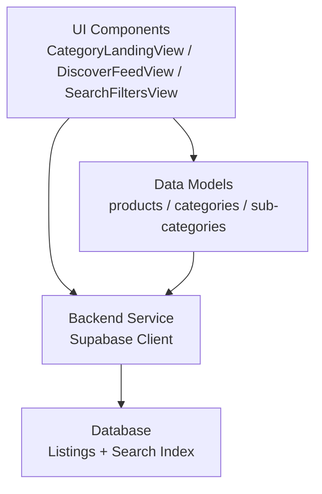
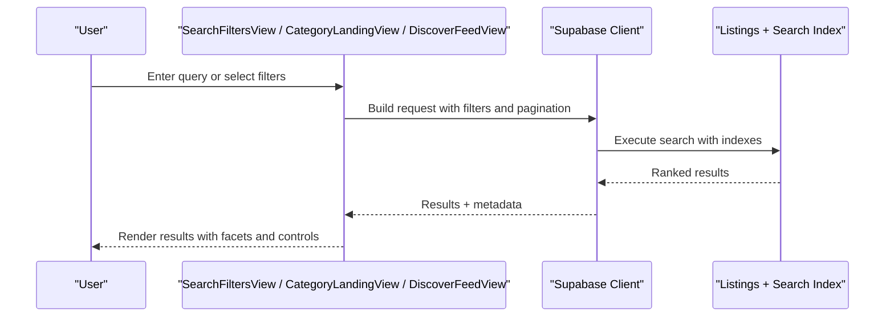
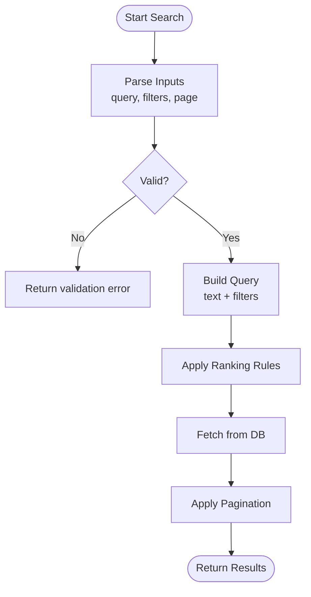
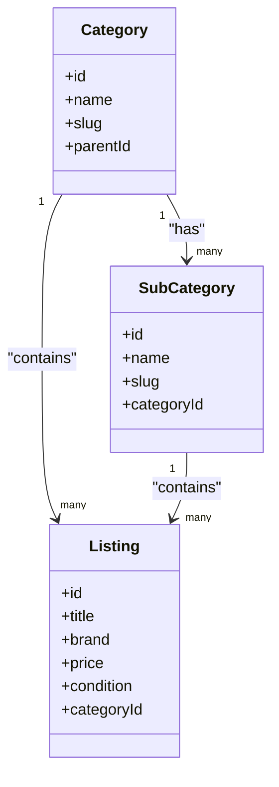
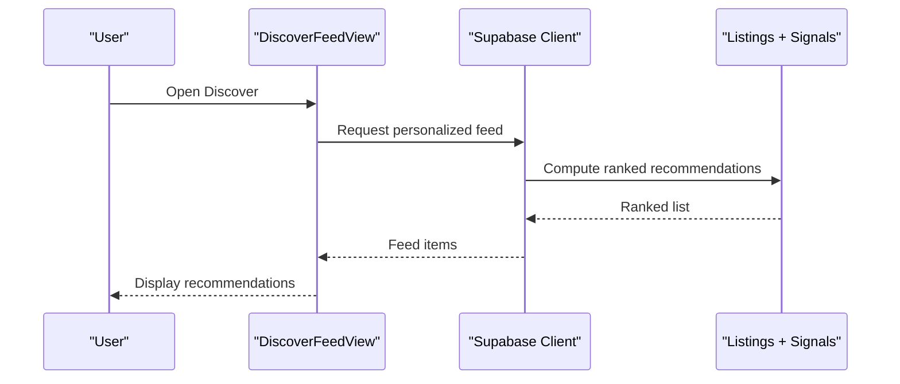
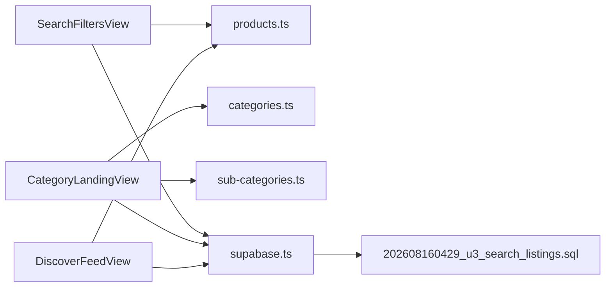

# Search and Discovery

<cite>
**Referenced Files in This Document**
- [search-filters.md](file://docs/search-filters.md)
- [discover-tabs.md](file://docs/discover-tabs.md)
- [category-landing.md](file://docs/category-landing.md)
- [CategoryLandingView.tsx](file://src/components/CategoryLandingView.tsx)
- [DiscoverFeedView.tsx](file://src/components/DiscoverFeedView.tsx)
- [SearchFiltersView.tsx](file://src/components/SearchFiltersView.tsx)
- [products.ts](file://src/data/products.ts)
- [categories.ts](file://src/data/categories.ts)
- [sub-categories.ts](file://src/data/sub-categories.ts)
- [supabase.ts](file://src/services/backend/supabase.ts)
- [202608160429_u3_search_listings.sql](file://supabase/migrations/202608160429_u3_search_listings.sql)
</cite>

## Table of Contents
1. Introduction
2. Project Structure
3. Core Components
4. Architecture Overview
5. Detailed Component Analysis
6. Dependency Analysis
7. Performance Considerations
8. Troubleshooting Guide
9. Conclusion
10. Appendices

## Introduction
This document explains the search and discovery system for the Mooday marketplace. It covers search algorithms, filtering capabilities, category-based navigation, and the discover feed algorithm for personalized product recommendations. It also documents advanced filters (price ranges, brands, categories, condition types), category landing pages and hierarchy, performance optimization and indexing strategies, real-time updates, query construction examples, filter combinations, result ranking, mobile experience, and accessibility considerations.

## Project Structure
The search and discovery features are implemented across UI components, data models, backend services, and database migrations:
- UI components: CategoryLandingView, DiscoverFeedView, SearchFiltersView
- Data models: products, categories, sub-categories
- Backend service: Supabase client integration
- Database migration: search listings index and queries

**Diagram sources**
- [CategoryLandingView.tsx:1-200](file://src/components/CategoryLandingView.tsx#L1-L200)
- [DiscoverFeedView.tsx:1-200](file://src/components/DiscoverFeedView.tsx#L1-L200)
- [SearchFiltersView.tsx:1-200](file://src/components/SearchFiltersView.tsx#L1-L200)
- [products.ts:1-200](file://src/data/products.ts#L1-L200)
- [categories.ts:1-200](file://src/data/categories.ts#L1-L200)
- [sub-categories.ts:1-200](file://src/data/sub-categories.ts#L1-L200)
- [supabase.ts:1-200](file://src/services/backend/supabase.ts#L1-L200)
- [202608160429_u3_search_listings.sql:1-200](file://supabase/migrations/202608160429_u3_search_listings.sql#L1-L200)

**Section sources**
- [CategoryLandingView.tsx:1-200](file://src/components/CategoryLandingView.tsx#L1-L200)
- [DiscoverFeedView.tsx:1-200](file://src/components/DiscoverFeedView.tsx#L1-L200)
- [SearchFiltersView.tsx:1-200](file://src/components/SearchFiltersView.tsx#L1-L200)
- [products.ts:1-200](file://src/data/products.ts#L1-L200)
- [categories.ts:1-200](file://src/data/categories.ts#L1-L200)
- [sub-categories.ts:1-200](file://src/data/sub-categories.ts#L1-L200)
- [supabase.ts:1-200](file://src/services/backend/supabase.ts#L1-L200)
- [202608160429_u3_search_listings.sql:1-200](file://supabase/migrations/202608160429_u3_search_listings.sql#L1-L200)

## Core Components
- CategoryLandingView: Renders category landing pages with hierarchical navigation and filtered results based on selected category and subcategory.
- DiscoverFeedView: Implements a personalized discovery feed that ranks and surfaces recommended items using user signals and item attributes.
- SearchFiltersView: Provides advanced filters including price range, brand, category, and condition, and composes query parameters for search endpoints.

Key responsibilities:
- Build and validate filter state
- Compose search queries with filters
- Render paginated results with ranking
- Handle empty states and errors
- Support mobile-friendly interactions and accessibility

**Section sources**
- [CategoryLandingView.tsx:1-200](file://src/components/CategoryLandingView.tsx#L1-L200)
- [DiscoverFeedView.tsx:1-200](file://src/components/DiscoverFeedView.tsx#L1-L200)
- [SearchFiltersView.tsx:1-200](file://src/components/SearchFiltersView.tsx#L1-L200)

## Architecture Overview
The search and discovery flow integrates UI, data models, and backend services to deliver fast, relevant results.

**Diagram sources**
- [SearchFiltersView.tsx:1-200](file://src/components/SearchFiltersView.tsx#L1-L200)
- [CategoryLandingView.tsx:1-200](file://src/components/CategoryLandingView.tsx#L1-L200)
- [DiscoverFeedView.tsx:1-200](file://src/components/DiscoverFeedView.tsx#L1-L200)
- [supabase.ts:1-200](file://src/services/backend/supabase.ts#L1-L200)
- [202608160429_u3_search_listings.sql:1-200](file://supabase/migrations/202608160429_u3_search_listings.sql#L1-L200)

## Detailed Component Analysis

### Search Filters and Query Construction
- Filter model: price range, brand, category, subcategory, condition type, and additional facets.
- Query composition: Combines text search with structured filters; applies sorting by relevance and business rules.
- Pagination: Supports cursor or offset-based pagination for large result sets.
- Validation: Ensures filter values are within allowed ranges and formats.

**Diagram sources**
- [SearchFiltersView.tsx:1-200](file://src/components/SearchFiltersView.tsx#L1-L200)
- [supabase.ts:1-200](file://src/services/backend/supabase.ts#L1-L200)
- [202608160429_u3_search_listings.sql:1-200](file://supabase/migrations/202608160429_u3_search_listings.sql#L1-L200)

**Section sources**
- [SearchFiltersView.tsx:1-200](file://src/components/SearchFiltersView.tsx#L1-L200)
- [supabase.ts:1-200](file://src/services/backend/supabase.ts#L1-L200)
- [202608160429_u3_search_listings.sql:1-200](file://supabase/migrations/202608160429_u3_search_listings.sql#L1-L200)

### Category-Based Navigation and Landing Pages
- Hierarchical organization: Categories and subcategories define navigation structure.
- Landing behavior: Selecting a category loads its landing page with curated or filtered listings.
- Breadcrumb and drill-down: Users can navigate up/down the hierarchy seamlessly.

**Diagram sources**
- [categories.ts:1-200](file://src/data/categories.ts#L1-L200)
- [sub-categories.ts:1-200](file://src/data/sub-categories.ts#L1-L200)
- [products.ts:1-200](file://src/data/products.ts#L1-L200)
- [CategoryLandingView.tsx:1-200](file://src/components/CategoryLandingView.tsx#L1-L200)

**Section sources**
- [CategoryLandingView.tsx:1-200](file://src/components/CategoryLandingView.tsx#L1-L200)
- [categories.ts:1-200](file://src/data/categories.ts#L1-L200)
- [sub-categories.ts:1-200](file://src/data/sub-categories.ts#L1-L200)
- [products.ts:1-200](file://src/data/products.ts#L1-L200)

### Discover Feed Algorithm
- Personalization signals: Uses user preferences, browsing history, and item attributes to rank recommendations.
- Ranking factors: Relevance, recency, popularity, and diversity to avoid repetition.
- Cold start handling: Falls back to trending or curated sets when insufficient personalization data exists.

**Diagram sources**
- [DiscoverFeedView.tsx:1-200](file://src/components/DiscoverFeedView.tsx#L1-L200)
- [supabase.ts:1-200](file://src/services/backend/supabase.ts#L1-L200)
- [202608160429_u3_search_listings.sql:1-200](file://supabase/migrations/202608160429_u3_search_listings.sql#L1-L200)

**Section sources**
- [DiscoverFeedView.tsx:1-200](file://src/components/DiscoverFeedView.tsx#L1-L200)
- [supabase.ts:1-200](file://src/services/backend/supabase.ts#L1-L200)
- [202608160429_u3_search_listings.sql:1-200](file://supabase/migrations/202608160429_u3_search_listings.sql#L1-L200)

### Advanced Filters: Price, Brand, Category, Condition
- Price range: Min/max bounds with step granularity; supports currency formatting.
- Brand: Multi-select chips with counts; debounced selection to reduce requests.
- Category/Subcategory: Hierarchical selectors; cascading updates.
- Condition: New, like new, good, fair; mapped to listing attributes.

Filter combination example:
- Query: “vintage jacket”
- Filters: price $50–$200, brand “Denim Co.”, category “Outerwear”, condition “like new”
- Sorting: Relevance first, then price ascending

**Section sources**
- [SearchFiltersView.tsx:1-200](file://src/components/SearchFiltersView.tsx#L1-L200)
- [products.ts:1-200](file://src/data/products.ts#L1-L200)
- [categories.ts:1-200](file://src/data/categories.ts#L1-L200)
- [sub-categories.ts:1-200](file://src/data/sub-categories.ts#L1-L200)

### Real-Time Search Updates
- Live updates: Use subscriptions to refresh results when listings change (e.g., price drops, availability).
- Optimistic UI: Update local state immediately and reconcile with server changes.
- Debouncing: Throttle rapid filter changes to minimize network load.

**Section sources**
- [supabase.ts:1-200](file://src/services/backend/supabase.ts#L1-L200)
- [SearchFiltersView.tsx:1-200](file://src/components/SearchFiltersView.tsx#L1-L200)

### Mobile Search Experience and Accessibility
- Mobile UX: Sticky search bar, collapsible filters, swipe gestures, and touch-friendly chips.
- Performance: Lazy loading images, skeleton loaders, and minimal reflows.
- Accessibility: ARIA labels for inputs, keyboard navigation, focus management, and screen reader announcements for results count and errors.

**Section sources**
- [SearchFiltersView.tsx:1-200](file://src/components/SearchFiltersView.tsx#L1-L200)
- [CategoryLandingView.tsx:1-200](file://src/components/CategoryLandingView.tsx#L1-L200)
- [DiscoverFeedView.tsx:1-200](file://src/components/DiscoverFeedView.tsx#L1-L200)

## Dependency Analysis
The following diagram shows how components depend on data models and backend services.

**Diagram sources**
- [SearchFiltersView.tsx:1-200](file://src/components/SearchFiltersView.tsx#L1-L200)
- [CategoryLandingView.tsx:1-200](file://src/components/CategoryLandingView.tsx#L1-L200)
- [DiscoverFeedView.tsx:1-200](file://src/components/DiscoverFeedView.tsx#L1-L200)
- [products.ts:1-200](file://src/data/products.ts#L1-L200)
- [categories.ts:1-200](file://src/data/categories.ts#L1-L200)
- [sub-categories.ts:1-200](file://src/data/sub-categories.ts#L1-L200)
- [supabase.ts:1-200](file://src/services/backend/supabase.ts#L1-L200)
- [202608160429_u3_search_listings.sql:1-200](file://supabase/migrations/202608160429_u3_search_listings.sql#L1-L200)

**Section sources**
- [SearchFiltersView.tsx:1-200](file://src/components/SearchFiltersView.tsx#L1-L200)
- [CategoryLandingView.tsx:1-200](file://src/components/CategoryLandingView.tsx#L1-L200)
- [DiscoverFeedView.tsx:1-200](file://src/components/DiscoverFeedView.tsx#L1-L200)
- [products.ts:1-200](file://src/data/products.ts#L1-L200)
- [categories.ts:1-200](file://src/data/categories.ts#L1-L200)
- [sub-categories.ts:1-200](file://src/data/sub-categories.ts#L1-L200)
- [supabase.ts:1-200](file://src/services/backend/supabase.ts#L1-L200)
- [202608160429_u3_search_listings.sql:1-200](file://supabase/migrations/202608160429_u3_search_listings.sql#L1-L200)

## Performance Considerations
- Indexing strategy: Ensure search columns and filter fields are indexed to accelerate queries.
- Query optimization: Prefer exact matches for filters; use full-text search only when necessary.
- Pagination: Implement efficient cursors or keyset pagination to handle large datasets.
- Caching: Cache category trees and popular queries; cache aggregated facet counts.
- Network efficiency: Debounce filter changes; batch requests where possible.
- Rendering: Virtualize long lists; lazy-load images and media.

[No sources needed since this section provides general guidance]

## Troubleshooting Guide
Common issues and resolutions:
- Empty results: Verify filter constraints and query syntax; check for over-filtering.
- Slow queries: Review indexes and query plans; simplify complex filters.
- Stale data: Confirm real-time subscriptions are active; handle reconnects gracefully.
- Mobile UX problems: Test touch targets, keyboard navigation, and screen reader compatibility.

**Section sources**
- [SearchFiltersView.tsx:1-200](file://src/components/SearchFiltersView.tsx#L1-L200)
- [supabase.ts:1-200](file://src/services/backend/supabase.ts#L1-L200)

## Conclusion
Mooday’s search and discovery system combines robust filtering, category-based navigation, and a personalized discover feed to deliver relevant results quickly. With careful indexing, optimized queries, and responsive UI patterns, it supports both desktop and mobile experiences while maintaining accessibility standards. Continuous monitoring and iterative tuning will further improve performance and relevance.

[No sources needed since this section summarizes without analyzing specific files]

## Appendices

### Example Queries and Filter Combinations
- Text-only: “leather boots”
- With filters: price $100–$300, brand “BootCraft”, category “Footwear”, condition “new”
- Category landing: Navigate to “Outerwear” and apply “like new” condition

[No sources needed since this section provides conceptual examples]

### Indexing and Real-Time Strategy
- Indexes: Full-text on title/description; b-tree on price, brand, category, condition.
- Real-time: Subscribe to listing changes; debounce updates; optimistic UI with rollback on conflicts.

[No sources needed since this section provides conceptual guidance]