# Shopping Cart System

<cite>
**Referenced Files in This Document**
- [202607150005_phase_3_user_likes_and_cart.sql](file://supabase/migrations/202607150005_phase_3_user_likes_and_cart.sql)
- [phase_3_cart_items_rls.sql](file://supabase/tests/phase_3_cart_items_rls.sql)
- [phase_3_user_likes_rls.sql](file://supabase/tests/phase_3_user_likes_rls.sql)
- [likes-cart-service.test.ts](file://src/services/backend/likes-cart-service.test.ts)
- [user-likes-cart-migration.test.ts](file://src/services/backend/user-likes-cart-migration.test.ts)
- [ShoppingBagView.tsx](file://src/components/ShoppingBagView.tsx)
- [ProductDetailsView.tsx](file://src/components/ProductDetailsView.tsx)
- [CheckoutFlowView.tsx](file://src/components/CheckoutFlowView.tsx)
- [AppContext.tsx](file://src/context/AppContext.tsx)
- [index.ts](file://src/services/backend/index.ts)
- [contracts.ts](file://src/services/backend/contracts.ts)
- [mappers.ts](file://src/services/backend/mappers.ts)
</cite>

## Table of Contents
1. [Introduction](#introduction)
2. [Project Structure](#project-structure)
3. [Core Components](#core-components)
4. [Architecture Overview](#architecture-overview)
5. [Detailed Component Analysis](#detailed-component-analysis)
6. [Dependency Analysis](#dependency-analysis)
7. [Performance Considerations](#performance-considerations)
8. [Troubleshooting Guide](#troubleshooting-guide)
9. [Conclusion](#conclusion)
10. [Appendices](#appendices)

## Introduction
This document explains the shopping cart system in the Mooday marketplace, focusing on state management, item addition/removal workflows, persistence, and integration with user authentication and guest carts. It also covers cart validation, inventory checks, price calculations, migration from likes to cart, batch operations, cross-device synchronization, abandonment recovery, saved items, wishlist integration, and performance optimizations for large or concurrently modified carts.

## Project Structure
The cart system spans UI components, application context, backend services, and Supabase schema and tests:
- UI layer: Shopping bag view, product details actions, checkout flow
- State layer: App context for in-memory cart state and actions
- Backend layer: Service index and contracts for API interactions; mappers for data transformation
- Persistence layer: Supabase migrations and RLS tests defining the cart tables and access rules

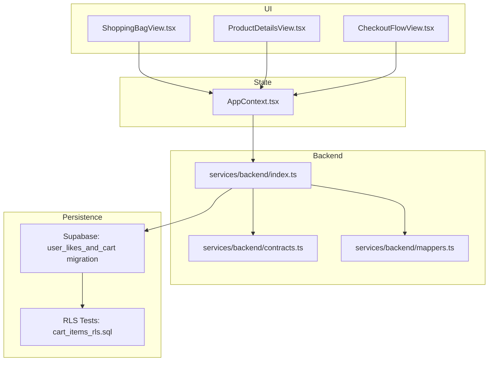

**Diagram sources**
- [ShoppingBagView.tsx](file://src/components/ShoppingBagView.tsx)
- [ProductDetailsView.tsx](file://src/components/ProductDetailsView.tsx)
- [CheckoutFlowView.tsx](file://src/components/CheckoutFlowView.tsx)
- [AppContext.tsx](file://src/context/AppContext.tsx)
- [index.ts](file://src/services/backend/index.ts)
- [contracts.ts](file://src/services/backend/contracts.ts)
- [mappers.ts](file://src/services/backend/mappers.ts)
- [202607150005_phase_3_user_likes_and_cart.sql](file://supabase/migrations/202607150005_phase_3_user_likes_and_cart.sql)
- [phase_3_cart_items_rls.sql](file://supabase/tests/phase_3_cart_items_rls.sql)

**Section sources**
- [ShoppingBagView.tsx](file://src/components/ShoppingBagView.tsx)
- [ProductDetailsView.tsx](file://src/components/ProductDetailsView.tsx)
- [CheckoutFlowView.tsx](file://src/components/CheckoutFlowView.tsx)
- [AppContext.tsx](file://src/context/AppContext.tsx)
- [index.ts](file://src/services/backend/index.ts)
- [contracts.ts](file://src/services/backend/contracts.ts)
- [mappers.ts](file://src/services/backend/mappers.ts)
- [202607150005_phase_3_user_likes_and_cart.sql](file://supabase/migrations/202607150005_phase_3_user_likes_and_cart.sql)
- [phase_3_cart_items_rls.sql](file://supabase/tests/phase_3_cart_items_rls.sql)

## Core Components
- Shopping bag view: Displays current cart items, quantities, totals, and provides add/remove/update actions.
- Product details view: Adds items to cart from product pages, handles quantity selection and availability feedback.
- Checkout flow view: Validates cart contents, resolves pricing, and proceeds to payment/order creation.
- App context: Centralizes cart state (items, quantities, totals), exposes actions to add/remove/update, and persists changes to backend when authenticated.
- Backend service: Encapsulates API calls for cart CRUD, batch operations, and sync across devices; maps server responses to client models.
- Data model and persistence: Supabase tables for cart and cart items, with row-level security policies ensuring users can only access their own carts.

Key responsibilities:
- State management: In-memory cart with optimistic updates and reconciliation with server state.
- Authentication integration: Guest carts are stored locally until login, then merged into the user’s persistent cart.
- Validation and inventory: Validate item existence, stock levels, and pricing before confirming changes.
- Price calculation: Compute line totals and cart totals based on unit prices, discounts, and taxes where applicable.

**Section sources**
- [ShoppingBagView.tsx](file://src/components/ShoppingBagView.tsx)
- [ProductDetailsView.tsx](file://src/components/ProductDetailsView.tsx)
- [CheckoutFlowView.tsx](file://src/components/CheckoutFlowView.tsx)
- [AppContext.tsx](file://src/context/AppContext.tsx)
- [index.ts](file://src/services/backend/index.ts)
- [contracts.ts](file://src/services/backend/contracts.ts)
- [mappers.ts](file://src/services/backend/mappers.ts)
- [202607150005_phase_3_user_likes_and_cart.sql](file://supabase/migrations/202607150005_phase_3_user_likes_and_cart.sql)
- [phase_3_cart_items_rls.sql](file://supabase/tests/phase_3_cart_items_rls.sql)

## Architecture Overview
The cart architecture follows a layered approach:
- UI triggers actions (add/remove/update) via AppContext.
- AppContext performs optimistic local updates and dispatches backend requests for persistence.
- Backend service validates inputs, enforces business rules (inventory, pricing), and persists to Supabase.
- Supabase enforces RLS so users can only modify their own cart items.

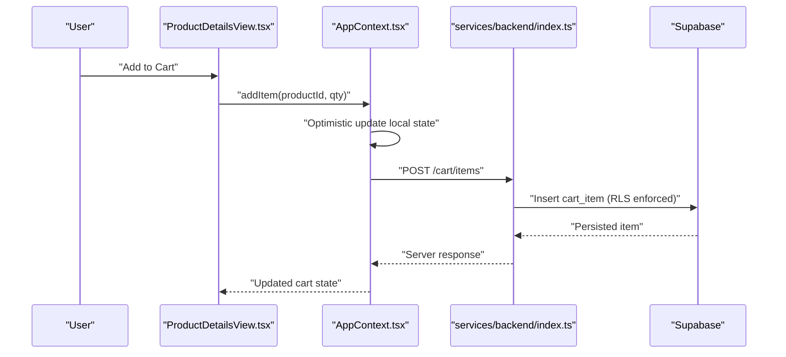

**Diagram sources**
- [ProductDetailsView.tsx](file://src/components/ProductDetailsView.tsx)
- [AppContext.tsx](file://src/context/AppContext.tsx)
- [index.ts](file://src/services/backend/index.ts)
- [202607150005_phase_3_user_likes_and_cart.sql](file://supabase/migrations/202607150005_phase_3_user_likes_and_cart.sql)
- [phase_3_cart_items_rls.sql](file://supabase/tests/phase_3_cart_items_rls.sql)

## Detailed Component Analysis

### Cart State Management (AppContext)
- Maintains an in-memory cart structure keyed by item identifiers, tracking quantities and derived totals.
- Provides actions: addItem, removeItem, updateQuantity, clearCart, and batch operations.
- On authenticated sessions, synchronizes state with backend; on logout or session change, merges guest cart into user cart.
- Handles conflicts by reconciling local changes with server state after network responses.

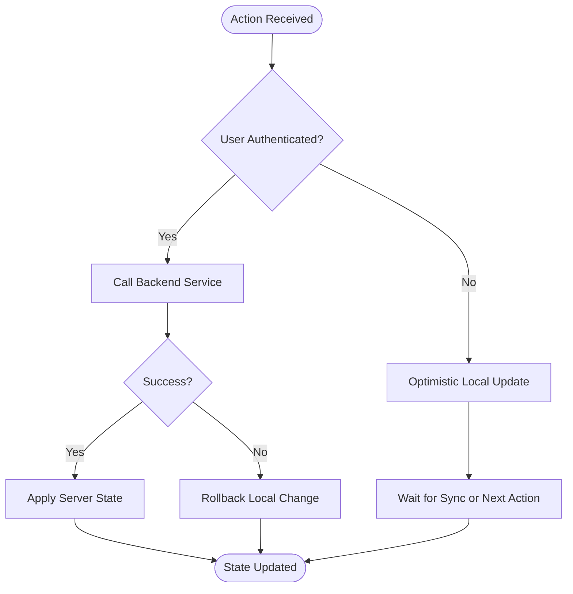

**Section sources**
- [AppContext.tsx](file://src/context/AppContext.tsx)
- [index.ts](file://src/services/backend/index.ts)

### Item Addition Workflow
- User selects quantity and clicks “Add to Cart” on product details.
- ProductDetailsView invokes AppContext.addItem with product ID and quantity.
- AppContext validates minimum/maximum quantities and updates local state optimistically.
- Backend service validates inventory and pricing, persists to Supabase, and returns confirmation.
- UI reflects updated totals and item count.

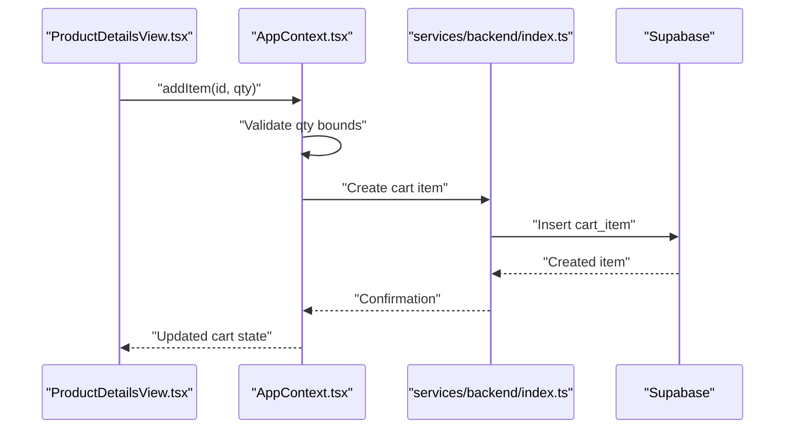

**Diagram sources**
- [ProductDetailsView.tsx](file://src/components/ProductDetailsView.tsx)
- [AppContext.tsx](file://src/context/AppContext.tsx)
- [index.ts](file://src/services/backend/index.ts)
- [202607150005_phase_3_user_likes_and_cart.sql](file://supabase/migrations/202607150005_phase_3_user_likes_and_cart.sql)

**Section sources**
- [ProductDetailsView.tsx](file://src/components/ProductDetailsView.tsx)
- [AppContext.tsx](file://src/context/AppContext.tsx)
- [index.ts](file://src/services/backend/index.ts)

### Item Removal and Quantity Updates
- Remove: Removes item from local state; if authenticated, deletes from backend.
- Update quantity: Adjusts local quantity; backend validates stock availability and updates persisted record.
- Batch updates: Support multiple item changes in a single request to reduce network overhead.

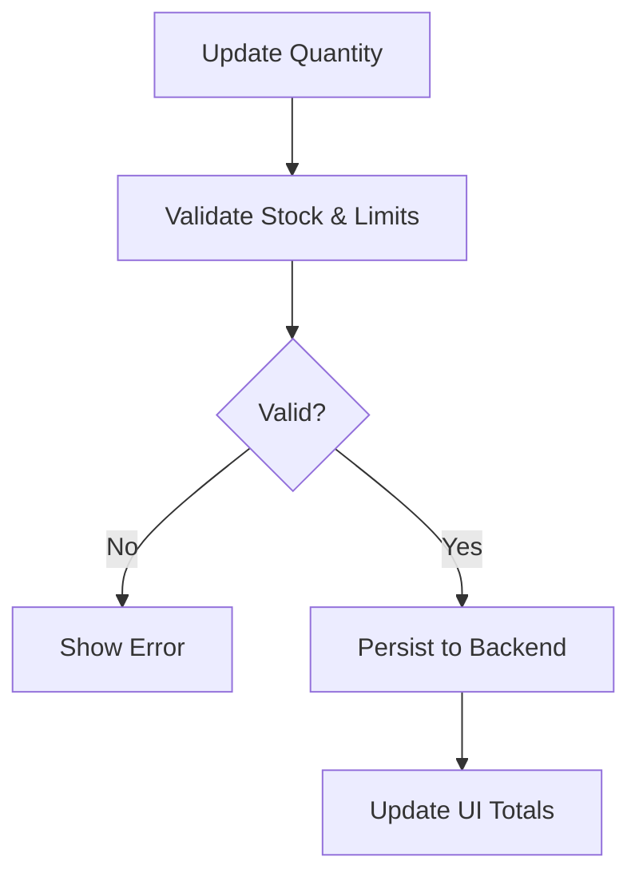

**Diagram sources**
- [AppContext.tsx](file://src/context/AppContext.tsx)
- [index.ts](file://src/services/backend/index.ts)

**Section sources**
- [AppContext.tsx](file://src/context/AppContext.tsx)
- [index.ts](file://src/services/backend/index.ts)

### Persistence and RLS
- Supabase migration defines cart and cart_items tables with foreign keys linking to users and products.
- Row-Level Security ensures users can only read/write their own cart items.
- Tests validate RLS policies for cart items.

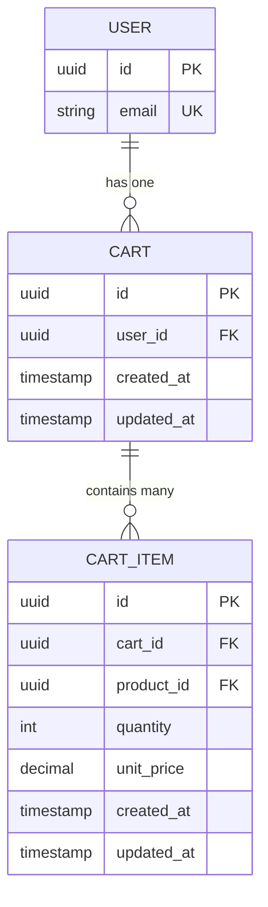

**Diagram sources**
- [202607150005_phase_3_user_likes_and_cart.sql](file://supabase/migrations/202607150005_phase_3_user_likes_and_cart.sql)
- [phase_3_cart_items_rls.sql](file://supabase/tests/phase_3_cart_items_rls.sql)

**Section sources**
- [202607150005_phase_3_user_likes_and_cart.sql](file://supabase/migrations/202607150005_phase_3_user_likes_and_cart.sql)
- [phase_3_cart_items_rls.sql](file://supabase/tests/phase_3_cart_items_rls.sql)

### Integration with Authentication and Guest Cart Handling
- Guest cart is stored locally until the user authenticates.
- On login, guest cart items are merged into the authenticated user’s cart, avoiding duplicates and preserving quantities.
- On logout, the user’s cart is cleared from local state; any unsynced changes are preserved until next login.

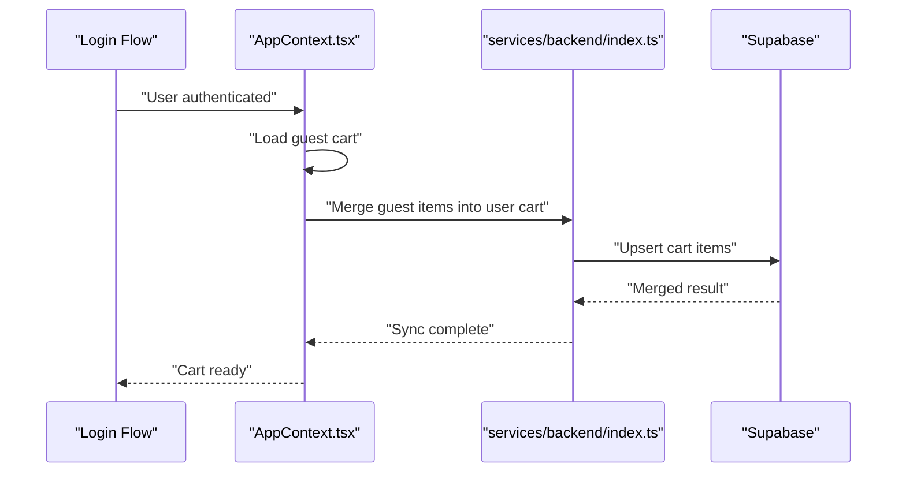

**Diagram sources**
- [AppContext.tsx](file://src/context/AppContext.tsx)
- [index.ts](file://src/services/backend/index.ts)

**Section sources**
- [AppContext.tsx](file://src/context/AppContext.tsx)
- [index.ts](file://src/services/backend/index.ts)

### Cart Validation, Inventory Checking, and Price Calculations
- Validation: Ensure product exists, is active, and meets minimum order quantities.
- Inventory: Check available stock before allowing quantity increases; reject over-quantity updates.
- Pricing: Calculate line totals using unit price and quantity; compute cart totals including discounts and taxes as configured.

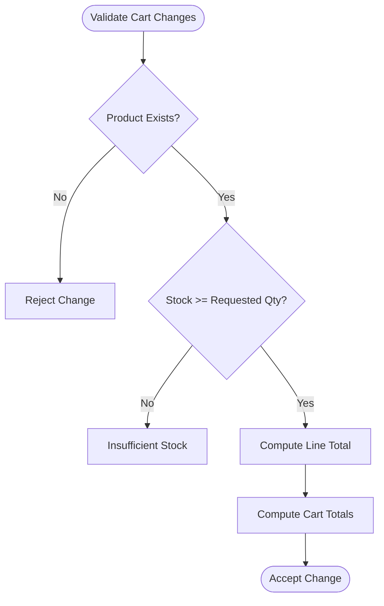

**Diagram sources**
- [AppContext.tsx](file://src/context/AppContext.tsx)
- [index.ts](file://src/services/backend/index.ts)

**Section sources**
- [AppContext.tsx](file://src/context/AppContext.tsx)
- [index.ts](file://src/services/backend/index.ts)

### Migration from Likes to Cart Functionality
- The migration introduces cart tables alongside existing likes functionality, enabling transition from liked items to cart items.
- Tests cover migration logic to move relevant liked items into cart entries where appropriate.
- UI may provide a “Move to Cart” action for liked items during migration.

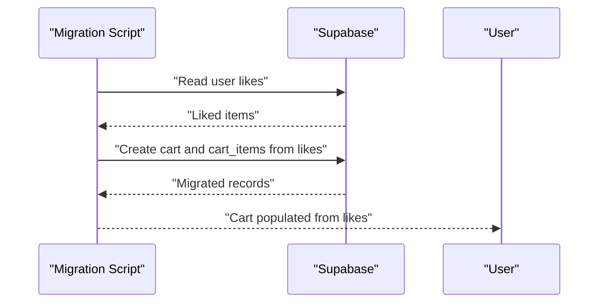

**Diagram sources**
- [user-likes-cart-migration.test.ts](file://src/services/backend/user-likes-cart-migration.test.ts)
- [202607150005_phase_3_user_likes_and_cart.sql](file://supabase/migrations/202607150005_phase_3_user_likes_and_cart.sql)

**Section sources**
- [user-likes-cart-migration.test.ts](file://src/services/backend/user-likes-cart-migration.test.ts)
- [202607150005_phase_3_user_likes_and_cart.sql](file://supabase/migrations/202607150005_phase_3_user_likes_and_cart.sql)

### Batch Actions and Cross-Device Synchronization
- Batch actions: Allow adding/removing multiple items in one request to reduce latency and ensure consistency.
- Synchronization: After each operation, fetch latest cart state from backend to reconcile across devices.
- Conflict resolution: Prefer server state for authoritative totals and stock levels; apply local deltas safely.

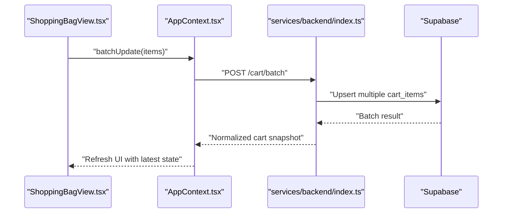

**Diagram sources**
- [ShoppingBagView.tsx](file://src/components/ShoppingBagView.tsx)
- [AppContext.tsx](file://src/context/AppContext.tsx)
- [index.ts](file://src/services/backend/index.ts)

**Section sources**
- [ShoppingBagView.tsx](file://src/components/ShoppingBagView.tsx)
- [AppContext.tsx](file://src/context/AppContext.tsx)
- [index.ts](file://src/services/backend/index.ts)

### Abandonment Recovery, Saved Items, and Wishlist Integration
- Abandonment recovery: Persist partial cart state locally and on backend; upon return, restore last known state.
- Saved items: Provide a mechanism to mark items as saved for later review; integrate with cart for quick re-add.
- Wishlist integration: Liked items can be surfaced as a wishlist; allow moving items from wishlist to cart seamlessly.

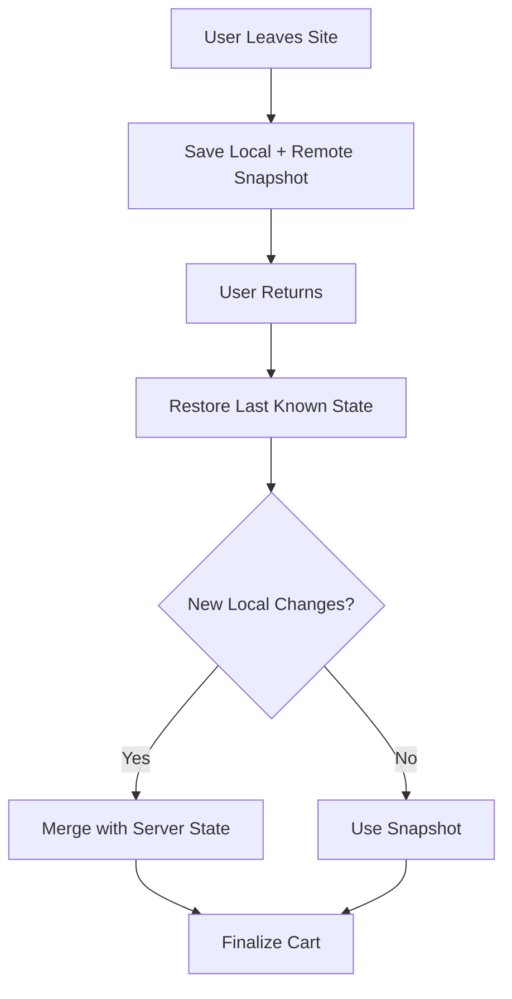

[No sources needed since this diagram shows conceptual workflow, not actual code structure]

**Section sources**
- [AppContext.tsx](file://src/context/AppContext.tsx)
- [index.ts](file://src/services/backend/index.ts)

## Dependency Analysis
- UI components depend on AppContext for state and actions.
- AppContext depends on backend services for persistence and validation.
- Backend services depend on Supabase schema and RLS policies defined in migrations and tests.
- Mappers transform between server payloads and client models to maintain type safety.

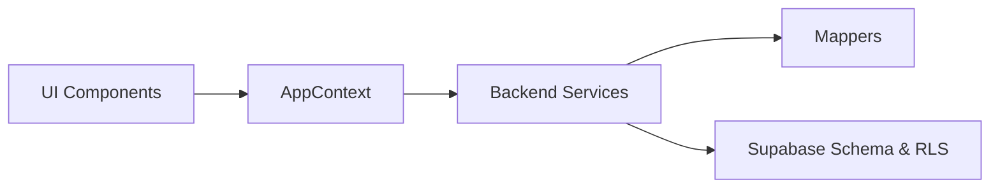

**Diagram sources**
- [ShoppingBagView.tsx](file://src/components/ShoppingBagView.tsx)
- [AppContext.tsx](file://src/context/AppContext.tsx)
- [index.ts](file://src/services/backend/index.ts)
- [mappers.ts](file://src/services/backend/mappers.ts)
- [202607150005_phase_3_user_likes_and_cart.sql](file://supabase/migrations/202607150005_phase_3_user_likes_and_cart.sql)
- [phase_3_cart_items_rls.sql](file://supabase/tests/phase_3_cart_items_rls.sql)

**Section sources**
- [ShoppingBagView.tsx](file://src/components/ShoppingBagView.tsx)
- [AppContext.tsx](file://src/context/AppContext.tsx)
- [index.ts](file://src/services/backend/index.ts)
- [mappers.ts](file://src/services/backend/mappers.ts)
- [202607150005_phase_3_user_likes_and_cart.sql](file://supabase/migrations/202607150005_phase_3_user_likes_and_cart.sql)
- [phase_3_cart_items_rls.sql](file://supabase/tests/phase_3_cart_items_rls.sql)

## Performance Considerations
- Optimistic UI updates: Reduce perceived latency by updating local state immediately and reconciling with server responses.
- Batch operations: Group multiple cart changes into single requests to minimize network overhead.
- Debounced sync: Throttle frequent updates to avoid excessive backend calls.
- Efficient queries: Fetch only necessary fields and leverage indexes on cart and cart_items tables.
- Concurrency control: Use versioning or timestamps to detect and resolve conflicting updates.
- Large cart handling: Paginate or virtualize lists in UI; lazy-load product details for performance.

[No sources needed since this section provides general guidance]

## Troubleshooting Guide
Common issues and resolutions:
- Duplicate items: Ensure unique constraints on cart_items per user/product; merge quantities on add.
- Stock mismatches: Always validate against server stock before confirming changes; handle insufficient stock gracefully.
- RLS violations: Verify user session and permissions; check RLS policies in tests and migration.
- Sync conflicts: Implement conflict resolution strategies such as server-wins for totals and stock.
- Migration errors: Validate migration scripts and test coverage for likes-to-cart transitions.

**Section sources**
- [phase_3_cart_items_rls.sql](file://supabase/tests/phase_3_cart_items_rls.sql)
- [phase_3_user_likes_rls.sql](file://supabase/tests/phase_3_user_likes_rls.sql)
- [user-likes-cart-migration.test.ts](file://src/services/backend/user-likes-cart-migration.test.ts)
- [likes-cart-service.test.ts](file://src/services/backend/likes-cart-service.test.ts)

## Conclusion
The shopping cart system integrates UI, state management, backend services, and Supabase persistence to deliver a robust, scalable experience. It supports guest and authenticated users, validates inventory and pricing, migrates from likes to cart, and provides batch operations and cross-device synchronization. With careful attention to performance and concurrency, it can handle large carts and high-frequency updates effectively.

## Appendices
- Example operations: Add item, remove item, update quantity, batch update, clear cart.
- API endpoints: Create/read/update/delete cart items; batch operations; merge guest cart on login.
- Data structures: Cart and cart_items schemas with relationships to users and products.
- Tests: Coverage for RLS policies, migration logic, and service behaviors.

[No sources needed since this section summarizes without analyzing specific files]