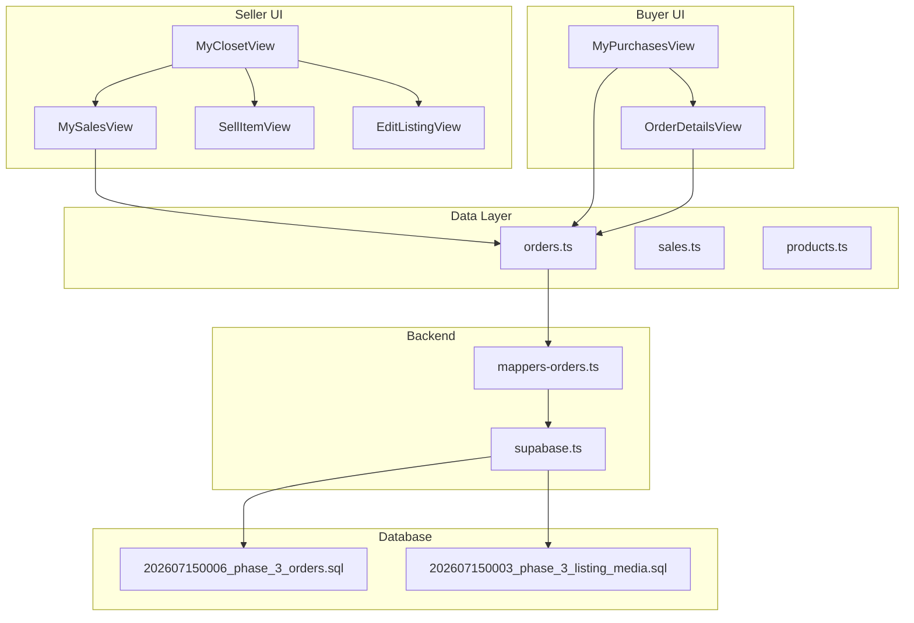
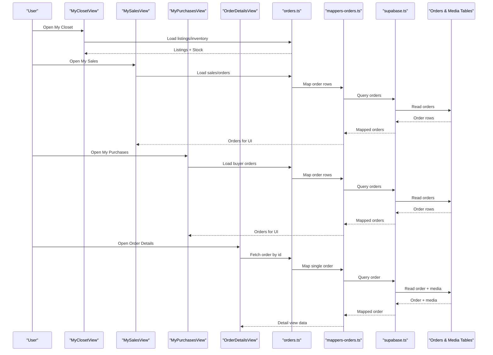
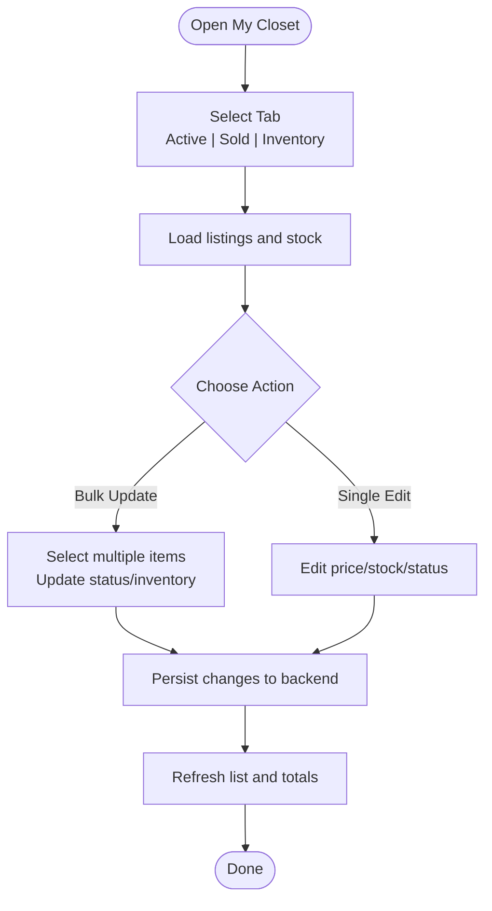
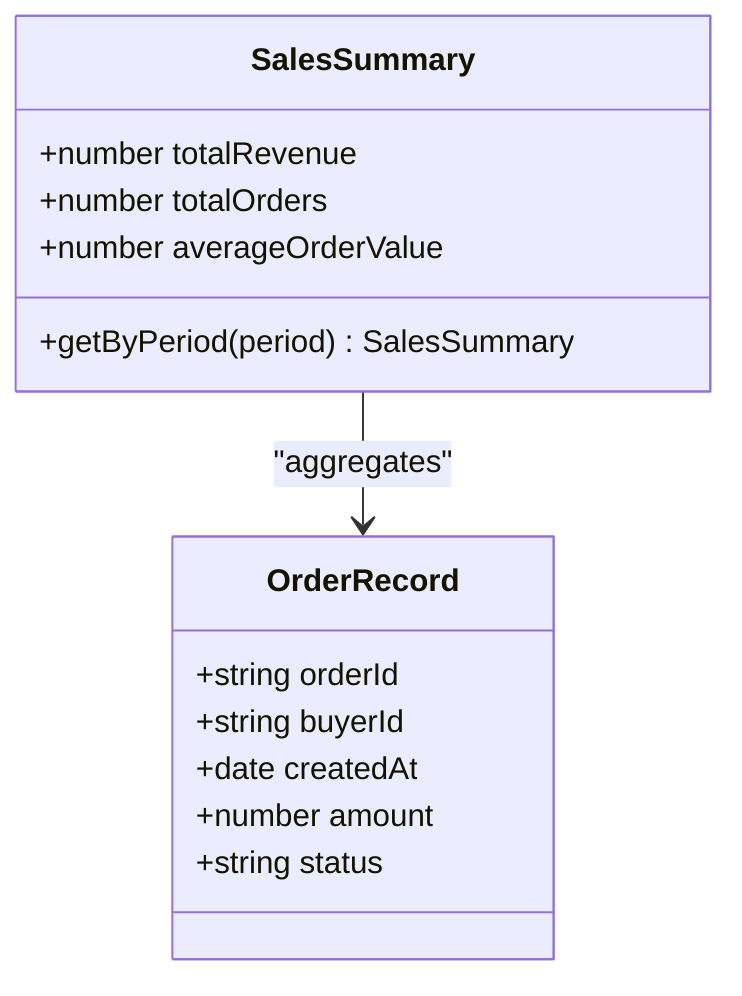
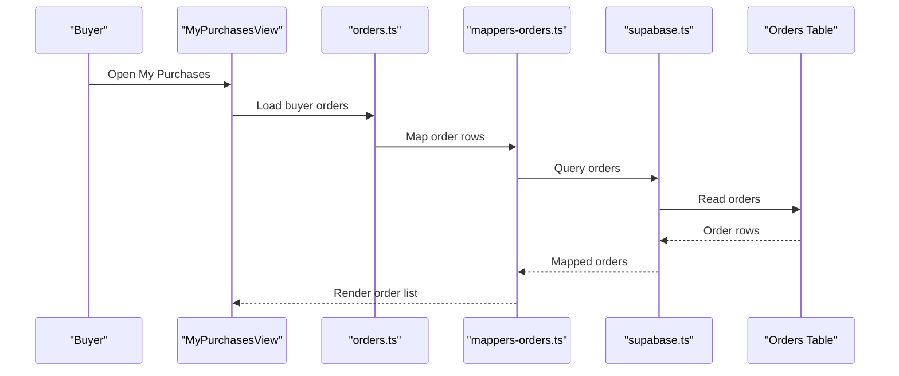
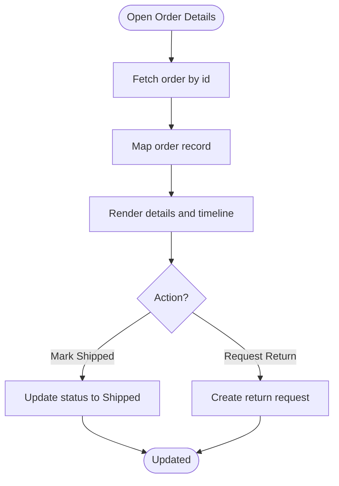
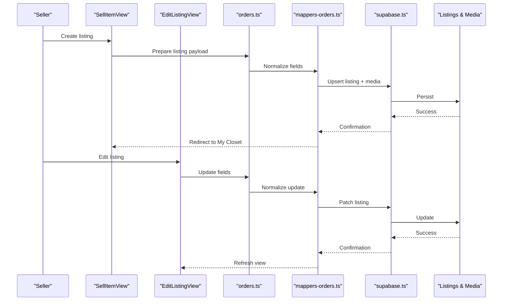
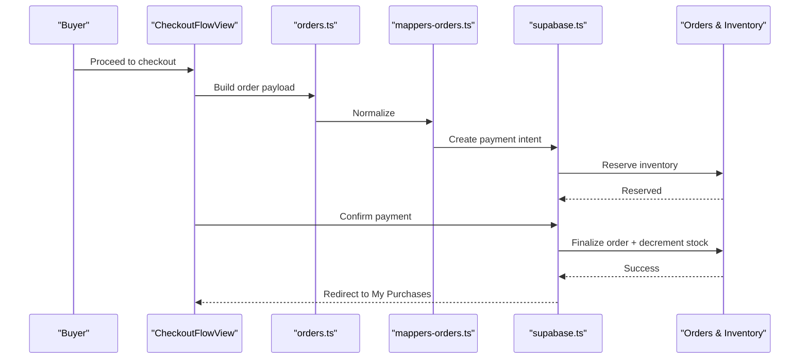
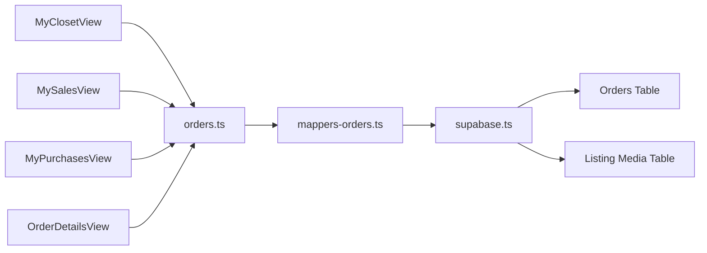

# User Closet and Inventory Management

<cite>
**Referenced Files in This Document**
- [MyClosetView.tsx](file://src/components/MyClosetView.tsx)
- [MySalesView.tsx](file://src/components/MySalesView.tsx)
- [MyPurchasesView.tsx](file://src/components/MyPurchasesView.tsx)
- [OrderDetailsView.tsx](file://src/components/OrderDetailsView.tsx)
- [ListingForm.tsx](file://src/components/listing/ListingForm.tsx)
- [EditListingView.tsx](file://src/components/EditListingView.tsx)
- [SellItemView.tsx](file://src/components/SellItemView.tsx)
- [CheckoutFlowView.tsx](file://src/components/CheckoutFlowView.tsx)
- [PayoutsView.tsx](file://src/components/PayoutsView.tsx)
- [orders.ts](file://src/data/orders.ts)
- [sales.ts](file://src/data/sales.ts)
- [products.ts](file://src/data/products.ts)
- [mappers-orders.ts](file://src/services/backend/mappers-orders.ts)
- [supabase.ts](file://src/services/backend/supabase.ts)
- [202607150003_phase_3_listing_media.sql](file://supabase/migrations/202607150003_phase_3_listing_media.sql)
- [202607150006_phase_3_orders.sql](file://supabase/migrations/202607150006_phase_3_orders.sql)
</cite>

## Table of Contents
1. Introduction
2. Project Structure
3. Core Components
4. Architecture Overview
5. Detailed Component Analysis
6. Dependency Analysis
7. Performance Considerations
8. Troubleshooting Guide
9. Conclusion

## Introduction
This document explains the user closet and inventory management system in the Mooday marketplace. It covers how sellers manage active listings, sold items, and inventory via My Closet; how sales tracking works with order history, revenue analytics, and performance metrics; how buyers view purchase history, order details, shipping status, and delivery tracking; and how inventory synchronizes between listings and available stock. It also documents bulk operations, listing status updates, inventory adjustments, data visualization for analytics, export capabilities, and integration points with external accounting systems.

## Project Structure
The closet and inventory features are implemented across UI components, data models, backend mappers, and database migrations:
- Seller-facing views: My Closet, My Sales, Sell Item, Edit Listing
- Buyer-facing views: My Purchases, Order Details
- Data layer: orders, sales, products datasets and mapping utilities
- Backend integration: Supabase client and order mappers
- Database schema: listing media and orders tables

**Diagram sources**
- [MyClosetView.tsx:1-200](file://src/components/MyClosetView.tsx#L1-L200)
- [MySalesView.tsx:1-200](file://src/components/MySalesView.tsx#L1-L200)
- [MyPurchasesView.tsx:1-200](file://src/components/MyPurchasesView.tsx#L1-L200)
- [OrderDetailsView.tsx:1-200](file://src/components/OrderDetailsView.tsx#L1-L200)
- [orders.ts:1-200](file://src/data/orders.ts#L1-L200)
- [sales.ts:1-200](file://src/data/sales.ts#L1-L200)
- [mappers-orders.ts:1-200](file://src/services/backend/mappers-orders.ts#L1-L200)
- [supabase.ts:1-200](file://src/services/backend/supabase.ts#L1-L200)
- [202607150006_phase_3_orders.sql:1-200](file://supabase/migrations/202607150006_phase_3_orders.sql#L1-L200)
- [202607150003_phase_3_listing_media.sql:1-200](file://supabase/migrations/202607150003_phase_3_listing_media.sql#L1-L200)

**Section sources**
- [MyClosetView.tsx:1-200](file://src/components/MyClosetView.tsx#L1-L200)
- [MySalesView.tsx:1-200](file://src/components/MySalesView.tsx#L1-L200)
- [MyPurchasesView.tsx:1-200](file://src/components/MyPurchasesView.tsx#L1-L200)
- [OrderDetailsView.tsx:1-200](file://src/components/OrderDetailsView.tsx#L1-L200)
- [orders.ts:1-200](file://src/data/orders.ts#L1-L200)
- [sales.ts:1-200](file://src/data/sales.ts#L1-L200)
- [mappers-orders.ts:1-200](file://src/services/backend/mappers-orders.ts#L1-L200)
- [supabase.ts:1-200](file://src/services/backend/supabase.ts#L1-L200)
- [202607150006_phase_3_orders.sql:1-200](file://supabase/migrations/202607150006_phase_3_orders.sql#L1-L200)
- [202607150003_phase_3_listing_media.sql:1-200](file://supabase/migrations/202607150003_phase_3_listing_media.sql#L1-L200)

## Core Components
- My Closet (seller): Central hub to manage active listings, sold items, and inventory. Provides tabs or sections for active, sold, and draft/inventory items. Supports filtering, sorting, and quick actions such as price edits, status toggles, and inventory adjustments.
- My Sales (seller): Tracks all completed sales with order references, buyer information, timestamps, and payout status. Includes revenue summaries and performance indicators.
- My Purchases (buyer): Displays order history with item details, shipping status, and delivery tracking links.
- Order Details (buyer/seller): Deep dive into a single order showing line items, payment info, shipping address, status timeline, and actions (e.g., mark shipped).
- Sell Item / Edit Listing: Creation and editing flows that update listing metadata, photos, pricing, and inventory counts.
- Payouts: View earnings, fees, and payout history for seller settlements.

Key responsibilities:
- Present and manipulate listing and order data from local datasets and backend services.
- Coordinate state changes for listing statuses and inventory levels.
- Provide analytics and exports for sales and inventory insights.

**Section sources**
- [MyClosetView.tsx:1-200](file://src/components/MyClosetView.tsx#L1-L200)
- [MySalesView.tsx:1-200](file://src/components/MySalesView.tsx#L1-L200)
- [MyPurchasesView.tsx:1-200](file://src/components/MyPurchasesView.tsx#L1-L200)
- [OrderDetailsView.tsx:1-200](file://src/components/OrderDetailsView.tsx#L1-L200)
- [SellItemView.tsx:1-200](file://src/components/SellItemView.tsx#L1-L200)
- [EditListingView.tsx:1-200](file://src/components/EditListingView.tsx#L1-L200)
- [PayoutsView.tsx:1-200](file://src/components/PayoutsView.tsx#L1-L200)

## Architecture Overview
The system follows a layered architecture:
- UI layer: React components render lists, forms, and detail views.
- Data layer: Local datasets provide initial or cached data; backend mappers transform records for UI consumption.
- Backend integration: Supabase client performs queries and mutations; order mappers normalize fields.
- Persistence: Orders and listing media are stored in Supabase tables defined by migrations.

**Diagram sources**
- [MyClosetView.tsx:1-200](file://src/components/MyClosetView.tsx#L1-L200)
- [MySalesView.tsx:1-200](file://src/components/MySalesView.tsx#L1-L200)
- [MyPurchasesView.tsx:1-200](file://src/components/MyPurchasesView.tsx#L1-L200)
- [OrderDetailsView.tsx:1-200](file://src/components/OrderDetailsView.tsx#L1-L200)
- [orders.ts:1-200](file://src/data/orders.ts#L1-L200)
- [mappers-orders.ts:1-200](file://src/services/backend/mappers-orders.ts#L1-L200)
- [supabase.ts:1-200](file://src/services/backend/supabase.ts#L1-L200)
- [202607150006_phase_3_orders.sql:1-200](file://supabase/migrations/202607150006_phase_3_orders.sql#L1-L200)
- [202607150003_phase_3_listing_media.sql:1-200](file://supabase/migrations/202607150003_phase_3_listing_media.sql#L1-L200)

## Detailed Component Analysis

### My Closet (Seller)
Purpose:
- Manage active listings, sold items, and inventory in one place.
- Provide quick actions to update listing status and adjust stock.

Key behaviors:
- Tabs or filters for Active, Sold, Draft/Inventory.
- Bulk selection to update statuses (e.g., pause, relist) and adjust inventory counts.
- Inline editing for price and quantity where appropriate.
- Syncs with backend to persist changes and reflect real-time availability.

**Diagram sources**
- [MyClosetView.tsx:1-200](file://src/components/MyClosetView.tsx#L1-L200)
- [orders.ts:1-200](file://src/data/orders.ts#L1-L200)
- [mappers-orders.ts:1-200](file://src/services/backend/mappers-orders.ts#L1-L200)
- [supabase.ts:1-200](file://src/services/backend/supabase.ts#L1-L200)

**Section sources**
- [MyClosetView.tsx:1-200](file://src/components/MyClosetView.tsx#L1-L200)

### My Sales (Seller)
Purpose:
- Track completed sales with order references, buyer info, timestamps, and payout status.
- Provide revenue analytics and performance metrics.

Key behaviors:
- Summary cards for total revenue, number of orders, average order value.
- Time-based filters (daily, weekly, monthly) for trend analysis.
- Export options for CSV/JSON to support accounting integrations.
- Links to individual orders for deeper inspection.

**Diagram sources**
- [MySalesView.tsx:1-200](file://src/components/MySalesView.tsx#L1-L200)
- [orders.ts:1-200](file://src/data/orders.ts#L1-L200)
- [sales.ts:1-200](file://src/data/sales.ts#L1-L200)
- [mappers-orders.ts:1-200](file://src/services/backend/mappers-orders.ts#L1-L200)

**Section sources**
- [MySalesView.tsx:1-200](file://src/components/MySalesView.tsx#L1-L200)
- [sales.ts:1-200](file://src/data/sales.ts#L1-L200)

### My Purchases (Buyer)
Purpose:
- Display order history with item details, shipping status, and delivery tracking.

Key behaviors:
- List of past orders with status badges (Processing, Shipped, Delivered).
- Drill-down to Order Details for full context.
- Tracking links when available.

**Diagram sources**
- [MyPurchasesView.tsx:1-200](file://src/components/MyPurchasesView.tsx#L1-L200)
- [orders.ts:1-200](file://src/data/orders.ts#L1-L200)
- [mappers-orders.ts:1-200](file://src/services/backend/mappers-orders.ts#L1-L200)
- [supabase.ts:1-200](file://src/services/backend/supabase.ts#L1-L200)
- [202607150006_phase_3_orders.sql:1-200](file://supabase/migrations/202607150006_phase_3_orders.sql#L1-L200)

**Section sources**
- [MyPurchasesView.tsx:1-200](file://src/components/MyPurchasesView.tsx#L1-L200)

### Order Details (Buyer/Seller)
Purpose:
- Show comprehensive details for a single order including line items, payment info, shipping address, status timeline, and actions.

Key behaviors:
- Status timeline with timestamps.
- Shipping and tracking information if available.
- Seller actions (e.g., mark as shipped) and buyer actions (e.g., request return).

**Diagram sources**
- [OrderDetailsView.tsx:1-200](file://src/components/OrderDetailsView.tsx#L1-L200)
- [orders.ts:1-200](file://src/data/orders.ts#L1-L200)
- [mappers-orders.ts:1-200](file://src/services/backend/mappers-orders.ts#L1-L200)
- [supabase.ts:1-200](file://src/services/backend/supabase.ts#L1-L200)

**Section sources**
- [OrderDetailsView.tsx:1-200](file://src/components/OrderDetailsView.tsx#L1-L200)

### Sell Item and Edit Listing
Purpose:
- Create new listings and edit existing ones, updating metadata, photos, pricing, and inventory.

Key behaviors:
- Photo picker and media upload flow.
- Price and inventory fields with validation.
- Status controls (active, draft, paused).

**Diagram sources**
- [SellItemView.tsx:1-200](file://src/components/SellItemView.tsx#L1-L200)
- [EditListingView.tsx:1-200](file://src/components/EditListingView.tsx#L1-L200)
- [orders.ts:1-200](file://src/data/orders.ts#L1-L200)
- [mappers-orders.ts:1-200](file://src/services/backend/mappers-orders.ts#L1-L200)
- [supabase.ts:1-200](file://src/services/backend/supabase.ts#L1-L200)
- [202607150003_phase_3_listing_media.sql:1-200](file://supabase/migrations/202607150003_phase_3_listing_media.sql#L1-L200)

**Section sources**
- [SellItemView.tsx:1-200](file://src/components/SellItemView.tsx#L1-L200)
- [EditListingView.tsx:1-200](file://src/components/EditListingView.tsx#L1-L200)

### Checkout Flow Integration
Purpose:
- Connect purchases to orders and ensure inventory is decremented upon successful payment.

Key behaviors:
- Payment intent creation and confirmation.
- Order creation with line items and buyer/seller associations.
- Inventory synchronization post-payment.

**Diagram sources**
- [CheckoutFlowView.tsx:1-200](file://src/components/CheckoutFlowView.tsx#L1-L200)
- [orders.ts:1-200](file://src/data/orders.ts#L1-L200)
- [mappers-orders.ts:1-200](file://src/services/backend/mappers-orders.ts#L1-L200)
- [supabase.ts:1-200](file://src/services/backend/supabase.ts#L1-L200)
- [202607150006_phase_3_orders.sql:1-200](file://supabase/migrations/202607150006_phase_3_orders.sql#L1-L200)

**Section sources**
- [CheckoutFlowView.tsx:1-200](file://src/components/CheckoutFlowView.tsx#L1-L200)

### Payouts
Purpose:
- Show seller earnings, fees, and payout history.

Key behaviors:
- Aggregated totals per period.
- Links to related orders and transactions.
- Export for accounting reconciliation.

**Section sources**
- [PayoutsView.tsx:1-200](file://src/components/PayoutsView.tsx#L1-L200)

## Dependency Analysis
- UI components depend on data modules for lists and details.
- Data modules rely on backend mappers to normalize records from Supabase.
- Mappers depend on the Supabase client for queries and mutations.
- Database schema defines the structure for orders and listing media.

**Diagram sources**
- [MyClosetView.tsx:1-200](file://src/components/MyClosetView.tsx#L1-L200)
- [MySalesView.tsx:1-200](file://src/components/MySalesView.tsx#L1-L200)
- [MyPurchasesView.tsx:1-200](file://src/components/MyPurchasesView.tsx#L1-L200)
- [OrderDetailsView.tsx:1-200](file://src/components/OrderDetailsView.tsx#L1-L200)
- [orders.ts:1-200](file://src/data/orders.ts#L1-L200)
- [mappers-orders.ts:1-200](file://src/services/backend/mappers-orders.ts#L1-L200)
- [supabase.ts:1-200](file://src/services/backend/supabase.ts#L1-L200)
- [202607150006_phase_3_orders.sql:1-200](file://supabase/migrations/202607150006_phase_3_orders.sql#L1-L200)
- [202607150003_phase_3_listing_media.sql:1-200](file://supabase/migrations/202607150003_phase_3_listing_media.sql#L1-L200)

**Section sources**
- [orders.ts:1-200](file://src/data/orders.ts#L1-L200)
- [mappers-orders.ts:1-200](file://src/services/backend/mappers-orders.ts#L1-L200)
- [supabase.ts:1-200](file://src/services/backend/supabase.ts#L1-L200)

## Performance Considerations
- Use pagination and virtualization for large listing and order lists to reduce rendering overhead.
- Cache frequently accessed data locally and refresh on interactions to minimize network calls.
- Batch updates for bulk operations to reduce API round-trips.
- Defer heavy computations (e.g., analytics aggregations) to background tasks or server-side where possible.
- Optimize image loading for listing media to improve perceived performance.

[No sources needed since this section provides general guidance]

## Troubleshooting Guide
Common issues and resolutions:
- Missing order data: Verify mapper mappings and Supabase query filters for buyer/seller context.
- Inventory mismatch: Ensure checkout flow decrements stock only after payment confirmation and handle rollbacks on failure.
- Status not updating: Check that status transitions are allowed and persisted correctly in the backend.
- Export failures: Validate data formatting and file size limits; implement chunked exports for large datasets.

**Section sources**
- [mappers-orders.ts:1-200](file://src/services/backend/mappers-orders.ts#L1-L200)
- [supabase.ts:1-200](file://src/services/backend/supabase.ts#L1-L200)
- [orders.ts:1-200](file://src/data/orders.ts#L1-L200)

## Conclusion
The user closet and inventory management system provides a cohesive experience for both sellers and buyers. Sellers can manage listings, track sales, and analyze performance, while buyers can monitor orders and deliveries. The layered architecture ensures clear separation of concerns, robust data mapping, and reliable persistence through Supabase. With bulk operations, export capabilities, and integration points, the system supports scalable marketplace workflows and external accounting integrations.

[No sources needed since this section summarizes without analyzing specific files]