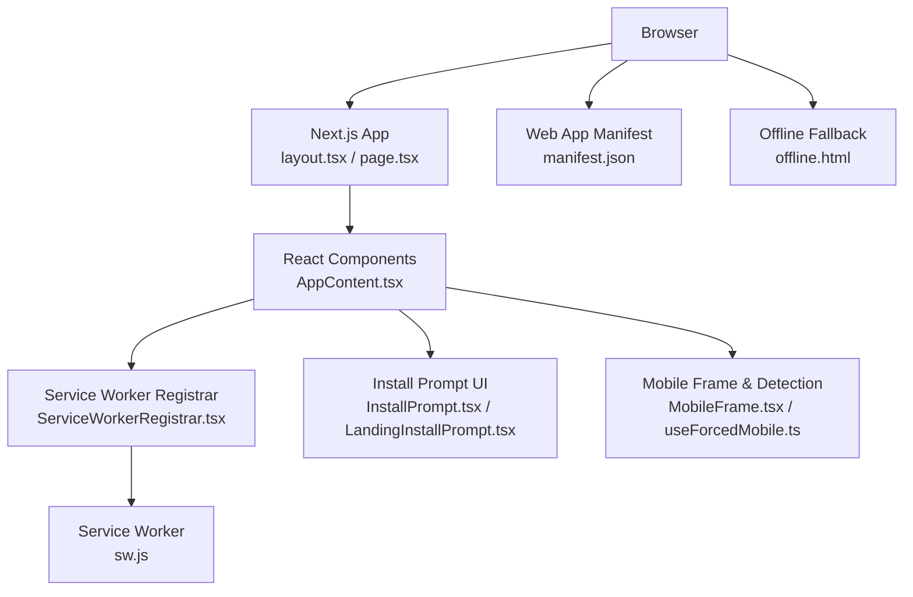
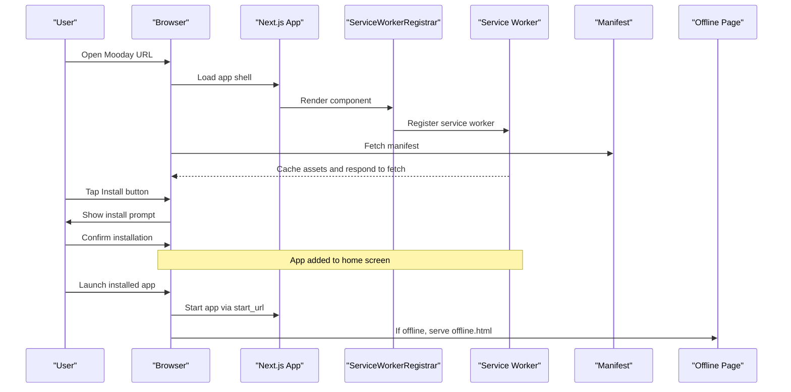
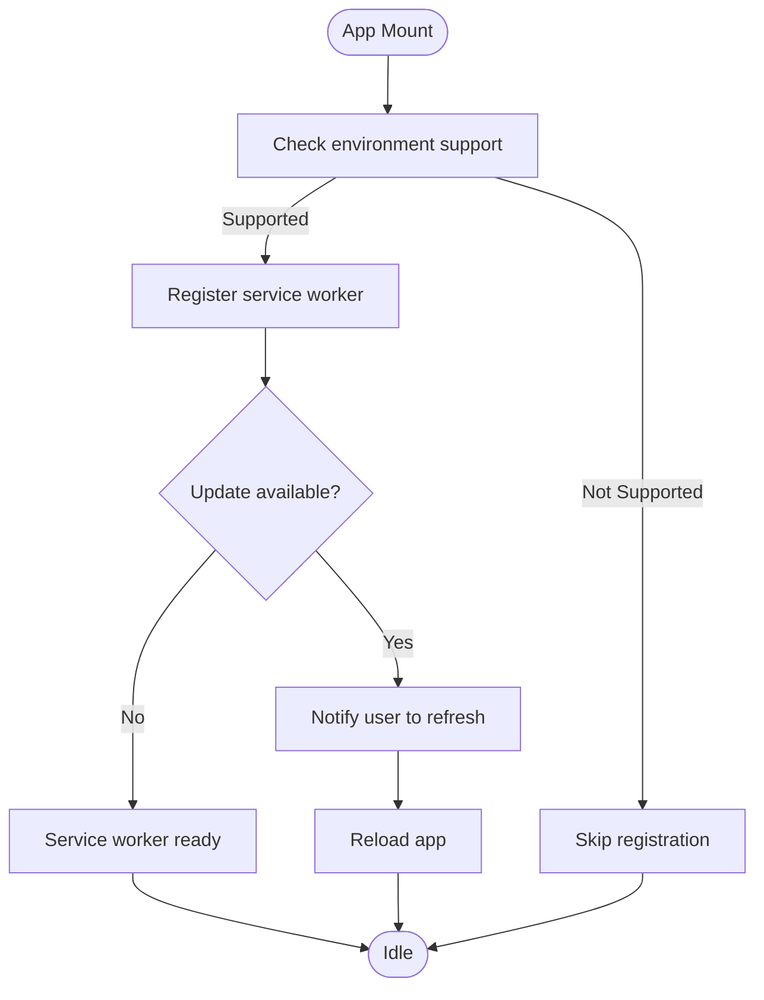
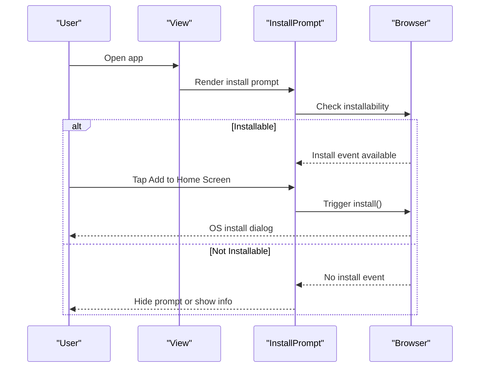
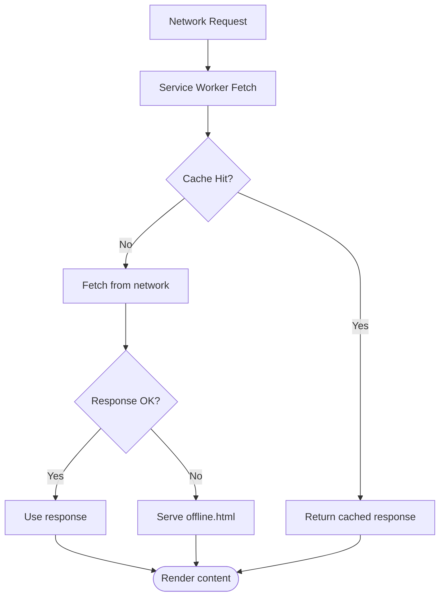
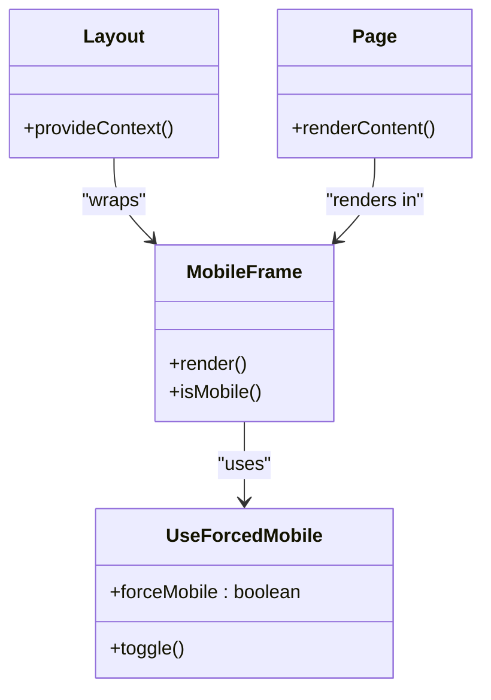
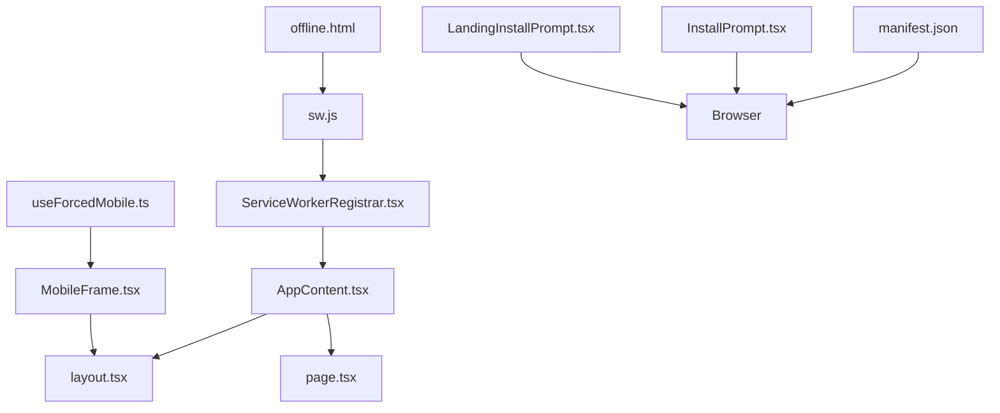

# Mobile Experience

<cite>
**Referenced Files in This Document**
- [manifest.json](file://public/manifest.json)
- [sw.js](file://public/sw.js)
- [offline.html](file://public/offline.html)
- [ServiceWorkerRegistrar.tsx](file://src/components/ServiceWorkerRegistrar.tsx)
- [InstallPrompt.tsx](file://src/components/InstallPrompt.tsx)
- [MobileFrame.tsx](file://src/components/MobileFrame.tsx)
- [useForcedMobile.ts](file://src/hooks/useForcedMobile.ts)
- [AppContent.tsx](file://src/components/AppContent.tsx)
- [layout.tsx](file://src/app/layout.tsx)
- [page.tsx](file://src/app/page.tsx)
- [LandingInstallPrompt.tsx](file://src/components/landing/LandingInstallPrompt.tsx)
- [next.config.ts](file://next.config.ts)
</cite>

## Table of Contents
1. [Introduction](#introduction)
2. [Project Structure](#project-structure)
3. [Core Components](#core-components)
4. [Architecture Overview](#architecture-overview)
5. [Detailed Component Analysis](#detailed-component-analysis)
6. [Dependency Analysis](#dependency-analysis)
7. [Performance Considerations](#performance-considerations)
8. [Troubleshooting Guide](#troubleshooting-guide)
9. [Conclusion](#conclusion)
10. [Appendices](#appendices)

## Introduction
This document explains the mobile and progressive web app (PWA) experience in Mooday. It covers the mobile-first responsive design approach, touch interactions, and mobile-specific optimizations. It also documents the PWA implementation including service worker configuration, offline support, and app-like features such as install prompts and background capabilities. Guidance is provided for push notifications, background sync, native device integration, performance tuning, battery considerations, cross-device compatibility, testing strategies, debugging techniques, user experience best practices, security considerations, and guidelines for developing mobile-specific features.

## Project Structure
Mooday’s mobile and PWA features are implemented across a small set of focused files:
- Public assets define the PWA manifest, service worker, and offline fallback page.
- React components register the service worker and provide an install prompt UI.
- Hooks and layout/page files coordinate mobile detection and rendering.
- Next.js configuration influences how static assets and service workers are served.

**Diagram sources**
- [layout.tsx:1-200](file://src/app/layout.tsx#L1-L200)
- [page.tsx:1-200](file://src/app/page.tsx#L1-L200)
- [AppContent.tsx:1-200](file://src/components/AppContent.tsx#L1-L200)
- [ServiceWorkerRegistrar.tsx:1-200](file://src/components/ServiceWorkerRegistrar.tsx#L1-L200)
- [sw.js:1-200](file://public/sw.js#L1-L200)
- [manifest.json:1-200](file://public/manifest.json#L1-L200)
- [offline.html:1-200](file://public/offline.html#L1-L200)
- [InstallPrompt.tsx:1-200](file://src/components/InstallPrompt.tsx#L1-L200)
- [LandingInstallPrompt.tsx:1-200](file://src/components/landing/LandingInstallPrompt.tsx#L1-L200)
- [MobileFrame.tsx:1-200](file://src/components/MobileFrame.tsx#L1-L200)
- [useForcedMobile.ts:1-200](file://src/hooks/useForcedMobile.ts#L1-L200)

**Section sources**
- [layout.tsx:1-200](file://src/app/layout.tsx#L1-L200)
- [page.tsx:1-200](file://src/app/page.tsx#L1-L200)
- [AppContent.tsx:1-200](file://src/components/AppContent.tsx#L1-L200)
- [ServiceWorkerRegistrar.tsx:1-200](file://src/components/ServiceWorkerRegistrar.tsx#L1-L200)
- [sw.js:1-200](file://public/sw.js#L1-L200)
- [manifest.json:1-200](file://public/manifest.json#L1-L200)
- [offline.html:1-200](file://public/offline.html#L1-L200)
- [InstallPrompt.tsx:1-200](file://src/components/InstallPrompt.tsx#L1-L200)
- [LandingInstallPrompt.tsx:1-200](file://src/components/landing/LandingInstallPrompt.tsx#L1-L200)
- [MobileFrame.tsx:1-200](file://src/components/MobileFrame.tsx#L1-L200)
- [useForcedMobile.ts:1-200](file://src/hooks/useForcedMobile.ts#L1-L200)

## Core Components
- Service Worker Registrar: Registers and updates the service worker from the client side, ensuring the latest runtime is active.
- Install Prompt: Provides a user-initiated flow to add the app to the home screen on supported platforms.
- Offline Support: Serves a friendly offline page when network requests fail or the app is not reachable.
- Mobile Frame and Detection: Renders a mobile-optimized frame and detects or forces mobile mode for consistent UX.
- Manifest and Assets: Declares app metadata, icons, theme colors, and start URL for app-like behavior.

Key responsibilities:
- Ensure the service worker lifecycle is managed safely and updated without disrupting the user.
- Offer a clear, compliant install prompt that respects platform constraints.
- Provide graceful degradation when offline or on poor networks.
- Maintain a consistent mobile layout and interaction model.

**Section sources**
- [ServiceWorkerRegistrar.tsx:1-200](file://src/components/ServiceWorkerRegistrar.tsx#L1-L200)
- [InstallPrompt.tsx:1-200](file://src/components/InstallPrompt.tsx#L1-L200)
- [LandingInstallPrompt.tsx:1-200](file://src/components/landing/LandingInstallPrompt.tsx#L1-L200)
- [offline.html:1-200](file://public/offline.html#L1-L200)
- [MobileFrame.tsx:1-200](file://src/components/MobileFrame.tsx#L1-L200)
- [useForcedMobile.ts:1-200](file://src/hooks/useForcedMobile.ts#L1-L200)
- [manifest.json:1-200](file://public/manifest.json#L1-L200)

## Architecture Overview
The mobile and PWA architecture integrates browser APIs with Next.js routing and React components to deliver an app-like experience. The service worker intercepts network requests to enable caching and offline access. The manifest configures app appearance and launch behavior. Install prompts guide users to add the app to their home screen. Mobile-specific components ensure a consistent layout and interaction model across devices.

**Diagram sources**
- [ServiceWorkerRegistrar.tsx:1-200](file://src/components/ServiceWorkerRegistrar.tsx#L1-L200)
- [sw.js:1-200](file://public/sw.js#L1-L200)
- [manifest.json:1-200](file://public/manifest.json#L1-L200)
- [offline.html:1-200](file://public/offline.html#L1-L200)
- [InstallPrompt.tsx:1-200](file://src/components/InstallPrompt.tsx#L1-L200)
- [LandingInstallPrompt.tsx:1-200](file://src/components/landing/LandingInstallPrompt.tsx#L1-L200)

## Detailed Component Analysis

### Service Worker Registration and Lifecycle
- Purpose: Register the service worker once the app mounts, handle updates, and manage activation to ensure the latest cache strategy is used.
- Behavior: Registers the service worker script, listens for update events, and prompts refresh if needed. Ensures registration only occurs in supported environments.
- Integration: Placed within the application tree so it runs after the initial render.

**Diagram sources**
- [ServiceWorkerRegistrar.tsx:1-200](file://src/components/ServiceWorkerRegistrar.tsx#L1-L200)
- [sw.js:1-200](file://public/sw.js#L1-L200)

**Section sources**
- [ServiceWorkerRegistrar.tsx:1-200](file://src/components/ServiceWorkerRegistrar.tsx#L1-L200)
- [sw.js:1-200](file://public/sw.js#L1-L200)

### Install Prompt Flow
- Purpose: Allow users to add Mooday to their home screen on supported browsers.
- Behavior: Detects installability, shows a custom prompt UI, and triggers the platform’s install flow upon user action.
- Placement: Available in general app views and landing pages to maximize discoverability.

**Diagram sources**
- [InstallPrompt.tsx:1-200](file://src/components/InstallPrompt.tsx#L1-L200)
- [LandingInstallPrompt.tsx:1-200](file://src/components/landing/LandingInstallPrompt.tsx#L1-L200)

**Section sources**
- [InstallPrompt.tsx:1-200](file://src/components/InstallPrompt.tsx#L1-L200)
- [LandingInstallPrompt.tsx:1-200](file://src/components/landing/LandingInstallPrompt.tsx#L1-L200)

### Offline Support and Fallback
- Purpose: Provide a helpful experience when the network is unavailable or the service worker cannot fetch resources.
- Behavior: Serves a dedicated offline page with guidance to reconnect. Works alongside service worker caching strategies.
- Integration: Configured via service worker fetch handling and linked from the app where appropriate.

**Diagram sources**
- [sw.js:1-200](file://public/sw.js#L1-L200)
- [offline.html:1-200](file://public/offline.html#L1-L200)

**Section sources**
- [sw.js:1-200](file://public/sw.js#L1-L200)
- [offline.html:1-200](file://public/offline.html#L1-L200)

### Mobile Frame and Detection
- Purpose: Ensure a consistent mobile layout and interaction model across devices.
- Behavior: Applies a mobile frame and can force mobile mode for development or specific flows. Integrates with layout and page components to maintain responsiveness.
- Usage: Used by views that require a mobile-centric presentation or when testing mobile behavior on desktop.

**Diagram sources**
- [MobileFrame.tsx:1-200](file://src/components/MobileFrame.tsx#L1-L200)
- [useForcedMobile.ts:1-200](file://src/hooks/useForcedMobile.ts#L1-L200)
- [layout.tsx:1-200](file://src/app/layout.tsx#L1-L200)
- [page.tsx:1-200](file://src/app/page.tsx#L1-L200)

**Section sources**
- [MobileFrame.tsx:1-200](file://src/components/MobileFrame.tsx#L1-L200)
- [useForcedMobile.ts:1-200](file://src/hooks/useForcedMobile.ts#L1-L200)
- [layout.tsx:1-200](file://src/app/layout.tsx#L1-L200)
- [page.tsx:1-200](file://src/app/page.tsx#L1-L200)

### Manifest and App Shell
- Purpose: Define app identity, icons, theme colors, display mode, and start URL to create an app-like experience.
- Behavior: The browser uses the manifest to configure how the app appears when launched from the home screen or installed.
- Integration: Referenced by the app shell and service worker to ensure consistent branding and behavior.

**Diagram sources**
- [manifest.json:1-200](file://public/manifest.json#L1-L200)
- [sw.js:1-200](file://public/sw.js#L1-L200)

**Section sources**
- [manifest.json:1-200](file://public/manifest.json#L1-L200)

## Dependency Analysis
The mobile and PWA features depend on a small set of core modules:
- Service Worker Registrar depends on the presence of sw.js and registers it at runtime.
- Install prompts depend on browser support and the manifest configuration.
- Offline support depends on the service worker’s fetch interception and the offline.html resource.
- Mobile frame and detection integrate with layout and page components to enforce mobile UX.

**Diagram sources**
- [sw.js:1-200](file://public/sw.js#L1-L200)
- [ServiceWorkerRegistrar.tsx:1-200](file://src/components/ServiceWorkerRegistrar.tsx#L1-L200)
- [AppContent.tsx:1-200](file://src/components/AppContent.tsx#L1-L200)
- [layout.tsx:1-200](file://src/app/layout.tsx#L1-L200)
- [page.tsx:1-200](file://src/app/page.tsx#L1-L200)
- [manifest.json:1-200](file://public/manifest.json#L1-L200)
- [offline.html:1-200](file://public/offline.html#L1-L200)
- [InstallPrompt.tsx:1-200](file://src/components/InstallPrompt.tsx#L1-L200)
- [LandingInstallPrompt.tsx:1-200](file://src/components/landing/LandingInstallPrompt.tsx#L1-L200)
- [MobileFrame.tsx:1-200](file://src/components/MobileFrame.tsx#L1-L200)
- [useForcedMobile.ts:1-200](file://src/hooks/useForcedMobile.ts#L1-L200)

**Section sources**
- [sw.js:1-200](file://public/sw.js#L1-L200)
- [ServiceWorkerRegistrar.tsx:1-200](file://src/components/ServiceWorkerRegistrar.tsx#L1-L200)
- [AppContent.tsx:1-200](file://src/components/AppContent.tsx#L1-L200)
- [layout.tsx:1-200](file://src/app/layout.tsx#L1-L200)
- [page.tsx:1-200](file://src/app/page.tsx#L1-L200)
- [manifest.json:1-200](file://public/manifest.json#L1-L200)
- [offline.html:1-200](file://public/offline.html#L1-L200)
- [InstallPrompt.tsx:1-200](file://src/components/InstallPrompt.tsx#L1-L200)
- [LandingInstallPrompt.tsx:1-200](file://src/components/landing/LandingInstallPrompt.tsx#L1-L200)
- [MobileFrame.tsx:1-200](file://src/components/MobileFrame.tsx#L1-L200)
- [useForcedMobile.ts:1-200](file://src/hooks/useForcedMobile.ts#L1-L200)

## Performance Considerations
- Minimize payload size: Keep the service worker lightweight; cache only essential assets for fast first load.
- Efficient caching: Use stale-while-revalidate for dynamic content and cache-busting for static assets.
- Reduce reflows: Avoid heavy DOM manipulation during scroll; prefer CSS transforms and will-change judiciously.
- Touch interactions: Use passive event listeners for scroll and touchmove to improve responsiveness.
- Battery usage: Throttle background tasks; avoid frequent polling; leverage background sync sparingly.
- Image optimization: Serve appropriately sized images; lazy-load offscreen media; use modern formats where supported.
- Cross-device compatibility: Test on iOS Safari, Android Chrome, and various form factors; validate viewport settings and safe areas.

[No sources needed since this section provides general guidance]

## Troubleshooting Guide
Common issues and resolutions:
- Service worker not updating: Clear caches and force reload; check for scope mismatches; verify network responses are cacheable.
- Install prompt not showing: Ensure HTTPS, valid manifest, and user gesture requirements; confirm no prior dismissal blocks the prompt.
- Offline page not serving: Verify service worker fetch handler routes to offline.html; test network throttling in DevTools.
- Mobile frame misbehavior: Check viewport meta tags; ensure forced mobile mode is toggled correctly in development.
- Performance regressions: Profile with Lighthouse; identify large payloads; optimize images and scripts.

Debugging tips:
- Use browser DevTools Application panel to inspect service worker state, caches, and manifest.
- Simulate offline conditions and slow networks to validate fallback behavior.
- Validate installability using built-in prompts and console warnings.

**Section sources**
- [sw.js:1-200](file://public/sw.js#L1-L200)
- [offline.html:1-200](file://public/offline.html#L1-L200)
- [ServiceWorkerRegistrar.tsx:1-200](file://src/components/ServiceWorkerRegistrar.tsx#L1-L200)
- [InstallPrompt.tsx:1-200](file://src/components/InstallPrompt.tsx#L1-L200)
- [LandingInstallPrompt.tsx:1-200](file://src/components/landing/LandingInstallPrompt.tsx#L1-L200)
- [MobileFrame.tsx:1-200](file://src/components/MobileFrame.tsx#L1-L200)
- [useForcedMobile.ts:1-200](file://src/hooks/useForcedMobile.ts#L1-L200)

## Conclusion
Mooday’s mobile and PWA features combine a robust service worker, a clear install flow, and a mobile-first layout to deliver an app-like experience. By following the outlined performance, security, and testing practices, teams can maintain a smooth, reliable, and engaging mobile journey across devices. Continuous monitoring and iterative optimization will ensure long-term quality and usability.

[No sources needed since this section summarizes without analyzing specific files]

## Appendices

### Push Notifications and Background Sync
- Push notifications: Integrate a backend notification service and request user permission; handle message delivery via the service worker.
- Background sync: Use the Background Sync API to defer non-critical operations until connectivity is restored; limit frequency to conserve battery.
- Native integration: Leverage Web Share, Clipboard, and Device Orientation APIs where appropriate; respect privacy permissions.

[No sources needed since this section provides general guidance]

### Security Considerations
- Secure storage: Prefer secure storage mechanisms for sensitive data; avoid storing tokens in plain text.
- Safe browsing: Enforce HTTPS; validate inputs; sanitize outputs; mitigate XSS and CSRF risks.
- Permissions: Request minimal permissions; explain purpose clearly to users.

[No sources needed since this section provides general guidance]

### Testing Strategies
- Unit tests: Validate service worker registration logic and install prompt flows.
- Integration tests: Simulate offline scenarios and verify fallback behavior.
- E2E tests: Automate install flows and mobile navigation paths using Playwright or similar tools.
- Accessibility: Ensure touch targets meet minimum sizes; verify keyboard navigation and screen reader compatibility.

[No sources needed since this section provides general guidance]

### Configuration Notes
- Next.js configuration: Ensure static assets and service worker are served correctly; configure headers for caching and security.
- Manifest validation: Confirm all required fields are present; test on multiple browsers.

**Section sources**
- [next.config.ts:1-200](file://next.config.ts#L1-L200)
- [manifest.json:1-200](file://public/manifest.json#L1-L200)