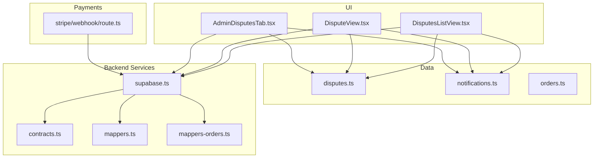
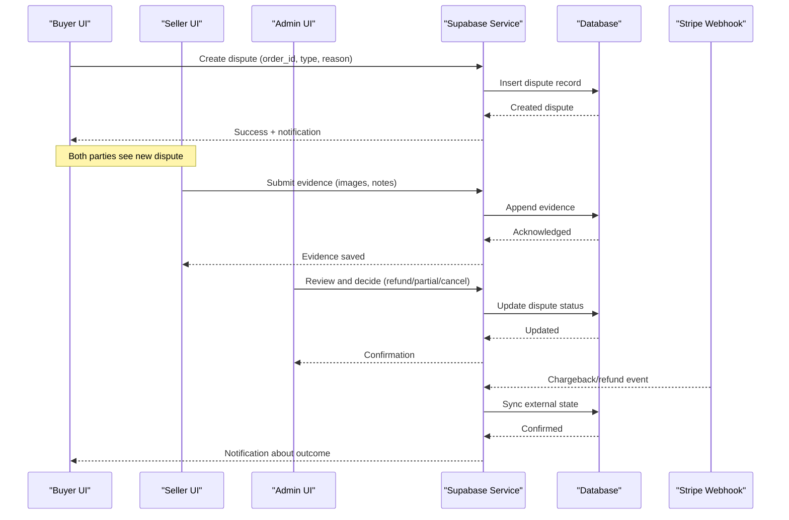
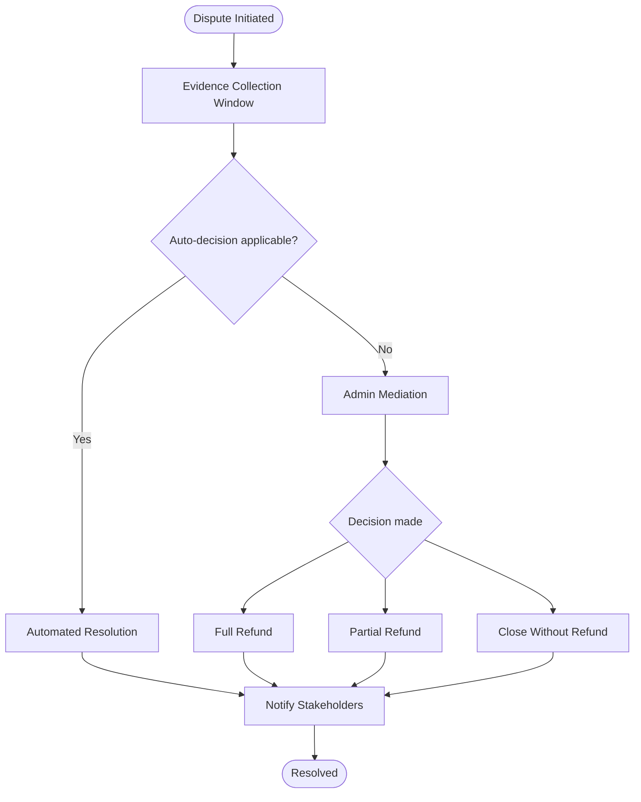
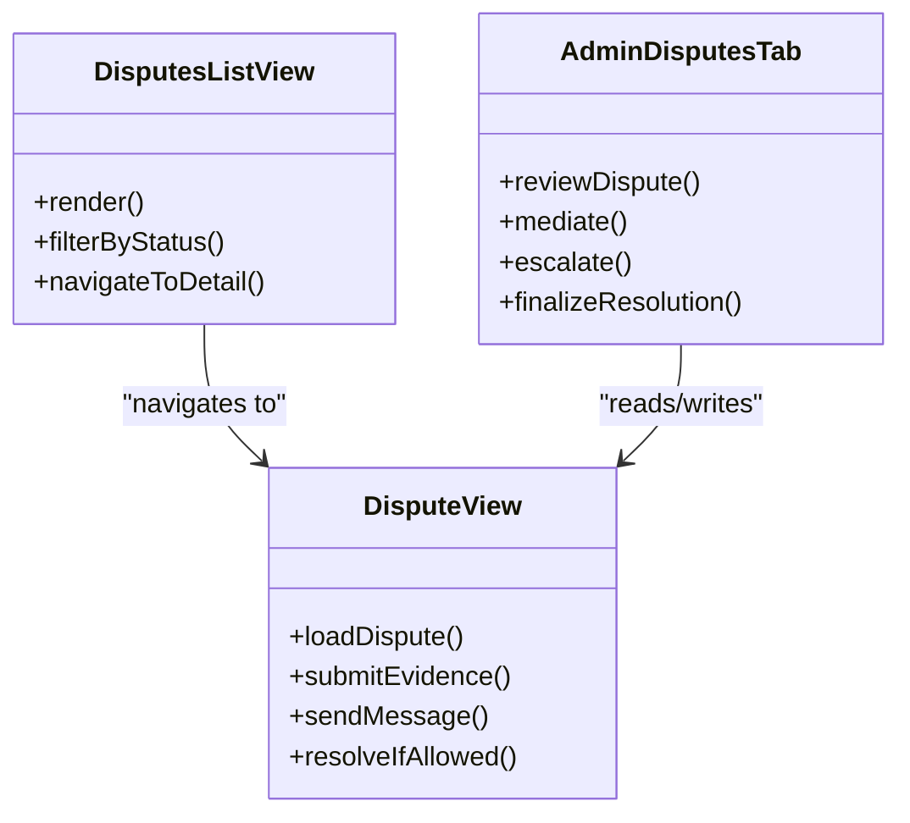
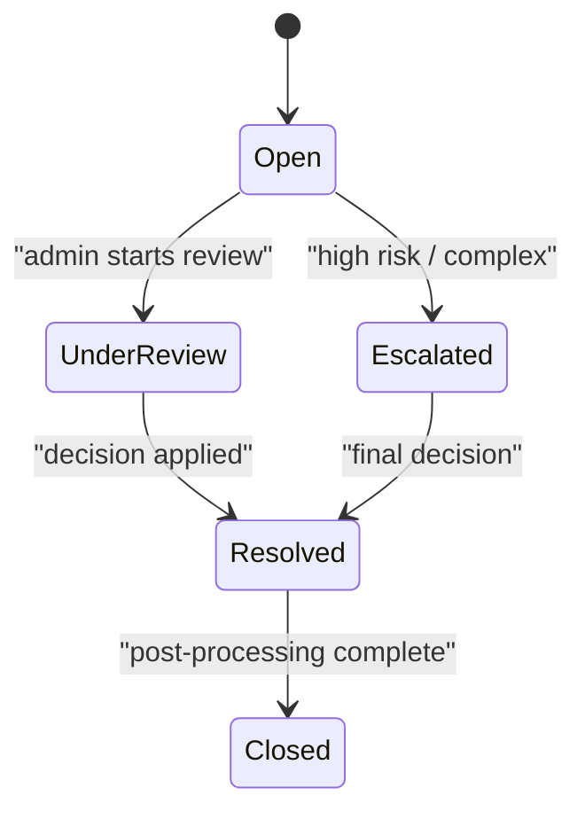
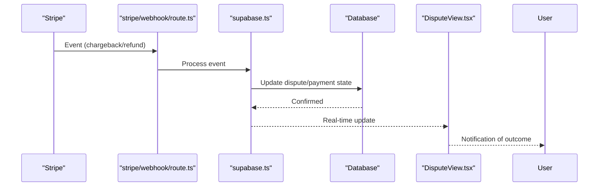
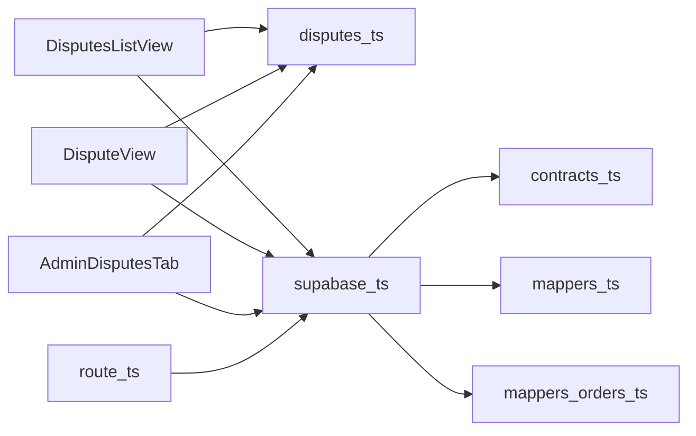

# Dispute Resolution

<cite>
**Referenced Files in This Document**
- [DisputesListView.tsx](file://src/components/DisputesListView.tsx)
- [DisputeView.tsx](file://src/components/DisputeView.tsx)
- [AdminDisputesTab.tsx](file://src/components/admin/AdminDisputesTab.tsx)
- [disputes.ts](file://src/data/disputes.ts)
- [notifications.ts](file://src/data/notifications.ts)
- [orders.ts](file://src/data/orders.ts)
- [supabase.ts](file://src/services/backend/supabase.ts)
- [contracts.ts](file://src/services/backend/contracts.ts)
- [mappers.ts](file://src/services/backend/mappers.ts)
- [mappers-orders.ts](file://src/services/backend/mappers-orders.ts)
- [create-payment-intent.test.ts](file://src/services/backend/create-payment-intent.test.ts)
- [route.ts](file://src/app/api/stripe/webhook/route.ts)
- [page.tsx](file://src/app/app/page.tsx)
- [AppContent.tsx](file://src/components/AppContent.tsx)
</cite>

## Table of Contents
1. Introduction
2. Project Structure
3. Core Components
4. Architecture Overview
5. Detailed Component Analysis
6. Dependency Analysis
7. Performance Considerations
8. Troubleshooting Guide
9. Conclusion

## Introduction
This document explains the dispute resolution system in the Mooday marketplace. It covers the full lifecycle from initiation to resolution, including evidence collection, mediation workflows, automated decision-making, and integration with payment reversal systems. It also documents dispute types (non-delivery, item not as described, payment issues), view implementations, notifications, stakeholder communication, status management, escalation procedures, chargeback handling, and fraud detection mechanisms.

## Project Structure
The dispute feature spans UI components, data models, backend services, and Stripe webhook integration:
- UI views for buyers and sellers to list and manage disputes
- Admin panel for moderation and resolution actions
- Data layer with mock/sample datasets for development and testing
- Backend service layer for database access and mapping
- Payment integration via Stripe webhooks for reversals and chargebacks

**Diagram sources**
- [DisputesListView.tsx:1-200](file://src/components/DisputesListView.tsx#L1-L200)
- [DisputeView.tsx:1-200](file://src/components/DisputeView.tsx#L1-L200)
- [AdminDisputesTab.tsx:1-200](file://src/components/admin/AdminDisputesTab.tsx#L1-L200)
- [disputes.ts:1-200](file://src/data/disputes.ts#L1-L200)
- [notifications.ts:1-200](file://src/data/notifications.ts#L1-L200)
- [orders.ts:1-200](file://src/data/orders.ts#L1-L200)
- [supabase.ts:1-200](file://src/services/backend/supabase.ts#L1-L200)
- [contracts.ts:1-200](file://src/services/backend/contracts.ts#L1-L200)
- [mappers.ts:1-200](file://src/services/backend/mappers.ts#L1-L200)
- [mappers-orders.ts:1-200](file://src/services/backend/mappers-orders.ts#L1-L200)
- [route.ts:1-200](file://src/app/api/stripe/webhook/route.ts#L1-L200)

**Section sources**
- [DisputesListView.tsx:1-200](file://src/components/DisputesListView.tsx#L1-L200)
- [DisputeView.tsx:1-200](file://src/components/DisputeView.tsx#L1-L200)
- [AdminDisputesTab.tsx:1-200](file://src/components/admin/AdminDisputesTab.tsx#L1-L200)
- [disputes.ts:1-200](file://src/data/disputes.ts#L1-L200)
- [notifications.ts:1-200](file://src/data/notifications.ts#L1-L200)
- [orders.ts:1-200](file://src/data/orders.ts#L1-L200)
- [supabase.ts:1-200](file://src/services/backend/supabase.ts#L1-L200)
- [contracts.ts:1-200](file://src/services/backend/contracts.ts#L1-L200)
- [mappers.ts:1-200](file://src/services/backend/mappers.ts#L1-L200)
- [mappers-orders.ts:1-200](file://src/services/backend/mappers-orders.ts#L1-L200)
- [route.ts:1-200](file://src/app/api/stripe/webhook/route.ts#L1-L200)

## Core Components
- DisputesListView: Lists all disputes for the current user with filters and status indicators. Supports navigation into a specific dispute detail view.
- DisputeView: Displays a single dispute’s timeline, allows evidence submission by buyers/sellers, shows messages between parties, and exposes resolution actions when permitted.
- AdminDisputesTab: Provides admin tools to review disputes, mediate, escalate, and finalize resolutions; integrates with order and payment context.
- Data Models: disputes.ts defines dispute entities, statuses, and sample records; orders.ts links disputes to orders; notifications.ts drives in-app alerts.
- Backend Services: supabase.ts provides DB queries; contracts.ts defines typed interfaces; mappers.ts and mappers-orders.ts transform records for UI and business logic.
- Payments Integration: stripe/webhook/route.ts handles Stripe events that can trigger dispute-related state changes or reversals.

**Section sources**
- [DisputesListView.tsx:1-200](file://src/components/DisputesListView.tsx#L1-L200)
- [DisputeView.tsx:1-200](file://src/components/DisputeView.tsx#L1-L200)
- [AdminDisputesTab.tsx:1-200](file://src/components/admin/AdminDisputesTab.tsx#L1-L200)
- [disputes.ts:1-200](file://src/data/disputes.ts#L1-L200)
- [orders.ts:1-200](file://src/data/orders.ts#L1-L200)
- [notifications.ts:1-200](file://src/data/notifications.ts#L1-L200)
- [supabase.ts:1-200](file://src/services/backend/supabase.ts#L1-L200)
- [contracts.ts:1-200](file://src/services/backend/contracts.ts#L1-L200)
- [mappers.ts:1-200](file://src/services/backend/mappers.ts#L1-L200)
- [mappers-orders.ts:1-200](file://src/services/backend/mappers-orders.ts#L1-L200)
- [route.ts:1-200](file://src/app/api/stripe/webhook/route.ts#L1-L200)

## Architecture Overview
The dispute system follows a layered architecture:
- Presentation Layer: React components render dispute lists and details, handle user interactions, and display notifications.
- Domain Layer: Contracts and mappers define dispute entities, relationships to orders, and transformation rules.
- Data Access Layer: Supabase client performs CRUD operations on disputes, evidence, and related entities.
- Integrations: Stripe webhook processes payment events that may initiate or resolve disputes and trigger reversals.

**Diagram sources**
- [DisputeView.tsx:1-200](file://src/components/DisputeView.tsx#L1-L200)
- [AdminDisputesTab.tsx:1-200](file://src/components/admin/AdminDisputesTab.tsx#L1-L200)
- [supabase.ts:1-200](file://src/services/backend/supabase.ts#L1-L200)
- [route.ts:1-200](file://src/app/api/stripe/webhook/route.ts#L1-L200)

## Detailed Component Analysis

### Dispute Lifecycle
The lifecycle progresses through defined states with clear transitions:
- Initiation: Buyer opens a dispute against an order, selecting a type and providing initial details.
- Evidence Collection: Both buyer and seller can upload evidence and comments within a time window.
- Mediation: Admin reviews evidence, may request additional information, and facilitates resolution.
- Automated Decisioning: Certain conditions (e.g., non-delivery confirmed by tracking) can auto-resolve based on policy.
- Resolution: Outcomes include full refund, partial refund, or closure without refund; payments are reversed accordingly.
- Post-resolution: Notifications inform stakeholders; audit logs capture decisions for compliance.

**Diagram sources**
- [disputes.ts:1-200](file://src/data/disputes.ts#L1-L200)
- [AdminDisputesTab.tsx:1-200](file://src/components/admin/AdminDisputesTab.tsx#L1-L200)
- [route.ts:1-200](file://src/app/api/stripe/webhook/route.ts#L1-L200)

**Section sources**
- [disputes.ts:1-200](file://src/data/disputes.ts#L1-L200)
- [AdminDisputesTab.tsx:1-200](file://src/components/admin/AdminDisputesTab.tsx#L1-L200)
- [route.ts:1-200](file://src/app/api/stripe/webhook/route.ts#L1-L200)

### Dispute Types
Common dispute types supported:
- Non-delivery: Item not received within expected timeframe or tracking indicates failure.
- Item not as described: Discrepancy between listing description/photos and actual item received.
- Payment issues: Unauthorized charges, incorrect amounts, or payment method failures.

These types influence evidence requirements and potential automated decisions.

**Section sources**
- [disputes.ts:1-200](file://src/data/disputes.ts#L1-L200)

### Dispute Views
- DisputesListView:
  - Displays all disputes for the current user with filters by status and type.
  - Shows summary metrics (open, resolved, pending).
  - Navigates to DisputeView for detailed actions.
- DisputeView:
  - Renders timeline of events, messages, and evidence attachments.
  - Allows evidence uploads and comments within allowed windows.
  - Shows actionable buttons based on role and status (buyer/seller/admin).
- AdminDisputesTab:
  - Centralized admin interface to review, mediate, and resolve disputes.
  - Integrates with order context and payment history for informed decisions.
  - Logs decisions and triggers downstream actions (refunds, notifications).

**Diagram sources**
- [DisputesListView.tsx:1-200](file://src/components/DisputesListView.tsx#L1-L200)
- [DisputeView.tsx:1-200](file://src/components/DisputeView.tsx#L1-L200)
- [AdminDisputesTab.tsx:1-200](file://src/components/admin/AdminDisputesTab.tsx#L1-L200)

**Section sources**
- [DisputesListView.tsx:1-200](file://src/components/DisputesListView.tsx#L1-L200)
- [DisputeView.tsx:1-200](file://src/components/DisputeView.tsx#L1-L200)
- [AdminDisputesTab.tsx:1-200](file://src/components/admin/AdminDisputesTab.tsx#L1-L200)

### Evidence Submission and Storage
- Buyers and sellers can attach images and text notes to support their case.
- Evidence is stored alongside the dispute record and linked to the relevant order.
- Validation ensures file size limits and acceptable formats.
- Evidence timestamps and authorship are recorded for auditability.

**Section sources**
- [DisputeView.tsx:1-200](file://src/components/DisputeView.tsx#L1-L200)
- [disputes.ts:1-200](file://src/data/disputes.ts#L1-L200)

### Status Management and Escalation
- Statuses include open, under review, escalated, resolved, and closed.
- Transitions enforce role-based permissions and policy checks.
- Escalation routes high-risk cases to senior admins or legal teams.
- Automated checks can move cases to resolution when criteria are met (e.g., delivery confirmation).

**Diagram sources**
- [disputes.ts:1-200](file://src/data/disputes.ts#L1-L200)
- [AdminDisputesTab.tsx:1-200](file://src/components/admin/AdminDisputesTab.tsx#L1-L200)

**Section sources**
- [disputes.ts:1-200](file://src/data/disputes.ts#L1-L200)
- [AdminDisputesTab.tsx:1-200](file://src/components/admin/AdminDisputesTab.tsx#L1-L200)

### Notification System and Stakeholder Communication
- In-app notifications alert users when disputes are created, evidence is requested, or outcomes are decided.
- Notifications include contextual links to the dispute detail view.
- Admins can send targeted messages during mediation to gather missing information.

**Section sources**
- [notifications.ts:1-200](file://src/data/notifications.ts#L1-L200)
- [DisputeView.tsx:1-200](file://src/components/DisputeView.tsx#L1-L200)

### Integration with Payment Reversals and Chargebacks
- Stripe webhook processes events such as chargebacks and refunds, updating dispute status and notifying users.
- Reversals are triggered upon admin decisions or automated outcomes, ensuring financial alignment with dispute results.
- Idempotency guards prevent duplicate reversals.

**Diagram sources**
- [route.ts:1-200](file://src/app/api/stripe/webhook/route.ts#L1-L200)
- [supabase.ts:1-200](file://src/services/backend/supabase.ts#L1-L200)
- [DisputeView.tsx:1-200](file://src/components/DisputeView.tsx#L1-L200)

**Section sources**
- [route.ts:1-200](file://src/app/api/stripe/webhook/route.ts#L1-L200)
- [supabase.ts:1-200](file://src/services/backend/supabase.ts#L1-L200)

### Examples
- Creating a dispute:
  - Navigate to the order detail and select “Open dispute.”
  - Choose dispute type (non-delivery, item not as described, payment issue).
  - Provide initial details and submit.
- Submitting evidence:
  - Open the dispute detail view.
  - Attach images and add explanatory notes.
  - Confirm submission; receive acknowledgment.
- Resolution outcomes:
  - Admin reviews evidence and decides refund amount or closure.
  - System updates dispute status and triggers payment reversal if needed.
  - Users receive notifications summarizing the outcome.

**Section sources**
- [DisputeView.tsx:1-200](file://src/components/DisputeView.tsx#L1-L200)
- [AdminDisputesTab.tsx:1-200](file://src/components/admin/AdminDisputesTab.tsx#L1-L200)
- [disputes.ts:1-200](file://src/data/disputes.ts#L1-L200)

### Legal Compliance, Chargeback Handling, and Fraud Detection
- Legal compliance:
  - Audit trails capture all actions, decisions, and communications.
  - Data retention policies align with regulatory requirements.
- Chargeback handling:
  - Stripe webhook events update dispute status and ensure accurate financial reconciliation.
  - Notifications keep stakeholders informed of chargeback outcomes.
- Fraud detection:
  - Risk scoring flags suspicious patterns (e.g., frequent disputes from same user).
  - Escalation routes high-risk cases for manual review.

**Section sources**
- [route.ts:1-200](file://src/app/api/stripe/webhook/route.ts#L1-L200)
- [AdminDisputesTab.tsx:1-200](file://src/components/admin/AdminDisputesTab.tsx#L1-L200)
- [disputes.ts:1-200](file://src/data/disputes.ts#L1-L200)

## Dependency Analysis
Key dependencies and relationships:
- UI components depend on data models and backend services for state and actions.
- Backend services rely on Supabase for persistence and on contracts/mappers for type safety and transformations.
- Stripe webhook integrates with backend services to synchronize external payment events with internal dispute state.

**Diagram sources**
- [DisputesListView.tsx:1-200](file://src/components/DisputesListView.tsx#L1-L200)
- [DisputeView.tsx:1-200](file://src/components/DisputeView.tsx#L1-L200)
- [AdminDisputesTab.tsx:1-200](file://src/components/admin/AdminDisputesTab.tsx#L1-L200)
- [disputes.ts:1-200](file://src/data/disputes.ts#L1-L200)
- [supabase.ts:1-200](file://src/services/backend/supabase.ts#L1-L200)
- [contracts.ts:1-200](file://src/services/backend/contracts.ts#L1-L200)
- [mappers.ts:1-200](file://src/services/backend/mappers.ts#L1-L200)
- [mappers-orders.ts:1-200](file://src/services/backend/mappers-orders.ts#L1-L200)
- [route.ts:1-200](file://src/app/api/stripe/webhook/route.ts#L1-L200)

**Section sources**
- [supabase.ts:1-200](file://src/services/backend/supabase.ts#L1-L200)
- [contracts.ts:1-200](file://src/services/backend/contracts.ts#L1-L200)
- [mappers.ts:1-200](file://src/services/backend/mappers.ts#L1-L200)
- [mappers-orders.ts:1-200](file://src/services/backend/mappers-orders.ts#L1-L200)
- [route.ts:1-200](file://src/app/api/stripe/webhook/route.ts#L1-L200)

## Performance Considerations
- Minimize re-renders in dispute lists by memoizing filtered results and using efficient pagination.
- Defer heavy evidence processing to background jobs where possible.
- Cache dispute summaries and frequently accessed metadata to reduce database load.
- Ensure idempotent webhook handlers to avoid redundant processing.

[No sources needed since this section provides general guidance]

## Troubleshooting Guide
Common issues and resolutions:
- Dispute not appearing:
  - Verify user permissions and order association.
  - Check database writes and real-time subscriptions.
- Evidence upload failures:
  - Validate file size and format constraints.
  - Inspect storage permissions and network errors.
- Payment reversal mismatch:
  - Cross-check Stripe webhook events with dispute status.
  - Ensure idempotency keys are handled correctly.
- Notification delays:
  - Confirm fanout service health and subscription channels.

**Section sources**
- [DisputeView.tsx:1-200](file://src/components/DisputeView.tsx#L1-L200)
- [route.ts:1-200](file://src/app/api/stripe/webhook/route.ts#L1-L200)
- [notifications.ts:1-200](file://src/data/notifications.ts#L1-L200)

## Conclusion
The Mooday marketplace dispute resolution system provides a robust, auditable workflow for managing conflicts between buyers and sellers. It supports multiple dispute types, structured evidence collection, mediated and automated resolutions, and tight integration with payment systems for reversals and chargebacks. The modular architecture enables scalable enhancements, while compliance and fraud detection safeguards protect both parties and maintain marketplace integrity.

[No sources needed since this section summarizes without analyzing specific files]