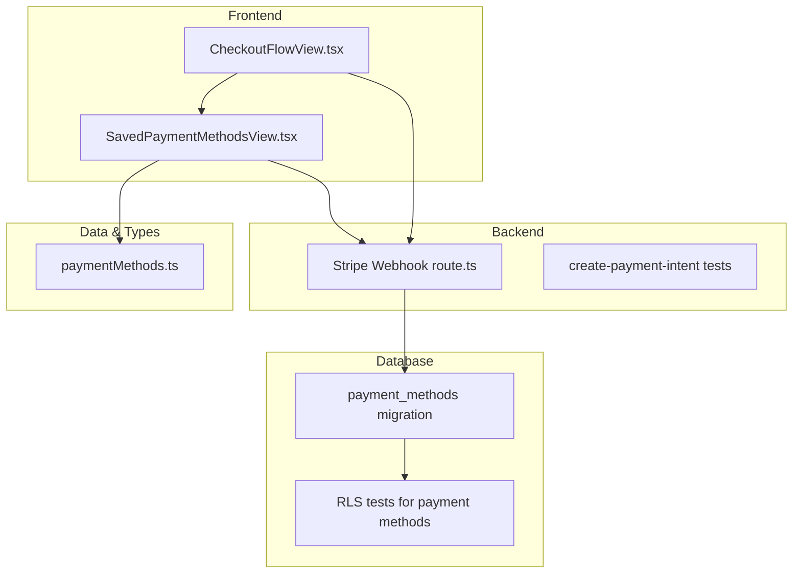
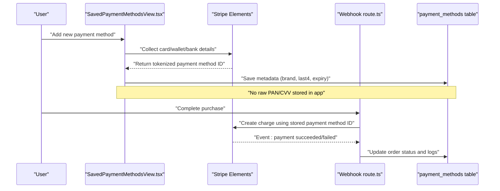
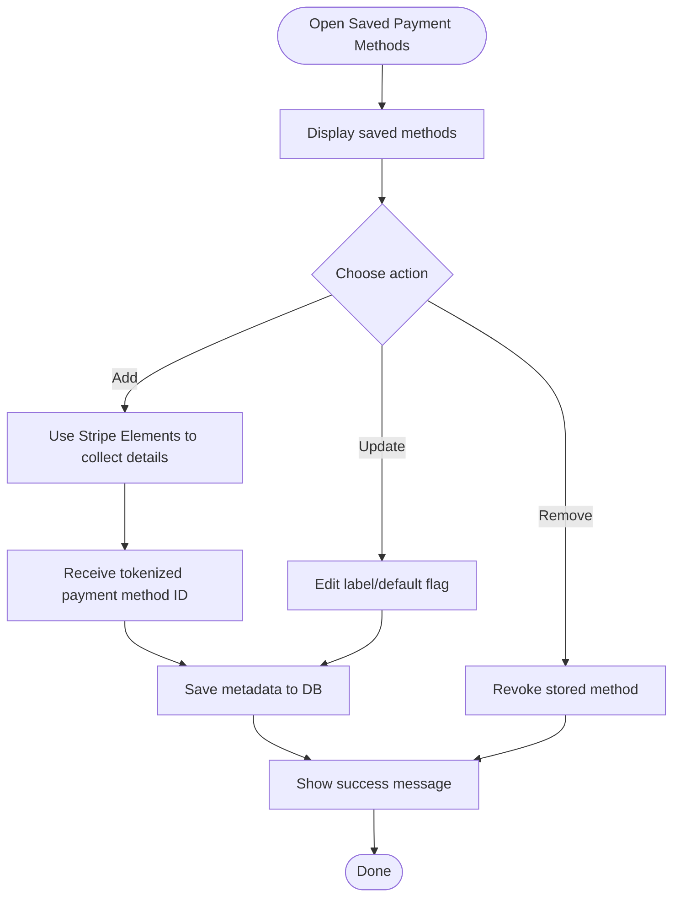
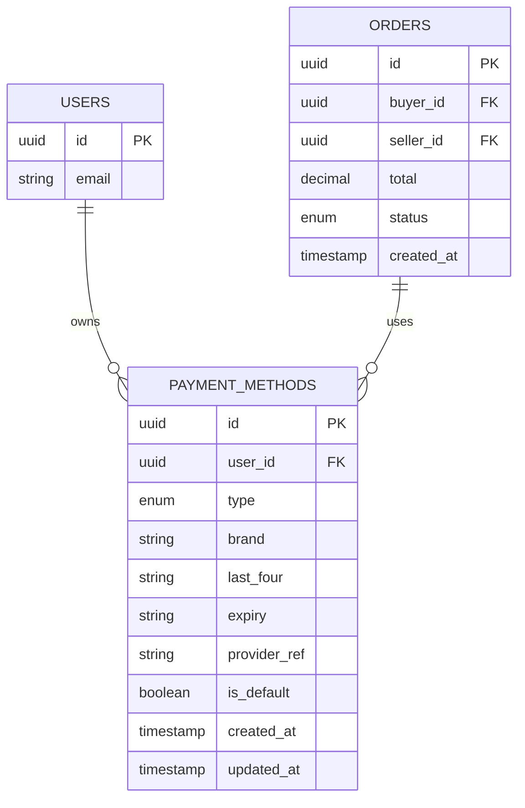
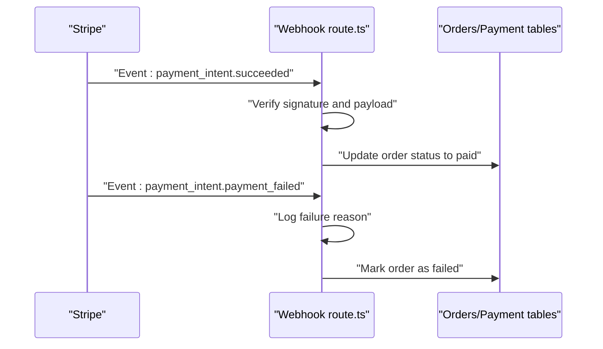
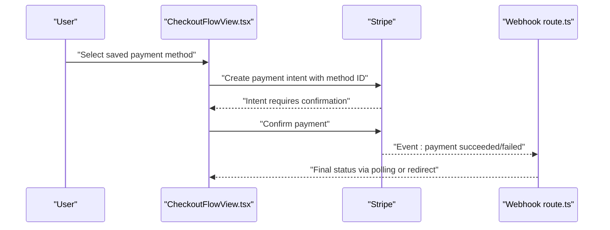
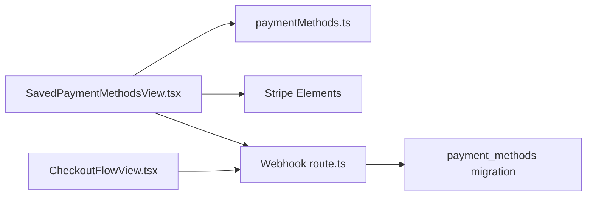

# Payment Methods

<cite>
**Referenced Files in This Document**
- [SavedPaymentMethodsView.tsx](file://src/components/SavedPaymentMethodsView.tsx)
- [paymentMethods.ts](file://src/data/paymentMethods.ts)
- [202608060001_payment_methods.sql](file://supabase/migrations/202608060001_payment_methods.sql)
- [phase_3_payment_methods_rls.sql](file://supabase/tests/phase_3_payment_methods_rls.sql)
- [create-payment-intent.test.ts](file://src/services/backend/create-payment-intent.test.ts)
- [route.ts](file://src/app/api/stripe/webhook/route.ts)
- [CheckoutFlowView.tsx](file://src/components/CheckoutFlowView.tsx)
</cite>

## Table of Contents
1. [Introduction](#introduction)
2. [Project Structure](#project-structure)
3. [Core Components](#core-components)
4. [Architecture Overview](#architecture-overview)
5. [Detailed Component Analysis](#detailed-component-analysis)
6. [Dependency Analysis](#dependency-analysis)
7. [Performance Considerations](#performance-considerations)
8. [Troubleshooting Guide](#troubleshooting-guide)
9. [Conclusion](#conclusion)

## Introduction
This document explains how Mooday manages payment methods end-to-end: adding, updating, and removing saved payment methods securely; the data model and storage; supported payment types; UI flows for viewing and editing saved methods; validation and error handling; and security practices including PCI DSS compliance and tokenization strategies. It is intended for both technical and non-technical readers who need to understand how payment methods work within the platform.

## Project Structure
The payment method feature spans several layers:
- Frontend UI for managing saved payment methods
- Data models and mock data for development/testing
- Database schema and Row-Level Security (RLS) policies
- Backend integration with Stripe for payments and webhooks
- Checkout flow that consumes saved payment methods

**Diagram sources**
- [SavedPaymentMethodsView.tsx](file://src/components/SavedPaymentMethodsView.tsx)
- [paymentMethods.ts](file://src/data/paymentMethods.ts)
- [route.ts](file://src/app/api/stripe/webhook/route.ts)
- [202608060001_payment_methods.sql](file://supabase/migrations/202608060001_payment_methods.sql)
- [phase_3_payment_methods_rls.sql](file://supabase/tests/phase_3_payment_methods_rls.sql)
- [CheckoutFlowView.tsx](file://src/components/CheckoutFlowView.tsx)
- [create-payment-intent.test.ts](file://src/services/backend/create-payment-intent.test.ts)

**Section sources**
- [SavedPaymentMethodsView.tsx](file://src/components/SavedPaymentMethodsView.tsx)
- [paymentMethods.ts](file://src/data/paymentMethods.ts)
- [202608060001_payment_methods.sql](file://supabase/migrations/202608060001_payment_methods.sql)
- [phase_3_payment_methods_rls.sql](file://supabase/tests/phase_3_payment_methods_rls.sql)
- [route.ts](file://src/app/api/stripe/webhook/route.ts)
- [CheckoutFlowView.tsx](file://src/components/CheckoutFlowView.tsx)
- [create-payment-intent.test.ts](file://src/services/backend/create-payment-intent.test.ts)

## Core Components
- SavedPaymentMethodsView: The primary user interface for listing, selecting, adding, updating, and removing saved payment methods. It renders available methods, shows last four digits and brand icons, and exposes actions to manage them.
- paymentMethods.ts: Provides the data model and sample/mock entries used by the UI during development and testing.
- Database schema (migration): Defines the persisted structure for payment methods and their relationships to users and orders.
- Stripe webhook: Processes payment outcomes and updates internal state based on events from Stripe.
- Checkout flow: Integrates saved payment methods into the purchase experience and triggers payment intents via backend services.

Key responsibilities:
- UI: Display saved methods, initiate add/update/remove flows, handle user feedback
- Data: Model fields for type, brand, last four digits, expiry, and provider references
- Storage: Secure persistence via database with RLS ensuring user isolation
- Payments: Tokenization through Stripe; no raw card data stored in app databases
- Validation: Client-side checks before submission and server-side verification

**Section sources**
- [SavedPaymentMethodsView.tsx](file://src/components/SavedPaymentMethodsView.tsx)
- [paymentMethods.ts](file://src/data/paymentMethods.ts)
- [202608060001_payment_methods.sql](file://supabase/migrations/202608060001_payment_methods.sql)
- [route.ts](file://src/app/api/stripe/webhook/route.ts)
- [CheckoutFlowView.tsx](file://src/components/CheckoutFlowView.tsx)

## Architecture Overview
Mooday follows a secure, token-first approach to payment methods:
- Users enter sensitive details directly into trusted components provided by Stripe. These components tokenize data and return short-lived tokens or saved payment method IDs to the frontend.
- The frontend associates tokens with a user context and persists only non-sensitive metadata (e.g., brand, last four digits, expiry) in the database.
- When charging, the backend uses Stripe APIs with the stored payment method ID to create payment intents and process transactions.
- Webhooks listen for Stripe events to update order statuses and reconcile payments.

**Diagram sources**
- [SavedPaymentMethodsView.tsx](file://src/components/SavedPaymentMethodsView.tsx)
- [route.ts](file://src/app/api/stripe/webhook/route.ts)
- [202608060001_payment_methods.sql](file://supabase/migrations/202608060001_payment_methods.sql)

## Detailed Component Analysis

### SavedPaymentMethodsView
Purpose:
- List all saved payment methods for the current user
- Allow adding new methods via Stripe Elements
- Enable updating display metadata (e.g., nickname) and removing methods
- Provide clear success/error feedback

Supported payment types:
- Credit/debit cards
- Digital wallets (via Stripe-supported integrations)
- Bank accounts (where applicable)

User flows:
- Add: User opens “Add payment method,” enters details in Stripe’s secure UI, receives a tokenized ID, and saves metadata.
- Update: User edits friendly labels or selects a default method.
- Remove: User revokes access to a stored method.

Validation:
- Client-side validation ensures required fields are present before submission
- Server-side validation enforces constraints and ownership checks via RLS

Error handling:
- Network failures, invalid tokens, and Stripe errors are surfaced to the user with actionable messages
- Failed operations do not persist partial or invalid records

**Diagram sources**
- [SavedPaymentMethodsView.tsx](file://src/components/SavedPaymentMethodsView.tsx)

**Section sources**
- [SavedPaymentMethodsView.tsx](file://src/components/SavedPaymentMethodsView.tsx)

### Data Model and Storage
The payment method data model captures non-sensitive metadata necessary for displaying and selecting methods at checkout. Sensitive financial data is never stored in the application database; instead, tokenized references are managed by Stripe.

Key attributes typically include:
- Unique identifier
- User association
- Type (card, wallet, bank account)
- Brand and last four digits
- Expiry date
- Provider reference (tokenized ID)
- Default flag
- Timestamps

Storage mechanisms:
- Relational table with foreign keys to users and orders where relevant
- Row-Level Security policies restrict access to each user’s own payment methods
- Audit-friendly timestamps for tracking changes

Security protocols:
- PCI DSS compliance by offloading sensitive data collection to Stripe Elements
- Tokenization strategy ensures only non-sensitive metadata is persisted
- RLS prevents cross-user data leakage

**Diagram sources**
- [202608060001_payment_methods.sql](file://supabase/migrations/202608060001_payment_methods.sql)

**Section sources**
- [202608060001_payment_methods.sql](file://supabase/migrations/202608060001_payment_methods.sql)
- [phase_3_payment_methods_rls.sql](file://supabase/tests/phase_3_payment_methods_rls.sql)

### Backend Integration and Webhooks
The webhook endpoint processes Stripe events to keep internal state consistent:
- Confirms successful payments and updates order statuses
- Handles failures and disputes by marking orders appropriately
- Logs events for auditability and debugging

Integration points:
- Uses stored payment method IDs to create charges
- Validates event signatures and payloads
- Persists minimal, non-sensitive information

**Diagram sources**
- [route.ts](file://src/app/api/stripe/webhook/route.ts)

**Section sources**
- [route.ts](file://src/app/api/stripe/webhook/route.ts)

### Checkout Flow Integration
The checkout flow leverages saved payment methods to streamline purchases:
- Displays available methods for selection
- Creates payment intents using the selected method
- Provides real-time feedback on success or failure

**Diagram sources**
- [CheckoutFlowView.tsx](file://src/components/CheckoutFlowView.tsx)
- [route.ts](file://src/app/api/stripe/webhook/route.ts)

**Section sources**
- [CheckoutFlowView.tsx](file://src/components/CheckoutFlowView.tsx)
- [create-payment-intent.test.ts](file://src/services/backend/create-payment-intent.test.ts)

## Dependency Analysis
The payment method feature depends on cohesive interactions between UI, data, and backend services:
- UI depends on Stripe Elements for secure data collection
- UI depends on the data model for rendering and validation
- Backend depends on Stripe APIs for processing and reconciliation
- Database relies on RLS for secure multi-tenant access

**Diagram sources**
- [SavedPaymentMethodsView.tsx](file://src/components/SavedPaymentMethodsView.tsx)
- [paymentMethods.ts](file://src/data/paymentMethods.ts)
- [route.ts](file://src/app/api/stripe/webhook/route.ts)
- [202608060001_payment_methods.sql](file://supabase/migrations/202608060001_payment_methods.sql)
- [CheckoutFlowView.tsx](file://src/components/CheckoutFlowView.tsx)

**Section sources**
- [SavedPaymentMethodsView.tsx](file://src/components/SavedPaymentMethodsView.tsx)
- [paymentMethods.ts](file://src/data/paymentMethods.ts)
- [route.ts](file://src/app/api/stripe/webhook/route.ts)
- [202608060001_payment_methods.sql](file://supabase/migrations/202608060001_payment_methods.sql)
- [CheckoutFlowView.tsx](file://src/components/CheckoutFlowView.tsx)

## Performance Considerations
- Minimize network calls by caching the list of saved methods locally after initial load
- Defer heavy operations until user interaction (e.g., lazy-load method details)
- Use optimistic UI updates for add/remove actions with rollback on failure
- Ensure Stripe Elements initialization is efficient and reused across views
- Keep database queries scoped to the current user to leverage RLS effectively

[No sources needed since this section provides general guidance]

## Troubleshooting Guide
Common issues and resolutions:
- Invalid or expired payment method: Prompt the user to update or replace the method
- Network errors during add/remove: Retry with exponential backoff and show clear error messages
- Webhook delivery failures: Inspect logs and reprocess events if necessary
- RLS policy violations: Verify user identity and ensure requests are authenticated under the correct tenant

Debugging tips:
- Check client-side validation errors before submission
- Review Stripe dashboard for event logs and error reasons
- Validate database rows for consistency after webhook processing

**Section sources**
- [SavedPaymentMethodsView.tsx](file://src/components/SavedPaymentMethodsView.tsx)
- [route.ts](file://src/app/api/stripe/webhook/route.ts)

## Conclusion
Mooday’s payment method management prioritizes security and usability. By leveraging Stripe Elements for tokenization, storing only non-sensitive metadata, enforcing strict RLS policies, and integrating robust webhook handling, the platform delivers a PCI-compliant experience. Users can confidently add, update, and remove payment methods while enjoying a streamlined checkout flow.

[No sources needed since this section summarizes without analyzing specific files]