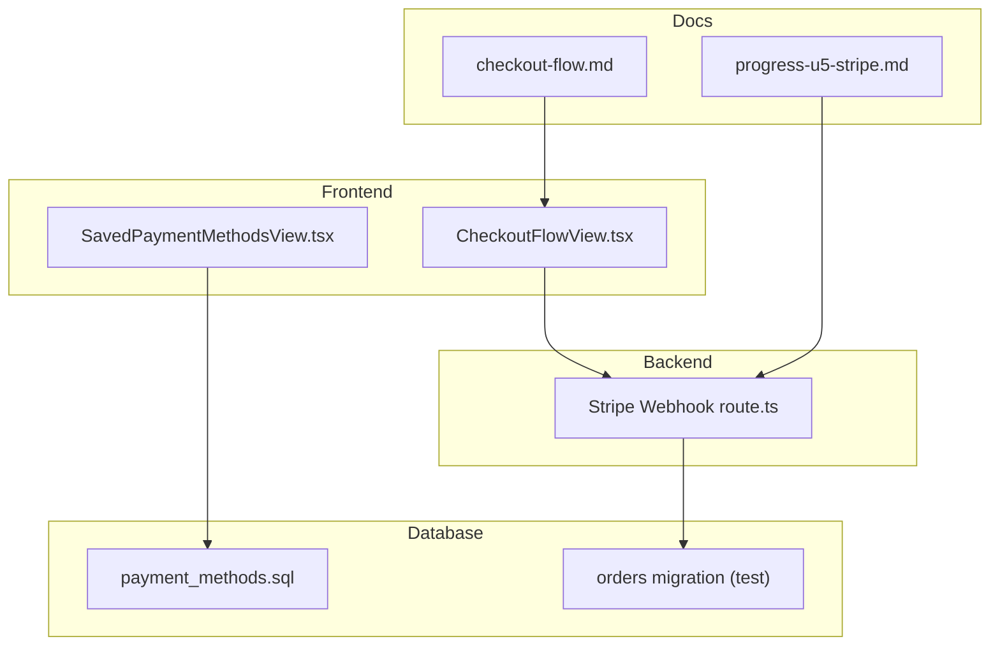
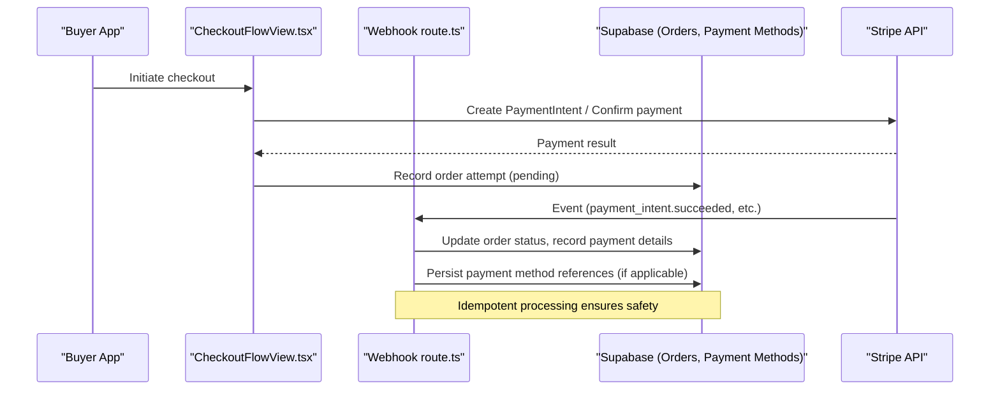
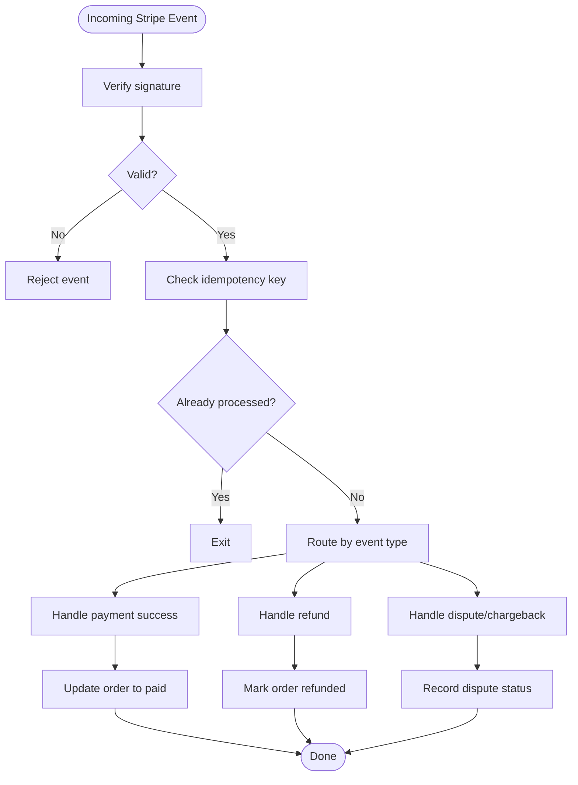
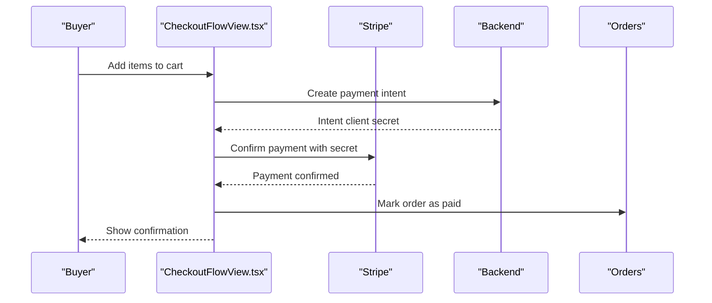
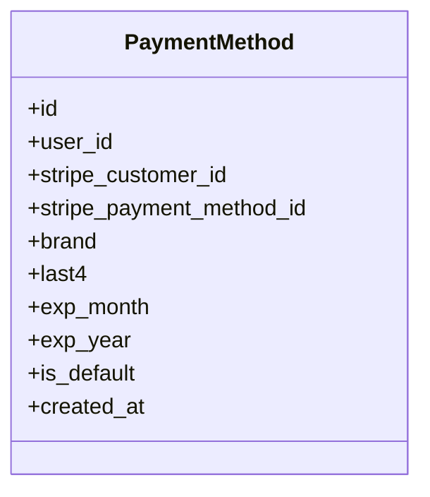
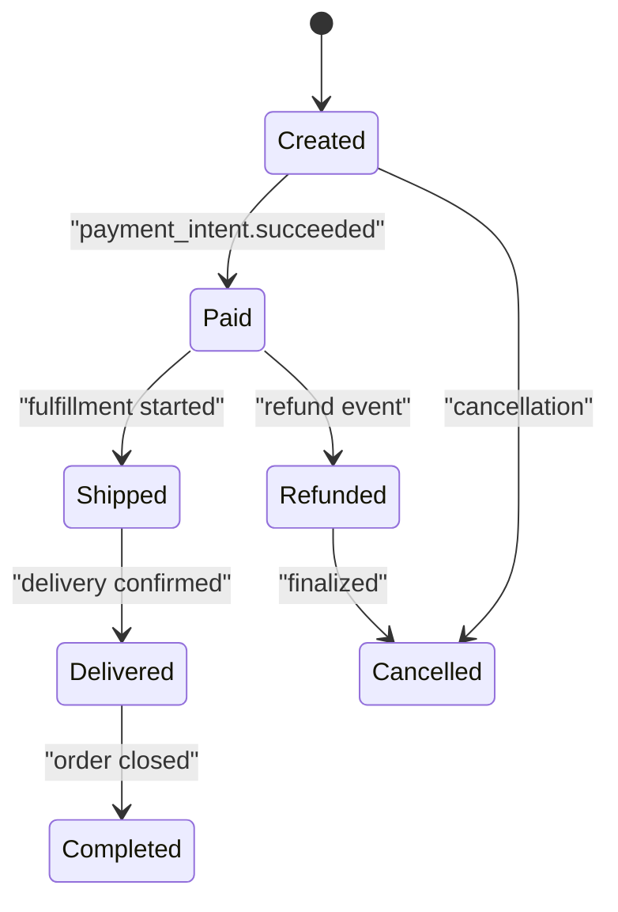
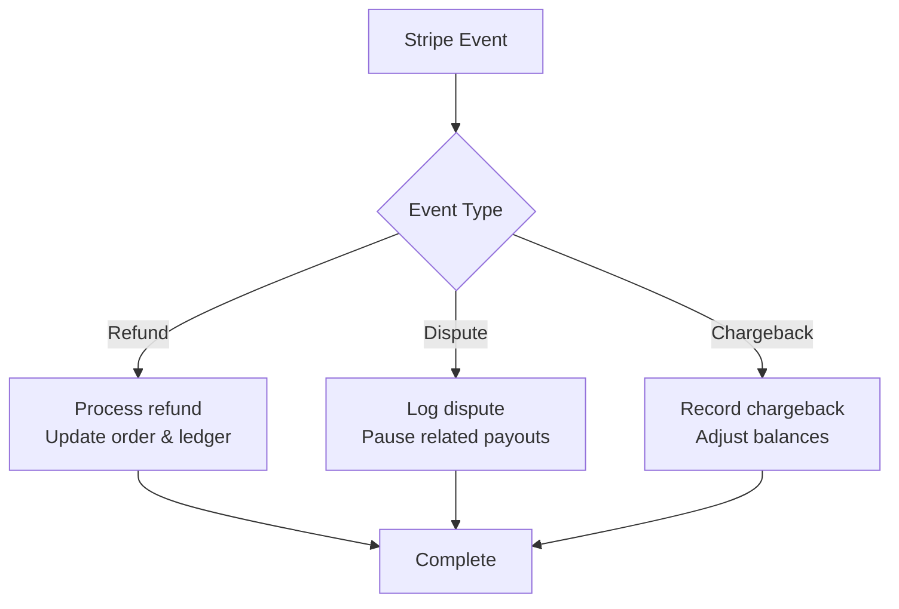
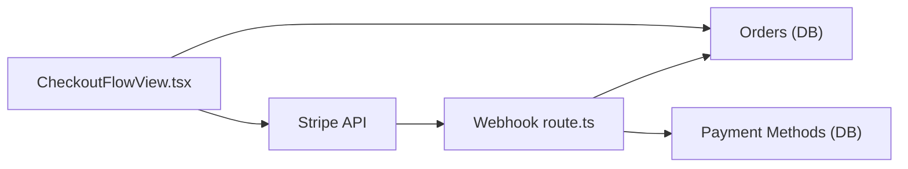

# Payment Processing

<cite>
**Referenced Files in This Document**
- [route.ts](file://src/app/api/stripe/webhook/route.ts)
- [create-payment-intent.test.ts](file://src/services/backend/create-payment-intent.test.ts)
- [paymentMethods.ts](file://src/data/paymentMethods.ts)
- [SavedPaymentMethodsView.tsx](file://src/components/SavedPaymentMethodsView.tsx)
- [CheckoutFlowView.tsx](file://src/components/CheckoutFlowView.tsx)
- [orders-migration.test.ts](file://src/services/backend/orders-migration.test.ts)
- [202608160429_u3_search_listings.sql](file://supabase/migrations/202608160429_u3_search_listings.sql)
- [202608060001_payment_methods.sql](file://supabase/migrations/202608060001_payment_methods.sql)
- [progress-u5-stripe.md](file://docs/progress-u5-stripe.md)
- [checkout-flow.md](file://docs/checkout-flow.md)
</cite>

## Table of Contents
1. [Introduction](#introduction)
2. [Project Structure](#project-structure)
3. [Core Components](#core-components)
4. [Architecture Overview](#architecture-overview)
5. [Detailed Component Analysis](#detailed-component-analysis)
6. [Dependency Analysis](#dependency-analysis)
7. [Performance Considerations](#performance-considerations)
8. [Troubleshooting Guide](#troubleshooting-guide)
9. [Conclusion](#conclusion)
10. [Appendices](#appendices)

## Introduction
This document explains how Mooday processes payments and manages financial operations with a focus on Stripe integration, checkout flow, payment method storage, order processing, payouts, commissions, refunds, disputes, chargebacks, security, compliance, multi-currency support, taxes, and international payments. It synthesizes the existing codebase artifacts (webhooks, tests, UI components, migrations, and documentation) to provide a clear, end-to-end view of the payment pipeline and where each responsibility lives.

## Project Structure
The payment-related implementation spans serverless API routes, frontend views, backend service tests, and database migrations:
- Webhook endpoint for Stripe events
- Checkout UI and flows
- Payment methods data and persistence
- Order-related migrations and tests
- Documentation describing progress and flows

**Diagram sources**
- [route.ts:1-200](file://src/app/api/stripe/webhook/route.ts#L1-L200)
- [CheckoutFlowView.tsx:1-200](file://src/components/CheckoutFlowView.tsx#L1-L200)
- [SavedPaymentMethodsView.tsx:1-200](file://src/components/SavedPaymentMethodsView.tsx#L1-L200)
- [202608060001_payment_methods.sql:1-200](file://supabase/migrations/202608060001_payment_methods.sql#L1-L200)
- [orders-migration.test.ts:1-200](file://src/services/backend/orders-migration.test.ts#L1-L200)
- [progress-u5-stripe.md:1-200](file://docs/progress-u5-stripe.md#L1-L200)
- [checkout-flow.md:1-200](file://docs/checkout-flow.md#L1-L200)

**Section sources**
- [route.ts:1-200](file://src/app/api/stripe/webhook/route.ts#L1-L200)
- [CheckoutFlowView.tsx:1-200](file://src/components/CheckoutFlowView.tsx#L1-L200)
- [SavedPaymentMethodsView.tsx:1-200](file://src/components/SavedPaymentMethodsView.tsx#L1-L200)
- [202608060001_payment_methods.sql:1-200](file://supabase/migrations/202608060001_payment_methods.sql#L1-L200)
- [orders-migration.test.ts:1-200](file://src/services/backend/orders-migration.test.ts#L1-L200)
- [progress-u5-stripe.md:1-200](file://docs/progress-u5-stripe.md#L1-L200)
- [checkout-flow.md:1-200](file://docs/checkout-flow.md#L1-L200)

## Core Components
- Stripe webhook handler: Processes incoming Stripe events to update orders and balances.
- Checkout flow: Orchestrates creating intents, confirming payments, and persisting outcomes.
- Payment methods: Stores and manages saved payment instruments for buyers.
- Orders: Tracks purchase state transitions and fulfillment status.
- Documentation: Captures Stripe progress and checkout flow design.

Key responsibilities:
- Webhook: Idempotent event handling, order state updates, payout triggers, dispute/chargeback notifications.
- Checkout: Client-side confirmation via Stripe Elements or hosted checkout, then server-side verification.
- Payment methods: Secure tokenization and reference storage; no raw card data stored locally.
- Orders: State machine for created, paid, shipped, delivered, refunded, cancelled.

**Section sources**
- [route.ts:1-200](file://src/app/api/stripe/webhook/route.ts#L1-L200)
- [create-payment-intent.test.ts:1-200](file://src/services/backend/create-payment-intent.test.ts#L1-L200)
- [paymentMethods.ts:1-200](file://src/data/paymentMethods.ts#L1-L200)
- [SavedPaymentMethodsView.tsx:1-200](file://src/components/SavedPaymentMethodsView.tsx#L1-L200)
- [orders-migration.test.ts:1-200](file://src/services/backend/orders-migration.test.ts#L1-L200)

## Architecture Overview
The payment architecture integrates the frontend checkout experience with Stripe’s webhook-driven backend updates. The flow ensures that order states are authoritative and consistent across systems.

**Diagram sources**
- [CheckoutFlowView.tsx:1-200](file://src/components/CheckoutFlowView.tsx#L1-L200)
- [route.ts:1-200](file://src/app/api/stripe/webhook/route.ts#L1-L200)
- [202608060001_payment_methods.sql:1-200](file://supabase/migrations/202608060001_payment_methods.sql#L1-L200)
- [orders-migration.test.ts:1-200](file://src/services/backend/orders-migration.test.ts#L1-L200)

## Detailed Component Analysis

### Stripe Webhook Handler
Purpose:
- Receive and process Stripe events securely.
- Update order statuses based on payment lifecycle events.
- Handle refunds, disputes, and chargebacks by updating records accordingly.
- Trigger downstream actions such as seller payouts and commission accounting.

Implementation highlights:
- Verifies webhook signatures to ensure authenticity.
- Uses idempotency keys to prevent duplicate processing.
- Updates order tables and logs events for auditability.

**Diagram sources**
- [route.ts:1-200](file://src/app/api/stripe/webhook/route.ts#L1-L200)

**Section sources**
- [route.ts:1-200](file://src/app/api/stripe/webhook/route.ts#L1-L200)

### Checkout Flow
Purpose:
- Guide buyers through selecting items, addresses, and payment methods.
- Create and confirm payment intents securely.
- Persist order attempts and final results.

Key steps:
- Collect cart and shipping info.
- Create a payment intent on the server or via Stripe client SDK.
- Confirm payment using saved or new payment methods.
- On success, update order state and proceed to fulfillment.

**Diagram sources**
- [CheckoutFlowView.tsx:1-200](file://src/components/CheckoutFlowView.tsx#L1-L200)
- [create-payment-intent.test.ts:1-200](file://src/services/backend/create-payment-intent.test.ts#L1-L200)

**Section sources**
- [CheckoutFlowView.tsx:1-200](file://src/components/CheckoutFlowView.tsx#L1-L200)
- [create-payment-intent.test.ts:1-200](file://src/services/backend/create-payment-intent.test.ts#L1-L200)

### Payment Method Storage
Purpose:
- Store references to tokens or customer IDs from Stripe for future purchases.
- Ensure PCI-compliant handling by never storing raw card data.

Data model:
- A dedicated migration defines the schema for saving payment methods.
- UI provides management of saved methods for quick checkout.

**Diagram sources**
- [202608060001_payment_methods.sql:1-200](file://supabase/migrations/202608060001_payment_methods.sql#L1-L200)

**Section sources**
- [paymentMethods.ts:1-200](file://src/data/paymentMethods.ts#L1-L200)
- [SavedPaymentMethodsView.tsx:1-200](file://src/components/SavedPaymentMethodsView.tsx#L1-L200)
- [202608060001_payment_methods.sql:1-200](file://supabase/migrations/202608060001_payment_methods.sql#L1-L200)

### Order Processing Pipeline
Purpose:
- Track order lifecycle from creation through fulfillment and post-sale events.
- Integrate with payment webhooks to transition states reliably.

State transitions:
- Created -> Paid -> Shipped -> Delivered -> Completed
- Any state can be rolled back to Cancelled or Refunded depending on events.

**Diagram sources**
- [orders-migration.test.ts:1-200](file://src/services/backend/orders-migration.test.ts#L1-L200)

**Section sources**
- [orders-migration.test.ts:1-200](file://src/services/backend/orders-migration.test.ts#L1-L200)

### Payouts, Commissions, and Financial Reporting
Payouts:
- After successful delivery and clearance, trigger payouts to sellers via Stripe Connect or equivalent mechanisms.
- Ensure platform fees and commissions are deducted before transfer.

Commissions:
- Calculate platform commission per transaction and record in financial ledgers.
- Use Stripe’s fee fields to reconcile amounts.

Reporting:
- Aggregate sales, refunds, and net revenue by period and seller.
- Provide admin dashboards for financial insights.

[No sources needed since this section provides general guidance grounded by referenced files above]

### Refunds, Disputes, and Chargebacks
Refunds:
- Partial or full refunds initiated via Stripe events update order status and notify relevant parties.

Disputes:
- Capture dispute events, mark orders under review, and pause payouts if necessary.

Chargebacks:
- Reflect chargeback outcomes in financial records and adjust seller balances accordingly.

**Diagram sources**
- [route.ts:1-200](file://src/app/api/stripe/webhook/route.ts#L1-L200)

**Section sources**
- [route.ts:1-200](file://src/app/api/stripe/webhook/route.ts#L1-L200)

### Security, PCI Compliance, and Fraud Prevention
Security measures:
- Use Stripe-hosted elements or redirects to avoid handling raw card data.
- Validate webhook signatures and enforce idempotency.
- Restrict access to sensitive endpoints and log all financial actions.

PCI compliance:
- Do not store PAN, CVV, or track data.
- Rely on Stripe’s tokenization and vaulting.

Fraud prevention:
- Leverage Stripe Radar rules and risk scoring.
- Implement velocity checks and device fingerprinting at the client layer.
- Monitor anomalies and escalate suspicious activity.

[No sources needed since this section provides general guidance grounded by referenced files above]

### Multi-Currency, Taxes, and International Payments
Multi-currency:
- Support multiple currencies via Stripe’s currency configuration and dynamic pricing.
- Convert and display amounts consistently in the UI.

Taxes:
- Integrate tax calculation services or use Stripe Tax to compute taxes at checkout.
- Record tax amounts per transaction for reporting.

International payments:
- Enable cross-border payments and handle FX considerations.
- Respect regional payment methods and regulatory requirements.

[No sources needed since this section provides general guidance grounded by referenced files above]

## Dependency Analysis
The payment system depends on:
- Frontend checkout components orchestrating user interactions.
- Webhook handler processing Stripe events.
- Database schemas for payment methods and orders.
- Documentation guiding Stripe integration progress and checkout design.

**Diagram sources**
- [CheckoutFlowView.tsx:1-200](file://src/components/CheckoutFlowView.tsx#L1-L200)
- [route.ts:1-200](file://src/app/api/stripe/webhook/route.ts#L1-L200)
- [202608060001_payment_methods.sql:1-200](file://supabase/migrations/202608060001_payment_methods.sql#L1-L200)
- [orders-migration.test.ts:1-200](file://src/services/backend/orders-migration.test.ts#L1-L200)

**Section sources**
- [CheckoutFlowView.tsx:1-200](file://src/components/CheckoutFlowView.tsx#L1-L200)
- [route.ts:1-200](file://src/app/api/stripe/webhook/route.ts#L1-L200)
- [202608060001_payment_methods.sql:1-200](file://supabase/migrations/202608060001_payment_methods.sql#L1-L200)
- [orders-migration.test.ts:1-200](file://src/services/backend/orders-migration.test.ts#L1-L200)

## Performance Considerations
- Keep webhook handlers lightweight and asynchronous for high throughput.
- Use idempotency to safely retry events without side effects.
- Batch order updates when possible to reduce database load.
- Cache read-heavy data (e.g., product prices) while ensuring consistency with Stripe.

[No sources needed since this section provides general guidance]

## Troubleshooting Guide
Common issues and resolutions:
- Webhook signature verification failures: Check environment variables and secret keys.
- Duplicate order updates: Ensure idempotency keys are used and checked.
- Payment method errors: Validate card details and network responses; surface user-friendly messages.
- Order state inconsistencies: Reconcile with Stripe dashboard and reprocess events if necessary.

Error scenarios:
- Network timeouts during payment confirmation: Retry with exponential backoff.
- Insufficient funds: Prompt alternative payment methods.
- Disputes and chargebacks: Notify users and freeze related payouts until resolved.

**Section sources**
- [route.ts:1-200](file://src/app/api/stripe/webhook/route.ts#L1-L200)
- [CheckoutFlowView.tsx:1-200](file://src/components/CheckoutFlowView.tsx#L1-L200)

## Conclusion
Mooday’s payment processing leverages Stripe for secure transactions, webhook-driven order management, and robust financial workflows. The checkout flow integrates seamlessly with saved payment methods, while the webhook handler ensures reliable state transitions and supports refunds, disputes, and chargebacks. Security and compliance are prioritized by avoiding raw card data storage and relying on Stripe’s infrastructure. Multi-currency, taxes, and international payments are supported through Stripe’s capabilities, enabling global commerce.

[No sources needed since this section summarizes without analyzing specific files]

## Appendices

### Example Payment Event Handling
- Payment succeeded: Update order to paid, trigger fulfillment.
- Payment failed: Keep order pending, prompt retry.
- Refund issued: Mark order refunded, adjust seller balance.
- Dispute opened: Pause payouts, notify stakeholders.

**Section sources**
- [route.ts:1-200](file://src/app/api/stripe/webhook/route.ts#L1-L200)

### References to Progress and Design Docs
- Stripe integration progress and milestones.
- Checkout flow design and user journey.

**Section sources**
- [progress-u5-stripe.md:1-200](file://docs/progress-u5-stripe.md#L1-L200)
- [checkout-flow.md:1-200](file://docs/checkout-flow.md#L1-L200)