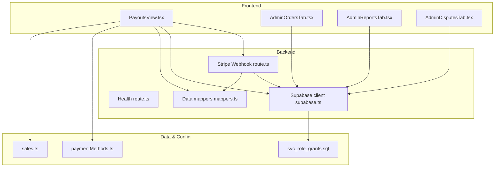
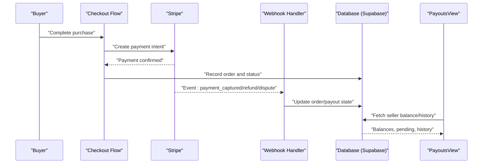
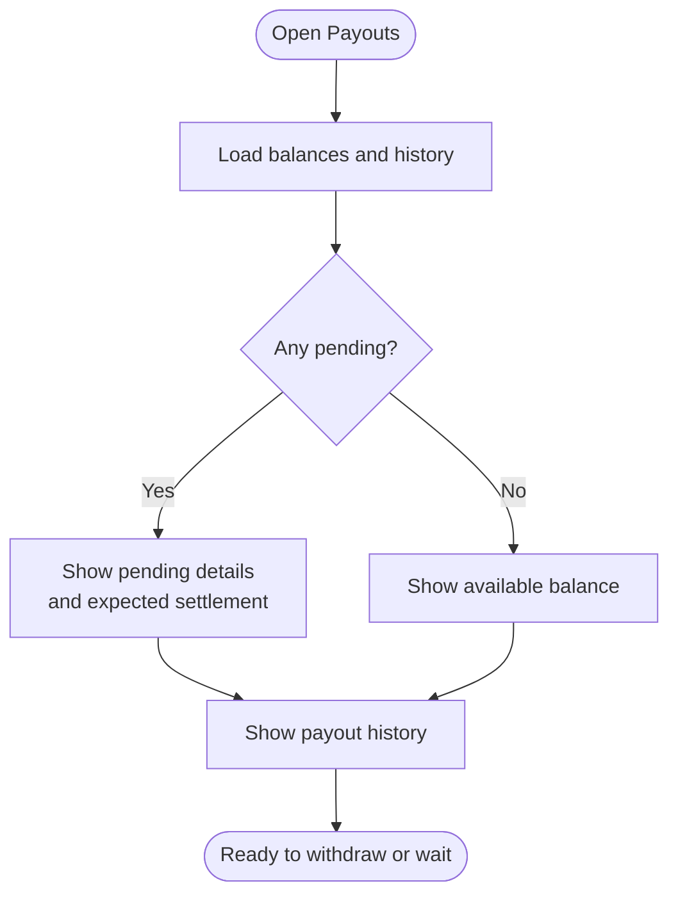
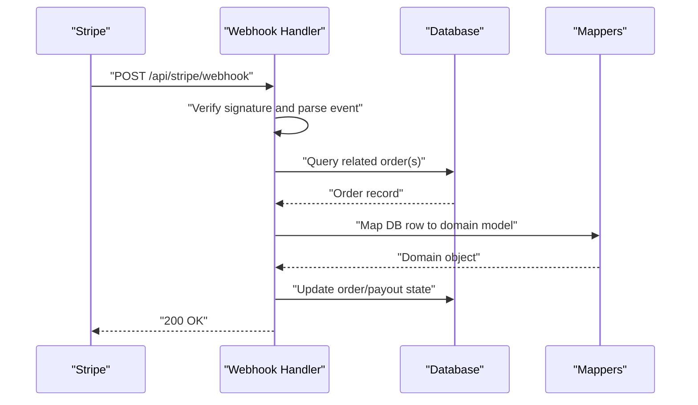
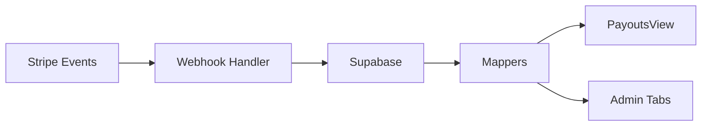

# Payout System

<cite>
**Referenced Files in This Document**
- [PayoutsView.tsx](file://src/components/PayoutsView.tsx)
- [PayoutsView.test.tsx](file://src/components/PayoutsView.test.tsx)
- [route.ts](file://src/app/api/stripe/webhook/route.ts)
- [route.ts](file://src/app/api/health/route.ts)
- [supabase.ts](file://src/services/backend/supabase.ts)
- [mappers.ts](file://src/services/backend/mappers.ts)
- [orders-migration.test.ts](file://src/services/backend/orders-migration.test.ts)
- [create-payment-intent.test.ts](file://src/services/backend/create-payment-intent.test.ts)
- [paymentMethods.ts](file://src/data/paymentMethods.ts)
- [sales.ts](file://src/data/sales.ts)
- [AdminOrdersTab.tsx](file://src/components/admin/AdminOrdersTab.tsx)
- [AdminReportsTab.tsx](file://src/components/admin/AdminReportsTab.tsx)
- [AdminDisputesTab.tsx](file://src/components/admin/AdminDisputesTab.tsx)
- [202608160503_svc_role_grants.sql](file://supabase/migrations/202608160503_svc_role_grants.sql)
</cite>

## Table of Contents
1. [Introduction](#introduction)
2. [Project Structure](#project-structure)
3. [Core Components](#core-components)
4. [Architecture Overview](#architecture-overview)
5. [Detailed Component Analysis](#detailed-component-analysis)
6. [Dependency Analysis](#dependency-analysis)
7. [Performance Considerations](#performance-considerations)
8. [Troubleshooting Guide](#troubleshooting-guide)
9. [Conclusion](#conclusion)
10. [Appendices](#appendices)

## Introduction
This document explains the seller payout system as implemented in Mooday. It covers how payouts are calculated, how commissions and fees are applied, and the end-to-end workflow from sale completion to fund disbursement. It also documents the UI for viewing payouts, transaction history, financial reporting, and the security and compliance considerations relevant to financial transactions. Where applicable, it references concrete files and diagrams to help you navigate the codebase.

## Project Structure
The payout-related functionality spans several layers:
- Frontend views for sellers to inspect balances, pending payouts, and history
- Backend API routes handling payment webhooks and health checks
- Data services for database access and data mapping
- Admin tools for order oversight, dispute handling, and reporting
- Database migrations that define roles and permissions

**Diagram sources**
- [PayoutsView.tsx](file://src/components/PayoutsView.tsx)
- [route.ts](file://src/app/api/stripe/webhook/route.ts)
- [route.ts](file://src/app/api/health/route.ts)
- [supabase.ts](file://src/services/backend/supabase.ts)
- [mappers.ts](file://src/services/backend/mappers.ts)
- [paymentMethods.ts](file://src/data/paymentMethods.ts)
- [sales.ts](file://src/data/sales.ts)
- [202608160503_svc_role_grants.sql](file://supabase/migrations/202608160503_svc_role_grants.sql)

**Section sources**
- [PayoutsView.tsx](file://src/components/PayoutsView.tsx)
- [route.ts](file://src/app/api/stripe/webhook/route.ts)
- [route.ts](file://src/app/api/health/route.ts)
- [supabase.ts](file://src/services/backend/supabase.ts)
- [mappers.ts](file://src/services/backend/mappers.ts)
- [paymentMethods.ts](file://src/data/paymentMethods.ts)
- [sales.ts](file://src/data/sales.ts)
- [202608160503_svc_role_grants.sql](file://supabase/migrations/202608160503_svc_role_grants.sql)

## Core Components
- Payouts view: Displays seller balances, available funds, pending payouts, and historical records. It integrates with backend services to fetch and refresh data.
- Stripe webhook handler: Processes payment events (e.g., capture, refund, chargeback) and updates internal state accordingly.
- Supabase client and mappers: Provide typed access to the database and transform rows into domain models used by the UI and admin panels.
- Admin tabs: Offer operational visibility into orders, disputes, and reports that influence payout eligibility and timing.

Key responsibilities:
- Maintain accurate seller balances and payout states
- React to payment lifecycle events via webhooks
- Expose consistent data models to frontend and admin
- Enforce least-privilege access through service role grants

**Section sources**
- [PayoutsView.tsx](file://src/components/PayoutsView.tsx)
- [PayoutsView.test.tsx](file://src/components/PayoutsView.test.tsx)
- [route.ts](file://src/app/api/stripe/webhook/route.ts)
- [supabase.ts](file://src/services/backend/supabase.ts)
- [mappers.ts](file://src/services/backend/mappers.ts)
- [AdminOrdersTab.tsx](file://src/components/admin/AdminOrdersTab.tsx)
- [AdminReportsTab.tsx](file://src/components/admin/AdminReportsTab.tsx)
- [AdminDisputesTab.tsx](file://src/components/admin/AdminDisputesTab.tsx)

## Architecture Overview
The payout architecture centers on a reliable event-driven flow:
- Sales complete and payments are captured
- Webhooks notify the backend of captures, refunds, and disputes
- The backend updates seller balances and payout queues
- Sellers view their status and history in the Payouts view
- Admin tools monitor and intervene when necessary

**Diagram sources**
- [route.ts](file://src/app/api/stripe/webhook/route.ts)
- [supabase.ts](file://src/services/backend/supabase.ts)
- [PayoutsView.tsx](file://src/components/PayoutsView.tsx)

## Detailed Component Analysis

### Payouts View
The Payouts view is the primary interface for sellers to understand their earnings and payout status. It typically shows:
- Available balance ready for withdrawal
- Pending amounts tied to holding periods or unresolved disputes
- Historical payouts with statuses and dates
- Links to detailed transaction records

It interacts with backend services to:
- Load current balances and pending amounts
- Refresh data after webhook-driven updates
- Render currency-aware values using configured methods

**Section sources**
- [PayoutsView.tsx](file://src/components/PayoutsView.tsx)
- [PayoutsView.test.tsx](file://src/components/PayoutsView.test.tsx)

### Payment Webhook Handler
The webhook handler ensures that external payment events are reflected accurately in internal state:
- Listens for Stripe events such as capture, refund, and dispute updates
- Validates event signatures and payloads
- Updates order and payout records via the database layer
- Triggers downstream processes like balance adjustments and notifications

**Diagram sources**
- [route.ts](file://src/app/api/stripe/webhook/route.ts)
- [supabase.ts](file://src/services/backend/supabase.ts)
- [mappers.ts](file://src/services/backend/mappers.ts)

**Section sources**
- [route.ts](file://src/app/api/stripe/webhook/route.ts)

### Data Services and Mappers
- Supabase client: Centralized configuration and typed queries for secure, efficient data access.
- Mappers: Convert raw database rows into strongly-typed models consumed by UI and admin components, ensuring consistency across the app.

These services underpin both the seller-facing Payouts view and admin dashboards.

**Section sources**
- [supabase.ts](file://src/services/backend/supabase.ts)
- [mappers.ts](file://src/services/backend/mappers.ts)

### Admin Tools
- Orders tab: Inspect and manage orders that affect payout eligibility.
- Reports tab: Aggregate financial metrics for reconciliation and insights.
- Disputes tab: Track and resolve disputes that may hold or reverse payouts.

These tools provide operational control over the payout lifecycle.

**Section sources**
- [AdminOrdersTab.tsx](file://src/components/admin/AdminOrdersTab.tsx)
- [AdminReportsTab.tsx](file://src/components/admin/AdminReportsTab.tsx)
- [AdminDisputesTab.tsx](file://src/components/admin/AdminDisputesTab.tsx)

## Dependency Analysis
The payout system depends on:
- Stripe for payment processing and event delivery
- Supabase for persistent storage and access control
- Mappers for consistent data representation
- Admin modules for oversight and intervention

**Diagram sources**
- [route.ts](file://src/app/api/stripe/webhook/route.ts)
- [supabase.ts](file://src/services/backend/supabase.ts)
- [mappers.ts](file://src/services/backend/mappers.ts)
- [PayoutsView.tsx](file://src/components/PayoutsView.tsx)
- [AdminOrdersTab.tsx](file://src/components/admin/AdminOrdersTab.tsx)
- [AdminReportsTab.tsx](file://src/components/admin/AdminReportsTab.tsx)
- [AdminDisputesTab.tsx](file://src/components/admin/AdminDisputesTab.tsx)

**Section sources**
- [route.ts](file://src/app/api/stripe/webhook/route.ts)
- [supabase.ts](file://src/services/backend/supabase.ts)
- [mappers.ts](file://src/services/backend/mappers.ts)
- [PayoutsView.tsx](file://src/components/PayoutsView.tsx)
- [AdminOrdersTab.tsx](file://src/components/admin/AdminOrdersTab.tsx)
- [AdminReportsTab.tsx](file://src/components/admin/AdminReportsTab.tsx)
- [AdminDisputesTab.tsx](file://src/components/admin/AdminDisputesTab.tsx)

## Performance Considerations
- Minimize redundant queries by batching reads in the Payouts view where possible.
- Cache stable data (e.g., currency settings) at the edge or in memory to reduce latency.
- Ensure webhook handlers are idempotent to handle duplicate events safely.
- Use indexes on frequently queried columns in order and payout tables to speed up lookups.
- Keep mapper transformations lightweight; avoid heavy computations inside hot paths.

[No sources needed since this section provides general guidance]

## Troubleshooting Guide
Common issues and diagnostics:
- Webhook not updating balances: Verify event signature validation and that the handler writes to the correct tables. Check logs around the webhook route.
- Stale balances in UI: Confirm that the Payouts view refreshes after webhook processing and that no optimistic UI state is out of sync.
- Access errors: Review service role grants to ensure the backend has sufficient privileges without overexposing data.
- Dispute-related holds: Use the admin disputes tab to identify active disputes affecting payouts.

Operational references:
- Health endpoint can be used to verify backend availability during incidents.
- Tests for orders and payment intents can help validate behavior changes.

**Section sources**
- [route.ts](file://src/app/api/stripe/webhook/route.ts)
- [route.ts](file://src/app/api/health/route.ts)
- [orders-migration.test.ts](file://src/services/backend/orders-migration.test.ts)
- [create-payment-intent.test.ts](file://src/services/backend/create-payment-intent.test.ts)
- [202608160503_svc_role_grants.sql](file://supabase/migrations/202608160503_svc_role_grants.sql)

## Conclusion
The Mooday payout system combines a robust webhook-driven backend with a clear seller-facing interface and comprehensive admin tools. By centralizing data access through Supabase and mappers, enforcing least-privilege access, and providing strong operational visibility, the system supports accurate, timely, and auditable seller payouts. Future enhancements should focus on explicit fee and commission modeling, automated settlement scheduling, and enhanced reporting capabilities.

[No sources needed since this section summarizes without analyzing specific files]

## Appendices

### Payout Calculation Concepts
While exact formulas are implemented in backend logic, typical components include:
- Gross sale amount
- Platform commission percentage
- Payment processing fees
- Adjustments for refunds, chargebacks, and disputes
- Net payout = Gross sale − Commission − Fees ± Adjustments

Use the admin reports and order details to reconcile these figures against actual payouts.

[No sources needed since this section provides conceptual guidance]

### Payout Methods and Currency Handling
- Payout methods are managed via saved payment methods and can be extended to support bank transfers or other providers.
- Currency conversion should be handled consistently in the backend and displayed correctly in the UI using configured formatting utilities.

**Section sources**
- [paymentMethods.ts](file://src/data/paymentMethods.ts)

### Transaction History and Reporting
- Transaction history is surfaced in the Payouts view and can be cross-referenced with order records.
- Admin reports aggregate key metrics for reconciliation and insight generation.

**Section sources**
- [PayoutsView.tsx](file://src/components/PayoutsView.tsx)
- [AdminReportsTab.tsx](file://src/components/admin/AdminReportsTab.tsx)

### Security and Compliance Notes
- Enforce least privilege with service role grants to limit data exposure.
- Validate all webhook inputs and signatures before processing.
- Maintain audit trails for payout state changes and administrative actions.
- Follow regional regulations for money movement, including KYC/AML requirements as applicable.

**Section sources**
- [202608160503_svc_role_grants.sql](file://supabase/migrations/202608160503_svc_role_grants.sql)