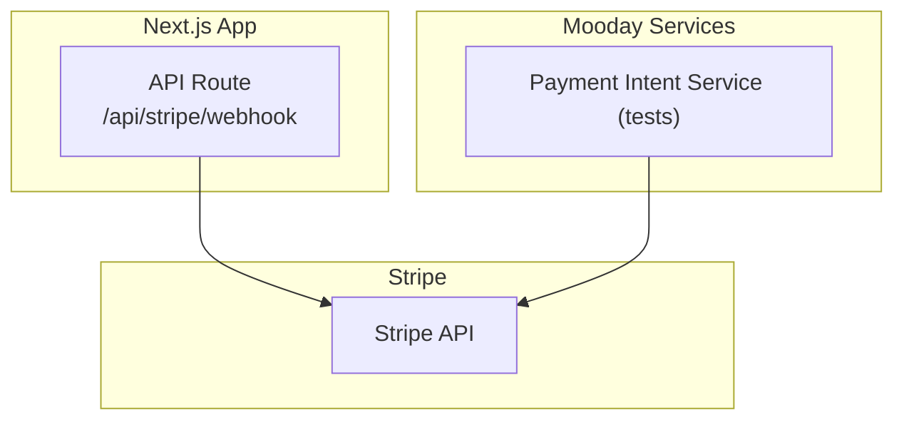
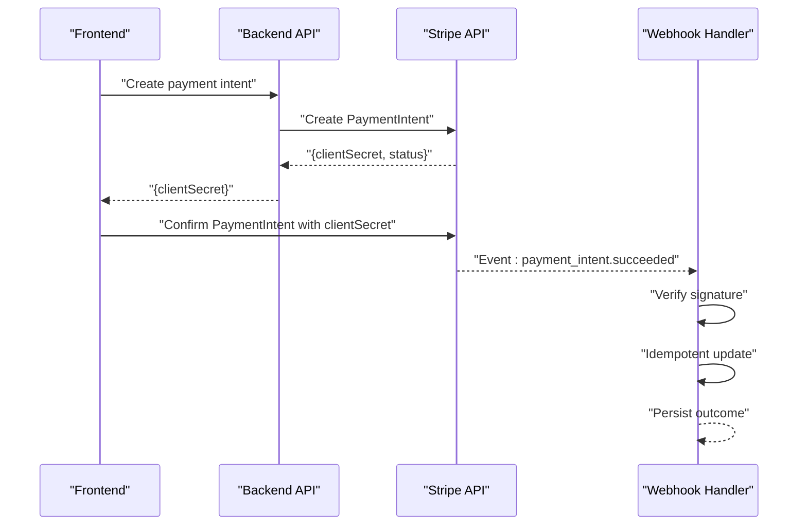
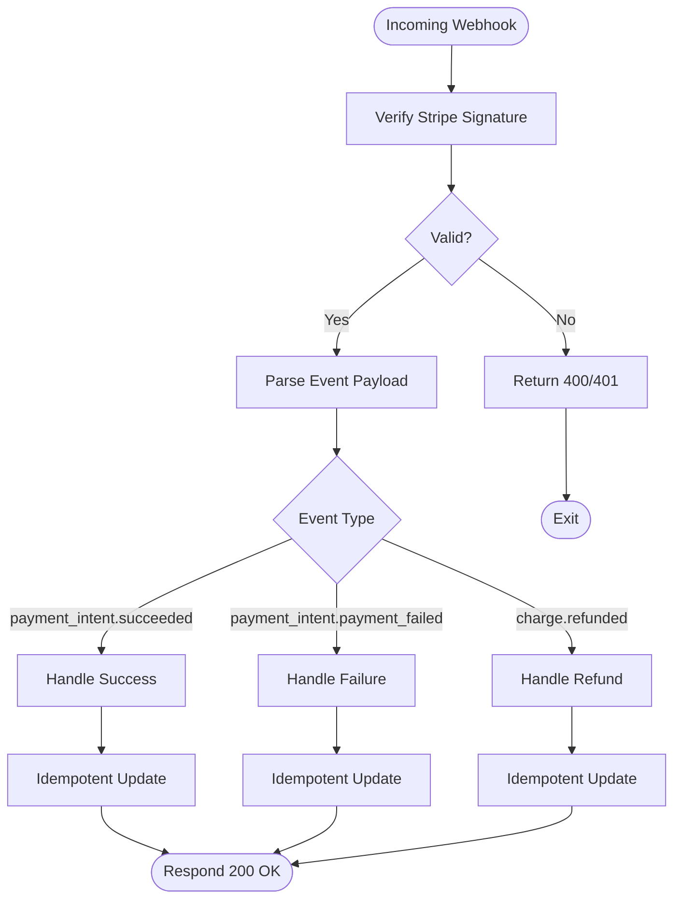
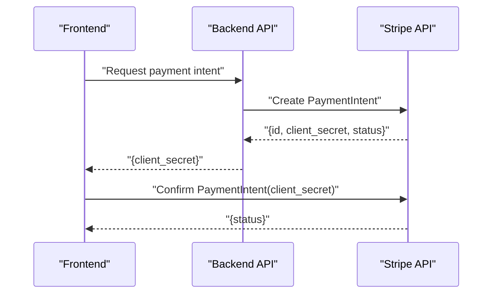
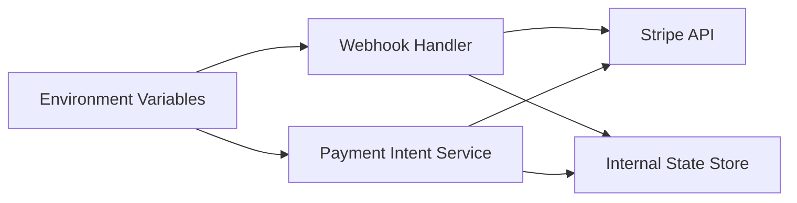

# Stripe Integration

<cite>
**Referenced Files in This Document**
- [route.ts](file://src/app/api/stripe/webhook/route.ts)
- [create-payment-intent.test.ts](file://src/services/backend/create-payment-intent.test.ts)
- [progress-u5-stripe.md](file://docs/progress-u5-stripe.md)
</cite>

## Table of Contents
1. [Introduction](#introduction)
2. [Project Structure](#project-structure)
3. [Core Components](#core-components)
4. [Architecture Overview](#architecture-overview)
5. [Detailed Component Analysis](#detailed-component-analysis)
6. [Dependency Analysis](#dependency-analysis)
7. [Performance Considerations](#performance-considerations)
8. [Troubleshooting Guide](#troubleshooting-guide)
9. [Conclusion](#conclusion)
10. [Appendices](#appendices)

## Introduction
This document explains the Stripe integration in Mooday with a focus on payment intent creation, webhook handling for payment events, and secure payment processing workflows. It covers Stripe API client configuration, supported payment method types, error handling strategies, webhook security verification, event processing pipeline, idempotency patterns, and practical examples for creating payment intents, confirming payments, and handling key Stripe events such as payment succeeded, failed, or refunded. It also includes PCI compliance considerations, test mode usage, and debugging techniques for payment issues.

## Project Structure
Stripe-related implementation is centered around:
- A Next.js API route that receives and processes Stripe webhooks.
- Backend service tests that demonstrate how payment intents are created and confirmed via the Stripe API.
- Documentation artifacts describing the Stripe feature progress and scope.

**Diagram sources**
- [route.ts](file://src/app/api/stripe/webhook/route.ts)
- [create-payment-intent.test.ts](file://src/services/backend/create-payment-intent.test.ts)

**Section sources**
- [progress-u5-stripe.md](file://docs/progress-u5-stripe.md)

## Core Components
- Webhook endpoint: Receives Stripe events, verifies signatures, and dispatches to handlers for specific event types.
- Payment intent creation: Server-side logic to create and confirm payment intents using Stripe’s API.
- Event processing: Idempotent handling of payment lifecycle events to update order/payment state consistently.

Key responsibilities:
- Securely verify incoming webhook payloads.
- Create payment intents with appropriate metadata and currency.
- Confirm payments securely from the server side when required.
- Handle success, failure, and refund events reliably.

**Section sources**
- [route.ts](file://src/app/api/stripe/webhook/route.ts)
- [create-payment-intent.test.ts](file://src/services/backend/create-payment-intent.test.ts)

## Architecture Overview
The Stripe integration follows a standard server-driven flow:
- The frontend initiates checkout and requests a payment intent from the backend.
- The backend creates a Stripe payment intent and returns the client secret.
- The frontend confirms the payment using the client secret and the selected payment method.
- Stripe sends asynchronous events to the webhook endpoint.
- The webhook endpoint verifies the signature, identifies the event type, and updates internal state idempotently.

**Diagram sources**
- [route.ts](file://src/app/api/stripe/webhook/route.ts)
- [create-payment-intent.test.ts](file://src/services/backend/create-payment-intent.test.ts)

## Detailed Component Analysis

### Webhook Endpoint (/api/stripe/webhook)
Responsibilities:
- Verify Stripe webhook signature to ensure authenticity.
- Parse the event payload and determine the event type.
- Process relevant events (e.g., payment succeeded, payment failed, refunded).
- Apply idempotency to prevent duplicate state changes.
- Return appropriate HTTP responses to Stripe.

Security and reliability:
- Signature verification prevents spoofed events.
- Idempotent handlers guard against retries and duplicates.
- Robust error handling ensures partial failures do not corrupt state.

**Diagram sources**
- [route.ts](file://src/app/api/stripe/webhook/route.ts)

**Section sources**
- [route.ts](file://src/app/api/stripe/webhook/route.ts)

### Payment Intent Creation and Confirmation
Responsibilities:
- Create a PaymentIntent with correct currency, amount, and metadata.
- Optionally attach payment methods or customer IDs.
- Confirm the PaymentIntent server-side when necessary for secure flows.
- Return the client secret to the frontend for confirmation.

Patterns:
- Use idempotency keys where applicable to avoid duplicate charges.
- Validate amounts and currencies before calling Stripe.
- Surface meaningful errors to clients while keeping sensitive details server-side.

**Diagram sources**
- [create-payment-intent.test.ts](file://src/services/backend/create-payment-intent.test.ts)

**Section sources**
- [create-payment-intent.test.ts](file://src/services/backend/create-payment-intent.test.ts)

### Supported Payment Method Types
- Card payments are supported through Stripe’s standard card elements.
- Additional payment methods can be enabled in Stripe Dashboard and used by updating the PaymentIntent configuration accordingly.

Note: Enable desired payment methods in Stripe and ensure your PaymentIntent creation aligns with those settings.

**Section sources**
- [progress-u5-stripe.md](file://docs/progress-u5-stripe.md)

### Error Handling Strategies
- Client-side validation before initiating payment.
- Server-side validation of amounts, currencies, and metadata.
- Graceful handling of Stripe API errors (network, validation, fraud).
- Clear user feedback without exposing sensitive error details.
- Retry logic for transient network errors where safe.

**Section sources**
- [route.ts](file://src/app/api/stripe/webhook/route.ts)
- [create-payment-intent.test.ts](file://src/services/backend/create-payment-intent.test.ts)

### Idempotency Patterns
- Use idempotency keys for operations that might be retried (e.g., payment intent creation).
- Ensure webhook handlers are idempotent by checking existing state before applying updates.
- Deduplicate events based on Stripe event IDs to avoid double-processing.

**Section sources**
- [route.ts](file://src/app/api/stripe/webhook/route.ts)
- [create-payment-intent.test.ts](file://src/services/backend/create-payment-intent.test.ts)

### PCI Compliance Considerations
- Do not handle raw card data on your servers; use Stripe Elements or Stripe.js for tokenization.
- Keep secrets (Stripe private keys, webhook signing secret) out of client code.
- Restrict access to webhook endpoints and enforce signature verification.
- Follow least privilege for API keys and store them securely in environment variables.

[No sources needed since this section provides general guidance]

### Test Mode Usage
- Use Stripe test mode keys during development and testing.
- Simulate successful, failed, and refunded scenarios using Stripe’s test cards and webhook simulator.
- Validate webhook handling locally with Stripe CLI forwarding.

[No sources needed since this section provides general guidance]

### Debugging Techniques
- Log Stripe event IDs and payloads (sanitized) for traceability.
- Use Stripe Dashboard to inspect events and PaymentIntents.
- Forward webhooks locally with Stripe CLI to reproduce issues quickly.
- Add structured logging around signature verification and event processing steps.

[No sources needed since this section provides general guidance]

## Dependency Analysis
The Stripe integration depends on:
- Stripe SDK for server-side operations (webhook verification, PaymentIntent management).
- Environment configuration for API keys and webhook signing secret.
- Internal services for persisting order/payment state and business rules.

**Diagram sources**
- [route.ts](file://src/app/api/stripe/webhook/route.ts)
- [create-payment-intent.test.ts](file://src/services/backend/create-payment-intent.test.ts)

**Section sources**
- [route.ts](file://src/app/api/stripe/webhook/route.ts)
- [create-payment-intent.test.ts](file://src/services/backend/create-payment-intent.test.ts)

## Performance Considerations
- Minimize synchronous work in webhook handlers; offload heavy tasks to background jobs if needed.
- Cache read-only configuration (e.g., supported currencies) where appropriate.
- Batch database writes for multiple related updates within a transaction.
- Monitor latency and error rates for Stripe API calls and adjust timeouts accordingly.

[No sources needed since this section provides general guidance]

## Troubleshooting Guide
Common issues and resolutions:
- Invalid webhook signature: Verify signing secret and request body integrity.
- Duplicate events: Ensure idempotent handlers and deduplication by event ID.
- Payment failures: Inspect PaymentIntent last_payment_error and log sanitized details.
- Refunds not reflected: Confirm webhook handling for refund events and idempotent updates.

Checklist:
- Confirm webhook URL is correctly configured in Stripe Dashboard.
- Validate environment variables for API keys and signing secret.
- Review logs around signature verification and event parsing.
- Use Stripe CLI to forward and replay events for local testing.

**Section sources**
- [route.ts](file://src/app/api/stripe/webhook/route.ts)
- [create-payment-intent.test.ts](file://src/services/backend/create-payment-intent.test.ts)

## Conclusion
Mooday’s Stripe integration centers on a secure webhook handler and robust payment intent creation/confirmation flows. By enforcing signature verification, idempotent event processing, and clear error handling, the system maintains consistency and reliability across payment lifecycles. Following PCI best practices, leveraging test mode, and employing targeted debugging techniques will help maintain a smooth and secure payment experience.

[No sources needed since this section summarizes without analyzing specific files]

## Appendices

### Example Workflows

#### Creating a Payment Intent
- Call the backend endpoint to create a PaymentIntent with the correct currency and amount.
- Receive the client secret and pass it to the frontend confirmation flow.

**Section sources**
- [create-payment-intent.test.ts](file://src/services/backend/create-payment-intent.test.ts)

#### Confirming a Payment
- Use the client secret to confirm the PaymentIntent on the frontend.
- Handle success and failure states appropriately in the UI.

**Section sources**
- [create-payment-intent.test.ts](file://src/services/backend/create-payment-intent.test.ts)

#### Handling Key Stripe Events
- payment_intent.succeeded: Mark payment as completed and update order status.
- payment_intent.payment_failed: Notify user and allow retry or alternative payment method.
- charge.refunded: Update order to refunded and notify relevant parties.

**Section sources**
- [route.ts](file://src/app/api/stripe/webhook/route.ts)