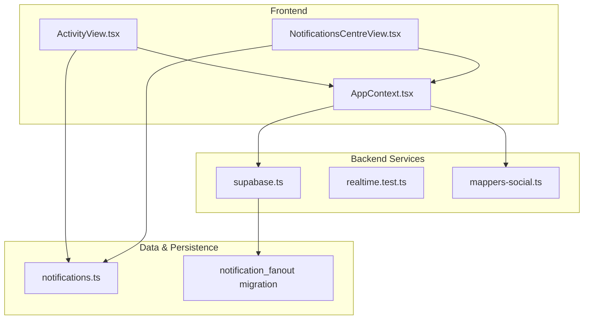
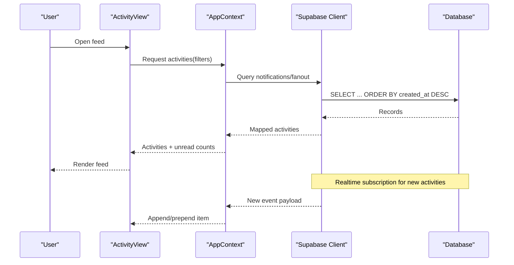
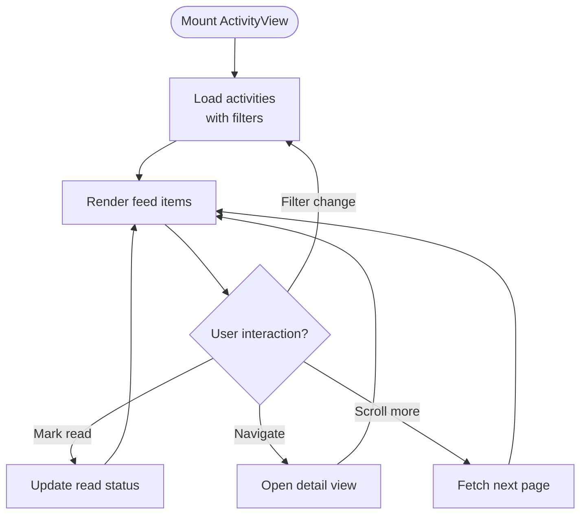
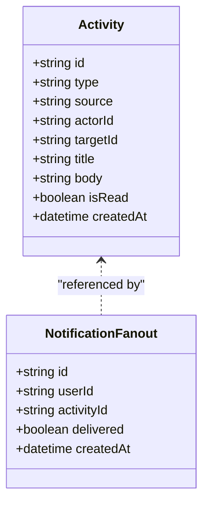
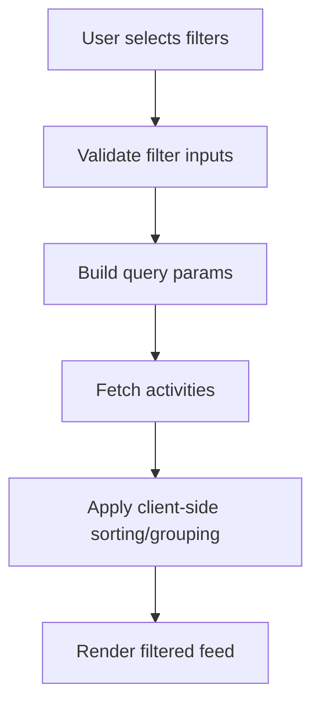
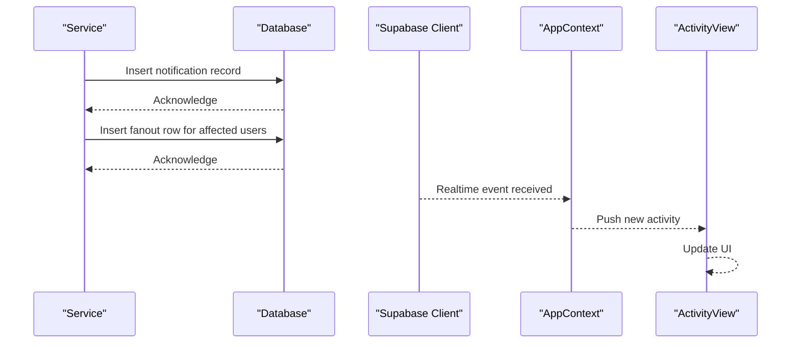
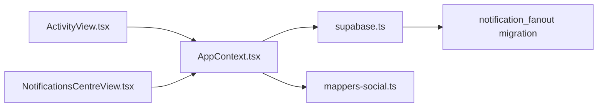

# Activity Feed

<cite>
**Referenced Files in This Document**
- [ActivityView.tsx](file://src/components/ActivityView.tsx)
- [ActivityView.test.tsx](file://src/components/ActivityView.test.tsx)
- [NotificationsCentreView.tsx](file://src/components/NotificationsCentreView.tsx)
- [NotificationsCentreView.test.tsx](file://src/components/NotificationsCentreView.test.tsx)
- [AppContext.tsx](file://src/context/AppContext.tsx)
- [AppContext.test.tsx](file://src/context/AppContext.test.tsx)
- [supabase.ts](file://src/services/backend/supabase.ts)
- [realtime.test.ts](file://src/services/backend/realtime.test.ts)
- [mappers-social.ts](file://src/services/backend/mappers-social.ts)
- [notifications.ts](file://src/data/notifications.ts)
- [202608060004_notification_fanout.sql](file://supabase/migrations/202608060004_notification_fanout.sql)
- [202608200002_extend_notification_fanout.sql](file://supabase/migrations/202608200002_extend_notification_fanout.sql)
</cite>

## Table of Contents
1. Introduction
2. Project Structure
3. Core Components
4. Architecture Overview
5. Detailed Component Analysis
6. Dependency Analysis
7. Performance Considerations
8. Troubleshooting Guide
9. Conclusion

## Introduction
This document explains the activity feed system in Mooday, focusing on how users track marketplace activities, social interactions, and platform events through a unified interface. It covers the ActivityView component, supported activity types, filtering capabilities, aggregation from purchases, sales, messages, and social sources, persistence via notifications infrastructure, real-time updates, performance optimization, retention policies, privacy controls, and customization options for feed content.

## Project Structure
The activity feed is primarily implemented as a React component that consumes application context and backend services to render a unified list of activities. Notifications and fanout tables provide persistence and distribution of events across users. Realtime subscriptions enable live updates.

**Diagram sources**
- [ActivityView.tsx:1-200](file://src/components/ActivityView.tsx#L1-L200)
- [NotificationsCentreView.tsx:1-200](file://src/components/NotificationsCentreView.tsx#L1-L200)
- [AppContext.tsx:1-200](file://src/context/AppContext.tsx#L1-L200)
- [supabase.ts:1-200](file://src/services/backend/supabase.ts#L1-L200)
- [realtime.test.ts:1-200](file://src/services/backend/realtime.test.ts#L1-L200)
- [mappers-social.ts:1-200](file://src/services/backend/mappers-social.ts#L1-L200)
- [notifications.ts:1-200](file://src/data/notifications.ts#L1-L200)
- [202608060004_notification_fanout.sql:1-200](file://supabase/migrations/202608060004_notification_fanout.sql#L1-L200)

**Section sources**
- [ActivityView.tsx:1-200](file://src/components/ActivityView.tsx#L1-L200)
- [NotificationsCentreView.tsx:1-200](file://src/components/NotificationsCentreView.tsx#L1-L200)
- [AppContext.tsx:1-200](file://src/context/AppContext.tsx#L1-L200)
- [supabase.ts:1-200](file://src/services/backend/supabase.ts#L1-L200)
- [realtime.test.ts:1-200](file://src/services/backend/realtime.test.ts#L1-L200)
- [mappers-social.ts:1-200](file://src/services/backend/mappers-social.ts#L1-L200)
- [notifications.ts:1-200](file://src/data/notifications.ts#L1-L200)
- [202608060004_notification_fanout.sql:1-200](file://supabase/migrations/202608060004_notification_fanout.sql#L1-L200)

## Core Components
- ActivityView: Renders a unified feed of activities with filtering and pagination. It aggregates items from multiple sources and presents them in a consistent UI.
- NotificationsCentreView: Provides a broader notifications experience; may share data access patterns and filters with the activity feed.
- AppContext: Centralizes state and actions for fetching, updating, and subscribing to activities and notifications.
- Backend services (Supabase client and mappers): Provide data retrieval, mapping, and realtime subscriptions.

Key responsibilities:
- Fetching and rendering activities
- Filtering by type, date range, and visibility
- Marking items as read/unread
- Subscribing to new activities in real time
- Managing local caching and pagination

**Section sources**
- [ActivityView.tsx:1-200](file://src/components/ActivityView.tsx#L1-L200)
- [ActivityView.test.tsx:1-200](file://src/components/ActivityView.test.tsx#L1-L200)
- [NotificationsCentreView.tsx:1-200](file://src/components/NotificationsCentreView.tsx#L1-L200)
- [NotificationsCentreView.test.tsx:1-200](file://src/components/NotificationsCentreView.test.tsx#L1-L200)
- [AppContext.tsx:1-200](file://src/context/AppContext.tsx#L1-L200)
- [AppContext.test.tsx:1-200](file://src/context/AppContext.test.tsx#L1-L200)

## Architecture Overview
The activity feed follows a layered architecture:
- Presentation layer: ActivityView and NotificationsCentreView handle user interactions and display.
- State layer: AppContext manages fetch state, filters, and subscriptions.
- Data layer: Supabase client queries notification-related tables and listens to changes.
- Mapping layer: Mappers normalize backend records into frontend-friendly activity objects.

**Diagram sources**
- [ActivityView.tsx:1-200](file://src/components/ActivityView.tsx#L1-L200)
- [AppContext.tsx:1-200](file://src/context/AppContext.tsx#L1-L200)
- [supabase.ts:1-200](file://src/services/backend/supabase.ts#L1-L200)
- [realtime.test.ts:1-200](file://src/services/backend/realtime.test.ts#L1-L200)

## Detailed Component Analysis

### ActivityView Component
Responsibilities:
- Display aggregated activities from marketplace, social, and platform events
- Apply filters (type, date range, visibility)
- Support pagination and infinite scroll
- Mark items as read and update counts
- Handle empty states and errors

Typical flow:
- On mount or filter change, request activities via AppContext
- Render list with grouped sections if applicable
- Subscribe to realtime updates to append new items
- Allow user to mark items as read and navigate to related details

**Diagram sources**
- [ActivityView.tsx:1-200](file://src/components/ActivityView.tsx#L1-L200)
- [ActivityView.test.tsx:1-200](file://src/components/ActivityView.test.tsx#L1-L200)

**Section sources**
- [ActivityView.tsx:1-200](file://src/components/ActivityView.tsx#L1-L200)
- [ActivityView.test.tsx:1-200](file://src/components/ActivityView.test.tsx#L1-L200)

### Activity Types and Aggregation
Supported activity categories include:
- Marketplace: purchases, sales, order status changes
- Social: likes, comments, follows, mentions
- Messages: new chat messages, replies
- Platform: policy updates, maintenance notices

Aggregation strategy:
- Normalize diverse events into a common activity model
- Group by source and sort by timestamp
- Deduplicate when necessary (e.g., repeated status updates)
- Enforce visibility rules based on privacy settings

**Diagram sources**
- [notifications.ts:1-200](file://src/data/notifications.ts#L1-L200)
- [202608060004_notification_fanout.sql:1-200](file://supabase/migrations/202608060004_notification_fanout.sql#L1-L200)

**Section sources**
- [notifications.ts:1-200](file://src/data/notifications.ts#L1-L200)
- [mappers-social.ts:1-200](file://src/services/backend/mappers-social.ts#L1-L200)
- [202608060004_notification_fanout.sql:1-200](file://supabase/migrations/202608060004_notification_fanout.sql#L1-L200)

### Filtering Capabilities
Filters commonly available:
- Type filter: marketplace, social, messages, platform
- Date range: last 24 hours, week, month, custom
- Read status: all, unread
- Visibility: personal, public, followers-only

Implementation approach:
- Build query parameters based on selected filters
- Debounce rapid filter changes
- Persist active filters in context or URL for shareability

**Diagram sources**
- [ActivityView.tsx:1-200](file://src/components/ActivityView.tsx#L1-L200)
- [AppContext.tsx:1-200](file://src/context/AppContext.tsx#L1-L200)

**Section sources**
- [ActivityView.tsx:1-200](file://src/components/ActivityView.tsx#L1-L200)
- [AppContext.tsx:1-200](file://src/context/AppContext.tsx#L1-L200)

### Persistence and Real-Time Updates
Persistence:
- Activities are persisted via notification tables and fanout mechanisms
- Fanout ensures each user receives relevant activities efficiently

Real-time:
- Subscriptions listen for new notification events
- New items are appended to the feed without full reloads

**Diagram sources**
- [supabase.ts:1-200](file://src/services/backend/supabase.ts#L1-L200)
- [realtime.test.ts:1-200](file://src/services/backend/realtime.test.ts#L1-L200)
- [202608060004_notification_fanout.sql:1-200](file://supabase/migrations/202608060004_notification_fanout.sql#L1-L200)
- [202608200002_extend_notification_fanout.sql:1-200](file://supabase/migrations/202608200002_extend_notification_fanout.sql#L1-L200)

**Section sources**
- [supabase.ts:1-200](file://src/services/backend/supabase.ts#L1-L200)
- [realtime.test.ts:1-200](file://src/services/backend/realtime.test.ts#L1-L200)
- [202608060004_notification_fanout.sql:1-200](file://supabase/migrations/202608060004_notification_fanout.sql#L1-L200)
- [202608200002_extend_notification_fanout.sql:1-200](file://supabase/migrations/202608200002_extend_notification_fanout.sql#L1-L200)

### Privacy Controls and Customization
Privacy:
- Visibility rules ensure users only see activities they are authorized to view
- Filters can exclude sensitive or private activities based on user preferences

Customization:
- Users can toggle which activity types appear in their feed
- Date range and read status filters help tailor the view
- Optional grouping by source improves readability

**Section sources**
- [ActivityView.tsx:1-200](file://src/components/ActivityView.tsx#L1-L200)
- [AppContext.tsx:1-200](file://src/context/AppContext.tsx#L1-L200)

### Retention Policies
Retention considerations:
- Keep recent activities readily accessible for performance
- Archive older activities to reduce storage and query costs
- Implement cleanup jobs to remove expired entries

Operational guidance:
- Define thresholds for archival and deletion
- Ensure user-visible history remains intact where required
- Provide export or backup options for critical data

[No sources needed since this section provides general guidance]

## Dependency Analysis
The activity feed depends on:
- UI components for rendering and interaction
- Context for state management and subscriptions
- Backend services for data access and realtime updates
- Database migrations defining notification structures

**Diagram sources**
- [ActivityView.tsx:1-200](file://src/components/ActivityView.tsx#L1-L200)
- [NotificationsCentreView.tsx:1-200](file://src/components/NotificationsCentreView.tsx#L1-L200)
- [AppContext.tsx:1-200](file://src/context/AppContext.tsx#L1-L200)
- [supabase.ts:1-200](file://src/services/backend/supabase.ts#L1-L200)
- [mappers-social.ts:1-200](file://src/services/backend/mappers-social.ts#L1-L200)
- [202608060004_notification_fanout.sql:1-200](file://supabase/migrations/202608060004_notification_fanout.sql#L1-L200)

**Section sources**
- [ActivityView.tsx:1-200](file://src/components/ActivityView.tsx#L1-L200)
- [NotificationsCentreView.tsx:1-200](file://src/components/NotificationsCentreView.tsx#L1-L200)
- [AppContext.tsx:1-200](file://src/context/AppContext.tsx#L1-L200)
- [supabase.ts:1-200](file://src/services/backend/supabase.ts#L1-L200)
- [mappers-social.ts:1-200](file://src/services/backend/mappers-social.ts#L1-L200)
- [202608060004_notification_fanout.sql:1-200](file://supabase/migrations/202608060004_notification_fanout.sql#L1-L200)

## Performance Considerations
Optimization strategies:
- Paginate results and implement virtualized lists for large feeds
- Debounce filter changes to avoid excessive requests
- Use efficient queries with proper indexing on timestamps and user IDs
- Minimize re-renders by memoizing computed activity lists
- Leverage realtime subscriptions to avoid polling

[No sources needed since this section provides general guidance]

## Troubleshooting Guide
Common issues and resolutions:
- Missing activities: Verify fanout rows exist and realtime subscriptions are active
- Duplicate items: Check deduplication logic and idempotent inserts
- Slow loading: Inspect query performance and add indexes if needed
- Privacy violations: Confirm visibility checks and RLS policies

Debugging steps:
- Inspect network requests and realtime events
- Validate filter parameters and query construction
- Review error boundaries and logging in components

**Section sources**
- [ActivityView.test.tsx:1-200](file://src/components/ActivityView.test.tsx#L1-L200)
- [NotificationsCentreView.test.tsx:1-200](file://src/components/NotificationsCentreView.test.tsx#L1-L200)
- [AppContext.test.tsx:1-200](file://src/context/AppContext.test.tsx#L1-L200)
- [realtime.test.ts:1-200](file://src/services/backend/realtime.test.ts#L1-L200)

## Conclusion
The activity feed in Mooday provides a unified interface for tracking marketplace activities, social interactions, and platform events. Through ActivityView and supporting services, it aggregates diverse sources, applies robust filtering, persists data via notification infrastructure, and delivers real-time updates. With attention to performance, retention, privacy, and customization, the feed offers a responsive and user-centric experience.