# Chat Overlay

<cite>
**Referenced Files in This Document**
- [ChatOverlay.tsx](file://src/components/ChatOverlay.tsx)
- [ChatOverlay.test.tsx](file://src/components/ChatOverlay.test.tsx)
- [ChatsListView.tsx](file://src/components/ChatsListView.tsx)
- [AppContext.tsx](file://src/context/AppContext.tsx)
- [supabase.ts](file://src/services/backend/supabase.ts)
- [realtime.test.ts](file://src/services/backend/realtime.test.ts)
</cite>

## Table of Contents
1. [Introduction](#introduction)
2. [Project Structure](#project-structure)
3. [Core Components](#core-components)
4. [Architecture Overview](#architecture-overview)
5. [Detailed Component Analysis](#detailed-component-analysis)
6. [Dependency Analysis](#dependency-analysis)
7. [Performance Considerations](#performance-considerations)
8. [Troubleshooting Guide](#troubleshooting-guide)
9. [Conclusion](#conclusion)

## Introduction
The ChatOverlay component provides inline messaging functionality within product pages and user profiles. It enables users to initiate conversations directly from context-rich surfaces without navigating away, supporting real-time message delivery, attachment handling, and seamless integration with the main chat system.

## Project Structure
The chat feature spans multiple layers:
- UI layer: ChatOverlay and related views
- Context/state: AppContext for global chat state
- Services: Supabase client and realtime subscriptions
- Data models: Types and mappers for messages and chats

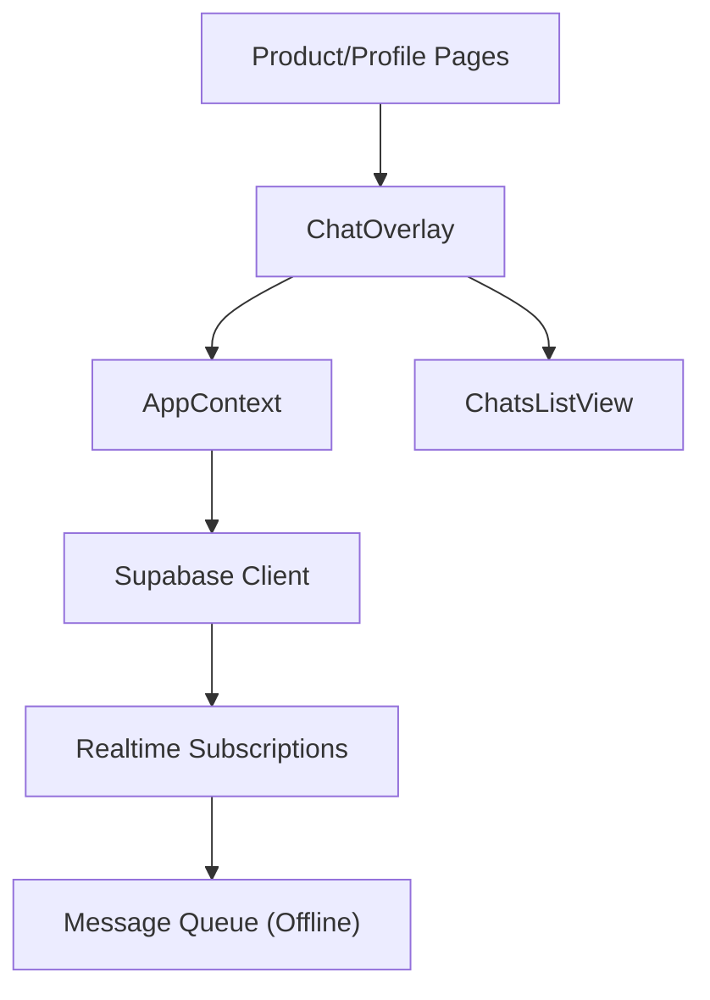

**Diagram sources**
- [ChatOverlay.tsx](file://src/components/ChatOverlay.tsx)
- [ChatsListView.tsx](file://src/components/ChatsListView.tsx)
- [AppContext.tsx](file://src/context/AppContext.tsx)
- [supabase.ts](file://src/services/backend/supabase.ts)

**Section sources**
- [ChatOverlay.tsx](file://src/components/ChatOverlay.tsx)
- [ChatsListView.tsx](file://src/components/ChatsListView.tsx)
- [AppContext.tsx](file://src/context/AppContext.tsx)
- [supabase.ts](file://src/services/backend/supabase.ts)

## Core Components
- ChatOverlay: Floating panel that opens/closes, renders conversation, input, and attachments
- ChatsListView: List of active conversations; used to switch between threads
- AppContext: Centralized state for current chat, unread counts, and offline queue
- Supabase service: Realtime subscriptions and persistence for messages

Key responsibilities:
- Open/close transitions and focus management
- Message composition with validation
- Attachment upload and preview
- Realtime send/receive and error handling
- Offline queuing and retry logic

**Section sources**
- [ChatOverlay.tsx](file://src/components/ChatOverlay.tsx)
- [ChatsListView.tsx](file://src/components/ChatsListView.tsx)
- [AppContext.tsx](file://src/context/AppContext.tsx)
- [supabase.ts](file://src/services/backend/supabase.ts)

## Architecture Overview
The overlay integrates with the main chat system via a shared context and realtime channel. Messages flow through a consistent pipeline: compose -> validate -> enqueue -> send -> persist -> broadcast.

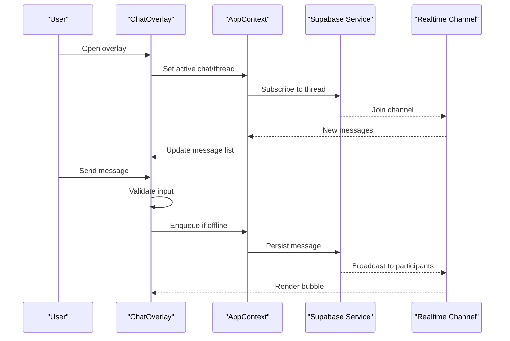

**Diagram sources**
- [ChatOverlay.tsx](file://src/components/ChatOverlay.tsx)
- [AppContext.tsx](file://src/context/AppContext.tsx)
- [supabase.ts](file://src/services/backend/supabase.ts)

## Detailed Component Analysis

### ChatOverlay Behavior: Open/Close and Focus
- Triggered from product/profile pages via a floating action button or inline link
- Opens with an animated panel anchored to the viewport edge
- Closes via explicit close button, backdrop click, or Escape key
- Focus moves into the input area on open; returns focus to trigger on close
- Respects reduced motion preferences

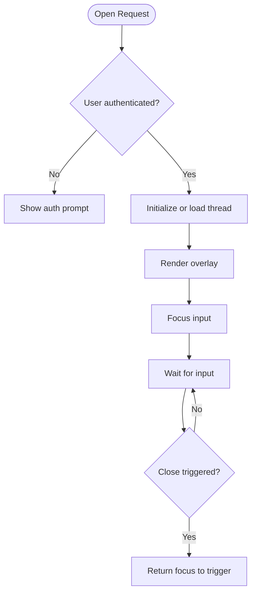

**Diagram sources**
- [ChatOverlay.tsx](file://src/components/ChatOverlay.tsx)

**Section sources**
- [ChatOverlay.tsx](file://src/components/ChatOverlay.tsx)

### Message Composition and Validation
- Supports text, mentions, and rich formatting where applicable
- Validates length limits, prohibited content, and attachment constraints
- Provides inline error feedback and disables send while invalid
- Auto-expands textarea up to a maximum height

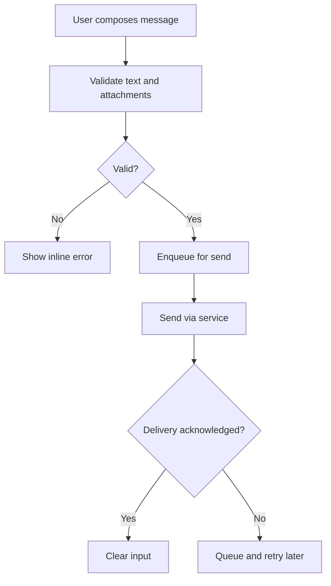

**Diagram sources**
- [ChatOverlay.tsx](file://src/components/ChatOverlay.tsx)
- [AppContext.tsx](file://src/context/AppContext.tsx)

**Section sources**
- [ChatOverlay.tsx](file://src/components/ChatOverlay.tsx)
- [AppContext.tsx](file://src/context/AppContext.tsx)

### Real-Time Message Delivery
- Subscribes to thread-specific channels for live updates
- Renders incoming messages immediately with optimistic UI
- Handles ordering, deduplication, and presence indicators
- Displays typing indicators and read receipts where supported

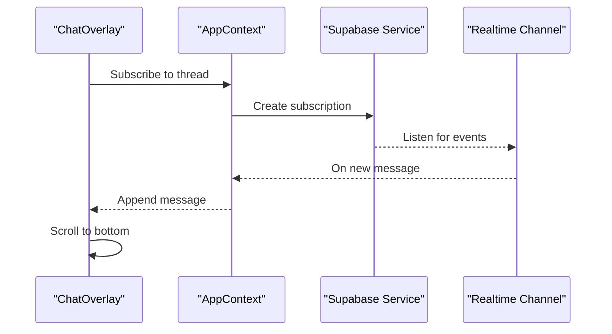

**Diagram sources**
- [ChatOverlay.tsx](file://src/components/ChatOverlay.tsx)
- [supabase.ts](file://src/services/backend/supabase.ts)

**Section sources**
- [ChatOverlay.tsx](file://src/components/ChatOverlay.tsx)
- [supabase.ts](file://src/services/backend/supabase.ts)

### Chat Bubble Rendering
- Differentiates sender vs recipient with distinct styles
- Shows timestamps, status indicators (sent/delivered/read), and media previews
- Supports inline links, safe rendering, and truncation for long messages
- Implements virtualization for large histories

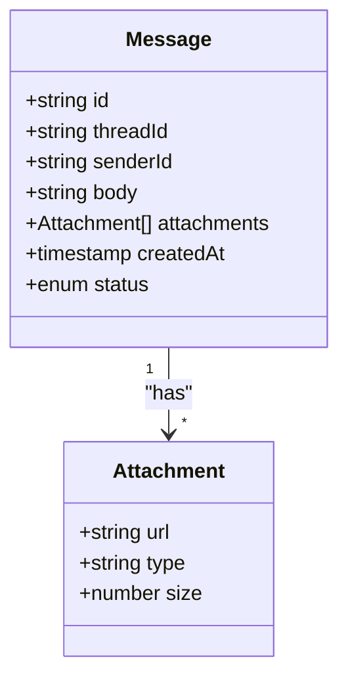

**Diagram sources**
- [ChatOverlay.tsx](file://src/components/ChatOverlay.tsx)

**Section sources**
- [ChatOverlay.tsx](file://src/components/ChatOverlay.tsx)

### Attachment Handling
- Accepts images, documents, and other supported types
- Validates MIME types, size limits, and naming rules
- Uploads via secure service endpoint; shows progress and error states
- Generates thumbnails and lazy-loads heavy media

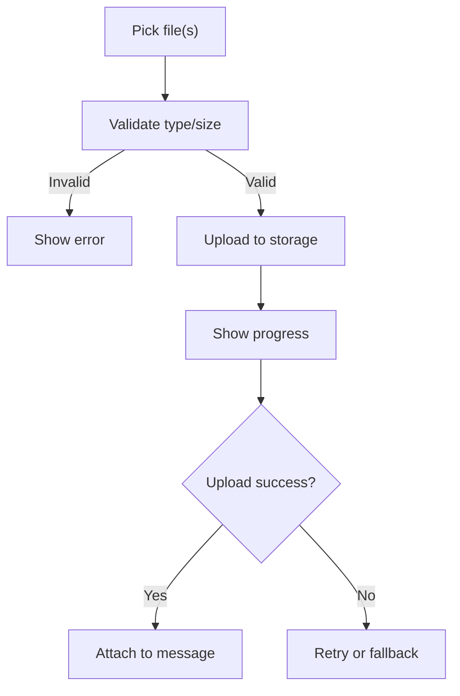

**Diagram sources**
- [ChatOverlay.tsx](file://src/components/ChatOverlay.tsx)

**Section sources**
- [ChatOverlay.tsx](file://src/components/ChatOverlay.tsx)

### Integration with Main Chat System
- Shares thread IDs and message model with ChatsListView
- Syncs unread counts and last message preview across views
- Ensures continuity when switching between overlay and full chat view

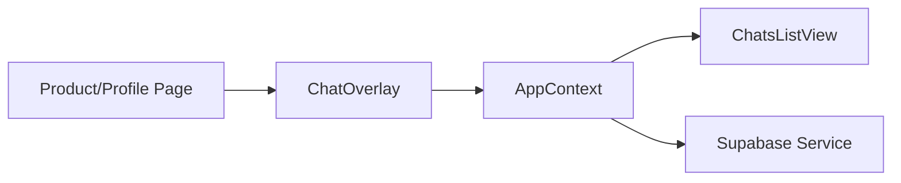

**Diagram sources**
- [ChatOverlay.tsx](file://src/components/ChatOverlay.tsx)
- [ChatsListView.tsx](file://src/components/ChatsListView.tsx)
- [AppContext.tsx](file://src/context/AppContext.tsx)

**Section sources**
- [ChatOverlay.tsx](file://src/components/ChatOverlay.tsx)
- [ChatsListView.tsx](file://src/components/ChatsListView.tsx)
- [AppContext.tsx](file://src/context/AppContext.tsx)

### Sending/Receiving Mechanisms and Error Handling
- Optimistic sends update UI immediately; server acknowledgment finalizes state
- Network failures queue messages locally and retry with exponential backoff
- Server errors surface actionable messages; failed attachments show retry controls
- Idempotent sends prevent duplicates on reconnect

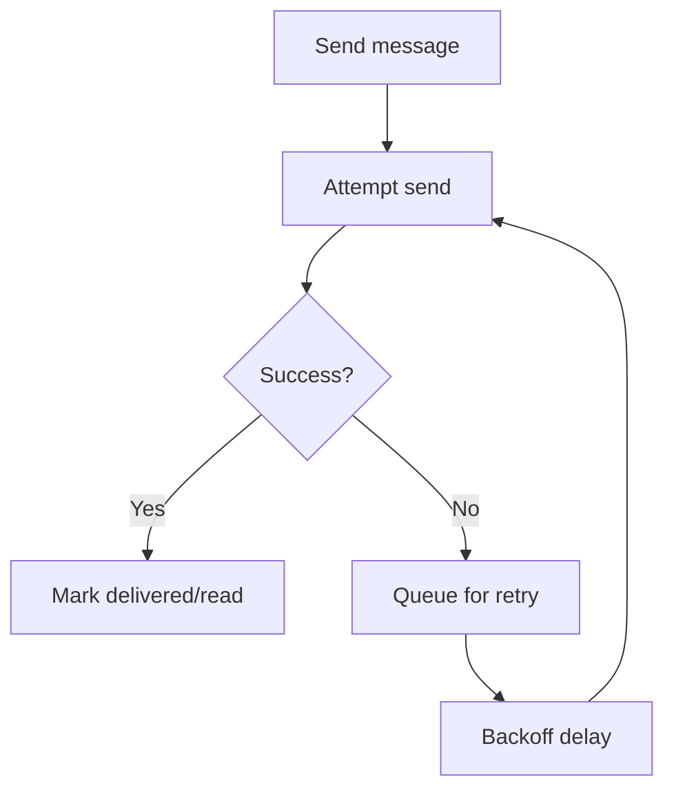

**Diagram sources**
- [ChatOverlay.tsx](file://src/components/ChatOverlay.tsx)
- [AppContext.tsx](file://src/context/AppContext.tsx)
- [supabase.ts](file://src/services/backend/supabase.ts)

**Section sources**
- [ChatOverlay.tsx](file://src/components/ChatOverlay.tsx)
- [AppContext.tsx](file://src/context/AppContext.tsx)
- [supabase.ts](file://src/services/backend/supabase.ts)

### Offline Message Queuing
- Persists unsent messages to local storage or IndexedDB
- Replays queued messages upon reconnection
- Marks items as pending until acknowledged by server

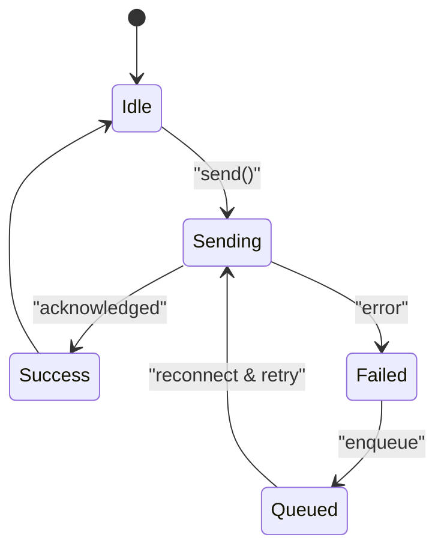

**Diagram sources**
- [AppContext.tsx](file://src/context/AppContext.tsx)

**Section sources**
- [AppContext.tsx](file://src/context/AppContext.tsx)

### Accessibility Features and Keyboard Navigation
- Full keyboard support: Tab order, Enter to send, Escape to close
- Screen reader labels for buttons, inputs, and status
- High contrast and scalable text support
- Focus trapping inside overlay when open

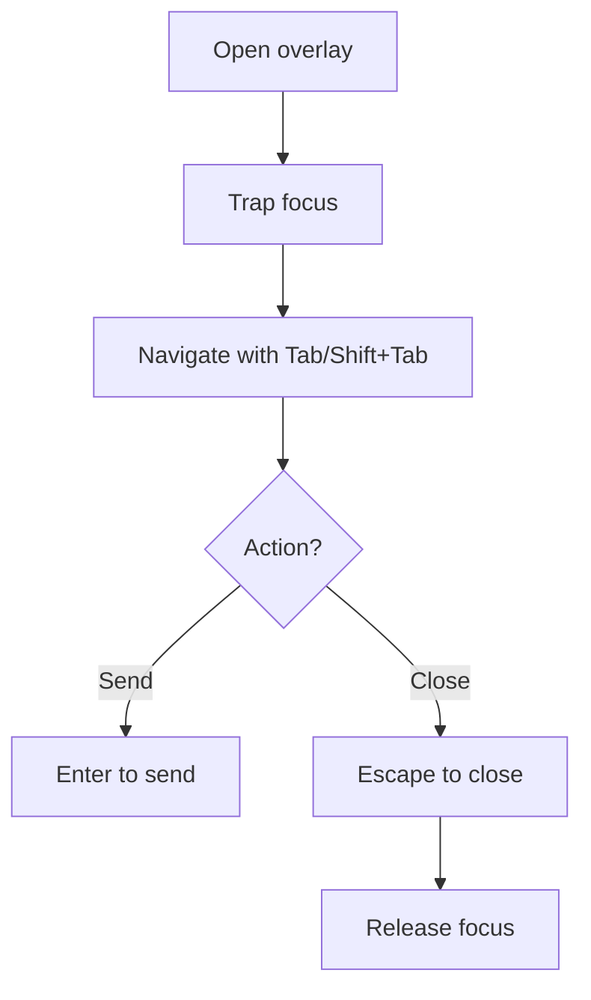

**Diagram sources**
- [ChatOverlay.tsx](file://src/components/ChatOverlay.tsx)

**Section sources**
- [ChatOverlay.tsx](file://src/components/ChatOverlay.tsx)

### Mobile Responsiveness
- Adapts to small screens with full-screen modal behavior
- Touch-friendly targets and swipe-to-dismiss gestures
- Safe area insets for notched devices
- Optimized media loading for cellular networks

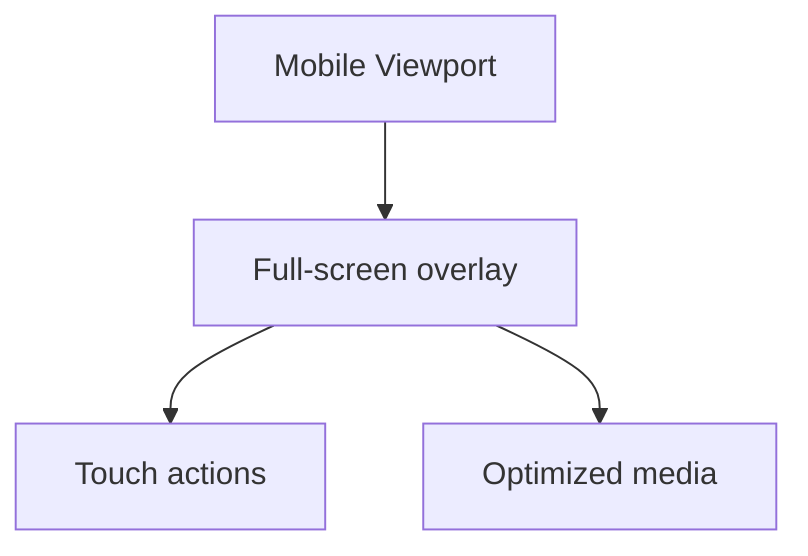

**Diagram sources**
- [ChatOverlay.tsx](file://src/components/ChatOverlay.tsx)

**Section sources**
- [ChatOverlay.tsx](file://src/components/ChatOverlay.tsx)

## Dependency Analysis
- ChatOverlay depends on AppContext for thread state and queue
- AppContext depends on Supabase service for persistence and realtime
- ChatsListView shares thread/message data via AppContext
- Tests verify interactions and edge cases for robustness

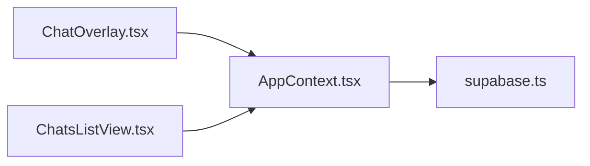

**Diagram sources**
- [ChatOverlay.tsx](file://src/components/ChatOverlay.tsx)
- [ChatsListView.tsx](file://src/components/ChatsListView.tsx)
- [AppContext.tsx](file://src/context/AppContext.tsx)
- [supabase.ts](file://src/services/backend/supabase.ts)

**Section sources**
- [ChatOverlay.tsx](file://src/components/ChatOverlay.tsx)
- [ChatsListView.tsx](file://src/components/ChatsListView.tsx)
- [AppContext.tsx](file://src/context/AppContext.tsx)
- [supabase.ts](file://src/services/backend/supabase.ts)

## Performance Considerations
- Virtualize message lists to handle long histories efficiently
- Debounce input changes and auto-resize calculations
- Lazy-load attachments and use responsive image formats
- Batch realtime updates to minimize re-renders
- Use optimistic UI to improve perceived performance

[No sources needed since this section provides general guidance]

## Troubleshooting Guide
Common issues and resolutions:
- Messages stuck in pending: check network connectivity and retry queue
- Realtime not updating: verify channel subscription and permissions
- Attachments failing: validate MIME types and storage quotas
- Overlay not closing: ensure focus trap release and event listeners

**Section sources**
- [ChatOverlay.test.tsx](file://src/components/ChatOverlay.test.tsx)
- [realtime.test.ts](file://src/services/backend/realtime.test.ts)

## Conclusion
The ChatOverlay delivers a seamless inline messaging experience integrated with the main chat system. It supports robust composition, validation, attachments, real-time delivery, offline queuing, accessibility, and mobile responsiveness, ensuring reliable communication across contexts.