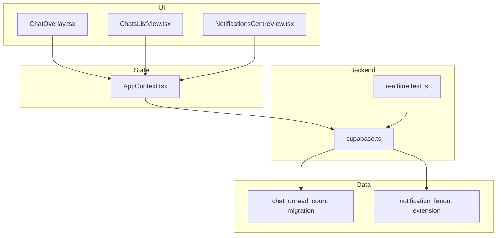
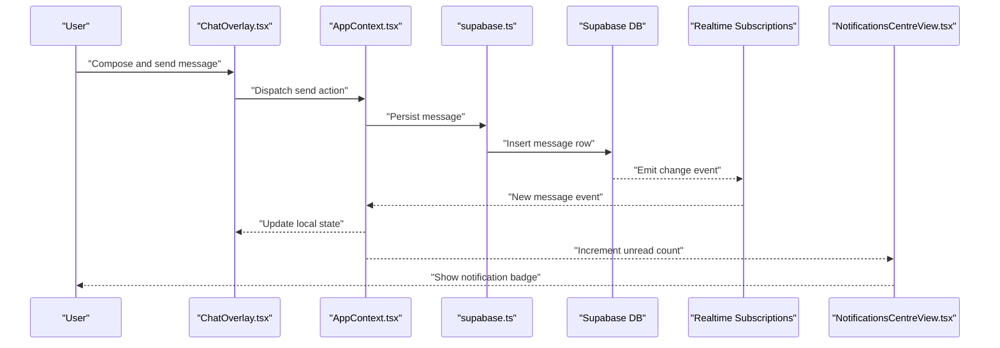
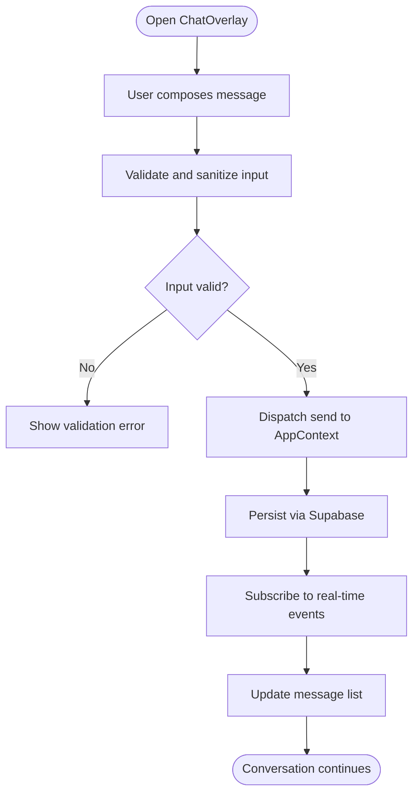
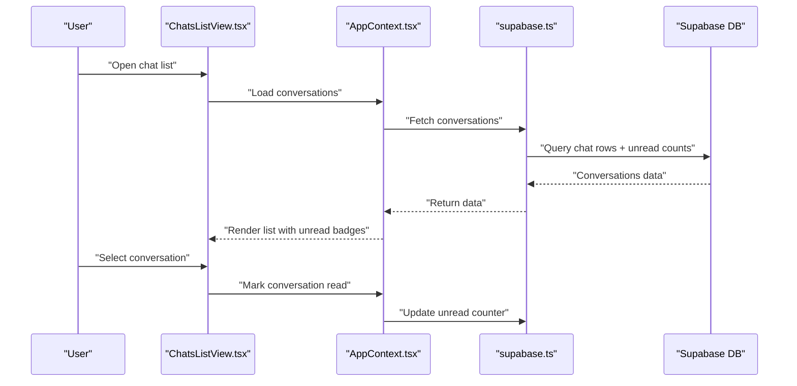
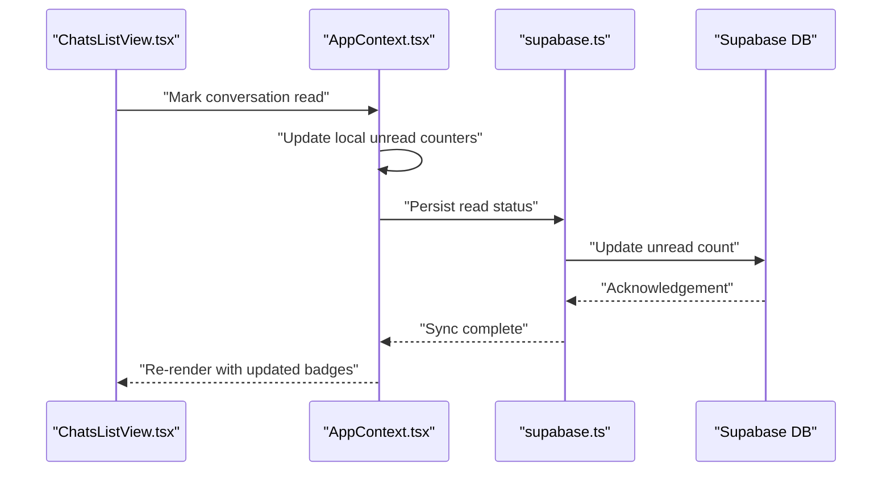
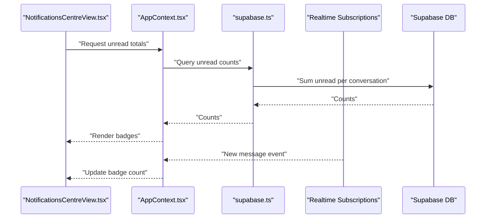
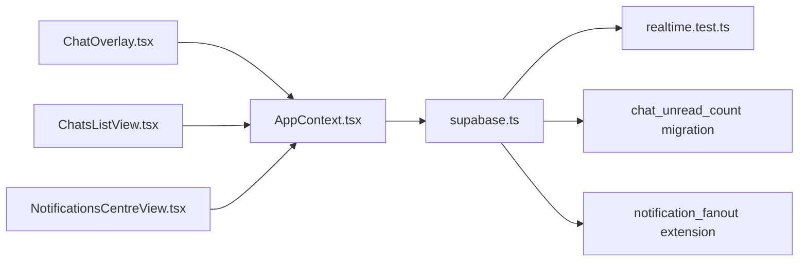

# Messaging System

<cite>
**Referenced Files in This Document**
- [ChatOverlay.tsx](file://src/components/ChatOverlay.tsx)
- [ChatsListView.tsx](file://src/components/ChatsListView.tsx)
- [AppContext.tsx](file://src/context/AppContext.tsx)
- [markChatRead.test.tsx](file://src/context/markChatRead.test.tsx)
- [realtime.test.ts](file://src/services/backend/realtime.test.ts)
- [supabase.ts](file://src/services/backend/supabase.ts)
- [202608200001_chat_unread_count.sql](file://supabase/migrations/202608200001_chat_unread_count.sql)
- [202608200002_extend_notification_fanout.sql](file://supabase/migrations/202608200002_extend_notification_fanout.sql)
- [NotificationsCentreView.tsx](file://src/components/NotificationsCentreView.tsx)
- [banned-phrases.ts](file://src/lib/banned-phrases.ts)
- [security.ts](file://src/lib/security.ts)
</cite>

## Table of Contents
1. [Introduction](#introduction)
2. [Project Structure](#project-structure)
3. [Core Components](#core-components)
4. [Architecture Overview](#architecture-overview)
5. [Detailed Component Analysis](#detailed-component-analysis)
6. [Dependency Analysis](#dependency-analysis)
7. [Performance Considerations](#performance-considerations)
8. [Troubleshooting Guide](#troubleshooting-guide)
9. [Conclusion](#conclusion)

## Introduction
This document explains the real-time messaging system in Mooday, focusing on how buyers and sellers communicate through the platform. It covers the chat interface components (ChatOverlay for inline conversations and ChatsListView for conversation history), conversation management, message delivery mechanisms, unread notifications, offline support, moderation, spam prevention, and privacy controls. The goal is to provide both a high-level understanding and implementation details for developers integrating or extending the messaging features.

## Project Structure
The messaging system spans UI components, application context/state, backend services, and database migrations:
- UI layer: ChatOverlay.tsx and ChatsListView.tsx render the chat experience and conversation lists.
- State layer: AppContext.tsx centralizes chat state and operations such as marking chats read.
- Backend integration: supabase.ts provides Supabase client utilities; realtime.test.ts documents real-time subscription patterns.
- Data persistence: Supabase migrations define chat-related schema and unread counters.
- Notifications: NotificationsCentreView.tsx integrates with chat unread counts and fanout events.
- Safety and moderation: banned-phrases.ts and security.ts implement content filtering and input sanitization.

**Diagram sources**
- [ChatOverlay.tsx](file://src/components/ChatOverlay.tsx)
- [ChatsListView.tsx](file://src/components/ChatsListView.tsx)
- [NotificationsCentreView.tsx](file://src/components/NotificationsCentreView.tsx)
- [AppContext.tsx](file://src/context/AppContext.tsx)
- [supabase.ts](file://src/services/backend/supabase.ts)
- [realtime.test.ts](file://src/services/backend/realtime.test.ts)
- [202608200001_chat_unread_count.sql](file://supabase/migrations/202608200001_chat_unread_count.sql)
- [202608200002_extend_notification_fanout.sql](file://supabase/migrations/202608200002_extend_notification_fanout.sql)

**Section sources**
- [ChatOverlay.tsx](file://src/components/ChatOverlay.tsx)
- [ChatsListView.tsx](file://src/components/ChatsListView.tsx)
- [AppContext.tsx](file://src/context/AppContext.tsx)
- [supabase.ts](file://src/services/backend/supabase.ts)
- [realtime.test.ts](file://src/services/backend/realtime.test.ts)
- [202608200001_chat_unread_count.sql](file://supabase/migrations/202608200001_chat_unread_count.sql)
- [202608200002_extend_notification_fanout.sql](file://supabase/migrations/202608200002_extend_notification_fanout.sql)
- [NotificationsCentreView.tsx](file://src/components/NotificationsCentreView.tsx)

## Core Components
- ChatOverlay: Renders an inline conversation view for active chats, including message composition, sending, and real-time updates.
- ChatsListView: Displays the list of conversations with summary info and unread indicators, enabling navigation into specific chats.
- AppContext: Manages global chat state, including active conversation selection, message queues, and operations like marking chats read.
- NotificationsCentreView: Integrates with unread counts and notification fanout to surface new messages to users.

Key responsibilities:
- Conversation management: selecting, navigating, and persisting conversation state.
- Message delivery: composing, validating, sending, and receiving messages via real-time channels.
- Unread handling: updating counters and badges when new messages arrive.
- Offline readiness: queuing actions and syncing when connectivity resumes.

**Section sources**
- [ChatOverlay.tsx](file://src/components/ChatOverlay.tsx)
- [ChatsListView.tsx](file://src/components/ChatsListView.tsx)
- [AppContext.tsx](file://src/context/AppContext.tsx)
- [NotificationsCentreView.tsx](file://src/components/NotificationsCentreView.tsx)

## Architecture Overview
The messaging architecture combines React components with a centralized context and Supabase-backed real-time subscriptions:
- UI components consume chat state from AppContext and trigger actions (send, mark read).
- AppContext coordinates with Supabase to persist messages and subscribe to real-time events.
- Database migrations ensure unread counters and notification fanout are maintained.
- NotificationsCentreView reflects unread counts and surfaces alerts.

**Diagram sources**
- [ChatOverlay.tsx](file://src/components/ChatOverlay.tsx)
- [AppContext.tsx](file://src/context/AppContext.tsx)
- [supabase.ts](file://src/services/backend/supabase.ts)
- [realtime.test.ts](file://src/services/backend/realtime.test.ts)
- [NotificationsCentreView.tsx](file://src/components/NotificationsCentreView.tsx)
- [202608200001_chat_unread_count.sql](file://supabase/migrations/202608200001_chat_unread_count.sql)
- [202608200002_extend_notification_fanout.sql](file://supabase/migrations/202608200002_extend_notification_fanout.sql)

## Detailed Component Analysis

### ChatOverlay Component
Responsibilities:
- Render active conversation thread with message list and input area.
- Validate and sanitize user input before sending.
- Dispatch send actions to AppContext for persistence and broadcasting.
- Handle real-time updates for incoming messages.

Message flow:
- Input validation and sanitization occur before dispatch.
- AppContext persists the message via Supabase and triggers real-time broadcast.
- ChatOverlay updates locally upon receiving real-time events.

**Diagram sources**
- [ChatOverlay.tsx](file://src/components/ChatOverlay.tsx)
- [AppContext.tsx](file://src/context/AppContext.tsx)
- [supabase.ts](file://src/services/backend/supabase.ts)
- [banned-phrases.ts](file://src/lib/banned-phrases.ts)
- [security.ts](file://src/lib/security.ts)

**Section sources**
- [ChatOverlay.tsx](file://src/components/ChatOverlay.tsx)
- [banned-phrases.ts](file://src/lib/banned-phrases.ts)
- [security.ts](file://src/lib/security.ts)

### ChatsListView Component
Responsibilities:
- Display all conversations with summaries and unread indicators.
- Navigate to selected conversation by updating AppContext state.
- Refresh conversation list based on real-time updates.

Unread handling:
- Uses unread counters persisted in the database to reflect new messages.
- Marks conversations as read when opened or explicitly marked.

**Diagram sources**
- [ChatsListView.tsx](file://src/components/ChatsListView.tsx)
- [AppContext.tsx](file://src/context/AppContext.tsx)
- [supabase.ts](file://src/services/backend/supabase.ts)
- [202608200001_chat_unread_count.sql](file://supabase/migrations/202608200001_chat_unread_count.sql)

**Section sources**
- [ChatsListView.tsx](file://src/components/ChatsListView.tsx)
- [AppContext.tsx](file://src/context/AppContext.tsx)
- [202608200001_chat_unread_count.sql](file://supabase/migrations/202608200001_chat_unread_count.sql)

### AppContext and Mark Read Logic
Responsibilities:
- Centralize chat state: active conversation, message queue, and unread counters.
- Provide actions to send messages, mark conversations read, and sync with backend.
- Coordinate real-time subscriptions to keep UI consistent.

Mark read workflow:
- Triggered when a conversation is opened or explicitly marked.
- Updates local state and persists changes to the database.

**Diagram sources**
- [ChatsListView.tsx](file://src/components/ChatsListView.tsx)
- [AppContext.tsx](file://src/context/AppContext.tsx)
- [supabase.ts](file://src/services/backend/supabase.ts)
- [markChatRead.test.tsx](file://src/context/markChatRead.test.tsx)
- [202608200001_chat_unread_count.sql](file://supabase/migrations/202608200001_chat_unread_count.sql)

**Section sources**
- [AppContext.tsx](file://src/context/AppContext.tsx)
- [markChatRead.test.tsx](file://src/context/markChatRead.test.tsx)
- [202608200001_chat_unread_count.sql](file://supabase/migrations/202608200001_chat_unread_count.sql)

### Notifications Integration
Responsibilities:
- Reflect unread message counts across the app via a notification center.
- Subscribe to notification fanout events to update badges in real time.

Integration points:
- Reads unread counters from the database and updates UI accordingly.
- Listens to real-time events to increment badges without full refresh.

**Diagram sources**
- [NotificationsCentreView.tsx](file://src/components/NotificationsCentreView.tsx)
- [AppContext.tsx](file://src/context/AppContext.tsx)
- [supabase.ts](file://src/services/backend/supabase.ts)
- [realtime.test.ts](file://src/services/backend/realtime.test.ts)
- [202608200002_extend_notification_fanout.sql](file://supabase/migrations/202608200002_extend_notification_fanout.sql)

**Section sources**
- [NotificationsCentreView.tsx](file://src/components/NotificationsCentreView.tsx)
- [realtime.test.ts](file://src/services/backend/realtime.test.ts)
- [202608200002_extend_notification_fanout.sql](file://supabase/migrations/202608200002_extend_notification_fanout.sql)

## Dependency Analysis
Component relationships and dependencies:
- ChatOverlay depends on AppContext for state and actions, and on Supabase for persistence and real-time updates.
- ChatsListView depends on AppContext for conversation list and unread counters.
- AppContext depends on Supabase client and real-time subscriptions to maintain consistency.
- NotificationsCentreView depends on AppContext and real-time events to reflect unread counts.

**Diagram sources**
- [ChatOverlay.tsx](file://src/components/ChatOverlay.tsx)
- [ChatsListView.tsx](file://src/components/ChatsListView.tsx)
- [NotificationsCentreView.tsx](file://src/components/NotificationsCentreView.tsx)
- [AppContext.tsx](file://src/context/AppContext.tsx)
- [supabase.ts](file://src/services/backend/supabase.ts)
- [realtime.test.ts](file://src/services/backend/realtime.test.ts)
- [202608200001_chat_unread_count.sql](file://supabase/migrations/202608200001_chat_unread_count.sql)
- [202608200002_extend_notification_fanout.sql](file://supabase/migrations/202608200002_extend_notification_fanout.sql)

**Section sources**
- [ChatOverlay.tsx](file://src/components/ChatOverlay.tsx)
- [ChatsListView.tsx](file://src/components/ChatsListView.tsx)
- [NotificationsCentreView.tsx](file://src/components/NotificationsCentreView.tsx)
- [AppContext.tsx](file://src/context/AppContext.tsx)
- [supabase.ts](file://src/services/backend/supabase.ts)
- [realtime.test.ts](file://src/services/backend/realtime.test.ts)
- [202608200001_chat_unread_count.sql](file://supabase/migrations/202608200001_chat_unread_count.sql)
- [202608200002_extend_notification_fanout.sql](file://supabase/migrations/202608200002_extend_notification_fanout.sql)

## Performance Considerations
- Minimize re-renders: Use memoization in ChatOverlay and ChatsListView to avoid unnecessary updates when message lists grow.
- Batch updates: Coalesce multiple real-time events to reduce UI churn.
- Pagination: Load recent messages first and paginate older ones to improve initial load time.
- Debounce input: Throttle composition actions to prevent excessive sends during rapid typing.
- Efficient queries: Leverage indexes on conversation IDs and timestamps for faster retrieval.
- Connection resilience: Implement exponential backoff and reconnection logic for WebSocket drops.

[No sources needed since this section provides general guidance]

## Troubleshooting Guide
Common issues and resolutions:
- Messages not appearing: Verify real-time subscriptions are active and that Supabase events are emitted for new messages.
- Unread badges not updating: Ensure unread counters are incremented on message insert and decremented on mark read.
- Offline behavior: Confirm that send actions queue locally and sync when connectivity resumes.
- Moderation false positives: Review banned phrases and adjust filters if legitimate messages are blocked.
- Privacy errors: Check permissions and RLS policies to ensure only authorized users access conversations.

Diagnostic steps:
- Inspect real-time logs in realtime.test.ts patterns to confirm event flow.
- Validate database schema and migrations for chat tables and unread counters.
- Test mark read flows using markChatRead tests to ensure state consistency.

**Section sources**
- [realtime.test.ts](file://src/services/backend/realtime.test.ts)
- [markChatRead.test.tsx](file://src/context/markChatRead.test.tsx)
- [202608200001_chat_unread_count.sql](file://supabase/migrations/202608200001_chat_unread_count.sql)
- [202608200002_extend_notification_fanout.sql](file://supabase/migrations/202608200002_extend_notification_fanout.sql)

## Conclusion
Mooday’s messaging system integrates UI components with centralized state and Supabase-backed real-time capabilities to deliver a responsive chat experience for buyers and sellers. ChatOverlay handles inline conversations, ChatsListView manages conversation history and unread indicators, and AppContext orchestrates state and persistence. Notifications integrate with unread counters and fanout events to keep users informed. Robust moderation, spam prevention, and privacy controls ensure safe and compliant communication. For optimal performance, apply memoization, pagination, debouncing, and resilient connection strategies.

[No sources needed since this section summarizes without analyzing specific files]