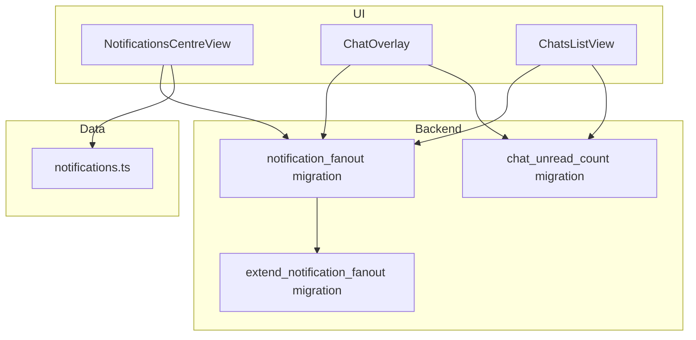
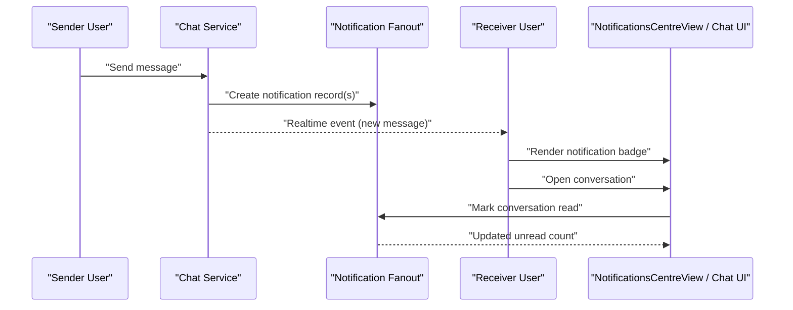
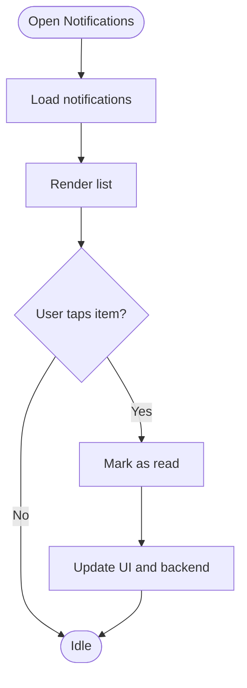
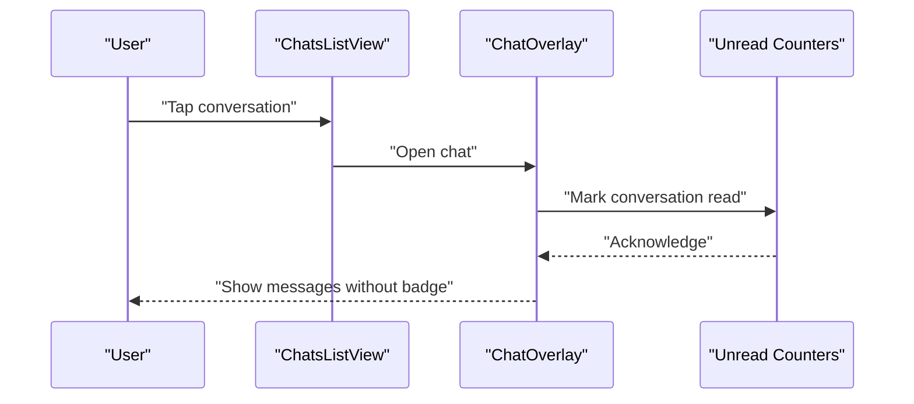
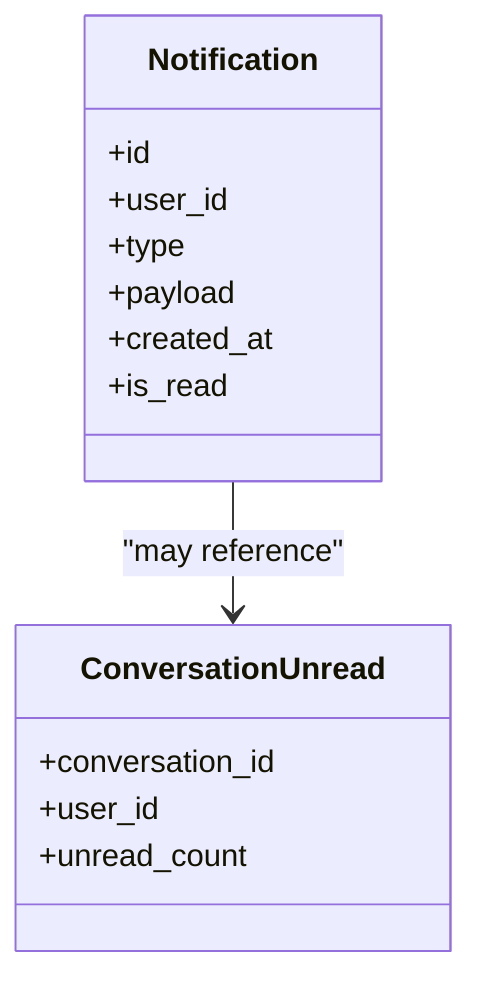
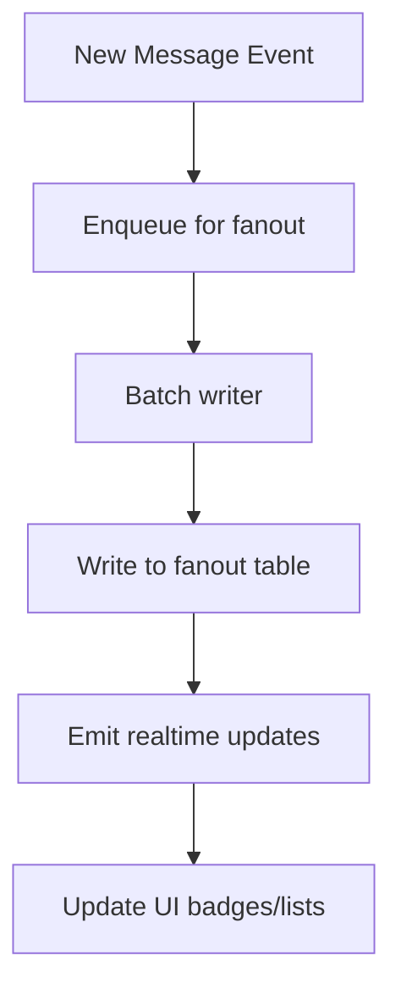
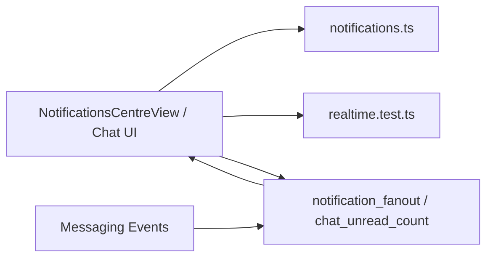

# Notification Integration

<cite>
**Referenced Files in This Document**
- [NotificationsCentreView.tsx](file://src/components/NotificationsCentreView.tsx)
- [notifications.ts](file://src/data/notifications.ts)
- [ChatOverlay.tsx](file://src/components/ChatOverlay.tsx)
- [ChatsListView.tsx](file://src/components/ChatsListView.tsx)
- [markChatRead.test.tsx](file://src/context/markChatRead.test.tsx)
- [202608060004_notification_fanout.sql](file://supabase/migrations/202608060004_notification_fanout.sql)
- [202608190001_fix_profile_recursion_and_avatar_storage.sql](file://supabase/migrations/202608190001_fix_profile_recursion_and_avatar_storage.sql)
- [202608200001_chat_unread_count.sql](file://supabase/migrations/202608200001_chat_unread_count.sql)
- [202608200002_extend_notification_fanout.sql](file://supabase/migrations/202608200002_extend_notification_fanout.sql)
- [realtime.test.ts](file://src/services/backend/realtime.test.ts)
- [progress-u7-chat.md](file://docs/progress-u7-chat.md)
- [progress-u19-u20-backup-deploy.md](file://docs/progress-u19-u20-backup-deploy.md)
</cite>

## Table of Contents
1. Introduction
2. Project Structure
3. Core Components
4. Architecture Overview
5. Detailed Component Analysis
6. Dependency Analysis
7. Performance Considerations
8. Troubleshooting Guide
9. Conclusion

## Introduction
This document explains the notification system that powers real-time messaging alerts and chat updates. It covers how notifications are generated for new messages, unread counts, and conversation updates; defines notification types and priority levels; describes delivery mechanisms including push notifications and in-app alerts; and documents the integration between the messaging system and the notification center with read/unread status synchronization. It also addresses persistence, batch processing, preferences management, spam prevention, rate limiting, and user control over settings.

## Project Structure
The notification system spans UI components, data models, backend migrations, and service integrations:
- UI layer: Notification center view and chat overlays/list views render notifications and update state.
- Data layer: Local mock/notification data structures define types and sample payloads.
- Persistence layer: Supabase migrations implement a fanout table for scalable notification storage and chat unread counters.
- Service layer: Realtime tests and scripts indicate event-driven updates and batch processing flows.

**Diagram sources**
- [NotificationsCentreView.tsx:1-200](file://src/components/NotificationsCentreView.tsx#L1-L200)
- [notifications.ts:1-200](file://src/data/notifications.ts#L1-L200)
- [202608060004_notification_fanout.sql:1-200](file://supabase/migrations/202608060004_notification_fanout.sql#L1-L200)
- [202608200001_chat_unread_count.sql:1-200](file://supabase/migrations/202608200001_chat_unread_count.sql#L1-L200)
- [202608200002_extend_notification_fanout.sql:1-200](file://supabase/migrations/202608200002_extend_notification_fanout.sql#L1-L200)

**Section sources**
- [NotificationsCentreView.tsx:1-200](file://src/components/NotificationsCentreView.tsx#L1-L200)
- [notifications.ts:1-200](file://src/data/notifications.ts#L1-L200)
- [202608060004_notification_fanout.sql:1-200](file://supabase/migrations/202608060004_notification_fanout.sql#L1-L200)
- [202608200001_chat_unread_count.sql:1-200](file://supabase/migrations/202608200001_chat_unread_count.sql#L1-L200)
- [202608200002_extend_notification_fanout.sql:1-200](file://supabase/migrations/202608200002_extend_notification_fanout.sql#L1-L200)

## Core Components
- Notifications Centre View: Renders the user’s notification list, supports marking items as read, and provides entry points to related conversations or actions.
- Chat Overlay and List Views: Display active chats, show unread indicators, and trigger read updates when users open or interact with conversations.
- Notification Data Model: Defines notification payload shape, categories, and metadata used by UI and backend.
- Fanout Storage: A dedicated table to store per-user notifications for efficient reads and writes, extended by later migrations to support richer fields and indexing.
- Unread Counters: Per-conversation unread counters updated on message events and synchronized when conversations are opened.

Key responsibilities:
- Generate notifications on new messages and conversation changes.
- Persist notifications and unread counts reliably.
- Deliver in-app alerts via the Notifications Centre and chat UI.
- Synchronize read/unread state across devices and sessions.

**Section sources**
- [NotificationsCentreView.tsx:1-200](file://src/components/NotificationsCentreView.tsx#L1-L200)
- [ChatOverlay.tsx:1-200](file://src/components/ChatOverlay.tsx#L1-L200)
- [ChatsListView.tsx:1-200](file://src/components/ChatsListView.tsx#L1-L200)
- [notifications.ts:1-200](file://src/data/notifications.ts#L1-L200)
- [202608060004_notification_fanout.sql:1-200](file://supabase/migrations/202608060004_notification_fanout.sql#L1-L200)
- [202608200001_chat_unread_count.sql:1-200](file://supabase/migrations/202608200001_chat_unread_count.sql#L1-L200)
- [202608200002_extend_notification_fanout.sql:1-200](file://supabase/migrations/202608200002_extend_notification_fanout.sql#L1-L200)

## Architecture Overview
The system uses an event-driven architecture where messaging events trigger notification creation and fanout writes. The UI subscribes to updates and renders notifications and unread badges. Read/unread synchronization ensures consistency across channels.

**Diagram sources**
- [ChatOverlay.tsx:1-200](file://src/components/ChatOverlay.tsx#L1-L200)
- [ChatsListView.tsx:1-200](file://src/components/ChatsListView.tsx#L1-L200)
- [NotificationsCentreView.tsx:1-200](file://src/components/NotificationsCentreView.tsx#L1-L200)
- [202608060004_notification_fanout.sql:1-200](file://supabase/migrations/202608060004_notification_fanout.sql#L1-L200)
- [202608200001_chat_unread_count.sql:1-200](file://supabase/migrations/202608200001_chat_unread_count.sql#L1-L200)

## Detailed Component Analysis

### Notifications Centre View
- Responsibilities:
  - Fetches and displays notifications for the current user.
  - Supports marking individual notifications or entire conversations as read.
  - Provides navigation to relevant screens (e.g., chat threads).
- Data binding:
  - Uses notification data model to render content and metadata.
  - Updates UI state upon read operations and realtime updates.

**Diagram sources**
- [NotificationsCentreView.tsx:1-200](file://src/components/NotificationsCentreView.tsx#L1-L200)
- [notifications.ts:1-200](file://src/data/notifications.ts#L1-L200)

**Section sources**
- [NotificationsCentreView.tsx:1-200](file://src/components/NotificationsCentreView.tsx#L1-L200)
- [notifications.ts:1-200](file://src/data/notifications.ts#L1-L200)

### Chat Overlay and List Views
- Responsibilities:
  - Show active conversations and unread indicators.
  - Trigger read updates when a conversation is opened or scrolled into view.
  - Integrate with realtime events to reflect new messages instantly.
- Unread synchronization:
  - On open, mark conversation as read and decrement unread counters.
  - Listen to realtime updates to refresh badges and lists.

**Diagram sources**
- [ChatsListView.tsx:1-200](file://src/components/ChatsListView.tsx#L1-L200)
- [ChatOverlay.tsx:1-200](file://src/components/ChatOverlay.tsx#L1-L200)
- [202608200001_chat_unread_count.sql:1-200](file://supabase/migrations/202608200001_chat_unread_count.sql#L1-L200)

**Section sources**
- [ChatsListView.tsx:1-200](file://src/components/ChatsListView.tsx#L1-L200)
- [ChatOverlay.tsx:1-200](file://src/components/ChatOverlay.tsx#L1-L200)
- [202608200001_chat_unread_count.sql:1-200](file://supabase/migrations/202608200001_chat_unread_count.sql#L1-L200)

### Notification Data Model
- Purpose:
  - Defines the structure of notification payloads, including type, target, metadata, and timestamps.
  - Used by both UI rendering and backend logic to ensure consistent interpretation.
- Extensibility:
  - Supports additional fields added by migrations for richer context and routing.

**Section sources**
- [notifications.ts:1-200](file://src/data/notifications.ts#L1-L200)

### Backend Migrations and Persistence
- Notification Fanout:
  - Stores per-user notifications for efficient retrieval and updates.
  - Extended by subsequent migrations to add fields and improve query performance.
- Chat Unread Counters:
  - Maintains per-conversation unread counts, updated on message events and cleared on read.
- Profile Recursion Fix:
  - Ensures safe profile data handling during notification-related operations.

**Diagram sources**
- [202608060004_notification_fanout.sql:1-200](file://supabase/migrations/202608060004_notification_fanout.sql#L1-L200)
- [202608200001_chat_unread_count.sql:1-200](file://supabase/migrations/202608200001_chat_unread_count.sql#L1-L200)
- [202608200002_extend_notification_fanout.sql:1-200](file://supabase/migrations/202608200002_extend_notification_fanout.sql#L1-L200)
- [202608190001_fix_profile_recursion_and_avatar_storage.sql:1-200](file://supabase/migrations/202608190001_fix_profile_recursion_and_avatar_storage.sql#L1-L200)

**Section sources**
- [202608060004_notification_fanout.sql:1-200](file://supabase/migrations/202608060004_notification_fanout.sql#L1-L200)
- [202608200001_chat_unread_count.sql:1-200](file://supabase/migrations/202608200001_chat_unread_count.sql#L1-L200)
- [202608200002_extend_notification_fanout.sql:1-200](file://supabase/migrations/202608200002_extend_notification_fanout.sql#L1-L200)
- [202608190001_fix_profile_recursion_and_avatar_storage.sql:1-200](file://supabase/migrations/202608190001_fix_profile_recursion_and_avatar_storage.sql#L1-L200)

### Realtime Integration and Batch Processing
- Realtime Events:
  - Tests demonstrate subscription to realtime updates for chat and notifications.
  - UI reacts to incoming events to update badges and lists without full page reloads.
- Batch Processing:
  - Scripts exist to process notification fanouts in batches, improving throughput under load.
  - Batching reduces database write pressure and improves latency for high-volume scenarios.

**Diagram sources**
- [realtime.test.ts:1-200](file://src/services/backend/realtime.test.ts#L1-L200)
- [202608060004_notification_fanout.sql:1-200](file://supabase/migrations/202608060004_notification_fanout.sql#L1-L200)

**Section sources**
- [realtime.test.ts:1-200](file://src/services/backend/realtime.test.ts#L1-L200)
- [progress-u19-u20-backup-deploy.md:1-200](file://docs/progress-u19-u20-backup-deploy.md#L1-L200)

## Dependency Analysis
- UI depends on:
  - Notification data model for rendering.
  - Realtime events for live updates.
  - Backend tables for persistence and queries.
- Backend depends on:
  - Messaging events to trigger notification creation.
  - Fanout table for scalable reads/writes.
  - Unread counters for accurate badges.

**Diagram sources**
- [NotificationsCentreView.tsx:1-200](file://src/components/NotificationsCentreView.tsx#L1-L200)
- [notifications.ts:1-200](file://src/data/notifications.ts#L1-L200)
- [realtime.test.ts:1-200](file://src/services/backend/realtime.test.ts#L1-L200)
- [202608060004_notification_fanout.sql:1-200](file://supabase/migrations/202608060004_notification_fanout.sql#L1-L200)
- [202608200001_chat_unread_count.sql:1-200](file://supabase/migrations/202608200001_chat_unread_count.sql#L1-L200)

**Section sources**
- [NotificationsCentreView.tsx:1-200](file://src/components/NotificationsCentreView.tsx#L1-L200)
- [notifications.ts:1-200](file://src/data/notifications.ts#L1-L200)
- [realtime.test.ts:1-200](file://src/services/backend/realtime.test.ts#L1-L200)
- [202608060004_notification_fanout.sql:1-200](file://supabase/migrations/202608060004_notification_fanout.sql#L1-L200)
- [202608200001_chat_unread_count.sql:1-200](file://supabase/migrations/202608200001_chat_unread_count.sql#L1-L200)

## Performance Considerations
- Fanout table design enables O(1) reads per user and efficient filtering by type and read status.
- Unread counters reduce expensive aggregation queries at scale.
- Batch processing smooths spikes in message volume and prevents database overload.
- Realtime subscriptions minimize polling and keep UI responsive.

[No sources needed since this section provides general guidance]

## Troubleshooting Guide
Common issues and resolutions:
- Missing notifications:
  - Verify fanout table exists and has required indexes from migrations.
  - Ensure realtime subscriptions are active and not blocked by permissions.
- Incorrect unread counts:
  - Confirm read operations are invoked when opening conversations.
  - Check that counters are decremented consistently on mark-as-read.
- Duplicate notifications:
  - Implement idempotency keys on notification creation to prevent duplicates.
  - Use upsert patterns where appropriate.
- Performance degradation:
  - Monitor batch queue depth and adjust batch sizes.
  - Add indexes on frequently queried columns (user_id, created_at, is_read).

**Section sources**
- [202608060004_notification_fanout.sql:1-200](file://supabase/migrations/202608060004_notification_fanout.sql#L1-L200)
- [202608200001_chat_unread_count.sql:1-200](file://supabase/migrations/202608200001_chat_unread_count.sql#L1-L200)
- [realtime.test.ts:1-200](file://src/services/backend/realtime.test.ts#L1-L200)

## Conclusion
The notification system combines a robust fanout-based persistence layer with realtime UI updates to deliver timely and accurate messaging alerts. Unread counters and read synchronization ensure consistent user experiences across sessions. With batch processing and careful schema design, the system scales to handle high message volumes while maintaining responsiveness. Future enhancements can include advanced preference controls, stricter rate limiting, and enhanced spam prevention strategies.

[No sources needed since this section summarizes without analyzing specific files]