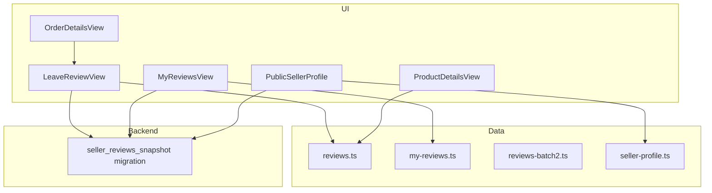
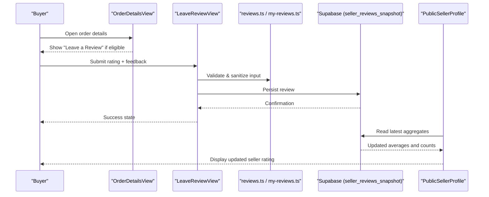
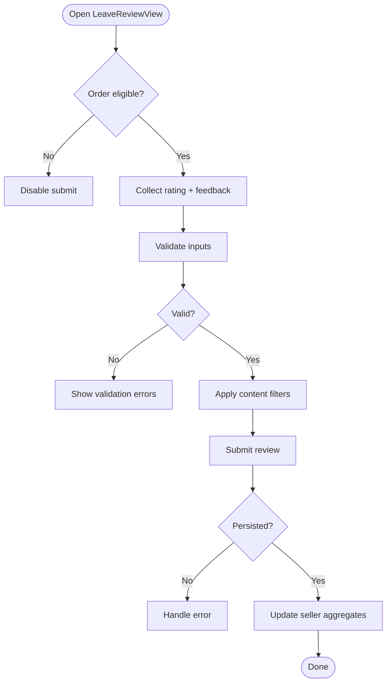
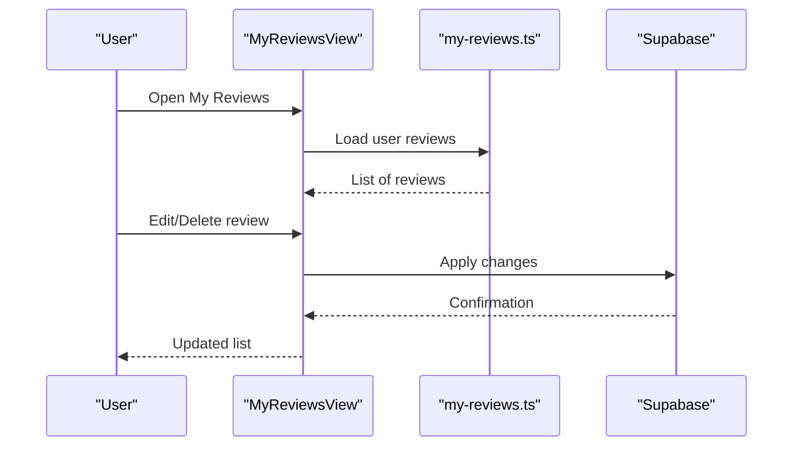
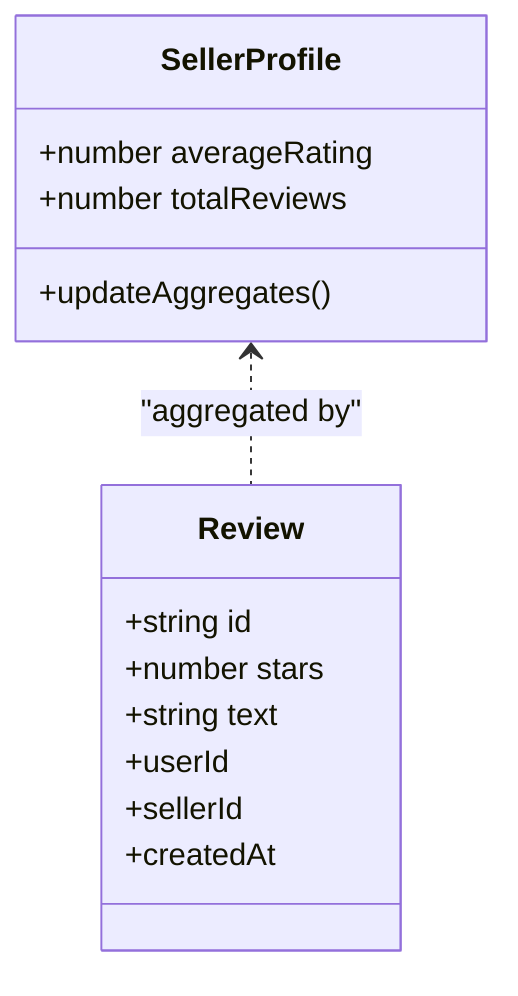
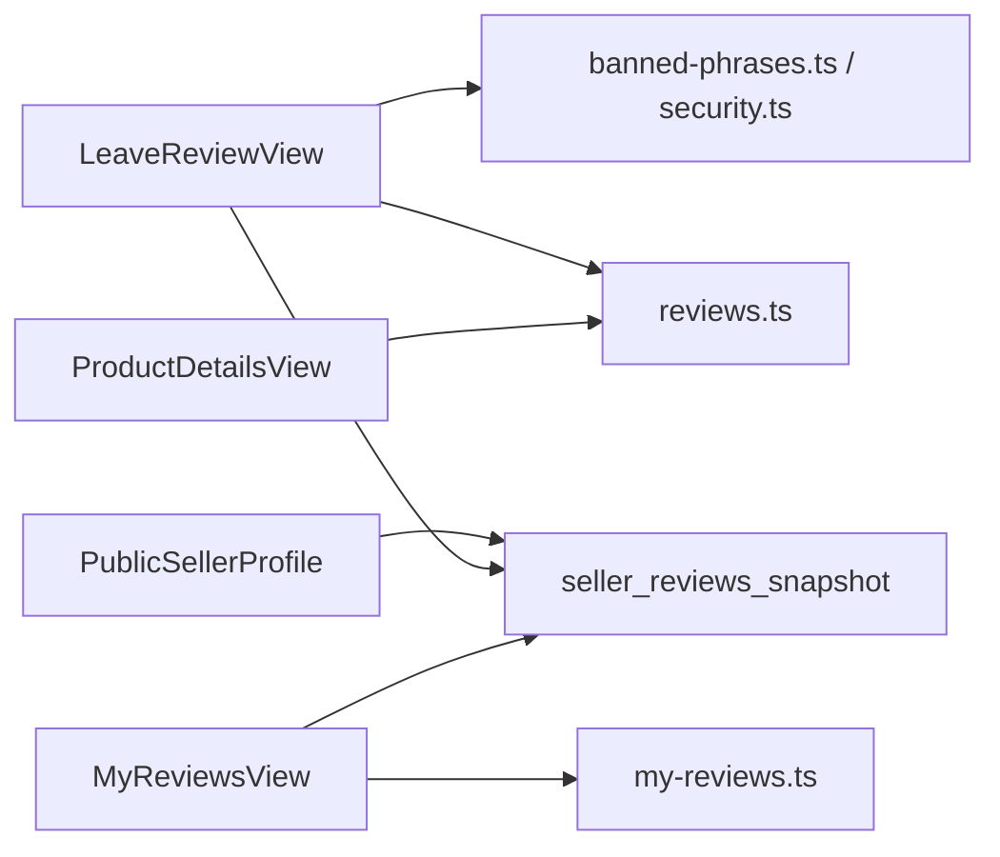

# Reviews and Ratings

<cite>
**Referenced Files in This Document**
- [LeaveReviewView.tsx](file://src/components/LeaveReviewView.tsx)
- [MyReviewsView.tsx](file://src/components/MyReviewsView.tsx)
- [reviews.ts](file://src/data/reviews.ts)
- [my-reviews.ts](file://src/data/my-reviews.ts)
- [reviews-batch2.ts](file://src/data/reviews-batch2.ts)
- [seller-profile.ts](file://src/data/seller-profile.ts)
- [PublicSellerProfile.tsx](file://src/components/PublicSellerProfile.tsx)
- [ProductDetailsView.tsx](file://src/components/ProductDetailsView.tsx)
- [OrderDetailsView.tsx](file://src/components/OrderDetailsView.tsx)
- [banned-phrases.ts](file://src/lib/banned-phrases.ts)
- [security.ts](file://src/lib/security.ts)
- [202608060003_seller_reviews_snapshot.sql](file://supabase/migrations/202608060003_seller_reviews_snapshot.sql)
</cite>

## Table of Contents
1. [Introduction](#introduction)
2. [Project Structure](#project-structure)
3. [Core Components](#core-components)
4. [Architecture Overview](#architecture-overview)
5. [Detailed Component Analysis](#detailed-component-analysis)
6. [Dependency Analysis](#dependency-analysis)
7. [Performance Considerations](#performance-considerations)
8. [Troubleshooting Guide](#troubleshooting-guide)
9. [Conclusion](#conclusion)
10. [Appendices](#appendices)

## Introduction
This document explains the review and rating system in Mooday, focusing on how buyers leave reviews for completed transactions, how seller ratings are displayed and aggregated, and how users manage their own reviews. It covers the LeaveReviewView component for creating feedback, MyReviewsView for managing personal reviews, and the overall rating calculation and display patterns. It also addresses validation, moderation workflows, authenticity verification, spam detection, and community guidelines enforcement as implemented or indicated by the codebase.

## Project Structure
The review and rating features span UI components, data models, and database migrations:
- UI components:
  - LeaveReviewView: creates and submits reviews after a purchase is completed.
  - MyReviewsView: lists and manages user’s own reviews (edit/delete).
  - PublicSellerProfile and ProductDetailsView: display seller ratings and product-level reviews.
  - OrderDetailsView: entry point to leave a review for an eligible order.
- Data models:
  - reviews.ts, my-reviews.ts, reviews-batch2.ts: define review entities and sample datasets.
  - seller-profile.ts: includes seller reputation and rating aggregates.
- Backend and storage:
  - Supabase migration 202608060003_seller_reviews_snapshot.sql: persists seller review snapshots and aggregates.
- Moderation and safety:
  - banned-phrases.ts and security.ts: provide content filtering and safety utilities used during review creation.

**Diagram sources**
- [LeaveReviewView.tsx](file://src/components/LeaveReviewView.tsx)
- [MyReviewsView.tsx](file://src/components/MyReviewsView.tsx)
- [PublicSellerProfile.tsx](file://src/components/PublicSellerProfile.tsx)
- [ProductDetailsView.tsx](file://src/components/ProductDetailsView.tsx)
- [OrderDetailsView.tsx](file://src/components/OrderDetailsView.tsx)
- [reviews.ts](file://src/data/reviews.ts)
- [my-reviews.ts](file://src/data/my-reviews.ts)
- [reviews-batch2.ts](file://src/data/reviews-batch2.ts)
- [seller-profile.ts](file://src/data/seller-profile.ts)
- [202608060003_seller_reviews_snapshot.sql](file://supabase/migrations/202608060003_seller_reviews_snapshot.sql)

**Section sources**
- [LeaveReviewView.tsx](file://src/components/LeaveReviewView.tsx)
- [MyReviewsView.tsx](file://src/components/MyReviewsView.tsx)
- [reviews.ts](file://src/data/reviews.ts)
- [my-reviews.ts](file://src/data/my-reviews.ts)
- [reviews-batch2.ts](file://src/data/reviews-batch2.ts)
- [seller-profile.ts](file://src/data/seller-profile.ts)
- [PublicSellerProfile.tsx](file://src/components/PublicSellerProfile.tsx)
- [ProductDetailsView.tsx](file://src/components/ProductDetailsView.tsx)
- [OrderDetailsView.tsx](file://src/components/OrderDetailsView.tsx)
- [202608060003_seller_reviews_snapshot.sql](file://supabase/migrations/202608060003_seller_reviews_snapshot.sql)

## Core Components
- LeaveReviewView: Enables buyers to submit star ratings and optional text feedback for completed orders. It validates inputs, applies content filters, and persists the review via backend services.
- MyReviewsView: Lists the current user’s reviews with options to edit or delete them. It fetches local/user-scoped reviews and updates the UI accordingly.
- Rating Aggregation: Seller profiles include aggregate metrics such as average rating and review counts. These are persisted through the seller_reviews_snapshot migration and refreshed when new reviews are created or updated.
- Display Patterns: PublicSellerProfile shows seller-level ratings; ProductDetailsView may show product-level reviews; OrderDetailsView provides the “Leave a Review” action for eligible orders.

Key responsibilities:
- Input validation and sanitization before submission.
- Enforcing eligibility (e.g., only completed orders can be reviewed).
- Updating seller reputation aggregates upon review changes.
- Rendering consistent rating visuals across views.

**Section sources**
- [LeaveReviewView.tsx](file://src/components/LeaveReviewView.tsx)
- [MyReviewsView.tsx](file://src/components/MyReviewsView.tsx)
- [seller-profile.ts](file://src/data/seller-profile.ts)
- [PublicSellerProfile.tsx](file://src/components/PublicSellerProfile.tsx)
- [ProductDetailsView.tsx](file://src/components/ProductDetailsView.tsx)
- [OrderDetailsView.tsx](file://src/components/OrderDetailsView.tsx)
- [202608060003_seller_reviews_snapshot.sql](file://supabase/migrations/202608060003_seller_reviews_snapshot.sql)

## Architecture Overview
The review flow connects UI components to data models and backend persistence:

**Diagram sources**
- [OrderDetailsView.tsx](file://src/components/OrderDetailsView.tsx)
- [LeaveReviewView.tsx](file://src/components/LeaveReviewView.tsx)
- [reviews.ts](file://src/data/reviews.ts)
- [my-reviews.ts](file://src/data/my-reviews.ts)
- [PublicSellerProfile.tsx](file://src/components/PublicSellerProfile.tsx)
- [202608060003_seller_reviews_snapshot.sql](file://supabase/migrations/202608060003_seller_reviews_snapshot.sql)

## Detailed Component Analysis

### LeaveReviewView
Purpose:
- Collects star rating and optional text feedback for a completed transaction.
- Validates inputs and enforces community guidelines.
- Persists the review and triggers reputation updates.

Key behaviors:
- Eligibility check: Only orders marked as completed allow review submission.
- Validation: Star rating must be within allowed range; text length limits enforced.
- Moderation: Content filtered using banned phrases and safety utilities prior to submission.
- Persistence: Sends review payload to backend; on success, refreshes related seller profile aggregates.

Common errors:
- Invalid rating value or empty required fields.
- Content flagged by moderation rules.
- Network or permission errors during submission.

**Diagram sources**
- [LeaveReviewView.tsx](file://src/components/LeaveReviewView.tsx)
- [banned-phrases.ts](file://src/lib/banned-phrases.ts)
- [security.ts](file://src/lib/security.ts)
- [202608060003_seller_reviews_snapshot.sql](file://supabase/migrations/202608060003_seller_reviews_snapshot.sql)

**Section sources**
- [LeaveReviewView.tsx](file://src/components/LeaveReviewView.tsx)
- [banned-phrases.ts](file://src/lib/banned-phrases.ts)
- [security.ts](file://src/lib/security.ts)
- [202608060003_seller_reviews_snapshot.sql](file://supabase/migrations/202608060003_seller_reviews_snapshot.sql)

### MyReviewsView
Purpose:
- Displays the current user’s reviews with actions to edit or delete.
- Reflects real-time updates after modifications.

Key behaviors:
- Fetches user-scoped reviews from data layer.
- Supports editing existing reviews and deleting them.
- Updates UI and triggers backend updates that refresh seller aggregates.

Common errors:
- Unauthorized access attempts.
- Deletion conflicts or network failures.

**Diagram sources**
- [MyReviewsView.tsx](file://src/components/MyReviewsView.tsx)
- [my-reviews.ts](file://src/data/my-reviews.ts)
- [202608060003_seller_reviews_snapshot.sql](file://supabase/migrations/202608060003_seller_reviews_snapshot.sql)

**Section sources**
- [MyReviewsView.tsx](file://src/components/MyReviewsView.tsx)
- [my-reviews.ts](file://src/data/my-reviews.ts)
- [202608060003_seller_reviews_snapshot.sql](file://supabase/migrations/202608060003_seller_reviews_snapshot.sql)

### Rating Calculation and Display
- Aggregation model: Seller profiles maintain average rating and review counts. The seller_reviews_snapshot migration stores these aggregates for efficient reads and consistency.
- Update triggers: When a review is created, edited, or deleted, aggregates are recalculated to reflect the latest values.
- Display: PublicSellerProfile renders the seller’s average rating and total reviews; ProductDetailsView may show product-level reviews where applicable.

**Diagram sources**
- [seller-profile.ts](file://src/data/seller-profile.ts)
- [reviews.ts](file://src/data/reviews.ts)
- [202608060003_seller_reviews_snapshot.sql](file://supabase/migrations/202608060003_seller_reviews_snapshot.sql)

**Section sources**
- [seller-profile.ts](file://src/data/seller-profile.ts)
- [reviews.ts](file://src/data/reviews.ts)
- [202608060003_seller_reviews_snapshot.sql](file://supabase/migrations/202608060003_seller_reviews_snapshot.sql)

### Data Models and Examples
- Review entity: Contains identifiers for reviewer and seller, star rating, optional text, timestamps, and status flags.
- Sample datasets: reviews.ts and reviews-batch2.ts provide example reviews for development and testing.
- My reviews dataset: my-reviews.ts defines user-scoped reviews for MyReviewsView.

Typical fields:
- Review ID, reviewer ID, seller ID, product/order reference, star rating, text, timestamps, moderation status.

Usage:
- Create: via LeaveReviewView.
- Read: via PublicSellerProfile and ProductDetailsView.
- Manage: via MyReviewsView.

**Section sources**
- [reviews.ts](file://src/data/reviews.ts)
- [reviews-batch2.ts](file://src/data/reviews-batch2.ts)
- [my-reviews.ts](file://src/data/my-reviews.ts)

### Moderation, Authenticity, and Spam Detection
- Content filtering: Uses banned-phrases.ts and security.ts to detect and block inappropriate content before submission.
- Eligibility: Only completed transactions can be reviewed to ensure authenticity.
- Reputation integrity: Aggregates are stored in a dedicated snapshot table to prevent manipulation and ensure consistent display.

Workflows:
- Pre-submission checks validate inputs and content.
- Post-submission, aggregates are updated and cached for performance.
- Admin tools can review flagged content and adjust visibility or remove reviews as needed.

**Section sources**
- [banned-phrases.ts](file://src/lib/banned-phrases.ts)
- [security.ts](file://src/lib/security.ts)
- [202608060003_seller_reviews_snapshot.sql](file://supabase/migrations/202608060003_seller_reviews_snapshot.sql)

## Dependency Analysis
Components and data layers interact as follows:
- LeaveReviewView depends on validation and moderation utilities and writes to the review store.
- MyReviewsView depends on user-scoped review data and update operations.
- PublicSellerProfile and ProductDetailsView depend on aggregated seller/product review data.
- The seller_reviews_snapshot migration underpins reliable aggregation reads.

**Diagram sources**
- [LeaveReviewView.tsx](file://src/components/LeaveReviewView.tsx)
- [MyReviewsView.tsx](file://src/components/MyReviewsView.tsx)
- [PublicSellerProfile.tsx](file://src/components/PublicSellerProfile.tsx)
- [ProductDetailsView.tsx](file://src/components/ProductDetailsView.tsx)
- [reviews.ts](file://src/data/reviews.ts)
- [my-reviews.ts](file://src/data/my-reviews.ts)
- [banned-phrases.ts](file://src/lib/banned-phrases.ts)
- [security.ts](file://src/lib/security.ts)
- [202608060003_seller_reviews_snapshot.sql](file://supabase/migrations/202608060003_seller_reviews_snapshot.sql)

**Section sources**
- [LeaveReviewView.tsx](file://src/components/LeaveReviewView.tsx)
- [MyReviewsView.tsx](file://src/components/MyReviewsView.tsx)
- [PublicSellerProfile.tsx](file://src/components/PublicSellerProfile.tsx)
- [ProductDetailsView.tsx](file://src/components/ProductDetailsView.tsx)
- [reviews.ts](file://src/data/reviews.ts)
- [my-reviews.ts](file://src/data/my-reviews.ts)
- [banned-phrases.ts](file://src/lib/banned-phrases.ts)
- [security.ts](file://src/lib/security.ts)
- [202608060003_seller_reviews_snapshot.sql](file://supabase/migrations/202608060003_seller_reviews_snapshot.sql)

## Performance Considerations
- Aggregated reads: Use seller_reviews_snapshot to avoid expensive real-time calculations on every page load.
- Caching: Cache seller ratings at the UI layer to reduce repeated requests.
- Batch updates: When multiple reviews change, batch aggregate recalculation to minimize writes.
- Lazy loading: Load detailed reviews lazily in product and seller profiles to improve initial render time.

[No sources needed since this section provides general guidance]

## Troubleshooting Guide
Common issues and resolutions:
- Submission fails due to invalid input: Ensure star rating is within allowed range and required fields are filled.
- Content blocked by moderation: Remove flagged phrases per banned-phrases.ts and retry.
- Unable to edit/delete: Verify ownership and permissions; confirm the review belongs to the current user.
- Inconsistent seller rating: Trigger a refresh of seller aggregates or re-run aggregation logic to sync with latest reviews.

Operational tips:
- Log validation and moderation steps for debugging.
- Provide clear error messages to users indicating what went wrong and how to fix it.
- Monitor aggregate staleness and trigger background jobs to reconcile discrepancies.

**Section sources**
- [LeaveReviewView.tsx](file://src/components/LeaveReviewView.tsx)
- [MyReviewsView.tsx](file://src/components/MyReviewsView.tsx)
- [banned-phrases.ts](file://src/lib/banned-phrases.ts)
- [security.ts](file://src/lib/security.ts)
- [202608060003_seller_reviews_snapshot.sql](file://supabase/migrations/202608060003_seller_reviews_snapshot.sql)

## Conclusion
Mooday’s review and rating system centers on robust UI components (LeaveReviewView, MyReviewsView), reliable data models, and persistent aggregation via the seller_reviews_snapshot migration. The system enforces eligibility, validates inputs, and applies moderation to maintain trust and quality. Ratings are consistently displayed across seller and product contexts, with performance optimizations ensuring responsive experiences.

[No sources needed since this section summarizes without analyzing specific files]

## Appendices

### Example Review Data Structure
- Fields typically include: review ID, reviewer ID, seller ID, product/order reference, star rating, text, timestamps, and moderation status.
- Sample datasets in reviews.ts and reviews-batch2.ts illustrate realistic entries for development and testing.

**Section sources**
- [reviews.ts](file://src/data/reviews.ts)
- [reviews-batch2.ts](file://src/data/reviews-batch2.ts)

### Rating Aggregation Methods
- Average rating computed from all valid reviews for a seller.
- Total review count maintained alongside the average.
- Snapshot table ensures fast reads and consistency across the app.

**Section sources**
- [seller-profile.ts](file://src/data/seller-profile.ts)
- [202608060003_seller_reviews_snapshot.sql](file://supabase/migrations/202608060003_seller_reviews_snapshot.sql)

### Display Patterns
- PublicSellerProfile: Shows seller average rating and total reviews prominently.
- ProductDetailsView: May show product-level reviews and link to seller profile.
- OrderDetailsView: Provides “Leave a Review” for eligible orders.

**Section sources**
- [PublicSellerProfile.tsx](file://src/components/PublicSellerProfile.tsx)
- [ProductDetailsView.tsx](file://src/components/ProductDetailsView.tsx)
- [OrderDetailsView.tsx](file://src/components/OrderDetailsView.tsx)