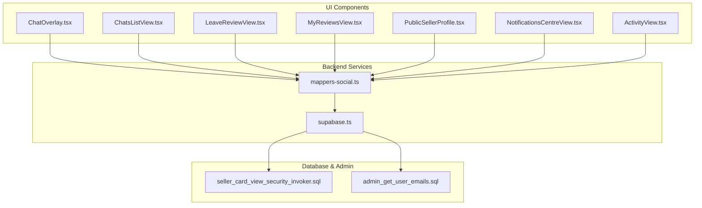
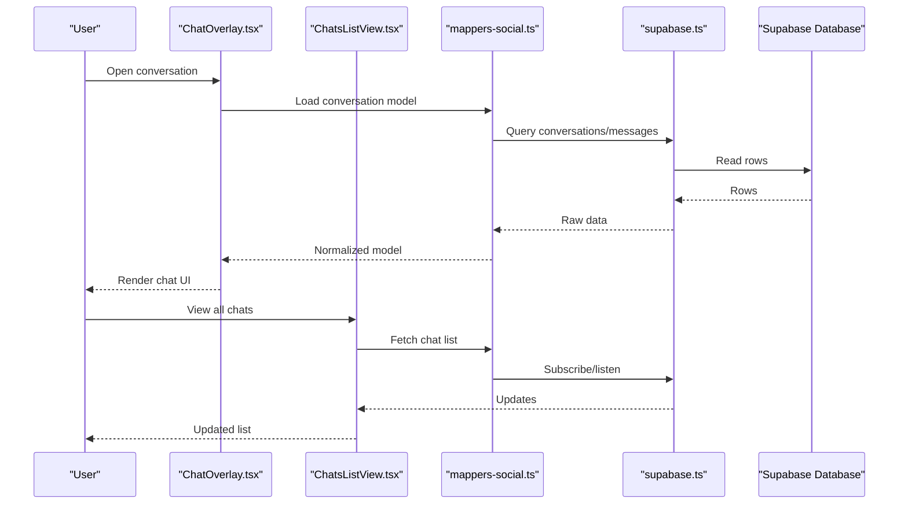
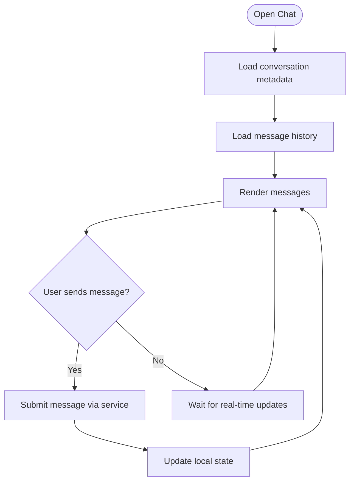
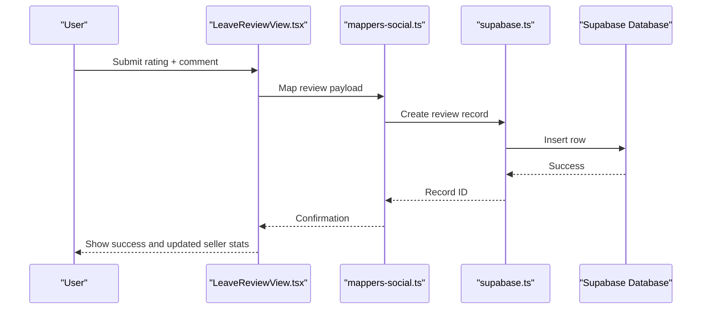
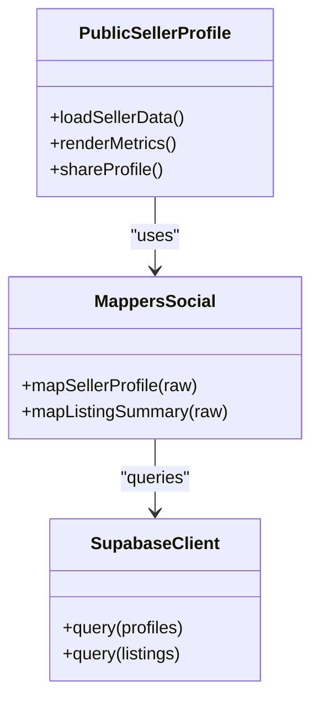
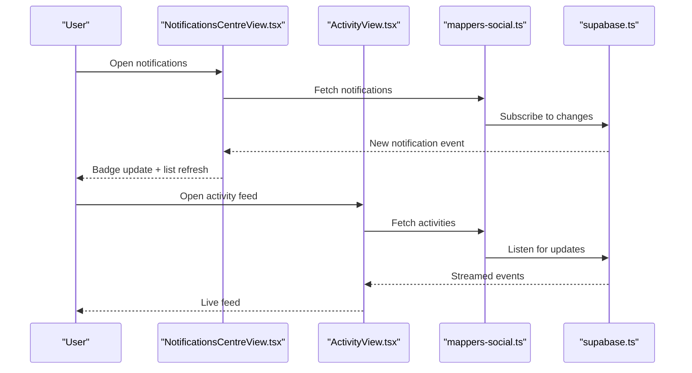
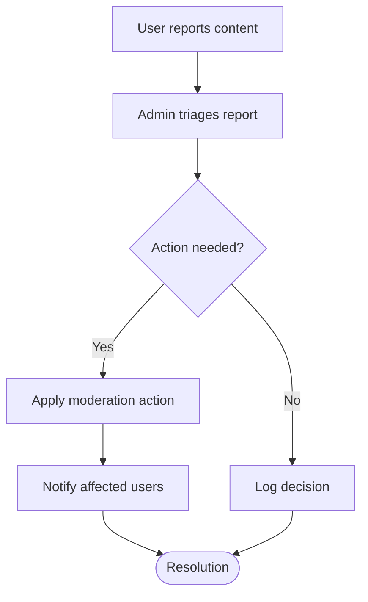
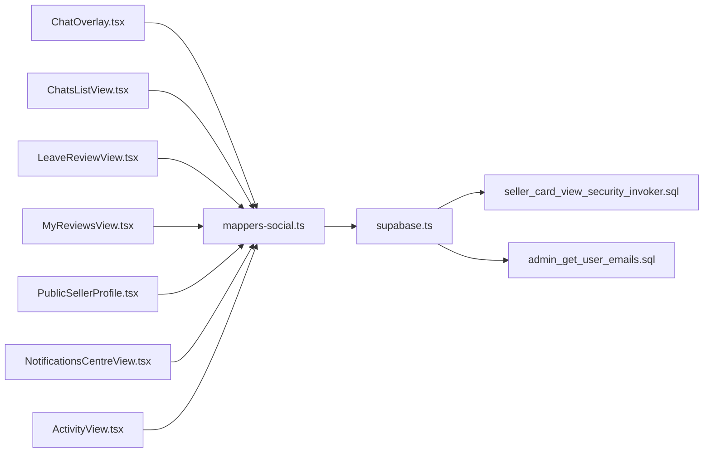

# Social Features

<cite>
**Referenced Files in This Document**
- [ChatOverlay.tsx](file://src/components/ChatOverlay.tsx)
- [ChatsListView.tsx](file://src/components/ChatsListView.tsx)
- [LeaveReviewView.tsx](file://src/components/LeaveReviewView.tsx)
- [MyReviewsView.tsx](file://src/components/MyReviewsView.tsx)
- [PublicSellerProfile.tsx](file://src/components/PublicSellerProfile.tsx)
- [NotificationsCentreView.tsx](file://src/components/NotificationsCentreView.tsx)
- [ActivityView.tsx](file://src/components/ActivityView.tsx)
- [mappers-social.ts](file://src/services/backend/mappers-social.ts)
- [supabase.ts](file://src/services/backend/supabase.ts)
- [202608160504_seller_card_view_security_invoker.sql](file://supabase/migrations/202608160504_seller_card_view_security_invoker.sql)
- [202608060007_admin_get_user_emails.sql](file://supabase/migrations/202608060007_admin_get_user_emails.sql)
- [progress-u7-chat.md](file://docs/progress-u7-chat.md)
- [progress-u6-reviews.md](file://docs/progress-u6-reviews.md)
- [progress-u8-social.md](file://docs/progress-u8-social.md)
- [group-f-social.md](file://docs/group-f-social.md)
- [public-seller-profile.md](file://docs/public-seller-profile.md)
</cite>

## Table of Contents
1. [Introduction](#introduction)
2. [Project Structure](#project-structure)
3. [Core Components](#core-components)
4. [Architecture Overview](#architecture-overview)
5. [Detailed Component Analysis](#detailed-component-analysis)
6. [Dependency Analysis](#dependency-analysis)
7. [Performance Considerations](#performance-considerations)
8. [Troubleshooting Guide](#troubleshooting-guide)
9. [Conclusion](#conclusion)

## Introduction
This document explains the social commerce features in Mooday with a focus on real-time messaging between buyers and sellers, reviews and ratings, user discovery via public seller profiles, activity feeds, and social notifications. It also covers moderation tools, spam prevention, and community guidelines enforcement as implemented or indicated by the codebase and migration files.

## Project Structure
The social features span UI components, backend mappers, Supabase migrations, and documentation artifacts:
- Real-time chat UI and conversation management are implemented in dedicated components.
- Reviews and ratings are surfaced through views for leaving and viewing feedback.
- Public seller profiles enable discovery and social sharing.
- Notifications center aggregates social events and updates.
- Backend mappers translate database schemas into application models.
- Supabase migrations define schema, security, and admin capabilities.

**Diagram sources**
- [ChatOverlay.tsx](file://src/components/ChatOverlay.tsx)
- [ChatsListView.tsx](file://src/components/ChatsListView.tsx)
- [LeaveReviewView.tsx](file://src/components/LeaveReviewView.tsx)
- [MyReviewsView.tsx](file://src/components/MyReviewsView.tsx)
- [PublicSellerProfile.tsx](file://src/components/PublicSellerProfile.tsx)
- [NotificationsCentreView.tsx](file://src/components/NotificationsCentreView.tsx)
- [ActivityView.tsx](file://src/components/ActivityView.tsx)
- [mappers-social.ts](file://src/services/backend/mappers-social.ts)
- [supabase.ts](file://src/services/backend/supabase.ts)
- [202608160504_seller_card_view_security_invoker.sql](file://supabase/migrations/202608160504_seller_card_view_security_invoker.sql)
- [202608060007_admin_get_user_emails.sql](file://supabase/migrations/202608060007_admin_get_user_emails.sql)

**Section sources**
- [ChatOverlay.tsx](file://src/components/ChatOverlay.tsx)
- [ChatsListView.tsx](file://src/components/ChatsListView.tsx)
- [LeaveReviewView.tsx](file://src/components/LeaveReviewView.tsx)
- [MyReviewsView.tsx](file://src/components/MyReviewsView.tsx)
- [PublicSellerProfile.tsx](file://src/components/PublicSellerProfile.tsx)
- [NotificationsCentreView.tsx](file://src/components/NotificationsCentreView.tsx)
- [ActivityView.tsx](file://src/components/ActivityView.tsx)
- [mappers-social.ts](file://src/services/backend/mappers-social.ts)
- [supabase.ts](file://src/services/backend/supabase.ts)
- [202608160504_seller_card_view_security_invoker.sql](file://supabase/migrations/202608160504_seller_card_view_security_invoker.sql)
- [202608060007_admin_get_user_emails.sql](file://supabase/migrations/202608060007_admin_get_user_emails.sql)

## Core Components
- Real-time messaging: Chat overlay and conversation list provide chat interfaces, message history, and conversation management.
- Reviews and ratings: Views to leave feedback and view one’s own reviews; seller reputation is reflected via profile and listings.
- Public seller profiles: Discoverable profiles that aggregate seller information and social signals.
- Activity feed and notifications: Centralized views for social events and real-time updates.
- Backend mapping: Translates database structures into typed models used across UI.

**Section sources**
- [ChatOverlay.tsx](file://src/components/ChatOverlay.tsx)
- [ChatsListView.tsx](file://src/components/ChatsListView.tsx)
- [LeaveReviewView.tsx](file://src/components/LeaveReviewView.tsx)
- [MyReviewsView.tsx](file://src/components/MyReviewsView.tsx)
- [PublicSellerProfile.tsx](file://src/components/PublicSellerProfile.tsx)
- [NotificationsCentreView.tsx](file://src/components/NotificationsCentreView.tsx)
- [ActivityView.tsx](file://src/components/ActivityView.tsx)
- [mappers-social.ts](file://src/services/backend/mappers-social.ts)

## Architecture Overview
The social architecture connects UI components to backend services and the database layer:
- UI components request data and perform actions (send messages, submit reviews, follow/unfollow).
- Backend mappers normalize data from Supabase into application models.
- Supabase client handles queries, subscriptions, and mutations.
- Migrations define schema, views, and admin capabilities required for social features.

**Diagram sources**
- [ChatOverlay.tsx](file://src/components/ChatOverlay.tsx)
- [ChatsListView.tsx](file://src/components/ChatsListView.tsx)
- [mappers-social.ts](file://src/services/backend/mappers-social.ts)
- [supabase.ts](file://src/services/backend/supabase.ts)

## Detailed Component Analysis

### Real-time Messaging System
- Chat interface: The chat overlay renders active conversations, displays messages, and supports sending new messages. It integrates with the conversation list to switch contexts and mark items as read.
- Conversation management: The conversation list shows recent chats, unread indicators, and navigation to individual chats.
- Message history: Messages are loaded per conversation and updated in real time via subscriptions.

**Diagram sources**
- [ChatOverlay.tsx](file://src/components/ChatOverlay.tsx)
- [ChatsListView.tsx](file://src/components/ChatsListView.tsx)

**Section sources**
- [ChatOverlay.tsx](file://src/components/ChatOverlay.tsx)
- [ChatsListView.tsx](file://src/components/ChatsListView.tsx)
- [progress-u7-chat.md](file://docs/progress-u7-chat.md)

### Reviews and Rating System
- Leaving feedback: Users can submit reviews after transactions, providing ratings and comments tied to sellers and orders.
- Viewing reviews: Users can see their own reviews and seller reputation is reflected in profiles and listings.
- Reputation management: Seller cards and profiles aggregate review metrics to inform buyers.

**Diagram sources**
- [LeaveReviewView.tsx](file://src/components/LeaveReviewView.tsx)
- [mappers-social.ts](file://src/services/backend/mappers-social.ts)
- [supabase.ts](file://src/services/backend/supabase.ts)

**Section sources**
- [LeaveReviewView.tsx](file://src/components/LeaveReviewView.tsx)
- [MyReviewsView.tsx](file://src/components/MyReviewsView.tsx)
- [progress-u6-reviews.md](file://docs/progress-u6-reviews.md)

### Public Seller Profiles and User Discovery
- Public profiles: Sellers have discoverable profiles aggregating listings, ratings, and social signals.
- Discovery: Users can browse seller cards and navigate to full profiles to evaluate trustworthiness before engaging.
- Sharing: Profiles support sharing links to promote sellers and listings.

**Diagram sources**
- [PublicSellerProfile.tsx](file://src/components/PublicSellerProfile.tsx)
- [mappers-social.ts](file://src/services/backend/mappers-social.ts)
- [supabase.ts](file://src/services/backend/supabase.ts)
- [202608160504_seller_card_view_security_invoker.sql](file://supabase/migrations/202608160504_seller_card_view_security_invoker.sql)

**Section sources**
- [PublicSellerProfile.tsx](file://src/components/PublicSellerProfile.tsx)
- [public-seller-profile.md](file://docs/public-seller-profile.md)
- [202608160504_seller_card_view_security_invoker.sql](file://supabase/migrations/202608160504_seller_card_view_security_invoker.sql)

### Activity Feeds and Social Notifications
- Activity feed: Aggregates social events such as follows, likes, and mentions.
- Notifications center: Displays notifications with read/unread states and deep links to relevant content.
- Real-time updates: Subscriptions push new notifications and activity to the UI.

**Diagram sources**
- [NotificationsCentreView.tsx](file://src/components/NotificationsCentreView.tsx)
- [ActivityView.tsx](file://src/components/ActivityView.tsx)
- [mappers-social.ts](file://src/services/backend/mappers-social.ts)
- [supabase.ts](file://src/services/backend/supabase.ts)

**Section sources**
- [NotificationsCentreView.tsx](file://src/components/NotificationsCentreView.tsx)
- [ActivityView.tsx](file://src/components/ActivityView.tsx)
- [progress-u8-social.md](file://docs/progress-u8-social.md)
- [group-f-social.md](file://docs/group-f-social.md)

### Moderation Tools, Spam Prevention, and Community Guidelines
- Admin capabilities: Admin endpoints and migrations expose tools to retrieve user emails and manage platform safety.
- Spam prevention: Input validation and reporting flows help enforce community standards.
- Enforcement: Moderation workflows rely on admin access and user reports to take action.

**Diagram sources**
- [202608060007_admin_get_user_emails.sql](file://supabase/migrations/202608060007_admin_get_user_emails.sql)

**Section sources**
- [202608060007_admin_get_user_emails.sql](file://supabase/migrations/202608060007_admin_get_user_emails.sql)

## Dependency Analysis
- UI components depend on backend mappers to transform raw database records into typed models.
- Mappers depend on the Supabase client for querying and subscribing to data.
- Migrations provide the schema and views that underpin social features, including seller card visibility and admin utilities.

**Diagram sources**
- [ChatOverlay.tsx](file://src/components/ChatOverlay.tsx)
- [ChatsListView.tsx](file://src/components/ChatsListView.tsx)
- [LeaveReviewView.tsx](file://src/components/LeaveReviewView.tsx)
- [MyReviewsView.tsx](file://src/components/MyReviewsView.tsx)
- [PublicSellerProfile.tsx](file://src/components/PublicSellerProfile.tsx)
- [NotificationsCentreView.tsx](file://src/components/NotificationsCentreView.tsx)
- [ActivityView.tsx](file://src/components/ActivityView.tsx)
- [mappers-social.ts](file://src/services/backend/mappers-social.ts)
- [supabase.ts](file://src/services/backend/supabase.ts)
- [202608160504_seller_card_view_security_invoker.sql](file://supabase/migrations/202608160504_seller_card_view_security_invoker.sql)
- [202608060007_admin_get_user_emails.sql](file://supabase/migrations/202608060007_admin_get_user_emails.sql)

**Section sources**
- [mappers-social.ts](file://src/services/backend/mappers-social.ts)
- [supabase.ts](file://src/services/backend/supabase.ts)
- [202608160504_seller_card_view_security_invoker.sql](file://supabase/migrations/202608160504_seller_card_view_security_invoker.sql)
- [202608060007_admin_get_user_emails.sql](file://supabase/migrations/202608060007_admin_get_user_emails.sql)

## Performance Considerations
- Prefer paginated loads for chat histories and activity feeds to reduce initial payload size.
- Use subscriptions judiciously; unsubscribe when components unmount to avoid unnecessary network traffic.
- Cache seller profile and listing summaries locally where appropriate to minimize repeated queries.
- Debounce search and filter inputs in discovery flows to limit query frequency.

[No sources needed since this section provides general guidance]

## Troubleshooting Guide
- Chat not updating: Verify subscription listeners are active and that messages are persisted in the database. Check for errors in the mapper transformations.
- Reviews not reflecting: Ensure the submission flow completes successfully and that seller metrics are recalculated or refreshed.
- Public profile not visible: Confirm the seller card view permissions and invoker roles are correctly applied via migrations.
- Admin actions failing: Validate that admin-only endpoints and migrations are deployed and accessible.

**Section sources**
- [ChatOverlay.tsx](file://src/components/ChatOverlay.tsx)
- [LeaveReviewView.tsx](file://src/components/LeaveReviewView.tsx)
- [PublicSellerProfile.tsx](file://src/components/PublicSellerProfile.tsx)
- [202608160504_seller_card_view_security_invoker.sql](file://supabase/migrations/202608160504_seller_card_view_security_invoker.sql)
- [202608060007_admin_get_user_emails.sql](file://supabase/migrations/202608060007_admin_get_user_emails.sql)

## Conclusion
Mooday’s social commerce features integrate real-time messaging, reviews and ratings, public seller profiles, activity feeds, and notifications into a cohesive experience. The architecture leverages UI components, backend mappers, and Supabase to deliver responsive interactions. Admin tools and migrations support moderation and platform governance. Following the recommendations above will help maintain performance, reliability, and a safe community environment.