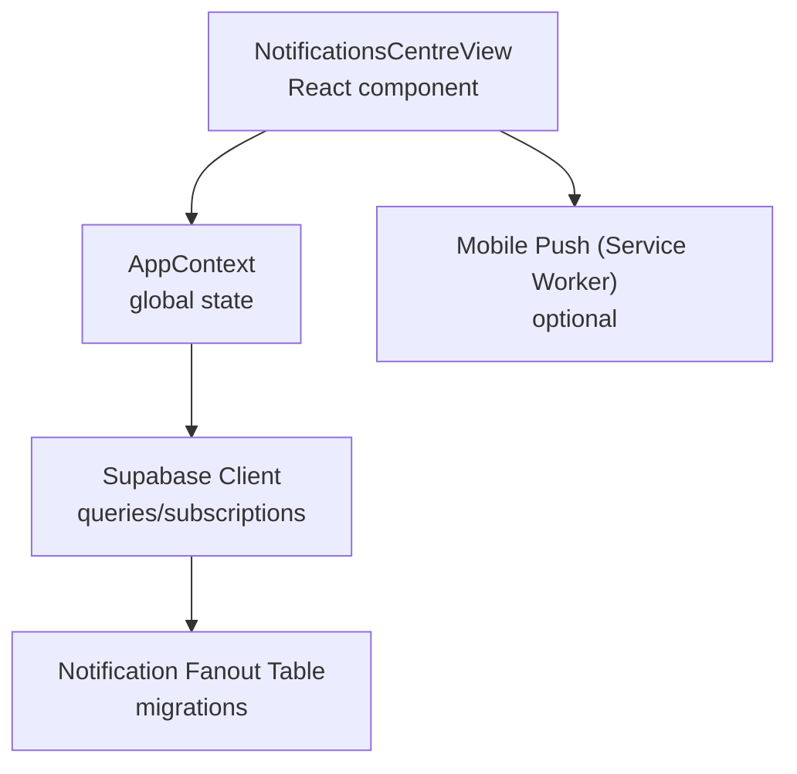
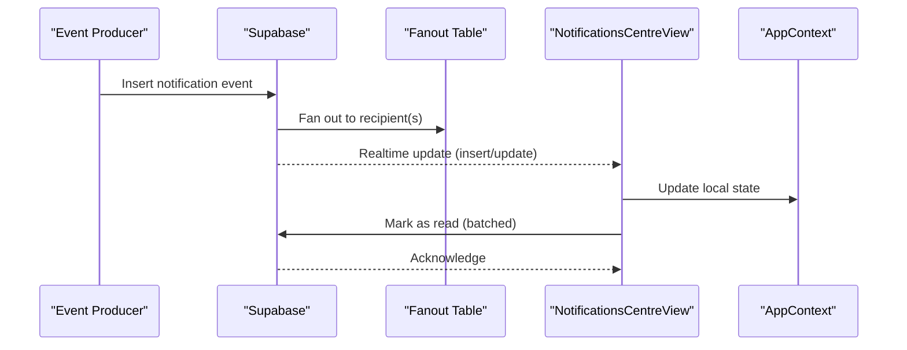
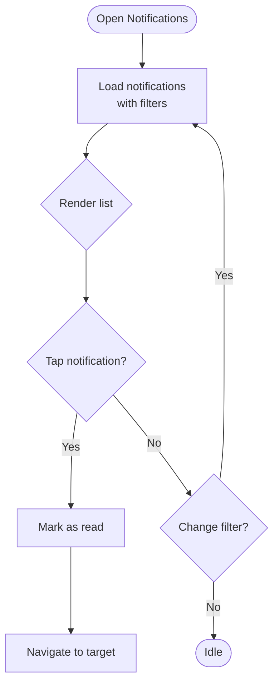
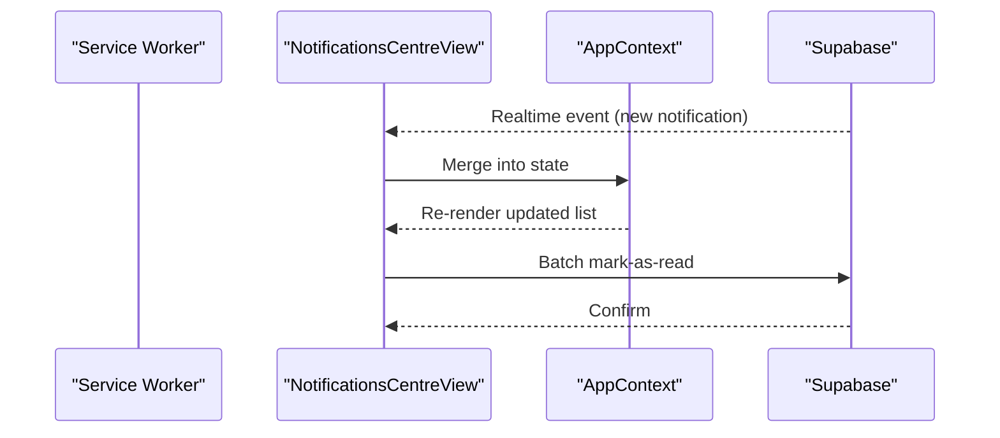
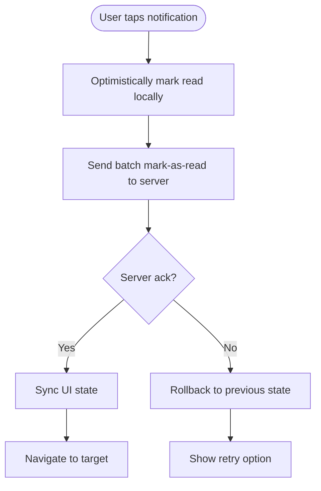
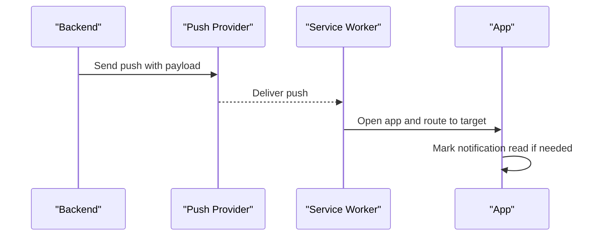
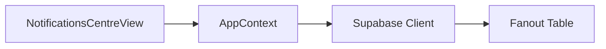

# Social Notifications

<cite>
**Referenced Files in This Document**
- [NotificationsCentreView.tsx](file://src/components/NotificationsCentreView.tsx)
- [notifications.ts](file://src/data/notifications.ts)
- [AppContext.tsx](file://src/context/AppContext.tsx)
- [supabase.ts](file://src/services/backend/supabase.ts)
- [notification_fanout.sql](file://supabase/migrations/202608060004_notification_fanout.sql)
- [progress-u19-u20-backup-deploy.md](file://docs/progress-u19-u20-backup-deploy.md)
</cite>

## Table of Contents
1. [Introduction](#introduction)
2. [Project Structure](#project-structure)
3. [Core Components](#core-components)
4. [Architecture Overview](#architecture-overview)
5. [Detailed Component Analysis](#detailed-component-analysis)
6. [Dependency Analysis](#dependency-analysis)
7. [Performance Considerations](#performance-considerations)
8. [Troubleshooting Guide](#troubleshooting-guide)
9. [Conclusion](#conclusion)

## Introduction
This document explains the social notifications system in Mooday: how users receive and manage notifications for messages, reviews, follows, and marketplace activities; how the NotificationsCentreView renders and interacts with notifications; how real-time updates are delivered; how preferences and read/unread status are managed; and how queuing, batching, retention, and mobile push notifications fit into the design. It also provides performance guidance and troubleshooting steps.

## Project Structure
The notifications feature spans UI components, data models, backend services, and database migrations:
- UI layer: NotificationsCentreView renders the user-facing notification center.
- Data layer: Local notification models and mock/sample data reside under src/data.
- Context/state: AppContext coordinates global state including notifications.
- Backend integration: Supabase client and migrations define storage and fan-out tables.
- Realtime: Supabase subscriptions enable live updates.

**Diagram sources**
- [NotificationsCentreView.tsx](file://src/components/NotificationsCentreView.tsx)
- [AppContext.tsx](file://src/context/AppContext.tsx)
- [supabase.ts](file://src/services/backend/supabase.ts)
- [notification_fanout.sql](file://supabase/migrations/202608060004_notification_fanout.sql)

**Section sources**
- [NotificationsCentreView.tsx](file://src/components/NotificationsCentreView.tsx)
- [notifications.ts](file://src/data/notifications.ts)
- [AppContext.tsx](file://src/context/AppContext.tsx)
- [supabase.ts](file://src/services/backend/supabase.ts)
- [notification_fanout.sql](file://supabase/migrations/202608060004_notification_fanout.sql)

## Core Components
- NotificationsCentreView: Displays a paginated list of notifications, supports filtering by type, marking as read, and navigating to related actions (e.g., open message, view review).
- Notification types: Messages, Reviews, Follows, Marketplace activities (orders, sales, disputes).
- State management: AppContext holds current user’s notifications, unread counts, and preference toggles.
- Data persistence: Supabase stores notifications and fan-out records; realtime subscriptions keep the UI in sync.

Key responsibilities:
- Fetching notifications efficiently (pagination, filters).
- Updating read/unread status atomically.
- Rendering different notification cards per type.
- Handling empty states and error states gracefully.

**Section sources**
- [NotificationsCentreView.tsx](file://src/components/NotificationsCentreView.tsx)
- [notifications.ts](file://src/data/notifications.ts)
- [AppContext.tsx](file://src/context/AppContext.tsx)

## Architecture Overview
The system uses a fan-out model to deliver notifications to recipients efficiently:
- Event producers (messages, reviews, follows, marketplace events) emit notifications.
- A fan-out table indexes notifications per recipient for fast retrieval.
- Supabase realtime subscriptions push updates to clients.
- The UI subscribes to changes and updates the local state via AppContext.

**Diagram sources**
- [notification_fanout.sql](file://supabase/migrations/202608060004_notification_fanout.sql)
- [supabase.ts](file://src/services/backend/supabase.ts)
- [NotificationsCentreView.tsx](file://src/components/NotificationsCentreView.tsx)
- [AppContext.tsx](file://src/context/AppContext.tsx)

## Detailed Component Analysis

### NotificationsCentreView
Responsibilities:
- Render lists of notifications grouped by date/time.
- Support filters (All, Messages, Reviews, Follows, Marketplace).
- Mark individual or batch notifications as read.
- Navigate to relevant screens based on notification payload.
- Show unread badge counts and handle loading/error states.

User flows:
- Open NotificationsCentreView -> fetch latest -> render cards -> tap to mark read and navigate.
- Filter by type -> refetch with query params -> update UI.
- Swipe or long-press actions (if implemented) -> quick mark as read/archive.

**Diagram sources**
- [NotificationsCentreView.tsx](file://src/components/NotificationsCentreView.tsx)

**Section sources**
- [NotificationsCentreView.tsx](file://src/components/NotificationsCentreView.tsx)

### Notification Types and Payloads
Common notification categories:
- Message: New message or reply in chat.
- Review: New review on listing or seller profile.
- Follow: User followed/unfollowed you.
- Marketplace: Order placed, payment received, dispute opened/closed.

Payload fields typically include:
- Type, actor, target, timestamp, metadata (IDs for navigation), and read flag.

These types drive rendering logic and routing behavior in the UI.

**Section sources**
- [notifications.ts](file://src/data/notifications.ts)

### Delivery Mechanisms and Realtime Updates
- Fan-out table ensures O(1) reads per recipient.
- Supabase realtime subscriptions listen for inserts/updates and push to clients.
- Client merges incoming updates into AppContext to avoid full re-fetches.
- Offline resilience: queue local mutations and reconcile when online.

**Diagram sources**
- [supabase.ts](file://src/services/backend/supabase.ts)
- [AppContext.tsx](file://src/context/AppContext.tsx)
- [NotificationsCentreView.tsx](file://src/components/NotificationsCentreView.tsx)

**Section sources**
- [supabase.ts](file://src/services/backend/supabase.ts)
- [AppContext.tsx](file://src/context/AppContext.tsx)

### Notification Preferences
Preferences allow users to control:
- Which channels receive notifications (in-app, email, push).
- Which event types trigger notifications (messages, reviews, follows, marketplace).
- Quiet hours or do-not-disturb windows.

Preference handling:
- Stored in user settings and synced across devices.
- Applied at delivery time to gate fan-out and push dispatch.
- UI exposes toggles in Settings; changes propagate immediately.

**Section sources**
- [AppContext.tsx](file://src/context/AppContext.tsx)

### Read/Unread Status Management
- Single tap marks a notification as read and navigates to the target.
- Batch operations mark multiple items as read to reduce network calls.
- Unread counters reflect both server state and optimistic UI updates.
- Edge cases: concurrent edits handled via last-write-wins or conflict resolution.

**Diagram sources**
- [NotificationsCentreView.tsx](file://src/components/NotificationsCentreView.tsx)
- [AppContext.tsx](file://src/context/AppContext.tsx)

**Section sources**
- [NotificationsCentreView.tsx](file://src/components/NotificationsCentreView.tsx)
- [AppContext.tsx](file://src/context/AppContext.tsx)

### Queuing, Batching, and Retention
- Queuing: Events are enqueued before fan-out to handle spikes and retries.
- Batching: Mark-as-read and other write operations are batched to minimize requests.
- Retention: Policies archive or purge old notifications to maintain performance and storage limits.

Implementation notes:
- Use idempotent upserts for fan-out to prevent duplicates.
- Implement background jobs for heavy fan-out tasks.
- Apply TTL-based cleanup or partitioning by date.

**Section sources**
- [notification_fanout.sql](file://supabase/migrations/202608060004_notification_fanout.sql)

### Mobile Push Notifications
- When enabled by user preferences, push notifications mirror in-app alerts.
- Service worker handles registration, token refresh, and silent updates.
- Deep links route directly to the relevant screen after tapping the notification.

**Diagram sources**
- [NotificationsCentreView.tsx](file://src/components/NotificationsCentreView.tsx)

**Section sources**
- [NotificationsCentreView.tsx](file://src/components/NotificationsCentreView.tsx)

## Dependency Analysis
- NotificationsCentreView depends on:
  - AppContext for state and actions.
  - Supabase client for queries and realtime.
  - Navigation utilities for deep linking.
- AppContext depends on:
  - Supabase client for fetching and subscribing.
  - Local storage for preferences and offline cache.
- Database schema (fan-out) depends on:
  - Migrations defining tables, indexes, and constraints.

**Diagram sources**
- [NotificationsCentreView.tsx](file://src/components/NotificationsCentreView.tsx)
- [AppContext.tsx](file://src/context/AppContext.tsx)
- [supabase.ts](file://src/services/backend/supabase.ts)
- [notification_fanout.sql](file://supabase/migrations/202608060004_notification_fanout.sql)

**Section sources**
- [NotificationsCentreView.tsx](file://src/components/NotificationsCentreView.tsx)
- [AppContext.tsx](file://src/context/AppContext.tsx)
- [supabase.ts](file://src/services/backend/supabase.ts)
- [notification_fanout.sql](file://supabase/migrations/202608060004_notification_fanout.sql)

## Performance Considerations
- Pagination and virtualization: Render only visible items to reduce memory usage.
- Debounced search/filter: Avoid excessive re-renders during typing.
- Batch writes: Group mark-as-read operations to reduce network overhead.
- Efficient indexing: Ensure fan-out table has appropriate indexes on recipient_id, created_at, and read flags.
- Realtime throttling: Coalesce rapid updates to prevent UI thrashing.
- Cache strategies: Keep recent notifications in memory; persist older ones to disk.
- Push payload size: Keep payloads small; use deep links to load details on demand.

[No sources needed since this section provides general guidance]

## Troubleshooting Guide
Common issues and resolutions:
- Notifications not appearing:
  - Verify realtime subscription is active and authenticated.
  - Check fan-out table for missing entries.
  - Inspect network logs for failed mark-as-read calls.
- Duplicate notifications:
  - Ensure idempotent inserts and unique constraints on recipient + event_id.
- High latency:
  - Add indexes on frequently queried columns.
  - Reduce payload size and paginate results.
- Push not delivered:
  - Validate device token validity and permissions.
  - Check provider quotas and error responses.

Operational checks:
- Monitor error rates and latency metrics.
- Review migration history for schema drift.
- Validate backup and restore procedures for critical data.

**Section sources**
- [progress-u19-u20-backup-deploy.md](file://docs/progress-u19-u20-backup-deploy.md)

## Conclusion
Mooday’s social notifications system combines a scalable fan-out architecture, efficient UI rendering, and robust realtime updates to deliver timely, relevant alerts for messages, reviews, follows, and marketplace activities. With clear preference controls, reliable read/unread management, and thoughtful performance optimizations, it provides a responsive experience across web and mobile. Proper indexing, batching, and retention policies ensure scalability and reliability as user growth continues.