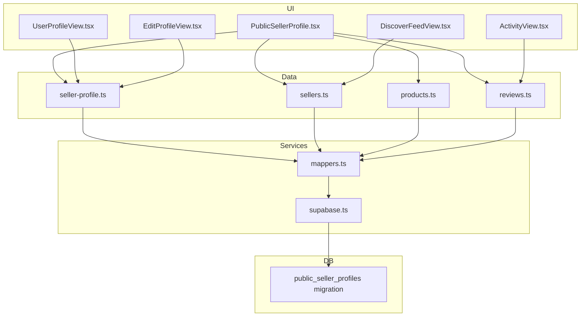
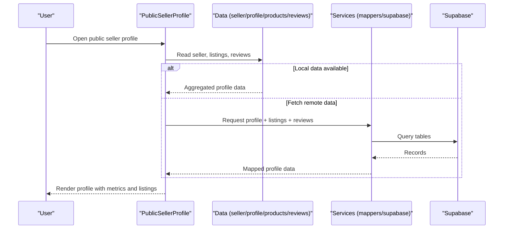
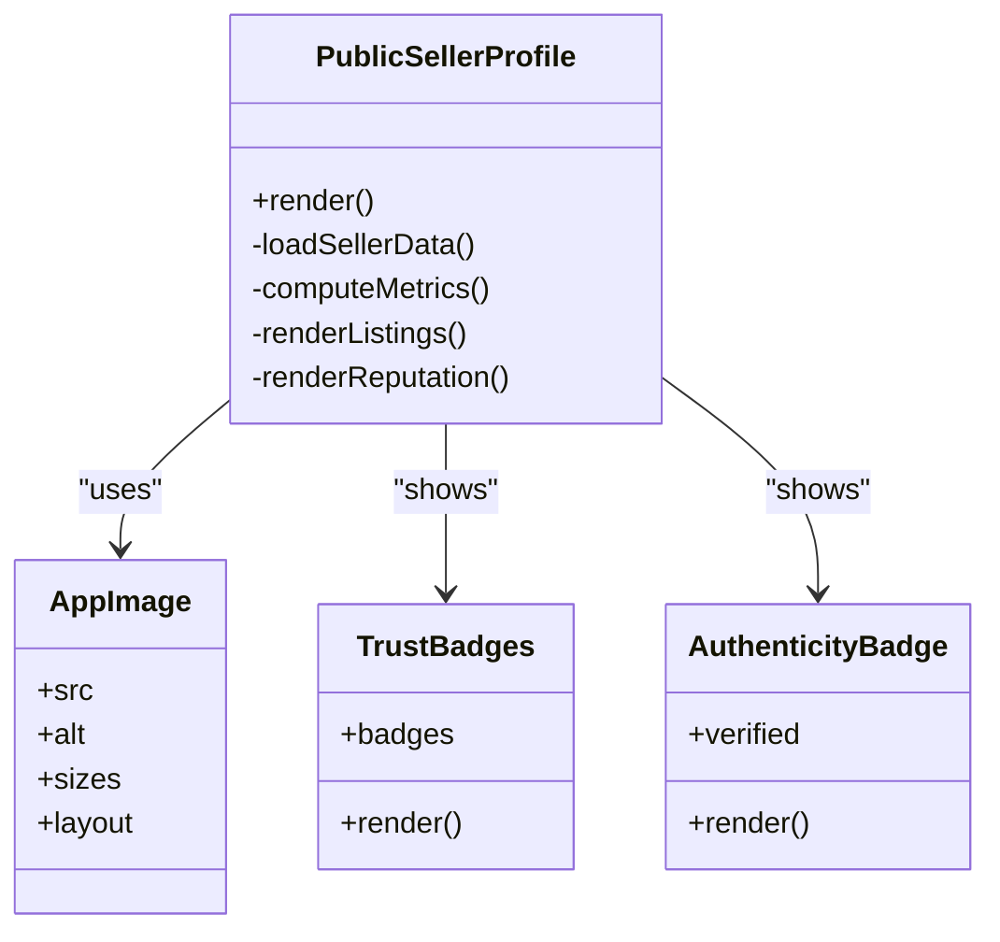
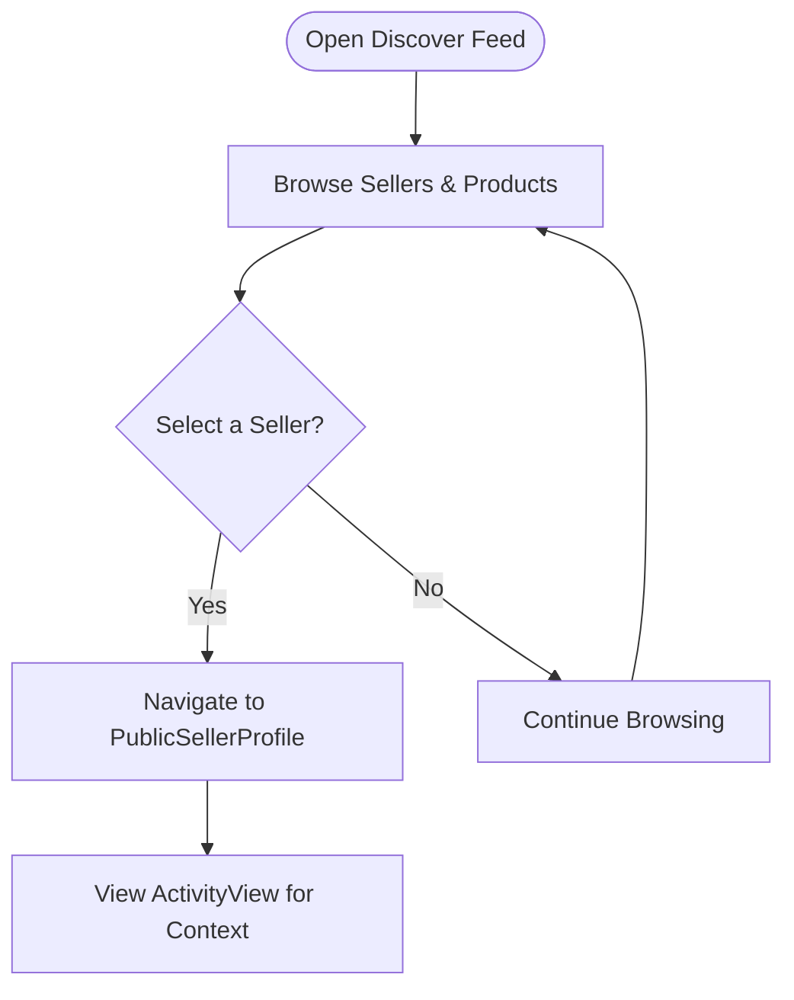
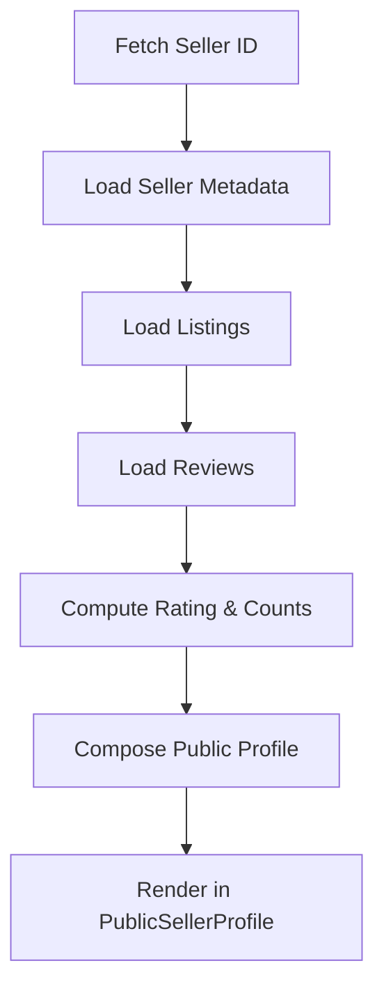
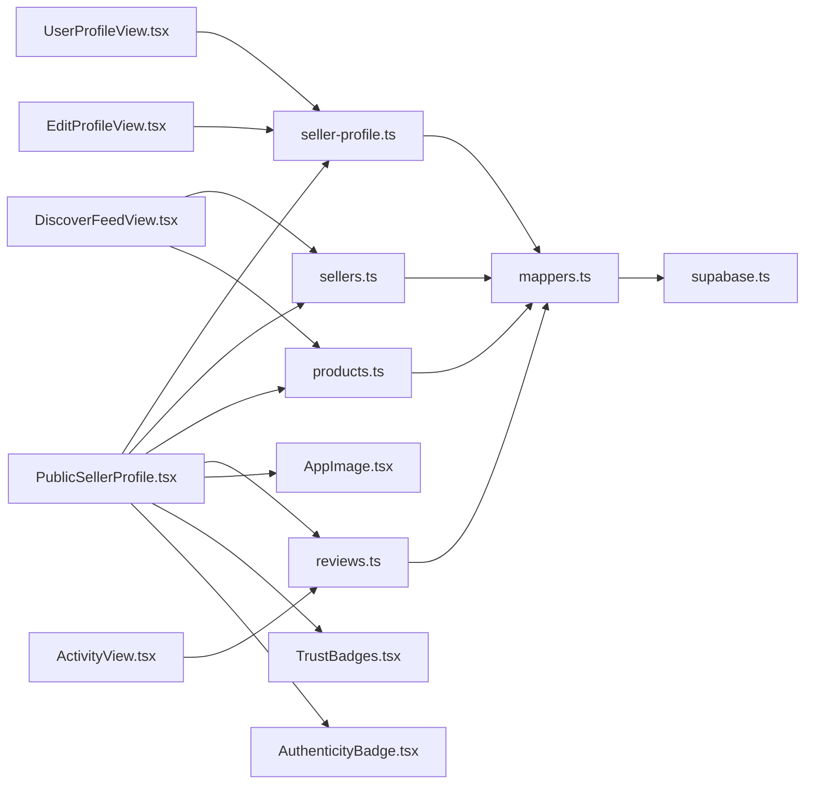

# User Discovery and Profiles

<cite>
**Referenced Files in This Document**
- [PublicSellerProfile.tsx](file://src/components/PublicSellerProfile.tsx)
- [PublicSellerProfile.test.tsx](file://src/components/PublicSellerProfile.test.tsx)
- [UserProfileView.tsx](file://src/components/UserProfileView.tsx)
- [EditProfileView.tsx](file://src/components/EditProfileView.tsx)
- [DiscoverFeedView.tsx](file://src/components/DiscoverFeedView.tsx)
- [ActivityView.tsx](file://src/components/ActivityView.tsx)
- [seller-profile.ts](file://src/data/seller-profile.ts)
- [sellers.ts](file://src/data/sellers.ts)
- [products.ts](file://src/data/products.ts)
- [reviews.ts](file://src/data/reviews.ts)
- [AppImage.tsx](file://src/components/AppImage.tsx)
- [TrustBadges.tsx](file://src/components/TrustBadges.tsx)
- [AuthenticityBadge.tsx](file://src/components/AuthenticityBadge.tsx)
- [mappers.ts](file://src/services/backend/mappers.ts)
- [supabase.ts](file://src/services/backend/supabase.ts)
- [202607150004_phase_3_public_seller_profiles.sql](file://supabase/migrations/202607150004_phase_3_public_seller_profiles.sql)
- [public-seller-profile.md](file://docs/public-seller-profile.md)
</cite>

## Table of Contents
1. [Introduction](#introduction)
2. [Project Structure](#project-structure)
3. [Core Components](#core-components)
4. [Architecture Overview](#architecture-overview)
5. [Detailed Component Analysis](#detailed-component-analysis)
6. [Dependency Analysis](#dependency-analysis)
7. [Performance Considerations](#performance-considerations)
8. [Troubleshooting Guide](#troubleshooting-guide)
9. [Conclusion](#conclusion)
10. [Appendices](#appendices)

## Introduction
This document explains how Mooday implements user discovery and public-facing seller profiles. It focuses on the PublicSellerProfile component that showcases seller information, product listings, and reputation metrics; how users manage their own profiles with privacy controls; and how buyers discover sellers, view activity, and connect through the platform. It also covers profile data aggregation, image handling, responsive design patterns, privacy controls, verification signals, and content moderation considerations for public profiles.

## Project Structure
Mooday organizes discovery and profile features across UI components, data fixtures, backend mappers, and database migrations:
- UI components render public seller profiles, user profiles, discovery feeds, and activity views.
- Data modules provide mock or seeded datasets for sellers, products, reviews, and profile attributes.
- Backend services map and fetch profile-related data from Supabase.
- Database migrations define the schema for public seller profiles and related entities.

**Diagram sources**
- [PublicSellerProfile.tsx](file://src/components/PublicSellerProfile.tsx)
- [UserProfileView.tsx](file://src/components/UserProfileView.tsx)
- [EditProfileView.tsx](file://src/components/EditProfileView.tsx)
- [DiscoverFeedView.tsx](file://src/components/DiscoverFeedView.tsx)
- [ActivityView.tsx](file://src/components/ActivityView.tsx)
- [seller-profile.ts](file://src/data/seller-profile.ts)
- [sellers.ts](file://src/data/sellers.ts)
- [products.ts](file://src/data/products.ts)
- [reviews.ts](file://src/data/reviews.ts)
- [mappers.ts](file://src/services/backend/mappers.ts)
- [supabase.ts](file://src/services/backend/supabase.ts)
- [202607150004_phase_3_public_seller_profiles.sql](file://supabase/migrations/202607150004_phase_3_public_seller_profiles.sql)

**Section sources**
- [PublicSellerProfile.tsx](file://src/components/PublicSellerProfile.tsx)
- [seller-profile.ts](file://src/data/seller-profile.ts)
- [mappers.ts](file://src/services/backend/mappers.ts)
- [supabase.ts](file://src/services/backend/supabase.ts)
- [202607150004_phase_3_public_seller_profiles.sql](file://supabase/migrations/202607150004_phase_3_public_seller_profiles.sql)

## Core Components
- PublicSellerProfile: Renders a public-facing seller page with avatar/banner, bio, location, badges, product grid, and reputation metrics (ratings, review counts). It aggregates data from multiple sources and supports responsive layouts.
- UserProfileView: Displays the current user’s private profile with editable fields and visibility toggles.
- EditProfileView: Provides form-based editing for profile details, including privacy settings and customization options.
- DiscoverFeedView: Shows a feed of sellers and products to help users discover new sellers.
- ActivityView: Presents recent seller activity such as listing updates, sales, and reviews.

Key responsibilities:
- Data aggregation: Combine seller metadata, listings, and reviews into a cohesive profile view.
- Image handling: Load and optimize avatars, banners, and product images.
- Privacy controls: Respect visibility flags to hide sensitive info from public profiles.
- Reputation display: Compute and show ratings and review summaries.

**Section sources**
- [PublicSellerProfile.tsx](file://src/components/PublicSellerProfile.tsx)
- [UserProfileView.tsx](file://src/components/UserProfileView.tsx)
- [EditProfileView.tsx](file://src/components/EditProfileView.tsx)
- [DiscoverFeedView.tsx](file://src/components/DiscoverFeedView.tsx)
- [ActivityView.tsx](file://src/components/ActivityView.tsx)

## Architecture Overview
The public seller profile is built by composing data from several layers:
- UI layer: Components render profile sections and handle interactions.
- Data layer: Modules supply seller, product, and review datasets used by components.
- Services layer: Mappers transform raw data into UI-friendly structures and fetch from Supabase when needed.
- Storage layer: Supabase stores profile records, media references, and social signals.

**Diagram sources**
- [PublicSellerProfile.tsx](file://src/components/PublicSellerProfile.tsx)
- [seller-profile.ts](file://src/data/seller-profile.ts)
- [sellers.ts](file://src/data/sellers.ts)
- [products.ts](file://src/data/products.ts)
- [reviews.ts](file://src/data/reviews.ts)
- [mappers.ts](file://src/services/backend/mappers.ts)
- [supabase.ts](file://src/services/backend/supabase.ts)

## Detailed Component Analysis

### PublicSellerProfile Component
Responsibilities:
- Display seller identity: avatar, banner, name, bio, location, and trust badges.
- Show product listings: grid of items with thumbnails, titles, and prices.
- Aggregate reputation metrics: average rating, total reviews, response indicators.
- Enforce public visibility: respect privacy flags to omit sensitive fields.
- Handle images: load optimized images for performance and responsiveness.

Implementation highlights:
- Data composition: Combines seller metadata, listings, and reviews to compute summary stats.
- Responsive layout: Adapts grid density and typography for mobile and desktop.
- Error states: Gracefully handles missing data or network failures.

**Diagram sources**
- [PublicSellerProfile.tsx](file://src/components/PublicSellerProfile.tsx)
- [AppImage.tsx](file://src/components/AppImage.tsx)
- [TrustBadges.tsx](file://src/components/TrustBadges.tsx)
- [AuthenticityBadge.tsx](file://src/components/AuthenticityBadge.tsx)

**Section sources**
- [PublicSellerProfile.tsx](file://src/components/PublicSellerProfile.tsx)
- [AppImage.tsx](file://src/components/AppImage.tsx)
- [TrustBadges.tsx](file://src/components/TrustBadges.tsx)
- [AuthenticityBadge.tsx](file://src/components/AuthenticityBadge.tsx)

### User Profile Management and Visibility
- UserProfileView: Shows the logged-in user’s profile with read-only or editable sections depending on context.
- EditProfileView: Allows updating profile text, avatar/banner, and visibility toggles for public exposure.
- Privacy controls: Fields can be marked private so they are hidden from public profiles while remaining visible to the owner.

Behavioral notes:
- When editing, changes are validated before submission.
- Public visibility respects user preferences and system defaults.
- Private fields are excluded from public profile rendering.

**Section sources**
- [UserProfileView.tsx](file://src/components/UserProfileView.tsx)
- [EditProfileView.tsx](file://src/components/EditProfileView.tsx)

### Seller Discovery and Activity
- DiscoverFeedView: Curates a feed of sellers and products to encourage exploration.
- ActivityView: Displays recent actions like listing updates, sales, and reviews to build trust and engagement.

Flow of discovery:
- Users browse the discover feed to find sellers.
- Clicking a seller navigates to their public profile.
- ActivityView provides context about seller reliability and engagement.

**Diagram sources**
- [DiscoverFeedView.tsx](file://src/components/DiscoverFeedView.tsx)
- [PublicSellerProfile.tsx](file://src/components/PublicSellerProfile.tsx)
- [ActivityView.tsx](file://src/components/ActivityView.tsx)

**Section sources**
- [DiscoverFeedView.tsx](file://src/components/DiscoverFeedView.tsx)
- [ActivityView.tsx](file://src/components/ActivityView.tsx)

### Profile Data Aggregation and Metrics
Aggregation logic:
- Collect seller metadata, listings, and reviews.
- Compute average rating and review counts.
- Surface trust signals via badges and authenticity indicators.

Data sources:
- seller-profile.ts: Core profile attributes and visibility flags.
- sellers.ts: Additional seller context and identifiers.
- products.ts: Listings linked to the seller.
- reviews.ts: Ratings and comments used for reputation metrics.

Service mapping:
- mappers.ts transforms raw records into UI-ready structures.
- supabase.ts performs queries when local data is insufficient.

**Diagram sources**
- [seller-profile.ts](file://src/data/seller-profile.ts)
- [sellers.ts](file://src/data/sellers.ts)
- [products.ts](file://src/data/products.ts)
- [reviews.ts](file://src/data/reviews.ts)
- [mappers.ts](file://src/services/backend/mappers.ts)
- [supabase.ts](file://src/services/backend/supabase.ts)

**Section sources**
- [seller-profile.ts](file://src/data/seller-profile.ts)
- [sellers.ts](file://src/data/sellers.ts)
- [products.ts](file://src/data/products.ts)
- [reviews.ts](file://src/data/reviews.ts)
- [mappers.ts](file://src/services/backend/mappers.ts)
- [supabase.ts](file://src/services/backend/supabase.ts)

### Image Handling and Responsive Design
- AppImage centralizes image loading, sizing, and optimization for avatars, banners, and product photos.
- Responsive patterns ensure optimal display across devices, using adaptive grids and scalable typography.
- Fallbacks and placeholders improve perceived performance when images fail to load.

Best practices:
- Use appropriate aspect ratios for banners and avatars.
- Provide meaningful alt text for accessibility.
- Defer non-critical images to improve initial load time.

**Section sources**
- [AppImage.tsx](file://src/components/AppImage.tsx)
- [PublicSellerProfile.tsx](file://src/components/PublicSellerProfile.tsx)

### Privacy Controls, Verification, and Moderation
Privacy controls:
- Visibility toggles allow sellers to control what appears on public profiles.
- Private fields are excluded from public rendering paths.

Verification:
- TrustBadges and AuthenticityBadge communicate verified status and platform endorsements.
- These signals are derived from seller attributes and platform checks.

Moderation:
- Public profiles should enforce content guidelines for bios and display names.
- Reports and blocks can be surfaced to protect users from harmful content.

Operational guidance:
- Validate inputs during profile edits.
- Sanitize displayed text to prevent injection.
- Provide clear reporting mechanisms for inappropriate content.

**Section sources**
- [EditProfileView.tsx](file://src/components/EditProfileView.tsx)
- [TrustBadges.tsx](file://src/components/TrustBadges.tsx)
- [AuthenticityBadge.tsx](file://src/components/AuthenticityBadge.tsx)

## Dependency Analysis
Components depend on data modules and services to assemble profile views:
- PublicSellerProfile depends on seller, product, and review data, plus image and badge components.
- UserProfileView and EditProfileView rely on seller-profile data and service mappings.
- DiscoverFeedView uses seller and product catalogs to populate feeds.
- ActivityView consumes review and listing activity data.

**Diagram sources**
- [PublicSellerProfile.tsx](file://src/components/PublicSellerProfile.tsx)
- [seller-profile.ts](file://src/data/seller-profile.ts)
- [sellers.ts](file://src/data/sellers.ts)
- [products.ts](file://src/data/products.ts)
- [reviews.ts](file://src/data/reviews.ts)
- [AppImage.tsx](file://src/components/AppImage.tsx)
- [TrustBadges.tsx](file://src/components/TrustBadges.tsx)
- [AuthenticityBadge.tsx](file://src/components/AuthenticityBadge.tsx)
- [UserProfileView.tsx](file://src/components/UserProfileView.tsx)
- [EditProfileView.tsx](file://src/components/EditProfileView.tsx)
- [DiscoverFeedView.tsx](file://src/components/DiscoverFeedView.tsx)
- [ActivityView.tsx](file://src/components/ActivityView.tsx)
- [mappers.ts](file://src/services/backend/mappers.ts)
- [supabase.ts](file://src/services/backend/supabase.ts)

**Section sources**
- [PublicSellerProfile.tsx](file://src/components/PublicSellerProfile.tsx)
- [seller-profile.ts](file://src/data/seller-profile.ts)
- [mappers.ts](file://src/services/backend/mappers.ts)
- [supabase.ts](file://src/services/backend/supabase.ts)

## Performance Considerations
- Lazy-load images and defer non-critical assets to reduce initial payload.
- Cache profile data client-side where possible to avoid repeated network calls.
- Paginate listings and reviews to keep rendering fast on large profiles.
- Use efficient grid layouts and avoid reflows by stabilizing image dimensions.
- Minimize recomputation of metrics by memoizing aggregated values.

[No sources needed since this section provides general guidance]

## Troubleshooting Guide
Common issues and resolutions:
- Missing profile data: Verify seller ID resolution and fallback to default state; check service mappings and Supabase queries.
- Image loading failures: Ensure correct URLs and fallbacks; validate storage permissions and CDN availability.
- Inconsistent metrics: Confirm review aggregation logic and cache invalidation after updates.
- Privacy leaks: Audit public rendering paths to ensure private fields are excluded.

Validation and testing:
- Use unit tests for profile components to assert rendering behavior under various data states.
- Run integration checks against mocked services to verify data flow.

**Section sources**
- [PublicSellerProfile.test.tsx](file://src/components/PublicSellerProfile.test.tsx)

## Conclusion
Mooday’s user discovery and profile features center around a robust PublicSellerProfile that aggregates seller data, listings, and reputation metrics while respecting privacy and delivering a responsive experience. Complementary components enable profile management, discovery, and activity viewing. The architecture leverages modular data sources, service mappers, and Supabase-backed storage to deliver reliable, scalable profile experiences. Adhering to best practices for image handling, performance, and moderation ensures a trustworthy and engaging marketplace.

[No sources needed since this section summarizes without analyzing specific files]

## Appendices

### Database Schema for Public Seller Profiles
The public seller profiles feature is backed by a dedicated migration that defines the necessary tables and relationships for storing and serving public profile data.

**Section sources**
- [202607150004_phase_3_public_seller_profiles.sql](file://supabase/migrations/202607150004_phase_3_public_seller_profiles.sql)

### Design and UX References
For additional guidance on public seller profile design and behavior, refer to the project documentation.

**Section sources**
- [public-seller-profile.md](file://docs/public-seller-profile.md)