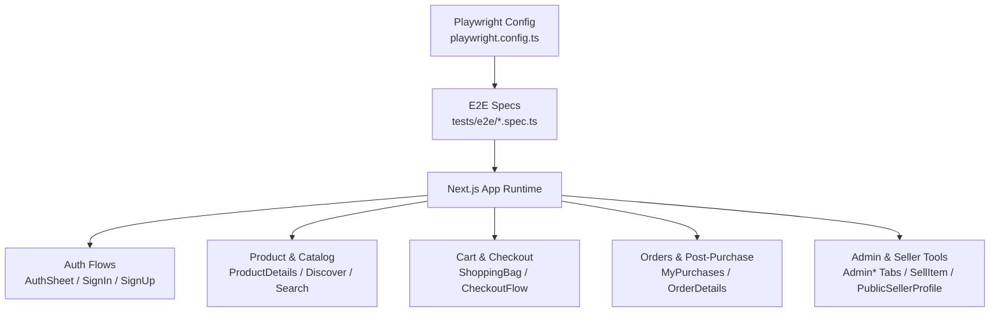
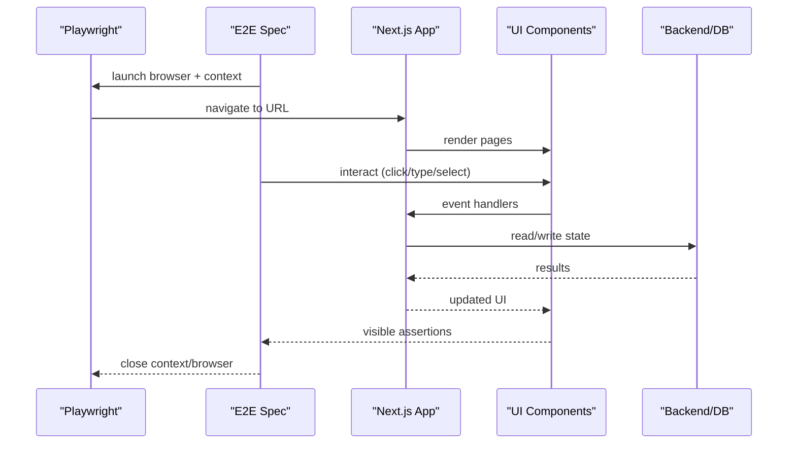
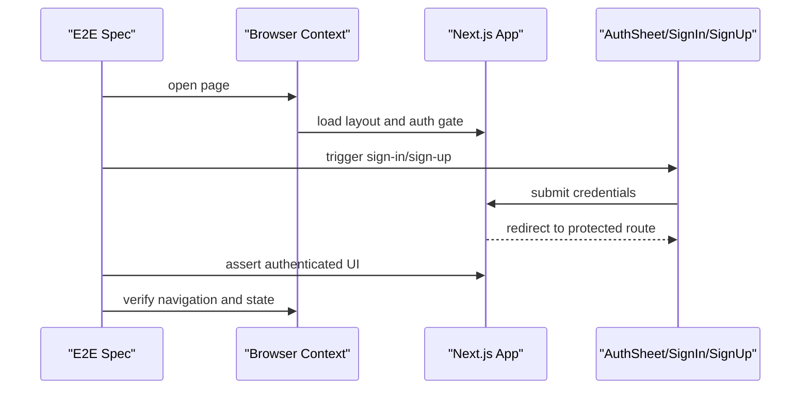
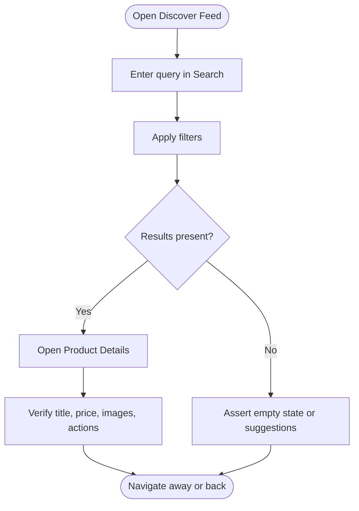
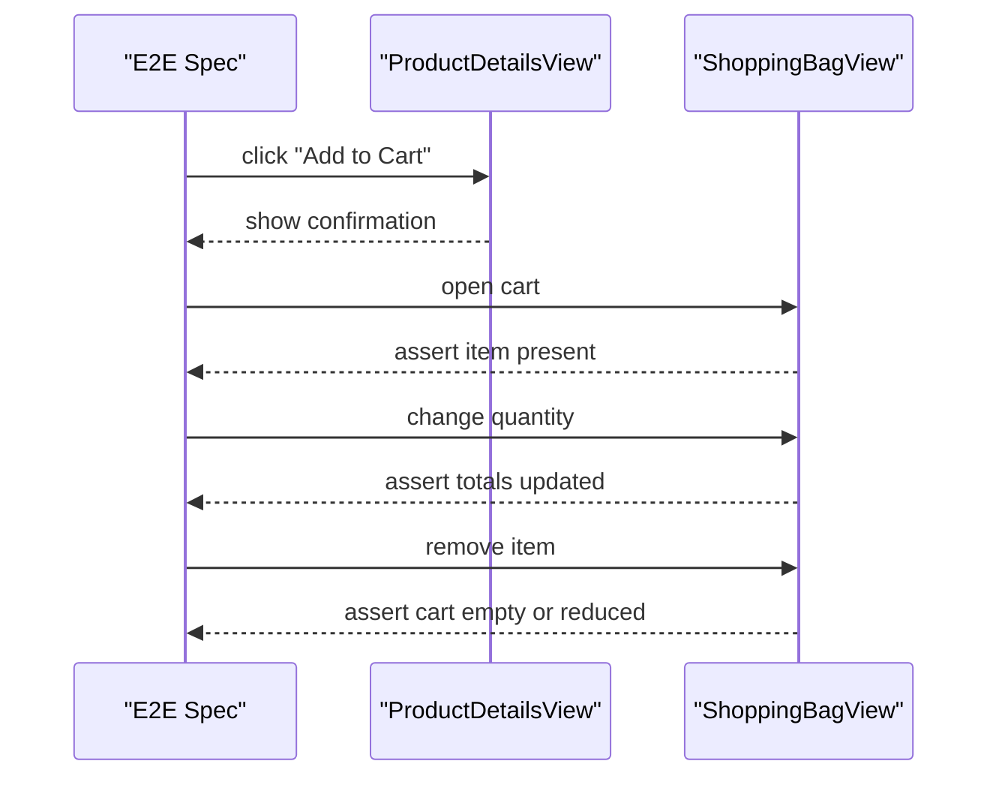
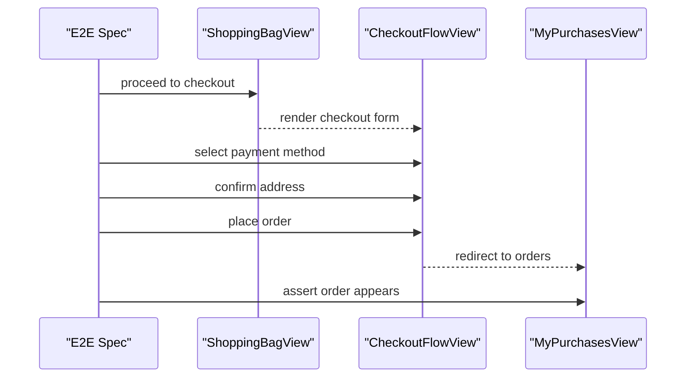
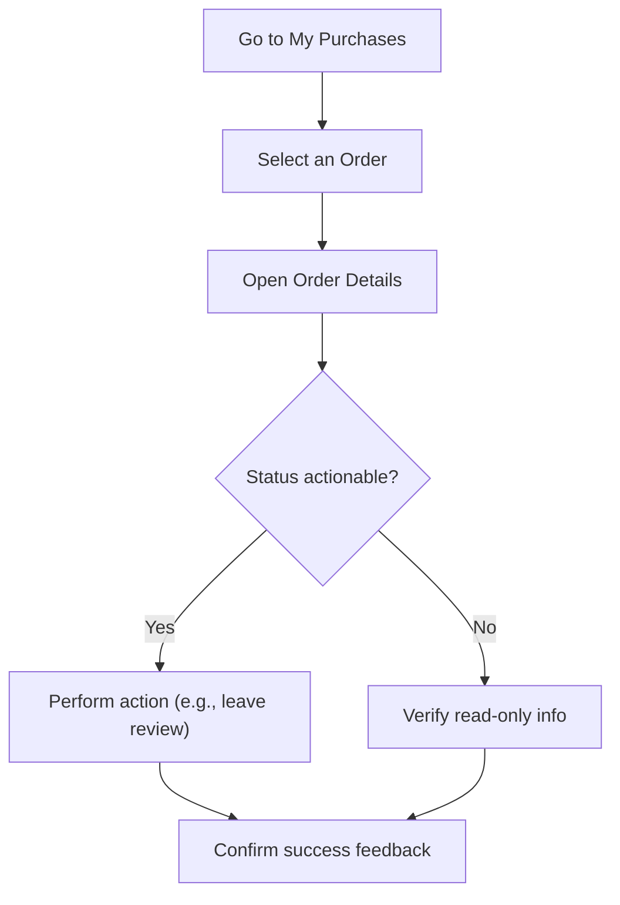
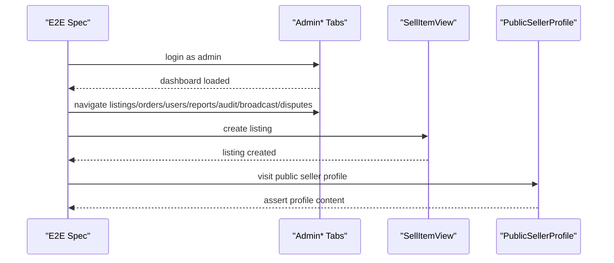
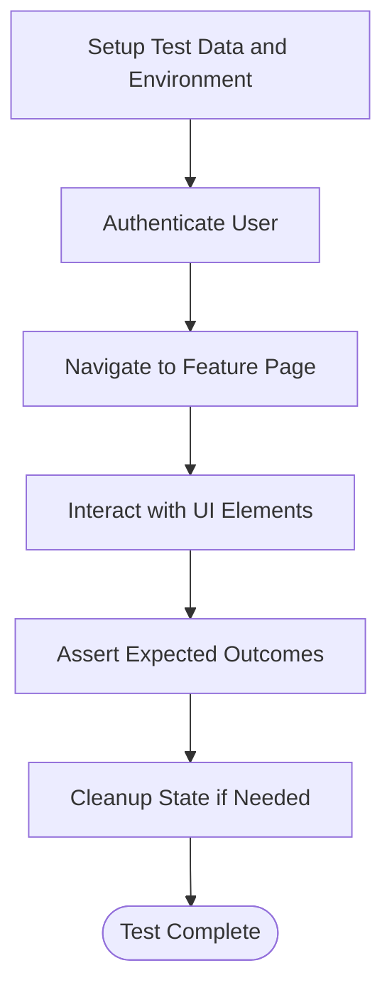
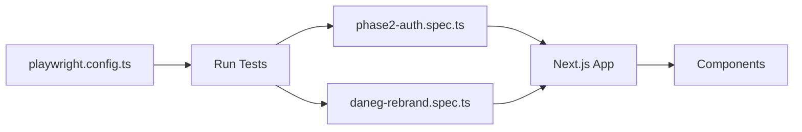

# End-to-End Testing with Playwright

<cite>
**Referenced Files in This Document**
- [playwright.config.ts](file://playwright.config.ts)
- [package.json](file://package.json)
- [tests/e2e/phase2-auth.spec.ts](file://tests/e2e/phase2-auth.spec.ts)
- [tests/e2e/daneg-rebrand.spec.ts](file://tests/e2e/daneg-rebrand.spec.ts)
- [src/app/layout.tsx](file://src/app/layout.tsx)
- [src/components/AuthSheet.tsx](file://src/components/AuthSheet.tsx)
- [src/components/SignInView.tsx](file://src/components/SignInView.tsx)
- [src/components/SignUpView.tsx](file://src/components/SignUpView.tsx)
- [src/components/ProductDetailsView.tsx](file://src/components/ProductDetailsView.tsx)
- [src/components/ShoppingBagView.tsx](file://src/components/ShoppingBagView.tsx)
- [src/components/CheckoutFlowView.tsx](file://src/components/CheckoutFlowView.tsx)
- [src/components/MyPurchasesView.tsx](file://src/components/MyPurchasesView.tsx)
- [src/components/OrderDetailsView.tsx](file://src/components/OrderDetailsView.tsx)
- [src/components/DiscoverFeedView.tsx](file://src/components/DiscoverFeedView.tsx)
- [src/components/SearchFiltersView.tsx](file://src/components/SearchFiltersView.tsx)
- [src/components/SellItemView.tsx](file://src/components/SellItemView.tsx)
- [src/components/PublicSellerProfile.tsx](file://src/components/PublicSellerProfile.tsx)
- [src/components/SettingsView.tsx](file://src/components/SettingsView.tsx)
- [src/components/HelpSupportView.tsx](file://src/components/HelpSupportView.tsx)
- [src/components/NotificationsCentreView.tsx](file://src/components/NotificationsCentreView.tsx)
- [src/components/BlockedUsersView.tsx](file://src/components/BlockedUsersView.tsx)
- [src/components/DisputesListView.tsx](file://src/components/DisputesListView.tsx)
- [src/components/PayoutsView.tsx](file://src/components/PayoutsView.tsx)
- [src/components/MySalesView.tsx](file://src/components/MySalesView.tsx)
- [src/components/MyReviewsView.tsx](file://src/components/MyReviewsView.tsx)
- [src/components/EditListingView.tsx](file://src/components/EditListingView.tsx)
- [src/components/LeaveReviewView.tsx](file://src/components/LeaveReviewView.tsx)
- [src/components/ReportView.tsx](file://src/components/ReportView.tsx)
- [src/components/SecuritySetupView.tsx](file://src/components/SecuritySetupView.tsx)
- [src/components/SavedAddressesView.tsx](file://src/components/SavedAddressesView.tsx)
- [src/components/SavedPaymentMethodsView.tsx](file://src/components/SavedPaymentMethodsView.tsx)
- [src/components/AdminOverviewTab.tsx](file://src/components/admin/AdminOverviewTab.tsx)
- [src/components/admin/AdminListingsTab.tsx](file://src/components/admin/AdminListingsTab.tsx)
- [src/components/admin/AdminOrdersTab.tsx](file://src/components/admin/AdminOrdersTab.tsx)
- [src/components/admin/AdminUsersTab.tsx](file://src/components/admin/AdminUsersTab.tsx)
- [src/components/admin/AdminReportsTab.tsx](file://src/components/admin/AdminReportsTab.tsx)
- [src/components/admin/AdminAuditLogTab.tsx](file://src/components/admin/AdminAuditLogTab.tsx)
- [src/components/admin/AdminBroadcastTab.tsx](file://src/components/admin/AdminBroadcastTab.tsx)
- [src/components/admin/AdminDisputesTab.tsx](file://src/components/admin/AdminDisputesTab.tsx)
</cite>

## Table of Contents
1. [Introduction](#introduction)
2. [Project Structure](#project-structure)
3. [Core Components](#core-components)
4. [Architecture Overview](#architecture-overview)
5. [Detailed Component Analysis](#detailed-component-analysis)
6. [Dependency Analysis](#dependency-analysis)
7. [Performance Considerations](#performance-considerations)
8. [Troubleshooting Guide](#troubleshooting-guide)
9. [Conclusion](#conclusion)
10. [Appendices](#appendices)

## Introduction
This document provides comprehensive end-to-end (E2E) testing guidance for the Mooday marketplace using Playwright. It covers test configuration, browser automation setup, page object patterns, and full user flow coverage including authentication, product browsing, shopping cart operations, checkout, and order management. It also addresses cross-browser testing, mobile emulation, responsive design verification, test data management, environment variables, isolation strategies, visual regression, accessibility, performance testing, parallelization, retries, reporting, complex scenarios, error handling tests, and debugging techniques.

## Project Structure
The repository includes a Playwright configuration file at the root and E2E specs under tests/e2e. The application is a Next.js app with components organized by feature. Tests should interact with the running Next.js instance and assert on UI elements exposed by these components.

**Diagram sources**
- [playwright.config.ts:1-200](file://playwright.config.ts#L1-L200)
- [tests/e2e/phase2-auth.spec.ts:1-200](file://tests/e2e/phase2-auth.spec.ts#L1-L200)
- [tests/e2e/daneg-rebrand.spec.ts:1-200](file://tests/e2e/daneg-rebrand.spec.ts#L1-L200)

**Section sources**
- [playwright.config.ts:1-200](file://playwright.config.ts#L1-L200)
- [tests/e2e/phase2-auth.spec.ts:1-200](file://tests/e2e/phase2-auth.spec.ts#L1-L200)
- [tests/e2e/daneg-rebrand.spec.ts:1-200](file://tests/e2e/daneg-rebrand.spec.ts#L1-L200)

## Core Components
This section outlines the key areas to cover in E2E tests and how they map to application components.

- Authentication
  - Entry points: AuthSheet, SignInView, SignUpView
  - Typical flows: sign-in, sign-up, password reset, session persistence across pages
- Product Browsing
  - Entry points: DiscoverFeedView, ProductDetailsView, SearchFiltersView
  - Typical flows: discover feed, search with filters, view product details
- Shopping Cart
  - Entry points: ShoppingBagView
  - Typical flows: add to cart, update quantities, remove items
- Checkout
  - Entry points: CheckoutFlowView
  - Typical flows: payment selection, address confirmation, order placement
- Orders and Post-Purchase
  - Entry points: MyPurchasesView, OrderDetailsView
  - Typical flows: list orders, view order details, track status changes
- Admin and Seller Features
  - Entry points: Admin* tabs, SellItemView, PublicSellerProfile
  - Typical flows: admin overview/listings/orders/users/reports/audit/broadcast/disputes; seller listing creation; public profile viewing
- User Settings and Support
  - Entry points: SettingsView, HelpSupportView, NotificationsCentreView, BlockedUsersView, PayoutsView, MySalesView, MyReviewsView, EditListingView, LeaveReviewView, ReportView, SecuritySetupView, SavedAddressesView, SavedPaymentMethodsView

**Section sources**
- [src/components/AuthSheet.tsx:1-200](file://src/components/AuthSheet.tsx#L1-L200)
- [src/components/SignInView.tsx:1-200](file://src/components/SignInView.tsx#L1-L200)
- [src/components/SignUpView.tsx:1-200](file://src/components/SignUpView.tsx#L1-L200)
- [src/components/DiscoverFeedView.tsx:1-200](file://src/components/DiscoverFeedView.tsx#L1-L200)
- [src/components/ProductDetailsView.tsx:1-200](file://src/components/ProductDetailsView.tsx#L1-L200)
- [src/components/SearchFiltersView.tsx:1-200](file://src/components/SearchFiltersView.tsx#L1-L200)
- [src/components/ShoppingBagView.tsx:1-200](file://src/components/ShoppingBagView.tsx#L1-L200)
- [src/components/CheckoutFlowView.tsx:1-200](file://src/components/CheckoutFlowView.tsx#L1-L200)
- [src/components/MyPurchasesView.tsx:1-200](file://src/components/MyPurchasesView.tsx#L1-L200)
- [src/components/OrderDetailsView.tsx:1-200](file://src/components/OrderDetailsView.tsx#L1-L200)
- [src/components/SellItemView.tsx:1-200](file://src/components/SellItemView.tsx#L1-L200)
- [src/components/PublicSellerProfile.tsx:1-200](file://src/components/PublicSellerProfile.tsx#L1-L200)
- [src/components/SettingsView.tsx:1-200](file://src/components/SettingsView.tsx#L1-L200)
- [src/components/HelpSupportView.tsx:1-200](file://src/components/HelpSupportView.tsx#L1-L200)
- [src/components/NotificationsCentreView.tsx:1-200](file://src/components/NotificationsCentreView.tsx#L1-L200)
- [src/components/BlockedUsersView.tsx:1-200](file://src/components/BlockedUsersView.tsx#L1-L200)
- [src/components/DisputesListView.tsx:1-200](file://src/components/DisputesListView.tsx#L1-L200)
- [src/components/PayoutsView.tsx:1-200](file://src/components/PayoutsView.tsx#L1-L200)
- [src/components/MySalesView.tsx:1-200](file://src/components/MySalesView.tsx#L1-L200)
- [src/components/MyReviewsView.tsx:1-200](file://src/components/MyReviewsView.tsx#L1-L200)
- [src/components/EditListingView.tsx:1-200](file://src/components/EditListingView.tsx#L1-L200)
- [src/components/LeaveReviewView.tsx:1-200](file://src/components/LeaveReviewView.tsx#L1-L200)
- [src/components/ReportView.tsx:1-200](file://src/components/ReportView.tsx#L1-L200)
- [src/components/SecuritySetupView.tsx:1-200](file://src/components/SecuritySetupView.tsx#L1-L200)
- [src/components/SavedAddressesView.tsx:1-200](file://src/components/SavedAddressesView.tsx#L1-L200)
- [src/components/SavedPaymentMethodsView.tsx:1-200](file://src/components/SavedPaymentMethodsView.tsx#L1-L200)
- [src/components/admin/AdminOverviewTab.tsx:1-200](file://src/components/admin/AdminOverviewTab.tsx#L1-L200)
- [src/components/admin/AdminListingsTab.tsx:1-200](file://src/components/admin/AdminListingsTab.tsx#L1-L200)
- [src/components/admin/AdminOrdersTab.tsx:1-200](file://src/components/admin/AdminOrdersTab.tsx#L1-L200)
- [src/components/admin/AdminUsersTab.tsx:1-200](file://src/components/admin/AdminUsersTab.tsx#L1-L200)
- [src/components/admin/AdminReportsTab.tsx:1-200](file://src/components/admin/AdminReportsTab.tsx#L1-L200)
- [src/components/admin/AdminAuditLogTab.tsx:1-200](file://src/components/admin/AdminAuditLogTab.tsx#L1-L200)
- [src/components/admin/AdminBroadcastTab.tsx:1-200](file://src/components/admin/AdminBroadcastTab.tsx#L1-L200)
- [src/components/admin/AdminDisputesTab.tsx:1-200](file://src/components/admin/AdminDisputesTab.tsx#L1-L200)

## Architecture Overview
The E2E architecture centers around Playwright orchestrating a real browser against the deployed or locally running Next.js app. Specs drive user journeys through UI interactions and assertions.

**Diagram sources**
- [playwright.config.ts:1-200](file://playwright.config.ts#L1-L200)
- [tests/e2e/phase2-auth.spec.ts:1-200](file://tests/e2e/phase2-auth.spec.ts#L1-L200)
- [src/app/layout.tsx:1-200](file://src/app/layout.tsx#L1-L200)

## Detailed Component Analysis

### Authentication Flow
Covers sign-in, sign-up, and session continuity across routes.

**Diagram sources**
- [src/components/AuthSheet.tsx:1-200](file://src/components/AuthSheet.tsx#L1-L200)
- [src/components/SignInView.tsx:1-200](file://src/components/SignInView.tsx#L1-L200)
- [src/components/SignUpView.tsx:1-200](file://src/components/SignUpView.tsx#L1-L200)
- [tests/e2e/phase2-auth.spec.ts:1-200](file://tests/e2e/phase2-auth.spec.ts#L1-L200)

**Section sources**
- [tests/e2e/phase2-auth.spec.ts:1-200](file://tests/e2e/phase2-auth.spec.ts#L1-L200)
- [src/components/AuthSheet.tsx:1-200](file://src/components/AuthSheet.tsx#L1-L200)
- [src/components/SignInView.tsx:1-200](file://src/components/SignInView.tsx#L1-L200)
- [src/components/SignUpView.tsx:1-200](file://src/components/SignUpView.tsx#L1-L200)

### Product Browsing and Search
Covers discover feed, search filters, and product detail views.

**Diagram sources**
- [src/components/DiscoverFeedView.tsx:1-200](file://src/components/DiscoverFeedView.tsx#L1-L200)
- [src/components/SearchFiltersView.tsx:1-200](file://src/components/SearchFiltersView.tsx#L1-L200)
- [src/components/ProductDetailsView.tsx:1-200](file://src/components/ProductDetailsView.tsx#L1-L200)

**Section sources**
- [src/components/DiscoverFeedView.tsx:1-200](file://src/components/DiscoverFeedView.tsx#L1-L200)
- [src/components/SearchFiltersView.tsx:1-200](file://src/components/SearchFiltersView.tsx#L1-L200)
- [src/components/ProductDetailsView.tsx:1-200](file://src/components/ProductDetailsView.tsx#L1-L200)

### Shopping Cart Operations
Covers adding items, updating quantities, and removing items.

**Diagram sources**
- [src/components/ProductDetailsView.tsx:1-200](file://src/components/ProductDetailsView.tsx#L1-L200)
- [src/components/ShoppingBagView.tsx:1-200](file://src/components/ShoppingBagView.tsx#L1-L200)

**Section sources**
- [src/components/ShoppingBagView.tsx:1-200](file://src/components/ShoppingBagView.tsx#L1-L200)
- [src/components/ProductDetailsView.tsx:1-200](file://src/components/ProductDetailsView.tsx#L1-L200)

### Checkout Process
Covers payment selection, address confirmation, and order placement.

**Diagram sources**
- [src/components/ShoppingBagView.tsx:1-200](file://src/components/ShoppingBagView.tsx#L1-L200)
- [src/components/CheckoutFlowView.tsx:1-200](file://src/components/CheckoutFlowView.tsx#L1-L200)
- [src/components/MyPurchasesView.tsx:1-200](file://src/components/MyPurchasesView.tsx#L1-L200)

**Section sources**
- [src/components/CheckoutFlowView.tsx:1-200](file://src/components/CheckoutFlowView.tsx#L1-L200)
- [src/components/MyPurchasesView.tsx:1-200](file://src/components/MyPurchasesView.tsx#L1-L200)

### Order Management
Covers viewing order details and post-purchase actions.

**Diagram sources**
- [src/components/MyPurchasesView.tsx:1-200](file://src/components/MyPurchasesView.tsx#L1-L200)
- [src/components/OrderDetailsView.tsx:1-200](file://src/components/OrderDetailsView.tsx#L1-L200)
- [src/components/LeaveReviewView.tsx:1-200](file://src/components/LeaveReviewView.tsx#L1-L200)

**Section sources**
- [src/components/MyPurchasesView.tsx:1-200](file://src/components/MyPurchasesView.tsx#L1-L200)
- [src/components/OrderDetailsView.tsx:1-200](file://src/components/OrderDetailsView.tsx#L1-L200)
- [src/components/LeaveReviewView.tsx:1-200](file://src/components/LeaveReviewView.tsx#L1-L200)

### Admin and Seller Scenarios
Covers admin dashboards and seller workflows.

**Diagram sources**
- [src/components/admin/AdminOverviewTab.tsx:1-200](file://src/components/admin/AdminOverviewTab.tsx#L1-L200)
- [src/components/admin/AdminListingsTab.tsx:1-200](file://src/components/admin/AdminListingsTab.tsx#L1-L200)
- [src/components/admin/AdminOrdersTab.tsx:1-200](file://src/components/admin/AdminOrdersTab.tsx#L1-L200)
- [src/components/admin/AdminUsersTab.tsx:1-200](file://src/components/admin/AdminUsersTab.tsx#L1-L200)
- [src/components/admin/AdminReportsTab.tsx:1-200](file://src/components/admin/AdminReportsTab.tsx#L1-L200)
- [src/components/admin/AdminAuditLogTab.tsx:1-200](file://src/components/admin/AdminAuditLogTab.tsx#L1-L200)
- [src/components/admin/AdminBroadcastTab.tsx:1-200](file://src/components/admin/AdminBroadcastTab.tsx#L1-L200)
- [src/components/admin/AdminDisputesTab.tsx:1-200](file://src/components/admin/AdminDisputesTab.tsx#L1-L200)
- [src/components/SellItemView.tsx:1-200](file://src/components/SellItemView.tsx#L1-L200)
- [src/components/PublicSellerProfile.tsx:1-200](file://src/components/PublicSellerProfile.tsx#L1-L200)

**Section sources**
- [src/components/admin/AdminOverviewTab.tsx:1-200](file://src/components/admin/AdminOverviewTab.tsx#L1-L200)
- [src/components/admin/AdminListingsTab.tsx:1-200](file://src/components/admin/AdminListingsTab.tsx#L1-L200)
- [src/components/admin/AdminOrdersTab.tsx:1-200](file://src/components/admin/AdminOrdersTab.tsx#L1-L200)
- [src/components/admin/AdminUsersTab.tsx:1-200](file://src/components/admin/AdminUsersTab.tsx#L1-L200)
- [src/components/admin/AdminReportsTab.tsx:1-200](file://src/components/admin/AdminReportsTab.tsx#L1-L200)
- [src/components/admin/AdminAuditLogTab.tsx:1-200](file://src/components/admin/AdminAuditLogTab.tsx#L1-L200)
- [src/components/admin/AdminBroadcastTab.tsx:1-200](file://src/components/admin/AdminBroadcastTab.tsx#L1-L200)
- [src/components/admin/AdminDisputesTab.tsx:1-200](file://src/components/admin/AdminDisputesTab.tsx#L1-L200)
- [src/components/SellItemView.tsx:1-200](file://src/components/SellItemView.tsx#L1-L200)
- [src/components/PublicSellerProfile.tsx:1-200](file://src/components/PublicSellerProfile.tsx#L1-L200)

### Conceptual Overview
Conceptual E2E workflow that can be adapted to any feature area.

[No sources needed since this diagram shows conceptual workflow, not actual code structure]

## Dependency Analysis
Playwright depends on the configured browsers and the running Next.js application. Specs import from the test directory and rely on the config for timeouts, workers, and reporters.

**Diagram sources**
- [playwright.config.ts:1-200](file://playwright.config.ts#L1-L200)
- [tests/e2e/phase2-auth.spec.ts:1-200](file://tests/e2e/phase2-auth.spec.ts#L1-L200)
- [tests/e2e/daneg-rebrand.spec.ts:1-200](file://tests/e2e/daneg-rebrand.spec.ts#L1-L200)

**Section sources**
- [playwright.config.ts:1-200](file://playwright.config.ts#L1-L200)
- [tests/e2e/phase2-auth.spec.ts:1-200](file://tests/e2e/phase2-auth.spec.ts#L1-L200)
- [tests/e2e/daneg-rebrand.spec.ts:1-200](file://tests/e2e/daneg-rebrand.spec.ts#L1-L200)

## Performance Considerations
- Use consistent viewport sizes and device emulators to avoid flaky timing issues.
- Prefer explicit waits and element visibility checks over sleeps.
- Isolate heavy operations (e.g., image uploads) into dedicated tests to reduce overall runtime.
- Leverage parallel execution with careful test isolation to maximize throughput.
- Capture performance metrics via Playwright’s built-in tracing and network interception where appropriate.

[No sources needed since this section provides general guidance]

## Troubleshooting Guide
Common issues and resolutions:
- Navigation failures: ensure base URL is correct and the app is fully loaded before interacting.
- Stale elements: re-query DOM after async updates; use stable selectors tied to component IDs or accessible names.
- Timeouts: increase global timeouts only when necessary; prefer targeted waits.
- Cross-browser differences: run in Chromium, Firefox, and WebKit; isolate platform-specific assertions.
- Visual regressions: capture screenshots and compare baselines; investigate diffs for layout shifts.
- Accessibility: validate keyboard navigation and ARIA attributes; fix violations early.

**Section sources**
- [playwright.config.ts:1-200](file://playwright.config.ts#L1-L200)
- [tests/e2e/phase2-auth.spec.ts:1-200](file://tests/e2e/phase2-auth.spec.ts#L1-L200)
- [tests/e2e/daneg-rebrand.spec.ts:1-200](file://tests/e2e/daneg-rebrand.spec.ts#L1-L200)

## Conclusion
By structuring tests around clear user flows, leveraging Playwright’s robust browser automation, and aligning assertions with component boundaries, you can build a resilient E2E suite for the Mooday marketplace. Focus on isolation, deterministic waits, and comprehensive coverage across authentication, catalog, cart, checkout, orders, and admin/seller features. Incorporate visual regression, accessibility, and performance checks to maintain quality across releases.

[No sources needed since this section summarizes without analyzing specific files]

## Appendices

### Test Configuration and Environment Variables
- Configure base URL, timeouts, workers, and reporters in the Playwright config.
- Use environment variables for secrets and endpoints; inject them into tests via process.env.
- Define per-environment configs (e.g., local vs CI) to switch behaviors.

**Section sources**
- [playwright.config.ts:1-200](file://playwright.config.ts#L1-L200)
- [package.json:1-200](file://package.json#L1-L200)

### Page Object Patterns
- Create reusable modules encapsulating selectors and actions for each feature area (auth, catalog, cart, checkout, orders, admin).
- Keep tests declarative by composing page objects to express user journeys.
- Centralize fixtures for common setup like authentication and seed data.

**Section sources**
- [tests/e2e/phase2-auth.spec.ts:1-200](file://tests/e2e/phase2-auth.spec.ts#L1-L200)
- [tests/e2e/daneg-rebrand.spec.ts:1-200](file://tests/e2e/daneg-rebrand.spec.ts#L1-L200)

### Cross-Browser and Mobile Emulation
- Run tests across Chromium, Firefox, and WebKit to catch rendering and behavior differences.
- Use device descriptors for mobile and tablet breakpoints; verify responsive layouts and touch interactions.
- Validate viewport-dependent behaviors such as menus, overlays, and media queries.

**Section sources**
- [playwright.config.ts:1-200](file://playwright.config.ts#L1-L200)

### Test Data Management and Isolation
- Seed minimal, deterministic data per test; avoid shared mutable state.
- Use unique identifiers for users, products, and orders to prevent collisions.
- Reset or rollback state between tests to ensure independence.

**Section sources**
- [playwright.config.ts:1-200](file://playwright.config.ts#L1-L200)

### Visual Regression, Accessibility, and Performance
- Capture screenshots during critical steps and compare against baselines.
- Integrate accessibility checks to enforce keyboard and screen reader compatibility.
- Record traces and network logs for performance analysis and flaky test diagnosis.

**Section sources**
- [playwright.config.ts:1-200](file://playwright.config.ts#L1-L200)

### Parallelization, Retries, and Reporting
- Enable parallel execution with worker limits tuned to your CI resources.
- Configure retries for transient failures while keeping retry counts low to preserve signal clarity.
- Generate reports and artifacts (screenshots, videos, traces) for failure investigation.

**Section sources**
- [playwright.config.ts:1-200](file://playwright.config.ts#L1-L200)

### Complex User Scenarios
- Multi-step flows: authenticate, browse, add to cart, checkout, verify order, leave review.
- Role-based flows: admin approvals, seller listing creation, public profile visits.
- Edge cases: invalid inputs, network errors, offline states, and recovery paths.

**Section sources**
- [src/components/CheckoutFlowView.tsx:1-200](file://src/components/CheckoutFlowView.tsx#L1-L200)
- [src/components/MyPurchasesView.tsx:1-200](file://src/components/MyPurchasesView.tsx#L1-L200)
- [src/components/SellItemView.tsx:1-200](file://src/components/SellItemView.tsx#L1-L200)
- [src/components/PublicSellerProfile.tsx:1-200](file://src/components/PublicSellerProfile.tsx#L1-L200)

### Error Handling Tests
- Simulate server errors and assert graceful UI responses.
- Validate validation messages and disabled states for invalid inputs.
- Ensure redirects and fallbacks occur as expected.

**Section sources**
- [src/components/SignInView.tsx:1-200](file://src/components/SignInView.tsx#L1-L200)
- [src/components/SignUpView.tsx:1-200](file://src/components/SignUpView.tsx#L1-L200)
- [src/components/CheckoutFlowView.tsx:1-200](file://src/components/CheckoutFlowView.tsx#L1-L200)

### Debugging Techniques
- Use step-through debugging and interactive mode to inspect state.
- Capture screenshots and videos on failure; enable tracing for detailed timelines.
- Log network requests and console output to identify bottlenecks and errors.

**Section sources**
- [playwright.config.ts:1-200](file://playwright.config.ts#L1-L200)