# Integration Testing

<cite>
**Referenced Files in This Document**
- [README.md](file://README.md)
- [package.json](file://package.json)
- [vitest.config.mts](file://vitest.config.mts)
- [vitest.setup.ts](file://vitest.setup.ts)
- [playwright.config.ts](file://playwright.config.ts)
- [SMOKE_TESTS.md](file://docs/SMOKE_TESTS.md)
- [phase2-auth.spec.ts](file://tests/e2e/phase2-auth.spec.ts)
- [daneg-rebrand.spec.ts](file://tests/e2e/daneg-rebrand.spec.ts)
- [route.test.ts](file://src/app/api/health/route.test.ts)
- [route.test.ts](file://src/app/api/stripe/webhook/route.test.ts)
- [supabase.ts](file://src/services/backend/supabase.ts)
- [supabase.test.ts](file://src/services/backend/supabase.test.ts)
- [realtime.test.ts](file://src/services/backend/realtime.test.ts)
- [migration.test.ts](file://src/services/backend/migration.test.ts)
- [orders-migration.test.ts](file://src/services/backend/orders-migration.test.ts)
- [listing-media-migration.test.ts](file://src/services/backend/listing-media-migration.test.ts)
- [listings-migration.test.ts](file://src/services/backend/listings-migration.test.ts)
- [social-migration.test.ts](file://src/services/backend/social-migration.test.ts)
- [user-follows-migration.test.ts](file://src/services/backend/user-follows-migration.test.ts)
- [user-likes-cart-migration.test.ts](file://src/services/backend/user-likes-cart-migration.test.ts)
- [public-seller-profiles-migration.test.ts](file://src/services/backend/public-seller-profiles-migration.test.ts)
- [admin-migration.test.ts](file://src/services/backend/admin-migration.test.ts)
- [create-payment-intent.test.ts](file://src/services/backend/create-payment-intent.test.ts)
- [config.ts](file://src/services/backend/config.ts)
- [config.test.ts](file://src/services/backend/config.test.ts)
- [mock-helpers.ts](file://src/services/backend/mock-helpers.ts)
- [mappers.ts](file://src/services/backend/mappers.ts)
- [mappers-orders.ts](file://src/services/backend/mappers-orders.ts)
- [mappers-social.ts](file://src/services/backend/mappers-social.ts)
- [index.ts](file://src/services/backend/index.ts)
- [contracts.ts](file://src/services/backend/contracts.ts)
- [apply-migrations.mjs](file://scripts/apply-migrations.mjs)
- [seed-demo-catalog.mjs](file://scripts/seed-demo-catalog.mjs)
- [phase2-smoke-supabase.mjs](file://scripts/phase2-smoke-supabase.mjs)
- [phase4-admin-actions-smoke.mjs](file://scripts/phase4-admin-actions-smoke.mjs)
- [phase4-image-upload-smoke.mjs](file://scripts/phase4-image-upload-smoke.mjs)
- [phase4-notification-fanout-smoke.mjs](file://scripts/phase4-notification-fanout-smoke.mjs)
- [phase4-public-reviews-smoke.mjs](file://scripts/phase4-public-reviews-smoke.mjs)
- [u3-u8-smoke.mjs](file://scripts/u3-u8-smoke.mjs)
- [phase_2_rls.sql](file://supabase/tests/phase_2_rls.sql)
- [phase_3_listings_rls.sql](file://supabase/tests/phase_3_listings_rls.sql)
- [phase_3_listing_media_rls.sql](file://supabase/tests/phase_3_listing_media_rls.sql)
- [phase_3_cart_items_rls.sql](file://supabase/tests/phase_3_cart_items_rls.sql)
- [phase_3_orders_rls.sql](file://supabase/tests/phase_3_orders_rls.sql)
- [phase_3_public_seller_profiles_rls.sql](file://supabase/tests/phase_3_public_seller_profiles_rls.sql)
- [phase_3_social_rls.sql](file://supabase/tests/phase_3_social_rls.sql)
- [phase_3_user_likes_rls.sql](file://supabase/tests/phase_3_user_likes_rls.sql)
- [phase_3_5_admin_rls.sql](file://supabase/tests/phase_3_5_admin_rls.sql)
- [phase_4_blocked_users_rls.sql](file://supabase/tests/phase_4_blocked_users_rls.sql)
- [phase_4_payment_methods_rls.sql](file://supabase/tests/phase_4_payment_methods_rls.sql)
</cite>

## Table of Contents
1. Introduction
2. Project Structure
3. Core Components
4. Architecture Overview
5. Detailed Component Analysis
6. Dependency Analysis
7. Performance Considerations
8. Troubleshooting Guide
9. Conclusion
10. Appendices

## Introduction
This document provides a comprehensive integration testing guide for the Mooday marketplace. It explains how to validate interactions across database operations, API endpoints, and external service integrations such as Stripe webhooks and email services. It covers Supabase testing strategies including Row-Level Security (RLS) policy validation, migration testing, and mock data setup. It also documents API integration tests for authentication, product listings, orders, and social features; third-party integrations like Stripe webhooks; smoke test scripts execution; test environment setup; database isolation strategies; asynchronous and real-time feature testing; transaction handling; common integration test scenarios; and troubleshooting approaches for integration failures.

## Project Structure
The project organizes integration tests across multiple layers:
- Unit and integration tests under src/services/backend using Vitest
- E2E tests under tests/e2e using Playwright
- Supabase RLS tests under supabase/tests as SQL scripts
- Smoke test scripts under scripts for end-to-end validation against live or staging environments
- Configuration files for test runners and environment setup

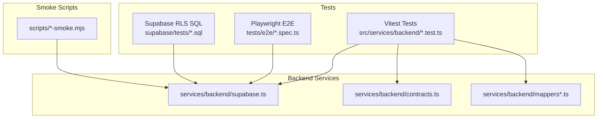

**Diagram sources**
- [vitest.config.mts:1-200](file://vitest.config.mts#L1-L200)
- [playwright.config.ts:1-200](file://playwright.config.ts#L1-L200)
- [supabase.ts:1-200](file://src/services/backend/supabase.ts#L1-L200)
- [contracts.ts:1-200](file://src/services/backend/contracts.ts#L1-L200)
- [mappers.ts:1-200](file://src/services/backend/mappers.ts#L1-L200)
- [mappers-orders.ts:1-200](file://src/services/backend/mappers-orders.ts#L1-L200)
- [mappers-social.ts:1-200](file://src/services/backend/mappers-social.ts#L1-L200)

**Section sources**
- [README.md:1-200](file://README.md#L1-L200)
- [package.json:1-200](file://package.json#L1-L200)
- [vitest.config.mts:1-200](file://vitest.config.mts#L1-L200)
- [playwright.config.ts:1-200](file://playwright.config.ts#L1-L200)
- [SMOKE_TESTS.md:1-200](file://docs/SMOKE_TESTS.md#L1-L200)

## Core Components
- Test runner configuration:
  - Vitest configuration and setup for unit/integration tests
  - Playwright configuration for browser-based E2E flows
- Backend service layer:
  - Supabase client initialization and helpers
  - Contracts and mappers for consistent data shapes
  - Realtime subscriptions and event handling
- Migration and RLS testing:
  - SQL-based RLS policy tests per schema area
  - Migration verification tests ensuring DB state matches expectations
- Smoke scripts:
  - End-to-end validations for auth, admin actions, image upload, notifications, public reviews, and catalog seeding

Key responsibilities:
- Validate that Supabase RLS policies enforce correct access control
- Ensure migrations produce expected schema changes and constraints
- Verify API endpoints behave correctly with authenticated and unauthenticated contexts
- Confirm Stripe webhook processing and order lifecycle updates
- Validate real-time events propagate through subscriptions

**Section sources**
- [vitest.config.mts:1-200](file://vitest.config.mts#L1-L200)
- [vitest.setup.ts:1-200](file://vitest.setup.ts#L1-L200)
- [playwright.config.ts:1-200](file://playwright.config.ts#L1-L200)
- [supabase.ts:1-200](file://src/services/backend/supabase.ts#L1-L200)
- [contracts.ts:1-200](file://src/services/backend/contracts.ts#L1-L200)
- [mappers.ts:1-200](file://src/services/backend/mappers.ts#L1-L200)
- [mappers-orders.ts:1-200](file://src/services/backend/mappers-orders.ts#L1-L200)
- [mappers-social.ts:1-200](file://src/services/backend/mappers-social.ts#L1-L200)
- [realtime.test.ts:1-200](file://src/services/backend/realtime.test.ts#L1-L200)
- [migration.test.ts:1-200](file://src/services/backend/migration.test.ts#L1-L200)
- [orders-migration.test.ts:1-200](file://src/services/backend/orders-migration.test.ts#L1-L200)
- [listing-media-migration.test.ts:1-200](file://src/services/backend/listing-media-migration.test.ts#L1-L200)
- [listings-migration.test.ts:1-200](file://src/services/backend/listings-migration.test.ts#L1-L200)
- [social-migration.test.ts:1-200](file://src/services/backend/social-migration.test.ts#L1-L200)
- [user-follows-migration.test.ts:1-200](file://src/services/backend/user-follows-migration.test.ts#L1-L200)
- [user-likes-cart-migration.test.ts:1-200](file://src/services/backend/user-likes-cart-migration.test.ts#L1-L200)
- [public-seller-profiles-migration.test.ts:1-200](file://src/services/backend/public-seller-profiles-migration.test.ts#L1-L200)
- [admin-migration.test.ts:1-200](file://src/services/backend/admin-migration.test.ts#L1-L200)
- [create-payment-intent.test.ts:1-200](file://src/services/backend/create-payment-intent.test.ts#L1-L200)
- [config.ts:1-200](file://src/services/backend/config.ts#L1-L200)
- [config.test.ts:1-200](file://src/services/backend/config.test.ts#L1-L200)
- [mock-helpers.ts:1-200](file://src/services/backend/mock-helpers.ts#L1-L200)
- [phase_2_rls.sql:1-200](file://supabase/tests/phase_2_rls.sql#L1-L200)
- [phase_3_listings_rls.sql:1-200](file://supabase/tests/phase_3_listings_rls.sql#L1-L200)
- [phase_3_listing_media_rls.sql:1-200](file://supabase/tests/phase_3_listing_media_rls.sql#L1-L200)
- [phase_3_cart_items_rls.sql:1-200](file://supabase/tests/phase_3_cart_items_rls.sql#L1-L200)
- [phase_3_orders_rls.sql:1-200](file://supabase/tests/phase_3_orders_rls.sql#L1-L200)
- [phase_3_public_seller_profiles_rls.sql:1-200](file://supabase/tests/phase_3_public_seller_profiles_rls.sql#L1-L200)
- [phase_3_social_rls.sql:1-200](file://supabase/tests/phase_3_social_rls.sql#L1-L200)
- [phase_3_user_likes_rls.sql:1-200](file://supabase/tests/phase_3_user_likes_rls.sql#L1-L200)
- [phase_3_5_admin_rls.sql:1-200](file://supabase/tests/phase_3_5_admin_rls.sql#L1-L200)
- [phase_4_blocked_users_rls.sql:1-200](file://supabase/tests/phase_4_blocked_users_rls.sql#L1-L200)
- [phase_4_payment_methods_rls.sql:1-200](file://supabase/tests/phase_4_payment_methods_rls.sql#L1-L200)

## Architecture Overview
Integration testing spans three primary layers:
- Service layer tests: Validate Supabase client usage, contracts, and mappers
- API endpoint tests: Validate health checks and Stripe webhook processing
- E2E tests: Validate user-facing flows via Playwright

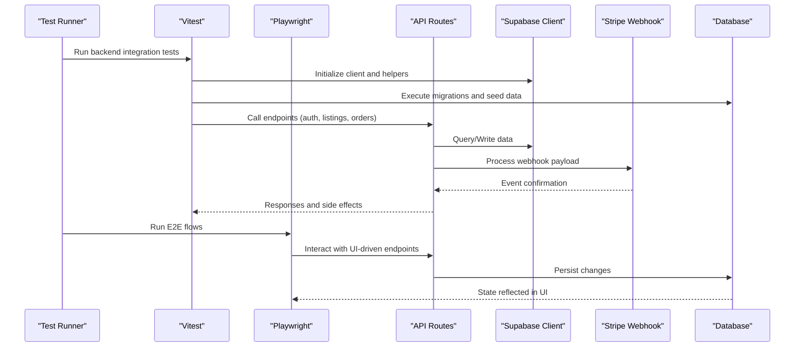

**Diagram sources**
- [vitest.config.mts:1-200](file://vitest.config.mts#L1-L200)
- [playwright.config.ts:1-200](file://playwright.config.ts#L1-L200)
- [route.test.ts:1-200](file://src/app/api/health/route.test.ts#L1-L200)
- [route.test.ts:1-200](file://src/app/api/stripe/webhook/route.test.ts#L1-L200)
- [supabase.ts:1-200](file://src/services/backend/supabase.ts#L1-L200)

## Detailed Component Analysis

### Supabase Client and Helpers
- Purpose: Provide a consistent Supabase client instance, helper utilities, and connection management for tests and runtime
- Key aspects:
  - Environment-aware configuration
  - Reusable client instances per test context
  - Helper functions for queries and mutations used by tests

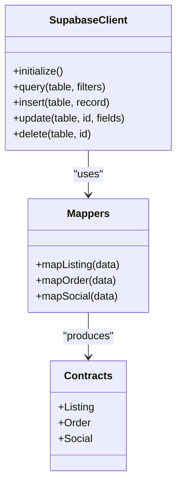

**Diagram sources**
- [supabase.ts:1-200](file://src/services/backend/supabase.ts#L1-L200)
- [mappers.ts:1-200](file://src/services/backend/mappers.ts#L1-L200)
- [mappers-orders.ts:1-200](file://src/services/backend/mappers-orders.ts#L1-L200)
- [mappers-social.ts:1-200](file://src/services/backend/mappers-social.ts#L1-L200)
- [contracts.ts:1-200](file://src/services/backend/contracts.ts#L1-L200)

**Section sources**
- [supabase.ts:1-200](file://src/services/backend/supabase.ts#L1-L200)
- [supabase.test.ts:1-200](file://src/services/backend/supabase.test.ts#L1-L200)
- [mappers.ts:1-200](file://src/services/backend/mappers.ts#L1-L200)
- [mappers-orders.ts:1-200](file://src/services/backend/mappers-orders.ts#L1-L200)
- [mappers-social.ts:1-200](file://src/services/backend/mappers-social.ts#L1-L200)
- [contracts.ts:1-200](file://src/services/backend/contracts.ts#L1-L200)

### Realtime Subscriptions and Events
- Purpose: Validate real-time features such as chat updates, notifications, and activity feeds
- Key aspects:
  - Subscription setup and teardown within tests
  - Mocking or asserting emitted events
  - Ensuring async event propagation is captured

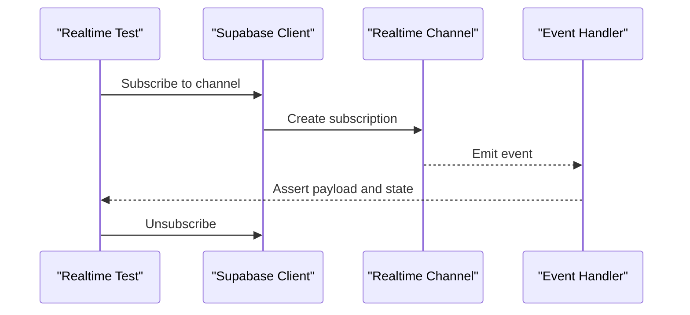

**Diagram sources**
- [realtime.test.ts:1-200](file://src/services/backend/realtime.test.ts#L1-L200)
- [supabase.ts:1-200](file://src/services/backend/supabase.ts#L1-L200)

**Section sources**
- [realtime.test.ts:1-200](file://src/services/backend/realtime.test.ts#L1-L200)
- [supabase.ts:1-200](file://src/services/backend/supabase.ts#L1-L200)

### Migration Testing
- Purpose: Ensure database migrations apply correctly and maintain expected schema and constraints
- Coverage:
  - Base migrations and feature-specific migrations (listings, media, orders, social, user follows, likes/cart, public seller profiles, admin)
  - Assertions on table existence, column types, indexes, and constraints
  - Rollback considerations and idempotency checks where applicable

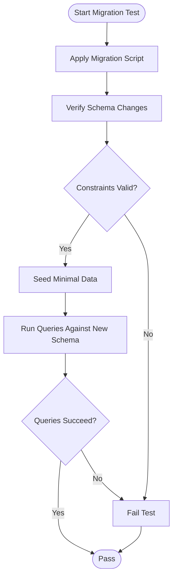

**Diagram sources**
- [migration.test.ts:1-200](file://src/services/backend/migration.test.ts#L1-L200)
- [orders-migration.test.ts:1-200](file://src/services/backend/orders-migration.test.ts#L1-L200)
- [listing-media-migration.test.ts:1-200](file://src/services/backend/listing-media-migration.test.ts#L1-L200)
- [listings-migration.test.ts:1-200](file://src/services/backend/listings-migration.test.ts#L1-L200)
- [social-migration.test.ts:1-200](file://src/services/backend/social-migration.test.ts#L1-L200)
- [user-follows-migration.test.ts:1-200](file://src/services/backend/user-follows-migration.test.ts#L1-L200)
- [user-likes-cart-migration.test.ts:1-200](file://src/services/backend/user-likes-cart-migration.test.ts#L1-L200)
- [public-seller-profiles-migration.test.ts:1-200](file://src/services/backend/public-seller-profiles-migration.test.ts#L1-L200)
- [admin-migration.test.ts:1-200](file://src/services/backend/admin-migration.test.ts#L1-L200)

**Section sources**
- [migration.test.ts:1-200](file://src/services/backend/migration.test.ts#L1-L200)
- [orders-migration.test.ts:1-200](file://src/services/backend/orders-migration.test.ts#L1-L200)
- [listing-media-migration.test.ts:1-200](file://src/services/backend/listing-media-migration.test.ts#L1-L200)
- [listings-migration.test.ts:1-200](file://src/services/backend/listings-migration.test.ts#L1-L200)
- [social-migration.test.ts:1-200](file://src/services/backend/social-migration.test.ts#L1-L200)
- [user-follows-migration.test.ts:1-200](file://src/services/backend/user-follows-migration.test.ts#L1-L200)
- [user-likes-cart-migration.test.ts:1-200](file://src/services/backend/user-likes-cart-migration.test.ts#L1-L200)
- [public-seller-profiles-migration.test.ts:1-200](file://src/services/backend/public-seller-profiles-migration.test.ts#L1-L200)
- [admin-migration.test.ts:1-200](file://src/services/backend/admin-migration.test.ts#L1-L200)

### RLS Policy Testing
- Purpose: Validate Row-Level Security policies ensure correct access control for users and roles
- Strategy:
  - Use SQL scripts to assert allowed and denied operations per role
  - Cover core entities: identity, listings, listing media, cart items, orders, public seller profiles, social, user likes, admin, blocked users, payment methods
  - Combine with Supabase client calls to simulate authenticated contexts

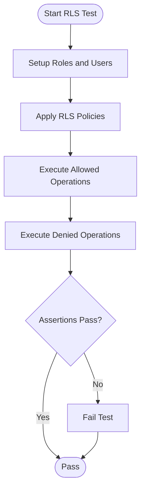

**Diagram sources**
- [phase_2_rls.sql:1-200](file://supabase/tests/phase_2_rls.sql#L1-L200)
- [phase_3_listings_rls.sql:1-200](file://supabase/tests/phase_3_listings_rls.sql#L1-L200)
- [phase_3_listing_media_rls.sql:1-200](file://supabase/tests/phase_3_listing_media_rls.sql#L1-L200)
- [phase_3_cart_items_rls.sql:1-200](file://supabase/tests/phase_3_cart_items_rls.sql#L1-L200)
- [phase_3_orders_rls.sql:1-200](file://supabase/tests/phase_3_orders_rls.sql#L1-L200)
- [phase_3_public_seller_profiles_rls.sql:1-200](file://supabase/tests/phase_3_public_seller_profiles_rls.sql#L1-L200)
- [phase_3_social_rls.sql:1-200](file://supabase/tests/phase_3_social_rls.sql#L1-L200)
- [phase_3_user_likes_rls.sql:1-200](file://supabase/tests/phase_3_user_likes_rls.sql#L1-L200)
- [phase_3_5_admin_rls.sql:1-200](file://supabase/tests/phase_3_5_admin_rls.sql#L1-L200)
- [phase_4_blocked_users_rls.sql:1-200](file://supabase/tests/phase_4_blocked_users_rls.sql#L1-L200)
- [phase_4_payment_methods_rls.sql:1-200](file://supabase/tests/phase_4_payment_methods_rls.sql#L1-L200)

**Section sources**
- [phase_2_rls.sql:1-200](file://supabase/tests/phase_2_rls.sql#L1-L200)
- [phase_3_listings_rls.sql:1-200](file://supabase/tests/phase_3_listings_rls.sql#L1-L200)
- [phase_3_listing_media_rls.sql:1-200](file://supabase/tests/phase_3_listing_media_rls.sql#L1-L200)
- [phase_3_cart_items_rls.sql:1-200](file://supabase/tests/phase_3_cart_items_rls.sql#L1-L200)
- [phase_3_orders_rls.sql:1-200](file://supabase/tests/phase_3_orders_rls.sql#L1-L200)
- [phase_3_public_seller_profiles_rls.sql:1-200](file://supabase/tests/phase_3_public_seller_profiles_rls.sql#L1-L200)
- [phase_3_social_rls.sql:1-200](file://supabase/tests/phase_3_social_rls.sql#L1-L200)
- [phase_3_user_likes_rls.sql:1-200](file://supabase/tests/phase_3_user_likes_rls.sql#L1-L200)
- [phase_3_5_admin_rls.sql:1-200](file://supabase/tests/phase_3_5_admin_rls.sql#L1-L200)
- [phase_4_blocked_users_rls.sql:1-200](file://supabase/tests/phase_4_blocked_users_rls.sql#L1-L200)
- [phase_4_payment_methods_rls.sql:1-200](file://supabase/tests/phase_4_payment_methods_rls.sql#L1-L200)

### API Endpoint Integration Tests
- Health endpoint:
  - Validates service readiness and basic connectivity
- Stripe webhook:
  - Verifies webhook signature handling, event parsing, and order state transitions
  - Confirms idempotent processing and error handling paths

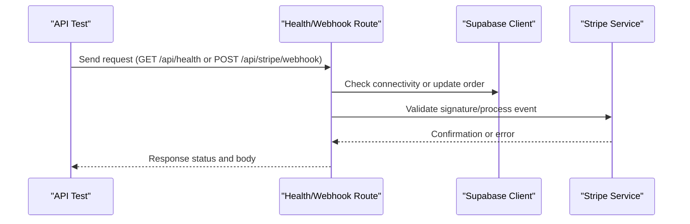

**Diagram sources**
- [route.test.ts:1-200](file://src/app/api/health/route.test.ts#L1-L200)
- [route.test.ts:1-200](file://src/app/api/stripe/webhook/route.test.ts#L1-L200)
- [supabase.ts:1-200](file://src/services/backend/supabase.ts#L1-L200)

**Section sources**
- [route.test.ts:1-200](file://src/app/api/health/route.test.ts#L1-L200)
- [route.test.ts:1-200](file://src/app/api/stripe/webhook/route.test.ts#L1-L200)

### E2E Authentication Flow
- Purpose: Validate user sign-in and session handling via Playwright
- Coverage:
  - Login success and failure cases
  - Redirects and UI state after authentication
  - Basic assertions on protected routes

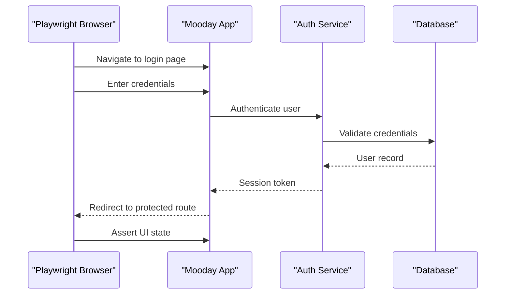

**Diagram sources**
- [phase2-auth.spec.ts:1-200](file://tests/e2e/phase2-auth.spec.ts#L1-L200)
- [playwright.config.ts:1-200](file://playwright.config.ts#L1-L200)

**Section sources**
- [phase2-auth.spec.ts:1-200](file://tests/e2e/phase2-auth.spec.ts#L1-L200)
- [daneg-rebrand.spec.ts:1-200](file://tests/e2e/daneg-rebrand.spec.ts#L1-L200)
- [playwright.config.ts:1-200](file://playwright.config.ts#L1-L200)

### Third-Party Integrations: Stripe Webhooks and Email Services
- Stripe webhooks:
  - Signature verification
  - Event routing and idempotency
  - Order state updates and error handling
- Email services:
  - Template rendering and delivery assertions where applicable
  - Fallback behavior when external services are unavailable

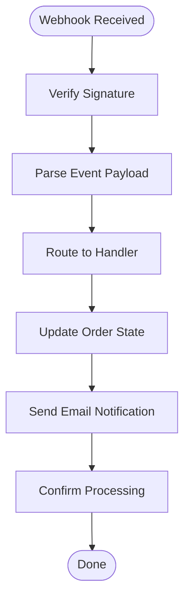

**Diagram sources**
- [route.test.ts:1-200](file://src/app/api/stripe/webhook/route.test.ts#L1-L200)
- [create-payment-intent.test.ts:1-200](file://src/services/backend/create-payment-intent.test.ts#L1-L200)

**Section sources**
- [route.test.ts:1-200](file://src/app/api/stripe/webhook/route.test.ts#L1-L200)
- [create-payment-intent.test.ts:1-200](file://src/services/backend/create-payment-intent.test.ts#L1-L200)

### Smoke Test Scripts Execution
- Purpose: Validate critical user journeys and system capabilities against live or staging environments
- Scripts include:
  - Phase 2 Supabase smoke tests
  - Admin actions smoke tests
  - Image upload smoke tests
  - Notification fanout smoke tests
  - Public reviews smoke tests
  - Catalog seeding and multi-phase smoke tests (U3-U8)

Execution guidance:
- Ensure environment variables are set for target Supabase instance and API endpoints
- Run scripts sequentially if they depend on prior state
- Capture logs and artifacts for debugging failures

**Section sources**
- [SMOKE_TESTS.md:1-200](file://docs/SMOKE_TESTS.md#L1-L200)
- [phase2-smoke-supabase.mjs:1-200](file://scripts/phase2-smoke-supabase.mjs#L1-L200)
- [phase4-admin-actions-smoke.mjs:1-200](file://scripts/phase4-admin-actions-smoke.mjs#L1-L200)
- [phase4-image-upload-smoke.mjs:1-200](file://scripts/phase4-image-upload-smoke.mjs#L1-L200)
- [phase4-notification-fanout-smoke.mjs:1-200](file://scripts/phase4-notification-fanout-smoke.mjs#L1-L200)
- [phase4-public-reviews-smoke.mjs:1-200](file://scripts/phase4-public-reviews-smoke.mjs#L1-L200)
- [u3-u8-smoke.mjs:1-200](file://scripts/u3-u8-smoke.mjs#L1-L200)
- [seed-demo-catalog.mjs:1-200](file://scripts/seed-demo-catalog.mjs#L1-L200)
- [apply-migrations.mjs:1-200](file://scripts/apply-migrations.mjs#L1-L200)

### Test Environment Setup and Database Isolation
- Environment setup:
  - Configure Supabase URLs, keys, and API endpoints via environment variables
  - Use separate databases or schemas for CI vs local development
- Database isolation strategies:
  - Use transactions to rollback changes within tests
  - Reset state between tests using migration application and seed scripts
  - Employ unique identifiers or prefixes to avoid cross-test interference

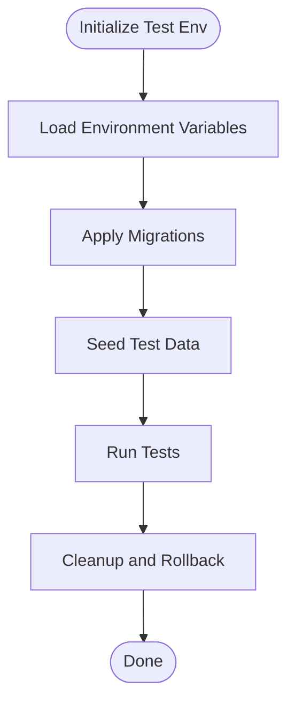

**Diagram sources**
- [apply-migrations.mjs:1-200](file://scripts/apply-migrations.mjs#L1-L200)
- [seed-demo-catalog.mjs:1-200](file://scripts/seed-demo-catalog.mjs#L1-L200)
- [vitest.setup.ts:1-200](file://vitest.setup.ts#L1-L200)

**Section sources**
- [apply-migrations.mjs:1-200](file://scripts/apply-migrations.mjs#L1-L200)
- [seed-demo-catalog.mjs:1-200](file://scripts/seed-demo-catalog.mjs#L1-L200)
- [vitest.setup.ts:1-200](file://vitest.setup.ts#L1-L200)

### Asynchronous Operations and Transaction Handling
- Asynchronous operations:
  - Use timeouts and retries for network-bound calls
  - Assert eventual consistency for background jobs and fanout processes
- Transaction handling:
  - Wrap related writes in transactions to ensure atomicity
  - Validate rollbacks on failure paths

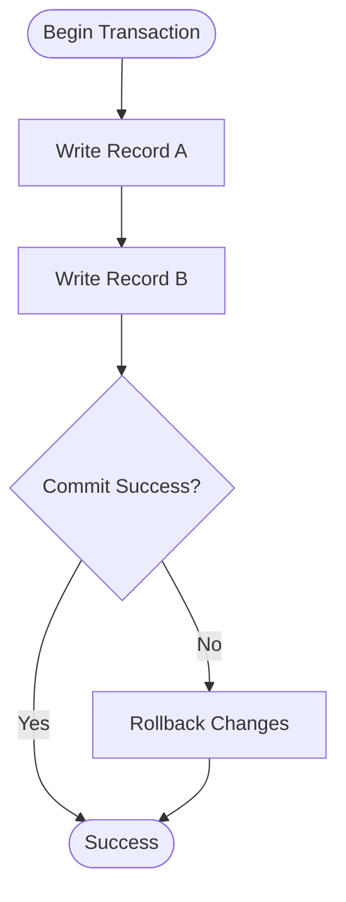

**Diagram sources**
- [supabase.ts:1-200](file://src/services/backend/supabase.ts#L1-L200)
- [mappers-orders.ts:1-200](file://src/services/backend/mappers-orders.ts#L1-L200)

**Section sources**
- [supabase.ts:1-200](file://src/services/backend/supabase.ts#L1-L200)
- [mappers-orders.ts:1-200](file://src/services/backend/mappers-orders.ts#L1-L200)

## Dependency Analysis
Integration tests depend on:
- Supabase client for database interactions
- API routes for endpoint validation
- External services (Stripe) for webhook processing
- Playwright for browser automation
- Vitest for unit/integration test orchestration

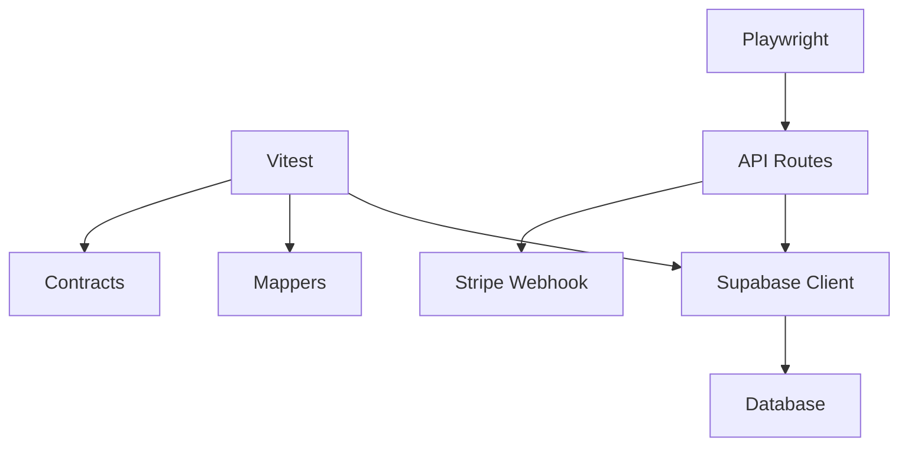

**Diagram sources**
- [vitest.config.mts:1-200](file://vitest.config.mts#L1-L200)
- [playwright.config.ts:1-200](file://playwright.config.ts#L1-L200)
- [supabase.ts:1-200](file://src/services/backend/supabase.ts#L1-L200)
- [mappers.ts:1-200](file://src/services/backend/mappers.ts#L1-L200)
- [contracts.ts:1-200](file://src/services/backend/contracts.ts#L1-L200)
- [route.test.ts:1-200](file://src/app/api/stripe/webhook/route.test.ts#L1-L200)

**Section sources**
- [vitest.config.mts:1-200](file://vitest.config.mts#L1-L200)
- [playwright.config.ts:1-200](file://playwright.config.ts#L1-L200)
- [supabase.ts:1-200](file://src/services/backend/supabase.ts#L1-L200)
- [mappers.ts:1-200](file://src/services/backend/mappers.ts#L1-L200)
- [contracts.ts:1-200](file://src/services/backend/contracts.ts#L1-L200)
- [route.test.ts:1-200](file://src/app/api/stripe/webhook/route.test.ts#L1-L200)

## Performance Considerations
- Minimize test flakiness by isolating database state and using deterministic seeds
- Batch operations where possible to reduce round-trips to Supabase
- Use efficient queries and leverage indexes defined in migrations
- Avoid heavy browser automation in unit tests; reserve Playwright for critical user flows
- Parallelize independent test suites while respecting shared resource constraints

[No sources needed since this section provides general guidance]

## Troubleshooting Guide
Common issues and resolutions:
- Supabase connection errors:
  - Verify environment variables and network access
  - Check RLS policies blocking intended operations
- Migration failures:
  - Review migration scripts for syntax or constraint conflicts
  - Ensure sequential application and idempotency
- Stripe webhook failures:
  - Validate signature secrets and payload formats
  - Inspect error logs from webhook handler
- E2E test instability:
  - Increase timeouts for slow pages
  - Stabilize selectors and handle dynamic content
- Realtime event misses:
  - Ensure subscriptions are active before emitting events
  - Add retries and assertion waits for eventual consistency

**Section sources**
- [supabase.test.ts:1-200](file://src/services/backend/supabase.test.ts#L1-L200)
- [migration.test.ts:1-200](file://src/services/backend/migration.test.ts#L1-L200)
- [route.test.ts:1-200](file://src/app/api/stripe/webhook/route.test.ts#L1-L200)
- [phase2-auth.spec.ts:1-200](file://tests/e2e/phase2-auth.spec.ts#L1-L200)
- [realtime.test.ts:1-200](file://src/services/backend/realtime.test.ts#L1-L200)

## Conclusion
This integration testing strategy ensures robust validation across database operations, API endpoints, and external integrations. By combining Vitest-based backend tests, Playwright E2E flows, Supabase RLS SQL tests, and smoke scripts, the Mooday marketplace can confidently verify correctness, security, and reliability across its full stack. Adhering to environment isolation, transactional integrity, and thorough assertion practices will minimize flakiness and accelerate feedback loops during development and CI.

[No sources needed since this section summarizes without analyzing specific files]

## Appendices
- Configuration references:
  - Vitest configuration and setup
  - Playwright configuration
  - Smoke test documentation
- Environment variables:
  - Supabase URL and keys
  - Stripe webhook secret
  - API base URLs for staging/production

**Section sources**
- [vitest.config.mts:1-200](file://vitest.config.mts#L1-L200)
- [vitest.setup.ts:1-200](file://vitest.setup.ts#L1-L200)
- [playwright.config.ts:1-200](file://playwright.config.ts#L1-L200)
- [SMOKE_TESTS.md:1-200](file://docs/SMOKE_TESTS.md#L1-L200)
- [config.ts:1-200](file://src/services/backend/config.ts#L1-L200)
- [config.test.ts:1-200](file://src/services/backend/config.test.ts#L1-L200)
- [mock-helpers.ts:1-200](file://src/services/backend/mock-helpers.ts#L1-L200)
- [index.ts:1-200](file://src/services/backend/index.ts#L1-L200)