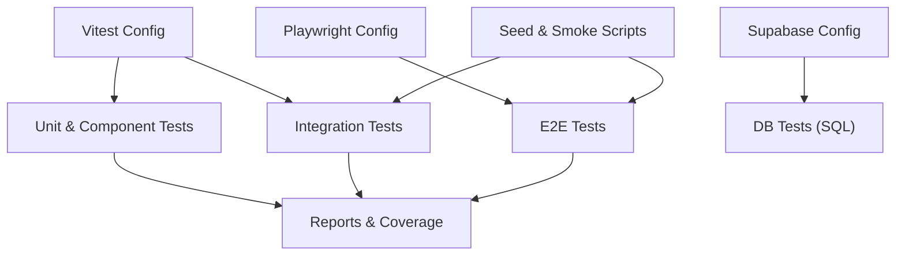
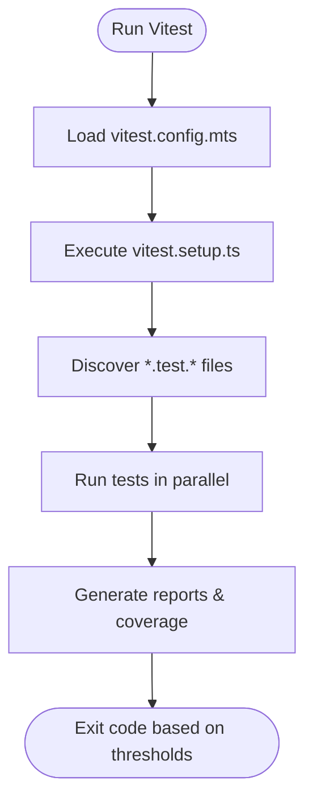
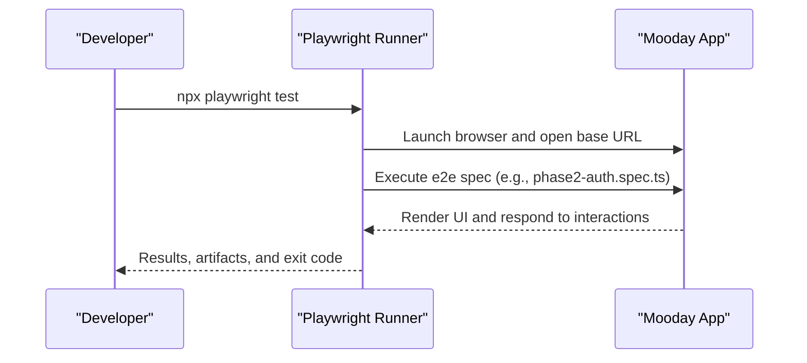
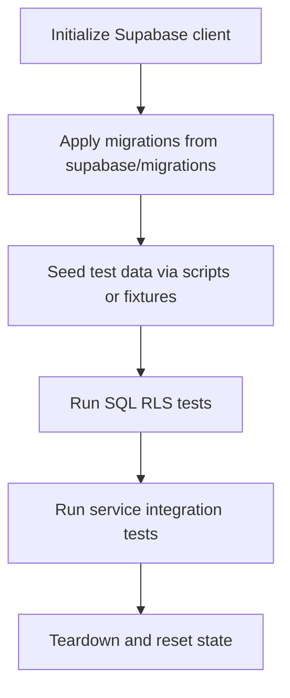
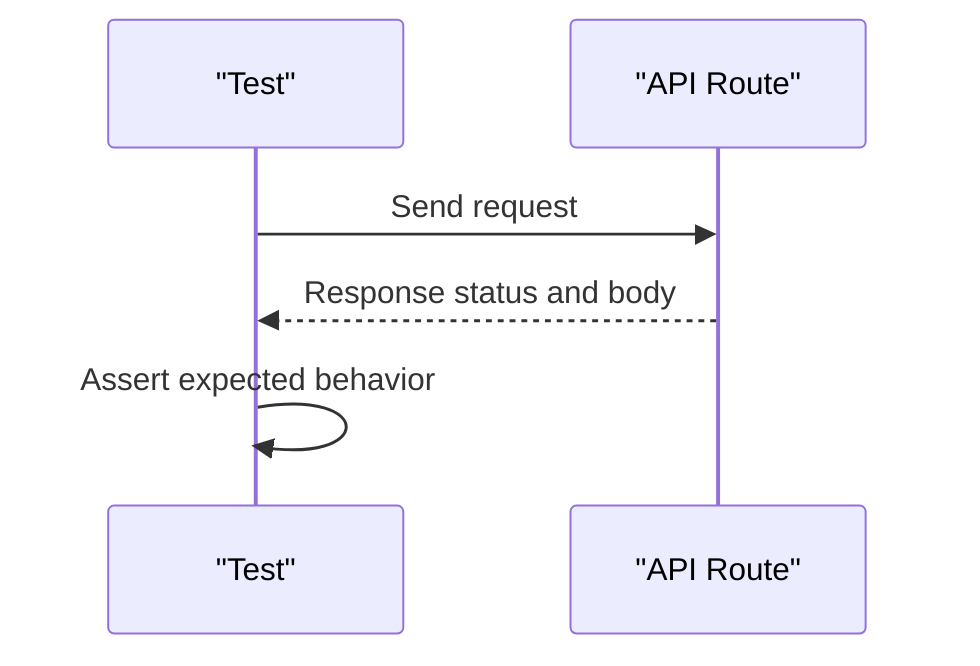
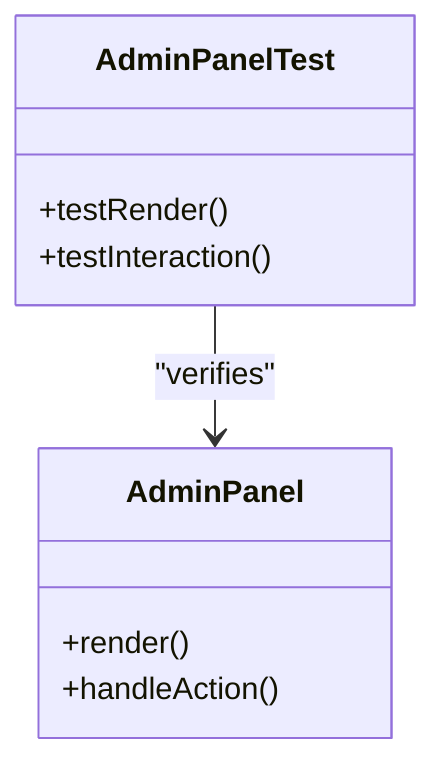
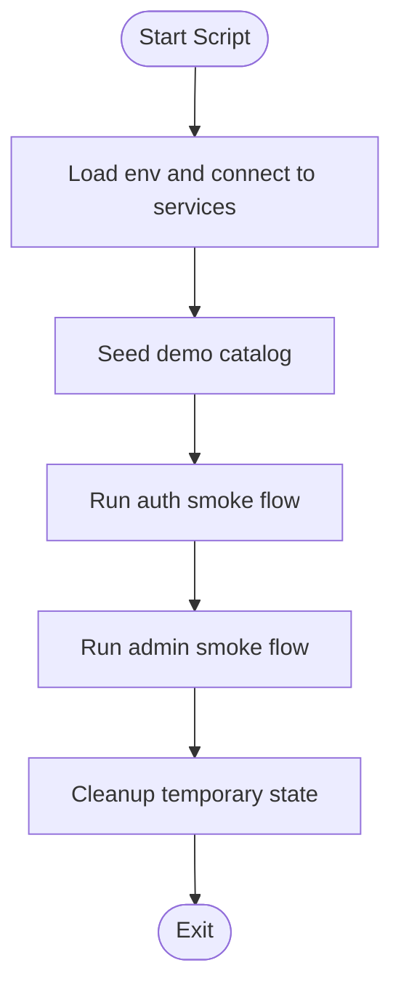
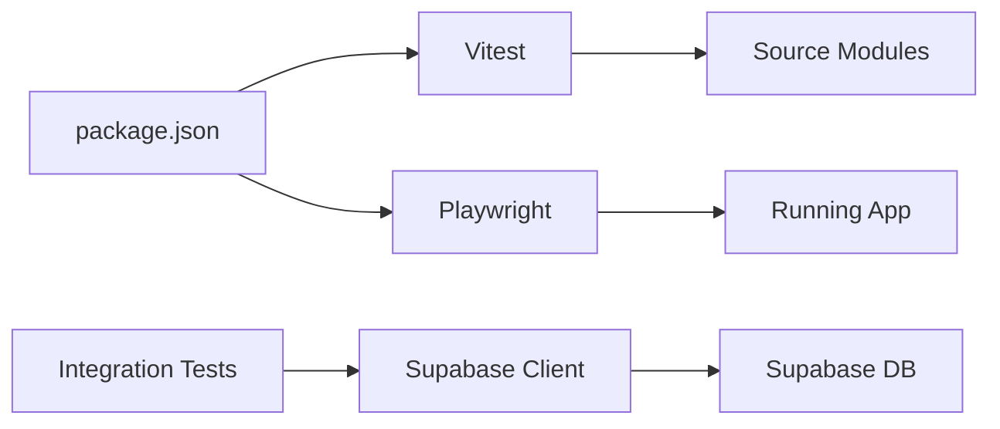

# Testing Infrastructure and CI/CD

<cite>
**Referenced Files in This Document**
- [package.json](file://package.json)
- [vitest.config.mts](file://vitest.config.mts)
- [vitest.setup.ts](file://vitest.setup.ts)
- [playwright.config.ts](file://playwright.config.ts)
- [supabase/config.toml](file://supabase/config.toml)
- [scripts/seed-demo-catalog.mjs](file://scripts/seed-demo-catalog.mjs)
- [scripts/phase2-auth-smoke.mjs](file://scripts/phase2-auth-smoke.mjs)
- [scripts/phase4-admin-actions-smoke.mjs](file://scripts/phase4-admin-actions-smoke.mjs)
- [src/app/api/health/route.test.ts](file://src/app/api/health/route.test.ts)
- [src/app/api/stripe/webhook/route.test.ts](file://src/app/api/stripe/webhook/route.test.ts)
- [src/components/admin/AdminPanel.test.tsx](file://src/components/admin/AdminPanel.test.tsx)
- [src/services/backend/supabase.test.ts](file://src/services/backend/supabase.test.ts)
- [tests/e2e/phase2-auth.spec.ts](file://tests/e2e/phase2-auth.spec.ts)
- [tests/e2e/daneg-rebrand.spec.ts](file://tests/e2e/daneg-rebrand.spec.ts)
- [supabase/tests/phase_3_listings_rls.sql](file://supabase/tests/phase_3_listings_rls.sql)
</cite>

## Table of Contents
1. [Introduction](#introduction)
2. [Project Structure](#project-structure)
3. [Core Components](#core-components)
4. [Architecture Overview](#architecture-overview)
5. [Detailed Component Analysis](#detailed-component-analysis)
6. [Dependency Analysis](#dependency-analysis)
7. [Performance Considerations](#performance-considerations)
8. [Troubleshooting Guide](#troubleshooting-guide)
9. [Conclusion](#conclusion)
10. [Appendices](#appendices)

## Introduction
This document explains the testing infrastructure and continuous integration setup for the Mooday marketplace. It covers unit, integration, and end-to-end (E2E) tests; environment configuration; dependency management; caching strategies; reporting and coverage; quality gates; local development workflows; debugging and profiling; test data seeding; database snapshot management; environment-specific configurations; scaling and parallelization; and best practices to keep tests reliable and maintainable.

## Project Structure
The repository organizes tests across multiple layers:
- Unit and component tests co-located with source files under src using .test.ts/.test.tsx suffixes.
- Integration tests for backend services and Supabase interactions live under src/services/backend.
- E2E tests are under tests/e2e using Playwright.
- Database-level tests and RLS assertions are under supabase/tests as SQL scripts.
- Test runners and frameworks are configured via Vitest and Playwright.
- Seed and smoke scripts support data preparation and quick validation flows.

```mermaid
graph TB
subgraph "Unit & Component Tests"
U1["src/app/api/health/route.test.ts"]
U2["src/app/api/stripe/webhook/route.test.ts"]
U3["src/components/admin/AdminPanel.test.tsx"]
end
subgraph "Integration Tests"
I1["src/services/backend/supabase.test.ts"]
end
subgraph "E2E Tests"
E1["tests/e2e/phase2-auth.spec.ts"]
E2["tests/e2e/daneg-rebrand.spec.ts"]
end
subgraph "Database Tests"
D1["supabase/tests/phase_3_listings_rls.sql"]
end
subgraph "Config & Scripts"
C1["vitest.config.mts"]
C2["playwright.config.ts"]
C3["supabase/config.toml"]
S1["scripts/seed-demo-catalog.mjs"]
S2["scripts/phase2-auth-smoke.mjs"]
S3["scripts/phase4-admin-actions-smoke.mjs"]
end
U1 --> C1
U2 --> C1
U3 --> C1
I1 --> C1
E1 --> C2
E2 --> C2
D1 --> C3
S1 --> C3
S2 --> C3
S3 --> C3
```

**Diagram sources**
- [vitest.config.mts:1-200](file://vitest.config.mts#L1-L200)
- [playwright.config.ts:1-200](file://playwright.config.ts#L1-L200)
- [supabase/config.toml:1-200](file://supabase/config.toml#L1-L200)
- [scripts/seed-demo-catalog.mjs:1-200](file://scripts/seed-demo-catalog.mjs#L1-L200)
- [scripts/phase2-auth-smoke.mjs:1-200](file://scripts/phase2-auth-smoke.mjs#L1-L200)
- [scripts/phase4-admin-actions-smoke.mjs:1-200](file://scripts/phase4-admin-actions-smoke.mjs#L1-L200)
- [src/app/api/health/route.test.ts:1-200](file://src/app/api/health/route.test.ts#L1-L200)
- [src/app/api/stripe/webhook/route.test.ts:1-200](file://src/app/api/stripe/webhook/route.test.ts#L1-L200)
- [src/components/admin/AdminPanel.test.tsx:1-200](file://src/components/admin/AdminPanel.test.tsx#L1-L200)
- [src/services/backend/supabase.test.ts:1-200](file://src/services/backend/supabase.test.ts#L1-L200)
- [tests/e2e/phase2-auth.spec.ts:1-200](file://tests/e2e/phase2-auth.spec.ts#L1-L200)
- [tests/e2e/daneg-rebrand.spec.ts:1-200](file://tests/e2e/daneg-rebrand.spec.ts#L1-L200)
- [supabase/tests/phase_3_listings_rls.sql:1-200](file://supabase/tests/phase_3_listings_rls.sql#L1-L200)

**Section sources**
- [package.json:1-200](file://package.json#L1-L200)
- [vitest.config.mts:1-200](file://vitest.config.mts#L1-L200)
- [playwright.config.ts:1-200](file://playwright.config.ts#L1-L200)
- [supabase/config.toml:1-200](file://supabase/config.toml#L1-L200)

## Core Components
- Test runner and framework:
  - Vitest is used for unit and component tests, configured via vitest.config.mts and a shared setup file vitest.setup.ts.
  - Playwright is used for E2E tests, configured via playwright.config.ts.
- Backend integration:
  - Supabase client and service tests validate migrations, RLS policies, and service behavior.
- Data seeding and smoke tests:
  - Seed script populates demo catalog data.
  - Smoke scripts exercise critical user journeys (auth, admin actions).
- Database-level tests:
  - SQL-based tests assert Row-Level Security policies and schema correctness.

Key responsibilities:
- Isolate external dependencies in unit tests.
- Use controlled environments for integration and E2E tests.
- Provide reproducible data through seed scripts and migration-driven state.

**Section sources**
- [vitest.config.mts:1-200](file://vitest.config.mts#L1-L200)
- [vitest.setup.ts:1-200](file://vitest.setup.ts#L1-L200)
- [playwright.config.ts:1-200](file://playwright.config.ts#L1-L200)
- [src/services/backend/supabase.test.ts:1-200](file://src/services/backend/supabase.test.ts#L1-L200)
- [scripts/seed-demo-catalog.mjs:1-200](file://scripts/seed-demo-catalog.mjs#L1-L200)
- [scripts/phase2-auth-smoke.mjs:1-200](file://scripts/phase2-auth-smoke.mjs#L1-L200)
- [scripts/phase4-admin-actions-smoke.mjs:1-200](file://scripts/phase4-admin-actions-smoke.mjs#L1-L200)
- [supabase/tests/phase_3_listings_rls.sql:1-200](file://supabase/tests/phase_3_listings_rls.sql#L1-L200)

## Architecture Overview
The testing architecture spans three layers with clear boundaries:
- Unit layer: Fast, isolated tests for API routes and components.
- Integration layer: Validates service logic against Supabase and related integrations.
- E2E layer: Exercises full application flows in a browser-like environment.

**Diagram sources**
- [vitest.config.mts:1-200](file://vitest.config.mts#L1-L200)
- [playwright.config.ts:1-200](file://playwright.config.ts#L1-L200)
- [supabase/config.toml:1-200](file://supabase/config.toml#L1-L200)
- [scripts/seed-demo-catalog.mjs:1-200](file://scripts/seed-demo-catalog.mjs#L1-L200)
- [scripts/phase2-auth-smoke.mjs:1-200](file://scripts/phase2-auth-smoke.mjs#L1-L200)
- [scripts/phase4-admin-actions-smoke.mjs:1-200](file://scripts/phase4-admin-actions-smoke.mjs#L1-L200)

## Detailed Component Analysis

### Vitest Configuration and Setup
- Purpose: Configure test execution, globals, environment, and shared setup for unit and component tests.
- Key aspects:
  - Environment isolation and mocking strategy.
  - Shared setup for DOM, timers, and utilities.
  - Coverage thresholds and reporters.

**Diagram sources**
- [vitest.config.mts:1-200](file://vitest.config.mts#L1-L200)
- [vitest.setup.ts:1-200](file://vitest.setup.ts#L1-L200)

**Section sources**
- [vitest.config.mts:1-200](file://vitest.config.mts#L1-L200)
- [vitest.setup.ts:1-200](file://vitest.setup.ts#L1-L200)

### Playwright E2E Configuration
- Purpose: Configure browser context, base URL, timeouts, and test discovery for E2E scenarios.
- Typical usage:
  - Authenticate users and navigate key flows (e.g., auth, rebrand UI checks).
  - Assert visual and functional outcomes across pages.

**Diagram sources**
- [playwright.config.ts:1-200](file://playwright.config.ts#L1-L200)
- [tests/e2e/phase2-auth.spec.ts:1-200](file://tests/e2e/phase2-auth.spec.ts#L1-L200)
- [tests/e2e/daneg-rebrand.spec.ts:1-200](file://tests/e2e/daneg-rebrand.spec.ts#L1-L200)

**Section sources**
- [playwright.config.ts:1-200](file://playwright.config.ts#L1-L200)
- [tests/e2e/phase2-auth.spec.ts:1-200](file://tests/e2e/phase2-auth.spec.ts#L1-L200)
- [tests/e2e/daneg-rebrand.spec.ts:1-200](file://tests/e2e/daneg-rebrand.spec.ts#L1-L200)

### Supabase Integration and DB Tests
- Purpose: Validate service behavior and database constraints, including RLS policies.
- Approach:
  - Service-level tests interact with Supabase client to assert correct queries and mutations.
  - SQL-based tests enforce RLS rules and schema integrity.

**Diagram sources**
- [supabase/config.toml:1-200](file://supabase/config.toml#L1-L200)
- [supabase/tests/phase_3_listings_rls.sql:1-200](file://supabase/tests/phase_3_listings_rls.sql#L1-L200)
- [src/services/backend/supabase.test.ts:1-200](file://src/services/backend/supabase.test.ts#L1-L200)
- [scripts/seed-demo-catalog.mjs:1-200](file://scripts/seed-demo-catalog.mjs#L1-L200)

**Section sources**
- [supabase/config.toml:1-200](file://supabase/config.toml#L1-L200)
- [supabase/tests/phase_3_listings_rls.sql:1-200](file://supabase/tests/phase_3_listings_rls.sql#L1-L200)
- [src/services/backend/supabase.test.ts:1-200](file://src/services/backend/supabase.test.ts#L1-L200)
- [scripts/seed-demo-catalog.mjs:1-200](file://scripts/seed-demo-catalog.mjs#L1-L200)

### API Route Tests
- Health endpoint tests verify server readiness and basic response shape.
- Stripe webhook tests validate payload handling and signature verification paths.

**Diagram sources**
- [src/app/api/health/route.test.ts:1-200](file://src/app/api/health/route.test.ts#L1-L200)
- [src/app/api/stripe/webhook/route.test.ts:1-200](file://src/app/api/stripe/webhook/route.test.ts#L1-L200)

**Section sources**
- [src/app/api/health/route.test.ts:1-200](file://src/app/api/health/route.test.ts#L1-L200)
- [src/app/api/stripe/webhook/route.test.ts:1-200](file://src/app/api/stripe/webhook/route.test.ts#L1-L200)

### Admin Panel Component Tests
- Purpose: Ensure admin UI components render correctly and handle interactions.
- Strategy: Mock external dependencies and assert UI states.

**Diagram sources**
- [src/components/admin/AdminPanel.test.tsx:1-200](file://src/components/admin/AdminPanel.test.tsx#L1-L200)

**Section sources**
- [src/components/admin/AdminPanel.test.tsx:1-200](file://src/components/admin/AdminPanel.test.tsx#L1-L200)

### Smoke and Seed Scripts
- Seed script populates catalog data for consistent testing and demos.
- Smoke scripts validate critical flows like authentication and admin actions.

**Diagram sources**
- [scripts/seed-demo-catalog.mjs:1-200](file://scripts/seed-demo-catalog.mjs#L1-L200)
- [scripts/phase2-auth-smoke.mjs:1-200](file://scripts/phase2-auth-smoke.mjs#L1-L200)
- [scripts/phase4-admin-actions-smoke.mjs:1-200](file://scripts/phase4-admin-actions-smoke.mjs#L1-L200)

**Section sources**
- [scripts/seed-demo-catalog.mjs:1-200](file://scripts/seed-demo-catalog.mjs#L1-L200)
- [scripts/phase2-auth-smoke.mjs:1-200](file://scripts/phase2-auth-smoke.mjs#L1-L200)
- [scripts/phase4-admin-actions-smoke.mjs:1-200](file://scripts/phase4-admin-actions-smoke.mjs#L1-L200)

## Dependency Analysis
- Test execution depends on:
  - Node packages defined in package.json for Vitest and Playwright.
  - Supabase client libraries for integration tests.
  - Browser runtime for Playwright E2E tests.
- External integrations:
  - Supabase database and storage.
  - Stripe webhook endpoints (mocked or sandboxed in tests).
- Coupling:
  - Integration tests depend on database schema and RLS policies.
  - E2E tests depend on deployed or locally running app instance.

**Diagram sources**
- [package.json:1-200](file://package.json#L1-L200)
- [vitest.config.mts:1-200](file://vitest.config.mts#L1-L200)
- [playwright.config.ts:1-200](file://playwright.config.ts#L1-L200)
- [src/services/backend/supabase.test.ts:1-200](file://src/services/backend/supabase.test.ts#L1-L200)

**Section sources**
- [package.json:1-200](file://package.json#L1-L200)
- [vitest.config.mts:1-200](file://vitest.config.mts#L1-L200)
- [playwright.config.ts:1-200](file://playwright.config.ts#L1-L200)
- [src/services/backend/supabase.test.ts:1-200](file://src/services/backend/supabase.test.ts#L1-L200)

## Performance Considerations
- Parallelization:
  - Vitest runs unit tests in parallel by default; tune workers and isolate modules where needed.
  - Playwright can run multiple browsers and shards specs for faster E2E execution.
- Caching:
  - Cache node_modules and Playwright browser binaries between runs.
  - Reuse Supabase test database snapshots when possible.
- Resource optimization:
  - Limit concurrent E2E contexts to avoid resource contention.
  - Use lightweight mocks for expensive external calls in unit tests.
- Reporting:
  - Enable coverage thresholds to prevent regressions.
  - Collect artifacts (screenshots, traces) for failing E2E tests.

[No sources needed since this section provides general guidance]

## Troubleshooting Guide
Common issues and remedies:
- Flaky E2E tests:
  - Increase timeouts and use stable selectors.
  - Add retries for transient network failures.
  - Capture screenshots and traces on failure.
- Supabase connection errors:
  - Verify environment variables and project URLs.
  - Ensure migrations are applied before tests.
  - Reset database state between runs if necessary.
- Coverage threshold failures:
  - Adjust thresholds or add missing tests for uncovered branches.
- Debugging:
  - Use Vitest’s watch mode for rapid iteration.
  - Use Playwright’s UI mode to step through tests visually.

**Section sources**
- [playwright.config.ts:1-200](file://playwright.config.ts#L1-L200)
- [vitest.config.mts:1-200](file://vitest.config.mts#L1-L200)
- [supabase/config.toml:1-200](file://supabase/config.toml#L1-L200)

## Conclusion
The Mooday marketplace employs a layered testing strategy with Vitest for unit/component tests, Playwright for E2E flows, and SQL-based tests for database integrity. The configuration emphasizes reproducibility, performance, and reliability through parallelization, caching, and robust teardown. By following the guidelines here, teams can maintain fast feedback loops, high confidence in releases, and scalable test execution.

[No sources needed since this section summarizes without analyzing specific files]

## Appendices

### Local Development Testing Workflow
- Run unit tests:
  - Use the test command defined in package.json to execute Vitest suites.
- Run E2E tests:
  - Start the app locally and execute Playwright tests against the running instance.
- Seed data:
  - Use the seed script to populate demo catalog data before integration or E2E runs.
- Smoke tests:
  - Execute smoke scripts to validate critical user journeys quickly.

**Section sources**
- [package.json:1-200](file://package.json#L1-L200)
- [scripts/seed-demo-catalog.mjs:1-200](file://scripts/seed-demo-catalog.mjs#L1-L200)
- [scripts/phase2-auth-smoke.mjs:1-200](file://scripts/phase2-auth-smoke.mjs#L1-L200)
- [scripts/phase4-admin-actions-smoke.mjs:1-200](file://scripts/phase4-admin-actions-smoke.mjs#L1-L200)

### Test Data Seeding and Database Snapshots
- Seeding:
  - Use seed scripts to create deterministic catalog and user data.
- Snapshots:
  - Leverage Supabase migrations to evolve schema consistently.
  - For complex datasets, consider exporting and restoring snapshots within CI.

**Section sources**
- [scripts/seed-demo-catalog.mjs:1-200](file://scripts/seed-demo-catalog.mjs#L1-L200)
- [supabase/config.toml:1-200](file://supabase/config.toml#L1-L200)

### Environment-Specific Configurations
- Unit tests:
  - Use minimal or mocked environments via Vitest setup.
- Integration tests:
  - Point Supabase client to a test project or local instance.
- E2E tests:
  - Configure base URL and browser settings per environment.

**Section sources**
- [vitest.setup.ts:1-200](file://vitest.setup.ts#L1-L200)
- [playwright.config.ts:1-200](file://playwright.config.ts#L1-L200)
- [supabase/config.toml:1-200](file://supabase/config.toml#L1-L200)

### Scaling Test Execution
- Parallelize:
  - Increase Vitest workers for CPU-bound unit tests.
  - Shard Playwright specs across multiple processes.
- Resource limits:
  - Cap concurrent E2E contexts to match available resources.
- Artifact retention:
  - Store only necessary artifacts to reduce storage overhead.

[No sources needed since this section provides general guidance]

### Reliability and Maintenance Best Practices
- Keep tests small and focused.
- Avoid coupling tests to implementation details.
- Use stable selectors and explicit waits in E2E tests.
- Regularly review flaky tests and remove or stabilize them.
- Enforce coverage thresholds to maintain quality.

[No sources needed since this section provides general guidance]