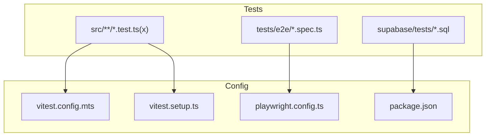
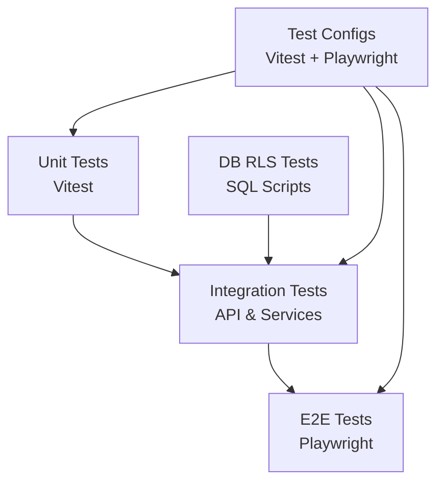
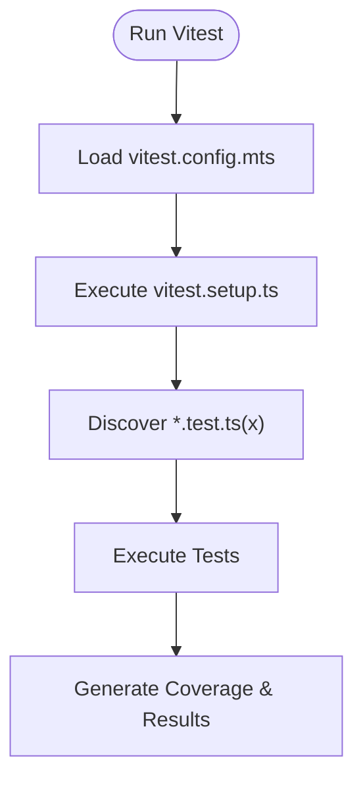
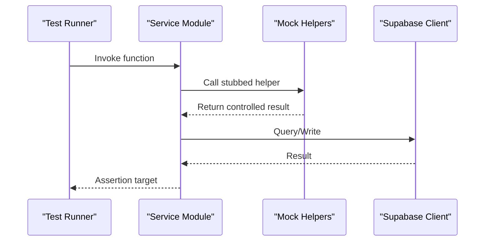
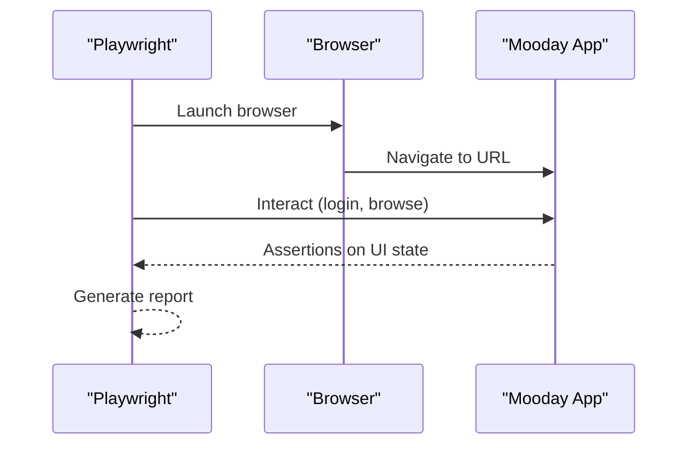
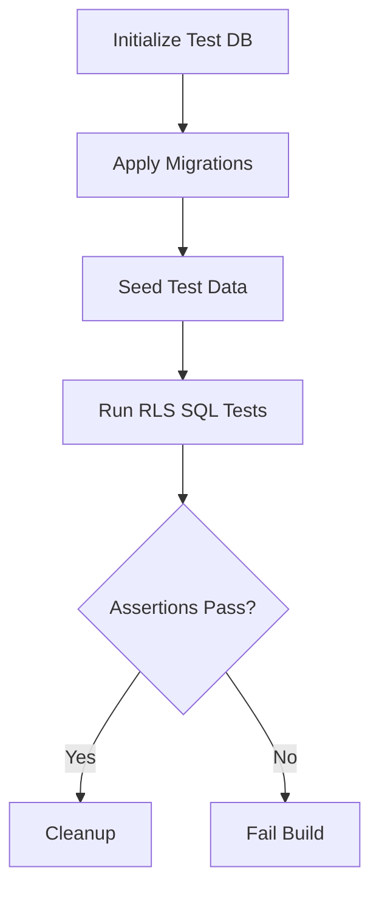
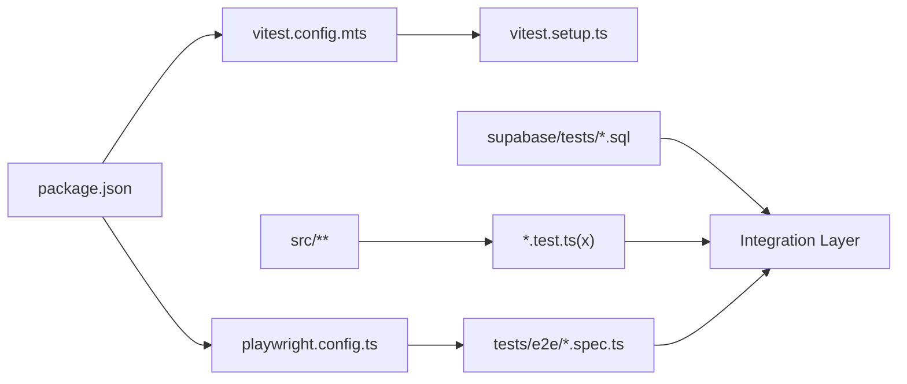

# Testing Strategy

<cite>
**Referenced Files in This Document**
- [vitest.config.mts](file://vitest.config.mts)
- [vitest.setup.ts](file://vitest.setup.ts)
- [playwright.config.ts](file://playwright.config.ts)
- [package.json](file://package.json)
- [src/app/api/health/route.test.ts](file://src/app/api/health/route.test.ts)
- [src/app/api/stripe/webhook/route.test.ts](file://src/app/api/stripe/webhook/route.test.ts)
- [src/components/admin/AdminPanel.test.tsx](file://src/components/admin/AdminPanel.test.tsx)
- [src/components/listing/ListingPhotoPicker.test.tsx](file://src/components/listing/ListingPhotoPicker.test.tsx)
- [src/components/AuthSheet.test.tsx](file://src/components/AuthSheet.test.tsx)
- [src/components/ActivityView.test.tsx](file://src/components/ActivityView.test.tsx)
- [src/components/BlockedUsersView.test.tsx](file://src/components/BlockedUsersView.test.tsx)
- [src/components/CategoryLandingView.test.tsx](file://src/components/CategoryLandingView.test.tsx)
- [src/components/ChatOverlay.test.tsx](file://src/components/ChatOverlay.test.tsx)
- [src/components/ChatsListView.test.tsx](file://src/components/ChatsListView.test.tsx)
- [src/components/CheckoutFlowView.test.tsx](file://src/components/CheckoutFlowView.test.tsx)
- [src/components/DiscoverFeedView.test.tsx](file://src/components/DiscoverFeedView.test.tsx)
- [src/components/DisputeView.test.tsx](file://src/components/DisputeView.test.tsx)
- [src/components/DisputesListView.test.tsx](file://src/components/DisputesListView.test.tsx)
- [src/components/EditListingView.test.tsx](file://src/components/EditListingView.test.tsx)
- [src/components/EditProfileView.test.tsx](file://src/components/EditProfileView.test.tsx)
- [src/components/ForgotPasswordView.test.tsx](file://src/components/ForgotPasswordView.test.tsx)
- [src/components/HelpSupportView.test.tsx](file://src/components/HelpSupportView.test.tsx)
- [src/components/LockScreen.test.tsx](file://src/components/LockScreen.test.tsx)
- [src/components/MyClosetView.test.tsx](file://src/components/MyClosetView.test.tsx)
- [src/components/MyPurchasesView.test.tsx](file://src/components/MyPurchasesView.test.tsx)
- [src/components/MyReviewsView.test.tsx](file://src/components/MyReviewsView.test.tsx)
- [src/components/MySalesView.test.tsx](file://src/components/MySalesView.test.tsx)
- [src/components/NotificationsCentreView.test.tsx](file://src/components/NotificationsCentreView.test.tsx)
- [src/components/OrderDetailsView.test.tsx](file://src/components/OrderDetailsView.test.tsx)
- [src/components/OtpView.test.tsx](file://src/components/OtpView.test.tsx)
- [src/components/PayoutsView.test.tsx](file://src/components/PayoutsView.test.tsx)
- [src/components/ProductDetailsView.test.tsx](file://src/components/ProductDetailsView.test.tsx)
- [src/components/PublicSellerProfile.test.tsx](file://src/components/PublicSellerProfile.test.tsx)
- [src/components/ReportView.test.tsx](file://src/components/ReportView.test.tsx)
- [src/components/ReturnRequestView.test.tsx](file://src/components/ReturnRequestView.test.tsx)
- [src/components/SavedAddressesView.test.tsx](file://src/components/SavedAddressesView.test.tsx)
- [src/components/SavedPaymentMethodsView.test.tsx](file://src/components/SavedPaymentMethodsView.test.tsx)
- [src/components/SearchFiltersView.test.tsx](file://src/components/SearchFiltersView.test.tsx)
- [src/components/SecuritySetupView.test.tsx](file://src/components/SecuritySetupView.test.tsx)
- [src/components/SellItemView.test.tsx](file://src/components/SellItemView.test.tsx)
- [src/components/SellModePickerView.test.tsx](file://src/components/SellModePickerView.test.tsx)
- [src/components/SettingsView.test.tsx](file://src/components/SettingsView.test.tsx)
- [src/components/SignInView.test.tsx](file://src/components/SignInView.test.tsx)
- [src/components/SignUpView.test.tsx](file://src/components/SignUpView.test.tsx)
- [src/components/SocialLoginView.test.tsx](file://src/components/SocialLoginView.test.tsx)
- [src/components/TrustBadges.test.tsx](file://src/components/TrustBadges.test.tsx)
- [src/components/WelcomeView.test.tsx](file://src/components/WelcomeView.test.tsx)
- [src/context/AppContext.test.tsx](file://src/context/AppContext.test.tsx)
- [src/context/markChatRead.test.tsx](file://src/context/markChatRead.test.tsx)
- [src/hooks/useAppNavigation.test.tsx](file://src/hooks/useAppNavigation.test.tsx)
- [src/hooks/useIdleLock.test.ts](file://src/hooks/useIdleLock.test.ts)
- [src/hooks/useWelcomeGuard.test.ts](file://src/hooks/useWelcomeGuard.test.ts)
- [src/lib/brand.test.ts](file://src/lib/brand.test.ts)
- [src/lib/format.test.ts](file://src/lib/format.test.ts)
- [src/lib/hooks.test.ts](file://src/lib/hooks.test.ts)
- [src/lib/imageStage.test.ts](file://src/lib/imageStage.test.ts)
- [src/lib/ownership.test.ts](file://src/lib/ownership.test.ts)
- [src/lib/security.test.ts](file://src/lib/security.test.ts)
- [src/services/backend/supabase.test.ts](file://src/services/backend/supabase.test.ts)
- [src/services/backend/mappers.test.ts](file://src/services/backend/mappers.test.ts)
- [src/services/backend/config.test.ts](file://src/services/backend/config.test.ts)
- [src/services/backend/create-payment-intent.test.ts](file://src/services/backend/create-payment-intent.test.ts)
- [src/services/backend/likes-cart-service.test.ts](file://src/services/backend/likes-cart-service.test.ts)
- [src/services/backend/mock-helpers.ts](file://src/services/backend/mock-helpers.ts)
- [tests/e2e/daneg-rebrand.spec.ts](file://tests/e2e/daneg-rebrand.spec.ts)
- [tests/e2e/phase2-auth.spec.ts](file://tests/e2e/phase2-auth.spec.ts)
- [tests/copyGuard.test.ts](file://tests/copyGuard.test.ts)
- [supabase/tests/phase_3_listings_rls.sql](file://supabase/tests/phase_3_listings_rls.sql)
- [supabase/tests/phase_3_orders_rls.sql](file://supabase/tests/phase_3_orders_rls.sql)
- [supabase/tests/phase_3_cart_items_rls.sql](file://supabase/tests/phase_3_cart_items_rls.sql)
- [supabase/tests/phase_3_listing_media_rls.sql](file://supabase/tests/phase_3_listing_media_rls.sql)
- [supabase/tests/phase_3_public_seller_profiles_rls.sql](file://supabase/tests/phase_3_public_seller_profiles_rls.sql)
- [supabase/tests/phase_3_social_rls.sql](file://supabase/tests/phase_3_social_rls.sql)
- [supabase/tests/phase_3_user_likes_rls.sql](file://supabase/tests/phase_3_user_likes_rls.sql)
- [supabase/tests/phase_4_blocked_users_rls.sql](file://supabase/tests/phase_4_blocked_users_rls.sql)
- [supabase/tests/phase_4_payment_methods_rls.sql](file://supabase/tests/phase_4_payment_methods_rls.sql)
</cite>

## Table of Contents
1. Introduction
2. Project Structure
3. Core Components
4. Architecture Overview
5. Detailed Component Analysis
6. Dependency Analysis
7. Performance Considerations
8. Troubleshooting Guide
9. Conclusion
10. Appendices

## Introduction
This document describes the testing strategy for the Mooday marketplace, covering unit tests with Vitest, integration tests, and end-to-end tests with Playwright. It explains test organization, mocking strategies, test data management, component testing patterns, API testing approaches, database testing with fixtures, continuous integration setup, automated pipelines, reporting, performance/load/accessibility testing strategies, best practices, coverage requirements, debugging failed tests, and examples of common scenarios and utilities.

## Project Structure
The repository follows a clear separation between application code and tests:
- Unit and component tests live alongside source files using .test.ts/.test.tsx naming conventions under src.
- End-to-end tests are centralized under tests/e2e.
- Database Row-Level Security (RLS) tests are stored under supabase/tests as SQL scripts.
- Test configuration is defined at the project root for Vitest and Playwright.

**Diagram sources**
- [vitest.config.mts:1-200](file://vitest.config.mts#L1-L200)
- [vitest.setup.ts:1-200](file://vitest.setup.ts#L1-L200)
- [playwright.config.ts:1-200](file://playwright.config.ts#L1-L200)
- [package.json:1-200](file://package.json#L1-L200)

**Section sources**
- [vitest.config.mts:1-200](file://vitest.config.mts#L1-L200)
- [vitest.setup.ts:1-200](file://vitest.setup.ts#L1-L200)
- [playwright.config.ts:1-200](file://playwright.config.ts#L1-L200)
- [package.json:1-200](file://package.json#L1-L200)

## Core Components
- Vitest-based unit and component tests across UI components, hooks, services, and libraries.
- Playwright-based end-to-end tests for critical user journeys.
- SQL-based RLS tests to validate database security policies.
- Shared test helpers and mocks to standardize assertions and environment setup.

Key responsibilities:
- Ensure correctness of business logic and UI behavior at multiple levels.
- Validate API contracts and third-party integrations via controlled mocks.
- Protect data integrity through RLS policy verification.

**Section sources**
- [src/components/AuthSheet.test.tsx:1-200](file://src/components/AuthSheet.test.tsx#L1-L200)
- [src/services/backend/supabase.test.ts:1-200](file://src/services/backend/supabase.test.ts#L1-L200)
- [tests/e2e/phase2-auth.spec.ts:1-200](file://tests/e2e/phase2-auth.spec.ts#L1-L200)
- [supabase/tests/phase_3_listings_rls.sql:1-200](file://supabase/tests/phase_3_listings_rls.sql#L1-L200)

## Architecture Overview
The testing architecture spans three layers:
- Unit layer: Fast, isolated tests for pure functions, hooks, and utilities.
- Integration layer: Tests that exercise service modules and API routes with mocked or test databases.
- E2E layer: Real browser flows validating complete user journeys.

[No sources needed since this diagram shows conceptual workflow, not actual code structure]

## Detailed Component Analysis

### Unit Testing with Vitest
- Scope: Pure functions, hooks, utility modules, and React components.
- Organization: Co-located .test.ts/.test.tsx next to source files.
- Configuration: Centralized in vitest.config.mts; global setup in vitest.setup.ts.
- Coverage: Enforced via Vitest configuration and CI reporting.

Common patterns:
- Mock external dependencies (network, storage, auth).
- Render components with minimal context providers.
- Assert DOM state and interactions.

Examples:
- Component tests: [src/components/AuthSheet.test.tsx](file://src/components/AuthSheet.test.tsx), [src/components/DiscoverFeedView.test.tsx](file://src/components/DiscoverFeedView.test.tsx), [src/components/ProductDetailsView.test.tsx](file://src/components/ProductDetailsView.test.tsx)
- Hook tests: [src/hooks/useAppNavigation.test.tsx](file://src/hooks/useAppNavigation.test.tsx), [src/hooks/useIdleLock.test.ts](file://src/hooks/useIdleLock.test.ts), [src/hooks/useWelcomeGuard.test.ts](file://src/hooks/useWelcomeGuard.test.ts)
- Library tests: [src/lib/format.test.ts](file://src/lib/format.test.ts), [src/lib/brand.test.ts](file://src/lib/brand.test.ts), [src/lib/security.test.ts](file://src/lib/security.test.ts)

**Diagram sources**
- [vitest.config.mts:1-200](file://vitest.config.mts#L1-L200)
- [vitest.setup.ts:1-200](file://vitest.setup.ts#L1-L200)

**Section sources**
- [vitest.config.mts:1-200](file://vitest.config.mts#L1-L200)
- [vitest.setup.ts:1-200](file://vitest.setup.ts#L1-L200)
- [src/components/AuthSheet.test.tsx:1-200](file://src/components/AuthSheet.test.tsx#L1-L200)
- [src/hooks/useAppNavigation.test.tsx:1-200](file://src/hooks/useAppNavigation.test.tsx#L1-L200)
- [src/lib/format.test.ts:1-200](file://src/lib/format.test.ts#L1-L200)

### Integration Testing (Services and API Routes)
- Service-level tests validate mappers, Supabase client usage, config, and payment intent creation.
- API route tests assert request/response contracts and error handling.

Patterns:
- Use mock helpers to stub network calls and database clients.
- Validate input validation, authorization checks, and response shapes.

Examples:
- Service tests: [src/services/backend/supabase.test.ts](file://src/services/backend/supabase.test.ts), [src/services/backend/mappers.test.ts](file://src/services/backend/mappers.test.ts), [src/services/backend/config.test.ts](file://src/services/backend/config.test.ts), [src/services/backend/create-payment-intent.test.ts](file://src/services/backend/create-payment-intent.test.ts), [src/services/backend/likes-cart-service.test.ts](file://src/services/backend/likes-cart-service.test.ts)
- API route tests: [src/app/api/health/route.test.ts](file://src/app/api/health/route.test.ts), [src/app/api/stripe/webhook/route.test.ts](file://src/app/api/stripe/webhook/route.test.ts)

**Diagram sources**
- [src/services/backend/supabase.test.ts:1-200](file://src/services/backend/supabase.test.ts#L1-L200)
- [src/services/backend/mock-helpers.ts:1-200](file://src/services/backend/mock-helpers.ts#L1-L200)

**Section sources**
- [src/services/backend/supabase.test.ts:1-200](file://src/services/backend/supabase.test.ts#L1-L200)
- [src/services/backend/mappers.test.ts:1-200](file://src/services/backend/mappers.test.ts#L1-L200)
- [src/services/backend/config.test.ts:1-200](file://src/services/backend/config.test.ts#L1-L200)
- [src/services/backend/create-payment-intent.test.ts:1-200](file://src/services/backend/create-payment-intent.test.ts#L1-L200)
- [src/services/backend/likes-cart-service.test.ts:1-200](file://src/services/backend/likes-cart-service.test.ts#L1-L200)
- [src/app/api/health/route.test.ts:1-200](file://src/app/api/health/route.test.ts#L1-L200)
- [src/app/api/stripe/webhook/route.test.ts:1-200](file://src/app/api/stripe/webhook/route.test.ts#L1-L200)
- [src/services/backend/mock-helpers.ts:1-200](file://src/services/backend/mock-helpers.ts#L1-L200)

### End-to-End Testing with Playwright
- Scope: Critical user journeys such as authentication and branding flows.
- Configuration: Centralized in playwright.config.ts.
- Examples: [tests/e2e/phase2-auth.spec.ts](file://tests/e2e/phase2-auth.spec.ts), [tests/e2e/daneg-rebrand.spec.ts](file://tests/e2e/daneg-rebrand.spec.ts)

**Diagram sources**
- [playwright.config.ts:1-200](file://playwright.config.ts#L1-L200)
- [tests/e2e/phase2-auth.spec.ts:1-200](file://tests/e2e/phase2-auth.spec.ts#L1-L200)
- [tests/e2e/daneg-rebrand.spec.ts:1-200](file://tests/e2e/daneg-rebrand.spec.ts#L1-L200)

**Section sources**
- [playwright.config.ts:1-200](file://playwright.config.ts#L1-L200)
- [tests/e2e/phase2-auth.spec.ts:1-200](file://tests/e2e/phase2-auth.spec.ts#L1-L200)
- [tests/e2e/daneg-rebrand.spec.ts:1-200](file://tests/e2e/daneg-rebrand.spec.ts#L1-L200)

### Database Testing with Fixtures (RLS Policies)
- Purpose: Verify Row-Level Security policies across tables like listings, orders, cart items, listing media, public seller profiles, social, user likes, blocked users, and payment methods.
- Format: SQL scripts under supabase/tests.

**Diagram sources**
- [supabase/tests/phase_3_listings_rls.sql:1-200](file://supabase/tests/phase_3_listings_rls.sql#L1-L200)
- [supabase/tests/phase_3_orders_rls.sql:1-200](file://supabase/tests/phase_3_orders_rls.sql#L1-L200)
- [supabase/tests/phase_3_cart_items_rls.sql:1-200](file://supabase/tests/phase_3_cart_items_rls.sql#L1-L200)
- [supabase/tests/phase_3_listing_media_rls.sql:1-200](file://supabase/tests/phase_3_listing_media_rls.sql#L1-L200)
- [supabase/tests/phase_3_public_seller_profiles_rls.sql:1-200](file://supabase/tests/phase_3_public_seller_profiles_rls.sql#L1-L200)
- [supabase/tests/phase_3_social_rls.sql:1-200](file://supabase/tests/phase_3_social_rls.sql#L1-L200)
- [supabase/tests/phase_3_user_likes_rls.sql:1-200](file://supabase/tests/phase_3_user_likes_rls.sql#L1-L200)
- [supabase/tests/phase_4_blocked_users_rls.sql:1-200](file://supabase/tests/phase_4_blocked_users_rls.sql#L1-L200)
- [supabase/tests/phase_4_payment_methods_rls.sql:1-200](file://supabase/tests/phase_4_payment_methods_rls.sql#L1-L200)

**Section sources**
- [supabase/tests/phase_3_listings_rls.sql:1-200](file://supabase/tests/phase_3_listings_rls.sql#L1-L200)
- [supabase/tests/phase_3_orders_rls.sql:1-200](file://supabase/tests/phase_3_orders_rls.sql#L1-L200)
- [supabase/tests/phase_3_cart_items_rls.sql:1-200](file://supabase/tests/phase_3_cart_items_rls.sql#L1-L200)
- [supabase/tests/phase_3_listing_media_rls.sql:1-200](file://supabase/tests/phase_3_listing_media_rls.sql#L1-L200)
- [supabase/tests/phase_3_public_seller_profiles_rls.sql:1-200](file://supabase/tests/phase_3_public_seller_profiles_rls.sql#L1-L200)
- [supabase/tests/phase_3_social_rls.sql:1-200](file://supabase/tests/phase_3_social_rls.sql#L1-L200)
- [supabase/tests/phase_3_user_likes_rls.sql:1-200](file://supabase/tests/phase_3_user_likes_rls.sql#L1-L200)
- [supabase/tests/phase_4_blocked_users_rls.sql:1-200](file://supabase/tests/phase_4_blocked_users_rls.sql#L1-L200)
- [supabase/tests/phase_4_payment_methods_rls.sql:1-200](file://supabase/tests/phase_4_payment_methods_rls.sql#L1-L200)

### Test Organization and Naming Conventions
- Co-locate tests with source files using .test.ts/.test.tsx suffix.
- Group related tests by feature directories (components, hooks, lib, services).
- Keep e2e specs grouped by user journey under tests/e2e.

Examples:
- Component tests: [src/components/MyClosetView.test.tsx](file://src/components/MyClosetView.test.tsx), [src/components/CheckoutFlowView.test.tsx](file://src/components/CheckoutFlowView.test.tsx), [src/components/OrderDetailsView.test.tsx](file://src/components/OrderDetailsView.test.tsx)
- Context tests: [src/context/AppContext.test.tsx](file://src/context/AppContext.test.tsx), [src/context/markChatRead.test.tsx](file://src/context/markChatRead.test.tsx)
- Utility tests: [src/lib/imageStage.test.ts](file://src/lib/imageStage.test.ts), [src/lib/ownership.test.ts](file://src/lib/ownership.test.ts)

**Section sources**
- [src/components/MyClosetView.test.tsx:1-200](file://src/components/MyClosetView.test.tsx#L1-L200)
- [src/components/CheckoutFlowView.test.tsx:1-200](file://src/components/CheckoutFlowView.test.tsx#L1-L200)
- [src/components/OrderDetailsView.test.tsx:1-200](file://src/components/OrderDetailsView.test.tsx#L1-L200)
- [src/context/AppContext.test.tsx:1-200](file://src/context/AppContext.test.tsx#L1-L200)
- [src/context/markChatRead.test.tsx:1-200](file://src/context/markChatRead.test.tsx#L1-L200)
- [src/lib/imageStage.test.ts:1-200](file://src/lib/imageStage.test.ts#L1-L200)
- [src/lib/ownership.test.ts:1-200](file://src/lib/ownership.test.ts#L1-L200)

### Mocking Strategies
- Use shared mock helpers to stub network and database calls consistently.
- Mock third-party integrations (e.g., Stripe webhooks) to isolate behavior.
- Provide deterministic test data for components and services.

References:
- Mock helpers: [src/services/backend/mock-helpers.ts](file://src/services/backend/mock-helpers.ts)
- API webhook tests: [src/app/api/stripe/webhook/route.test.ts](file://src/app/api/stripe/webhook/route.test.ts)

**Section sources**
- [src/services/backend/mock-helpers.ts:1-200](file://src/services/backend/mock-helpers.ts#L1-L200)
- [src/app/api/stripe/webhook/route.test.ts:1-200](file://src/app/api/stripe/webhook/route.test.ts#L1-L200)

### Test Data Management
- Use fixtures and seed data within tests to ensure consistent states.
- For database tests, rely on SQL scripts to set up and tear down data per scenario.

References:
- RLS fixtures: [supabase/tests/phase_3_listings_rls.sql](file://supabase/tests/phase_3_listings_rls.sql), [supabase/tests/phase_3_orders_rls.sql](file://supabase/tests/phase_3_orders_rls.sql)

**Section sources**
- [supabase/tests/phase_3_listings_rls.sql:1-200](file://supabase/tests/phase_3_listings_rls.sql#L1-L200)
- [supabase/tests/phase_3_orders_rls.sql:1-200](file://supabase/tests/phase_3_orders_rls.sql#L1-L200)

### Component Testing Patterns
- Render components with necessary providers and context.
- Simulate user interactions and assert visual/state changes.
- Focus on accessibility and responsive behavior where applicable.

Examples:
- [src/components/SignInView.test.tsx](file://src/components/SignInView.test.tsx), [src/components/SignUpView.test.tsx](file://src/components/SignUpView.test.tsx), [src/components/SettingsView.test.tsx](file://src/components/SettingsView.test.tsx)

**Section sources**
- [src/components/SignInView.test.tsx:1-200](file://src/components/SignInView.test.tsx#L1-L200)
- [src/components/SignUpView.test.tsx:1-200](file://src/components/SignUpView.test.tsx#L1-L200)
- [src/components/SettingsView.test.tsx:1-200](file://src/components/SettingsView.test.tsx#L1-L200)

### API Testing Approaches
- Validate HTTP endpoints for health checks and webhook processing.
- Assert status codes, payloads, and error paths.

Examples:
- Health endpoint: [src/app/api/health/route.test.ts](file://src/app/api/health/route.test.ts)
- Stripe webhook: [src/app/api/stripe/webhook/route.test.ts](file://src/app/api/stripe/webhook/route.test.ts)

**Section sources**
- [src/app/api/health/route.test.ts:1-200](file://src/app/api/health/route.test.ts#L1-L200)
- [src/app/api/stripe/webhook/route.test.ts:1-200](file://src/app/api/stripe/webhook/route.test.ts#L1-L200)

### Continuous Integration and Automated Pipelines
- Configure CI to run Vitest and Playwright suites on each push/PR.
- Generate coverage reports and artifact uploads for review.
- Integrate database RLS tests into pipeline steps.

References:
- Package scripts and dependencies: [package.json](file://package.json)
- Vitest config: [vitest.config.mts](file://vitest.config.mts)
- Playwright config: [playwright.config.ts](file://playwright.config.ts)

**Section sources**
- [package.json:1-200](file://package.json#L1-L200)
- [vitest.config.mts:1-200](file://vitest.config.mts#L1-L200)
- [playwright.config.ts:1-200](file://playwright.config.ts#L1-L200)

### Test Reporting
- Use Vitest’s built-in reporters to output results and coverage.
- Capture Playwright traces and screenshots for failures.
- Aggregate reports in CI artifacts for visibility.

References:
- Vitest setup and config: [vitest.setup.ts](file://vitest.setup.ts), [vitest.config.mts](file://vitest.config.mts)
- Playwright config: [playwright.config.ts](file://playwright.config.ts)

**Section sources**
- [vitest.setup.ts:1-200](file://vitest.setup.ts#L1-L200)
- [vitest.config.mts:1-200](file://vitest.config.mts#L1-L200)
- [playwright.config.ts:1-200](file://playwright.config.ts#L1-L200)

### Performance, Load, and Accessibility Testing
- Performance: Add synthetic benchmarks for hot paths in services and hooks; measure render times for heavy components.
- Load: Use Playwright to simulate concurrent sessions for critical flows (auth, checkout).
- Accessibility: Include axe-core checks in component tests and Playwright e2e flows to enforce WCAG compliance.

[No sources needed since this section provides general guidance]

### Best Practices, Code Coverage, and Debugging
- Best practices:
  - Keep tests small, focused, and deterministic.
  - Prefer explicit assertions over implicit expectations.
  - Isolate side effects with mocks and fixtures.
- Coverage:
  - Set thresholds in Vitest configuration to enforce minimum coverage.
  - Track coverage trends in CI.
- Debugging:
  - Use Vitest watch mode for rapid iteration.
  - Enable Playwright trace viewer for e2e failures.
  - Log contextual information in tests without leaking secrets.

References:
- Vitest config and setup: [vitest.config.mts](file://vitest.config.mts), [vitest.setup.ts](file://vitest.setup.ts)
- Playwright config: [playwright.config.ts](file://playwright.config.ts)

**Section sources**
- [vitest.config.mts:1-200](file://vitest.config.mts#L1-L200)
- [vitest.setup.ts:1-200](file://vitest.setup.ts#L1-L200)
- [playwright.config.ts:1-200](file://playwright.config.ts#L1-L200)

### Common Test Scenarios and Utilities
- Authentication flow: Login, session handling, and protected routes.
  - Example: [tests/e2e/phase2-auth.spec.ts](file://tests/e2e/phase2-auth.spec.ts)
- Branding consistency: Verify rebrand visuals and copy.
  - Example: [tests/e2e/daneg-rebrand.spec.ts](file://tests/e2e/daneg-rebrand.spec.ts)
- Copy guard: Prevent accidental copy-paste of sensitive content.
  - Example: [tests/copyGuard.test.ts](file://tests/copyGuard.test.ts)
- Service behaviors: Mappings, config loading, payment intents, likes/cart operations.
  - Examples: [src/services/backend/mappers.test.ts](file://src/services/backend/mappers.test.ts), [src/services/backend/config.test.ts](file://src/services/backend/config.test.ts), [src/services/backend/create-payment-intent.test.ts](file://src/services/backend/create-payment-intent.test.ts), [src/services/backend/likes-cart-service.test.ts](file://src/services/backend/likes-cart-service.test.ts)

**Section sources**
- [tests/e2e/phase2-auth.spec.ts:1-200](file://tests/e2e/phase2-auth.spec.ts#L1-L200)
- [tests/e2e/daneg-rebrand.spec.ts:1-200](file://tests/e2e/daneg-rebrand.spec.ts#L1-L200)
- [tests/copyGuard.test.ts:1-200](file://tests/copyGuard.test.ts#L1-L200)
- [src/services/backend/mappers.test.ts:1-200](file://src/services/backend/mappers.test.ts#L1-L200)
- [src/services/backend/config.test.ts:1-200](file://src/services/backend/config.test.ts#L1-L200)
- [src/services/backend/create-payment-intent.test.ts:1-200](file://src/services/backend/create-payment-intent.test.ts#L1-L200)
- [src/services/backend/likes-cart-service.test.ts:1-200](file://src/services/backend/likes-cart-service.test.ts#L1-L200)

## Dependency Analysis
Testing dependencies include:
- Vitest for unit/component tests.
- Playwright for e2e tests.
- SQL scripts for database RLS validation.
- Shared mock helpers for consistent stubbing.

**Diagram sources**
- [package.json:1-200](file://package.json#L1-L200)
- [vitest.config.mts:1-200](file://vitest.config.mts#L1-L200)
- [playwright.config.ts:1-200](file://playwright.config.ts#L1-L200)
- [vitest.setup.ts:1-200](file://vitest.setup.ts#L1-L200)
- [tests/e2e/phase2-auth.spec.ts:1-200](file://tests/e2e/phase2-auth.spec.ts#L1-L200)
- [supabase/tests/phase_3_listings_rls.sql:1-200](file://supabase/tests/phase_3_listings_rls.sql#L1-L200)

**Section sources**
- [package.json:1-200](file://package.json#L1-L200)
- [vitest.config.mts:1-200](file://vitest.config.mts#L1-L200)
- [playwright.config.ts:1-200](file://playwright.config.ts#L1-L200)
- [vitest.setup.ts:1-200](file://vitest.setup.ts#L1-L200)
- [tests/e2e/phase2-auth.spec.ts:1-200](file://tests/e2e/phase2-auth.spec.ts#L1-L200)
- [supabase/tests/phase_3_listings_rls.sql:1-200](file://supabase/tests/phase_3_listings_rls.sql#L1-L200)

## Performance Considerations
- Keep unit tests fast by avoiding real I/O; use mocks and in-memory data.
- Parallelize test execution where possible.
- Limit e2e scope to critical paths; use targeted selectors and avoid flaky waits.
- Cache dependencies and browser binaries in CI to reduce runtime.

[No sources needed since this section provides general guidance]

## Troubleshooting Guide
- Flaky e2e tests:
  - Increase timeouts selectively; prefer explicit waits.
  - Capture traces and screenshots for failure analysis.
- Unit test failures:
  - Check mock setups and fixture data.
  - Isolate failing tests and add minimal reproduction cases.
- Database RLS issues:
  - Re-run SQL tests locally against a fresh test database.
  - Validate migrations and seed data alignment.

References:
- Playwright config and e2e specs: [playwright.config.ts](file://playwright.config.ts), [tests/e2e/phase2-auth.spec.ts](file://tests/e2e/phase2-auth.spec.ts)
- RLS SQL tests: [supabase/tests/phase_3_listings_rls.sql](file://supabase/tests/phase_3_listings_rls.sql), [supabase/tests/phase_3_orders_rls.sql](file://supabase/tests/phase_3_orders_rls.sql)

**Section sources**
- [playwright.config.ts:1-200](file://playwright.config.ts#L1-L200)
- [tests/e2e/phase2-auth.spec.ts:1-200](file://tests/e2e/phase2-auth.spec.ts#L1-L200)
- [supabase/tests/phase_3_listings_rls.sql:1-200](file://supabase/tests/phase_3_listings_rls.sql#L1-L200)
- [supabase/tests/phase_3_orders_rls.sql:1-200](file://supabase/tests/phase_3_orders_rls.sql#L1-L200)

## Conclusion
The Mooday marketplace employs a layered testing strategy combining Vitest for unit and component tests, robust integration tests for services and API routes, and Playwright for end-to-end validation. Database security is enforced through SQL-based RLS tests. The configuration and organization support scalable growth, while CI pipelines ensure reliability and quality. Adhering to best practices, coverage thresholds, and debugging techniques will maintain high confidence in releases.

[No sources needed since this section summarizes without analyzing specific files]

## Appendices

### Appendix A: Example Test Scenarios
- Authentication: [tests/e2e/phase2-auth.spec.ts](file://tests/e2e/phase2-auth.spec.ts)
- Branding: [tests/e2e/daneg-rebrand.spec.ts](file://tests/e2e/daneg-rebrand.spec.ts)
- Copy guard: [tests/copyGuard.test.ts](file://tests/copyGuard.test.ts)

**Section sources**
- [tests/e2e/phase2-auth.spec.ts:1-200](file://tests/e2e/phase2-auth.spec.ts#L1-L200)
- [tests/e2e/daneg-rebrand.spec.ts:1-200](file://tests/e2e/daneg-rebrand.spec.ts#L1-L200)
- [tests/copyGuard.test.ts:1-200](file://tests/copyGuard.test.ts#L1-L200)

### Appendix B: Key Configuration Files
- Vitest: [vitest.config.mts](file://vitest.config.mts), [vitest.setup.ts](file://vitest.setup.ts)
- Playwright: [playwright.config.ts](file://playwright.config.ts)
- Package scripts: [package.json](file://package.json)

**Section sources**
- [vitest.config.mts:1-200](file://vitest.config.mts#L1-L200)
- [vitest.setup.ts:1-200](file://vitest.setup.ts#L1-L200)
- [playwright.config.ts:1-200](file://playwright.config.ts#L1-L200)
- [package.json:1-200](file://package.json#L1-L200)