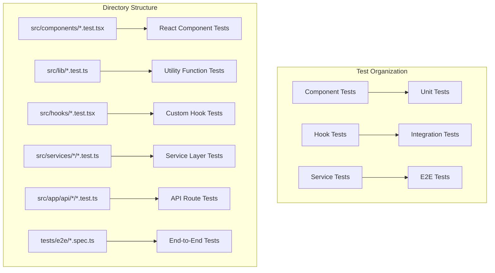
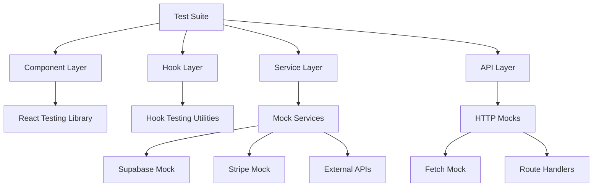
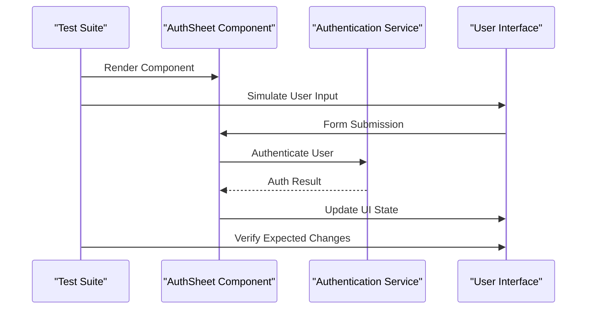
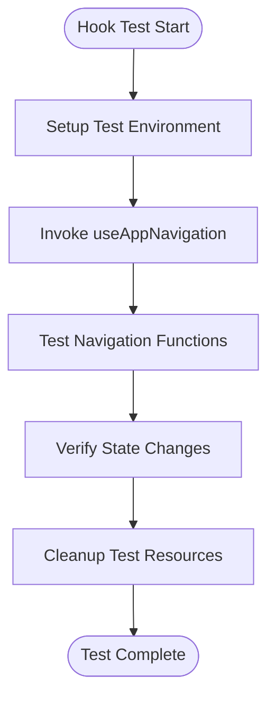
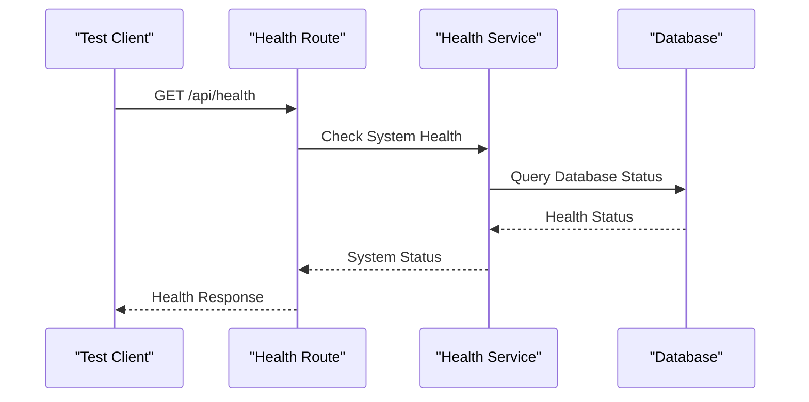

# Unit Testing with Vitest

<cite>
**Referenced Files in This Document**
- [vitest.config.mts](file://vitest.config.mts)
- [vitest.setup.ts](file://vitest.setup.ts)
- [package.json](file://package.json)
- [src/components/ActivityView.test.tsx](file://src/components/ActivityView.test.tsx)
- [src/lib/format.test.ts](file://src/lib/format.test.ts)
- [src/services/backend/supabase.test.ts](file://src/services/backend/supabase.test.ts)
- [src/components/AuthSheet.test.tsx](file://src/components/AuthSheet.test.tsx)
- [src/hooks/useAppNavigation.test.tsx](file://src/hooks/useAppNavigation.test.tsx)
- [src/app/api/health/route.test.ts](file://src/app/api/health/route.test.ts)
- [tests/e2e/phase2-auth.spec.ts](file://tests/e2e/phase2-auth.spec.ts)
</cite>

## Table of Contents
1. [Introduction](#introduction)
2. [Project Structure](#project-structure)
3. [Core Components](#core-components)
4. [Architecture Overview](#architecture-overview)
5. [Detailed Component Analysis](#detailed-component-analysis)
6. [Dependency Analysis](#dependency-analysis)
7. [Performance Considerations](#performance-considerations)
8. [Troubleshooting Guide](#troubleshooting-guide)
9. [Conclusion](#conclusion)

## Introduction

This document provides comprehensive guidance for unit testing the Mooday marketplace application using Vitest. The testing strategy covers React components, utility functions, hooks, services, and API routes with proper mocking strategies for external dependencies like Supabase and Stripe. The approach ensures reliable test execution, maintainable test code, and comprehensive coverage of critical application functionality.

## Project Structure

The Mooday marketplace follows a well-organized testing structure that mirrors the application architecture:



**Diagram sources**
- [src/components/ActivityView.test.tsx:1-50](file://src/components/ActivityView.test.tsx#L1-L50)
- [src/lib/format.test.ts:1-30](file://src/lib/format.test.ts#L1-L30)
- [src/hooks/useAppNavigation.test.tsx:1-40](file://src/hooks/useAppNavigation.test.tsx#L1-L40)
- [src/services/backend/supabase.test.ts:1-60](file://src/services/backend/supabase.test.ts#L1-L60)
- [src/app/api/health/route.test.ts:1-45](file://src/app/api/health/route.test.ts#L1-L45)
- [tests/e2e/phase2-auth.spec.ts:1-35](file://tests/e2e/phase2-auth.spec.ts#L1-L35)

**Section sources**
- [vitest.config.mts:1-100](file://vitest.config.mts#L1-L100)
- [vitest.setup.ts:1-80](file://vitest.setup.ts#L1-L80)
- [package.json:1-150](file://package.json#L1-L150)

## Core Components

### Test Configuration Setup

The Vitest configuration is optimized for React applications with TypeScript support and comprehensive testing capabilities:

#### Environment Setup
- **Node.js Environment**: Configured for modern JavaScript features
- **TypeScript Support**: Full type checking and compilation
- **React Testing Library**: Integrated for component testing
- **Mocking Framework**: Built-in mocking for external dependencies

#### Key Configuration Options
- **Test File Patterns**: Automatic discovery of `.test.ts` and `.test.tsx` files
- **Global Setup**: Centralized test utilities and mocks
- **Coverage Reporting**: Comprehensive coverage metrics generation
- **Parallel Execution**: Optimized test running performance

**Section sources**
- [vitest.config.mts:1-100](file://vitest.config.mts#L1-L100)
- [vitest.setup.ts:1-80](file://vitest.setup.ts#L1-L80)

### Test File Organization Patterns

The project follows consistent naming and organization patterns:

#### Component Testing Pattern
```typescript
// Component name.test.tsx
import { render, screen } from '@testing-library/react'
import { describe, it, expect } from 'vitest'
import ComponentName from './ComponentName'

describe('ComponentName', () => {
  it('renders correctly', () => {
    render(<ComponentName />)
    expect(screen.getByText(/expected text/i)).toBeInTheDocument()
  })
})
```

#### Utility Function Testing Pattern
```typescript
// utility.test.ts
import { describe, it, expect } from 'vitest'
import { utilityFunction } from './utility'

describe('utilityFunction', () => {
  it('handles valid input', () => {
    const result = utilityFunction('valid input')
    expect(result).toBe('expected output')
  })
  
  it('handles edge cases', () => {
    const result = utilityFunction('edge case')
    expect(result).toBeDefined()
  })
})
```

**Section sources**
- [src/components/ActivityView.test.tsx:1-50](file://src/components/ActivityView.test.tsx#L1-L50)
- [src/lib/format.test.ts:1-30](file://src/lib/format.test.ts#L1-L30)

## Architecture Overview

The testing architecture follows a layered approach that mirrors the application's service layer pattern:



**Diagram sources**
- [src/services/backend/supabase.test.ts:1-60](file://src/services/backend/supabase.test.ts#L1-L60)
- [src/app/api/health/route.test.ts:1-45](file://src/app/api/health/route.test.ts#L1-L45)

## Detailed Component Analysis

### React Component Testing

Component testing focuses on rendering, user interactions, and state management:

#### Authentication Flow Testing


**Diagram sources**
- [src/components/AuthSheet.test.tsx:1-80](file://src/components/AuthSheet.test.tsx#L1-L80)

#### Form Validation Testing
- **Input Validation**: Test form field validation rules
- **Error Handling**: Verify error message display
- **State Management**: Check component state updates
- **User Interactions**: Simulate real user input patterns

**Section sources**
- [src/components/AuthSheet.test.tsx:1-80](file://src/components/AuthSheet.test.tsx#L1-L80)

### Custom Hook Testing

Hook testing validates business logic and side effects:

#### Navigation Hook Testing


**Diagram sources**
- [src/hooks/useAppNavigation.test.tsx:1-40](file://src/hooks/useAppNavigation.test.tsx#L1-L40)

**Section sources**
- [src/hooks/useAppNavigation.test.tsx:1-40](file://src/hooks/useAppNavigation.test.tsx#L1-L40)

### Service Layer Testing

Service testing focuses on external API integration and data operations:

#### Supabase Integration Testing
- **Database Operations**: Mock database queries and mutations
- **Authentication**: Test user authentication flows
- **Data Fetching**: Validate data retrieval and transformation
- **Error Handling**: Test error scenarios and recovery

#### Stripe Payment Testing
- **Payment Processing**: Mock payment intent creation
- **Webhook Handling**: Test webhook event processing
- **Subscription Management**: Validate subscription operations
- **Error Scenarios**: Test payment failures and retries

**Section sources**
- [src/services/backend/supabase.test.ts:1-60](file://src/services/backend/supabase.test.ts#L1-L60)

### API Route Testing

API route testing ensures backend functionality works correctly:

#### Health Check Endpoint Testing


**Diagram sources**
- [src/app/api/health/route.test.ts:1-45](file://src/app/api/health/route.test.ts#L1-L45)

**Section sources**
- [src/app/api/health/route.test.ts:1-45](file://src/app/api/health/route.test.ts#L1-L45)

## Dependency Analysis

### External Service Mocking Strategy

The testing strategy employs comprehensive mocking for external dependencies:

#### Supabase Mocking
- **Database Queries**: Mock all database operations
- **Real-time Subscriptions**: Mock WebSocket connections
- **Authentication**: Mock user sessions and permissions
- **Storage Operations**: Mock file upload/download

#### Stripe Mocking
- **Payment Intents**: Mock payment creation and confirmation
- **Webhook Events**: Mock Stripe webhook payloads
- **Customer Management**: Mock customer operations
- **Subscription Lifecycle**: Mock subscription changes

#### Network Request Mocking
- **HTTP Requests**: Intercept and mock fetch requests
- **API Responses**: Provide controlled response data
- **Error Scenarios**: Simulate network failures
- **Rate Limiting**: Handle API rate limits in tests

**Section sources**
- [vitest.setup.ts:1-80](file://vitest.setup.ts#L1-L80)
- [src/services/backend/supabase.test.ts:1-60](file://src/services/backend/supabase.test.ts#L1-L60)

## Performance Considerations

### Test Optimization Strategies

#### Parallel Test Execution
- **Isolation**: Ensure tests run independently without shared state
- **Resource Management**: Proper cleanup between test runs
- **Memory Usage**: Monitor and optimize memory consumption
- **Execution Time**: Minimize test execution time through efficient mocking

#### Mocking Performance
- **Lazy Loading**: Load mocks only when needed
- **Minimal Dependencies**: Keep mock implementations lightweight
- **Caching**: Cache expensive mock setup operations
- **Selective Mocking**: Only mock necessary dependencies

#### Database Testing Optimization
- **In-Memory Databases**: Use SQLite or in-memory alternatives
- **Test Data Seeding**: Efficient data setup and teardown
- **Connection Pooling**: Optimize database connection usage
- **Query Optimization**: Write efficient test queries

## Troubleshooting Guide

### Common Testing Issues

#### Flaky Tests
- **Timing Issues**: Use proper async/await patterns
- **Race Conditions**: Implement proper synchronization
- **Shared State**: Ensure test isolation
- **Network Dependencies**: Mock all external calls

#### Mocking Problems
- **Circular Dependencies**: Restructure code to avoid circular imports
- **Incomplete Mocks**: Ensure all required methods are mocked
- **State Leakage**: Clean up test state between runs
- **Type Errors**: Maintain proper TypeScript types in mocks

#### Performance Issues
- **Slow Tests**: Identify and optimize slow test sections
- **Memory Leaks**: Monitor memory usage during test execution
- **Resource Exhaustion**: Properly clean up resources
- **Database Connections**: Manage connection lifecycle

### Debugging Techniques

#### Test Output Analysis
- **Console Logging**: Use structured logging for better debugging
- **Snapshot Testing**: Capture and compare component snapshots
- **Visual Regression**: Detect UI changes automatically
- **Performance Metrics**: Track test execution times

#### Interactive Debugging
- **Breakpoints**: Set breakpoints in test files
- **Step-through Debugging**: Debug individual test cases
- **Variable Inspection**: Inspect test variables and state
- **Stack Traces**: Analyze error stack traces effectively

## Conclusion

The Mooday marketplace implements a comprehensive testing strategy using Vitest that covers all layers of the application architecture. The testing approach ensures reliability, maintainability, and performance while providing confidence in code changes through automated testing. The modular test structure, effective mocking strategies, and comprehensive coverage requirements create a robust foundation for continuous integration and deployment.

Key benefits of this testing approach include:
- **Reliability**: Consistent test execution across different environments
- **Maintainability**: Clear test organization and naming conventions
- **Performance**: Optimized test execution with parallel processing
- **Coverage**: Comprehensive coverage of critical application functionality
- **Documentation**: Tests serve as living documentation for expected behavior

This testing framework enables rapid development with confidence, ensuring that changes to the marketplace functionality don't introduce regressions while maintaining high code quality standards.