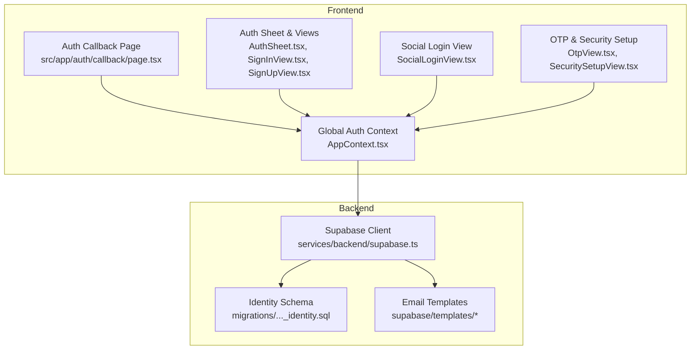
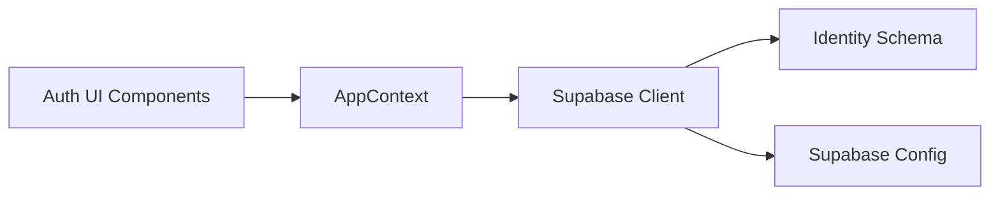
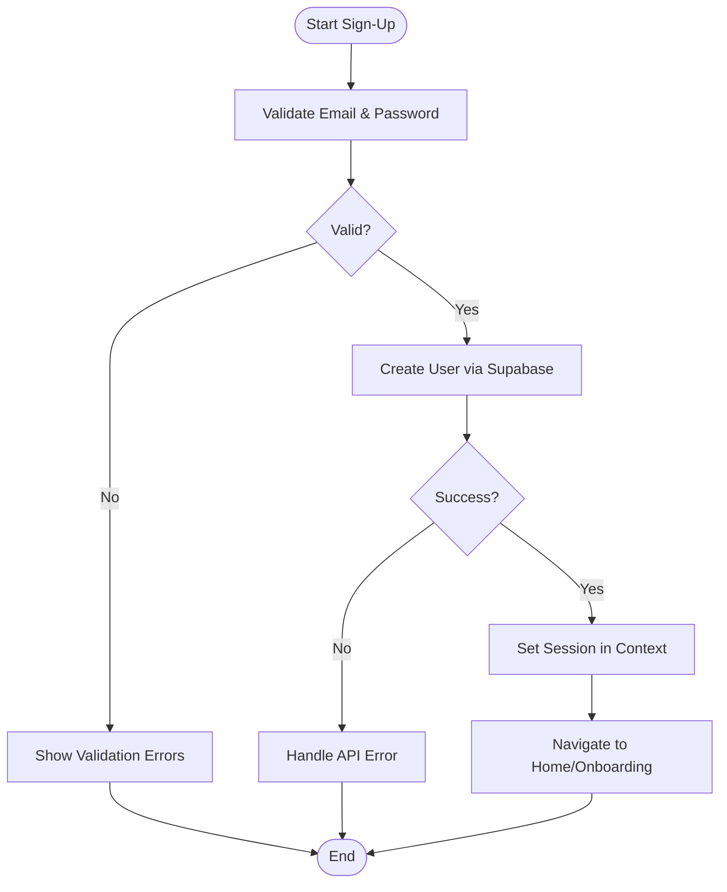
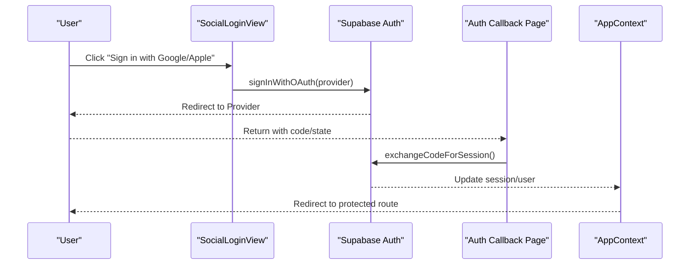

# Authentication System

<cite>
**Referenced Files in This Document**
- [src/app/auth/callback/page.tsx](file://src/app/auth/callback/page.tsx)
- [src/components/AuthSheet.tsx](file://src/components/AuthSheet.tsx)
- [src/components/SignInView.tsx](file://src/components/SignInView.tsx)
- [src/components/SignUpView.tsx](file://src/components/SignUpView.tsx)
- [src/components/SocialLoginView.tsx](file://src/components/SocialLoginView.tsx)
- [src/components/OtpView.tsx](file://src/components/OtpView.tsx)
- [src/components/ForgotPasswordView.tsx](file://src/components/ForgotPasswordView.tsx)
- [src/components/SecuritySetupView.tsx](file://src/components/SecuritySetupView.tsx)
- [src/context/AppContext.tsx](file://src/context/AppContext.tsx)
- [src/services/backend/supabase.ts](file://src/services/backend/supabase.ts)
- [src/lib/security.ts](file://src/lib/security.ts)
- [supabase/migrations/202607150001_phase_2_identity.sql](file://supabase/migrations/202607150001_phase_2_identity.sql)
- [supabase/config.toml](file://supabase/config.toml)
- [tests/e2e/phase2-auth.spec.ts](file://tests/e2e/phase2-auth.spec.ts)
</cite>

## Table of Contents
1. [Introduction](#introduction)
2. [Project Structure](#project-structure)
3. [Core Components](#core-components)
4. [Architecture Overview](#architecture-overview)
5. [Detailed Component Analysis](#detailed-component-analysis)
6. [Dependency Analysis](#dependency-analysis)
7. [Performance Considerations](#performance-considerations)
8. [Troubleshooting Guide](#troubleshooting-guide)
9. [Conclusion](#conclusion)
10. [Appendices](#appendices)

## Introduction
This document explains the authentication system used by Mooday, focusing on Supabase Auth integration, OAuth flows for Google and Apple sign-in, email/password authentication, OTP verification, state management, session handling, persistence, form validation, error handling, user feedback, social login redirect handling, account linking, security considerations (token management, CSRF protection, secure storage), and examples of hooks, protected routes, and role-based access control.

## Project Structure
Mooday’s authentication spans UI components, a global context for auth state, a Supabase client service, and Supabase migrations/templates. The key areas are:
- App-level callback route for OAuth redirects
- Auth UI components for sign-in, sign-up, social login, OTP, password reset, and security setup
- Global app context that manages auth state and session lifecycle
- Supabase client configuration and identity schema
- End-to-end tests validating auth flows



**Diagram sources**
- [src/app/auth/callback/page.tsx](file://src/app/auth/callback/page.tsx)
- [src/components/AuthSheet.tsx](file://src/components/AuthSheet.tsx)
- [src/components/SignInView.tsx](file://src/components/SignInView.tsx)
- [src/components/SignUpView.tsx](file://src/components/SignUpView.tsx)
- [src/components/SocialLoginView.tsx](file://src/components/SocialLoginView.tsx)
- [src/components/OtpView.tsx](file://src/components/OtpView.tsx)
- [src/components/SecuritySetupView.tsx](file://src/components/SecuritySetupView.tsx)
- [src/context/AppContext.tsx](file://src/context/AppContext.tsx)
- [src/services/backend/supabase.ts](file://src/services/backend/supabase.ts)
- [supabase/migrations/202607150001_phase_2_identity.sql](file://supabase/migrations/202607150001_phase_2_identity.sql)

**Section sources**
- [src/app/auth/callback/page.tsx](file://src/app/auth/callback/page.tsx)
- [src/components/AuthSheet.tsx](file://src/components/AuthSheet.tsx)
- [src/components/SignInView.tsx](file://src/components/SignInView.tsx)
- [src/components/SignUpView.tsx](file://src/components/SignUpView.tsx)
- [src/components/SocialLoginView.tsx](file://src/components/SocialLoginView.tsx)
- [src/components/OtpView.tsx](file://src/components/OtpView.tsx)
- [src/components/SecuritySetupView.tsx](file://src/components/SecuritySetupView.tsx)
- [src/context/AppContext.tsx](file://src/context/AppContext.tsx)
- [src/services/backend/supabase.ts](file://src/services/backend/supabase.ts)
- [supabase/migrations/202607150001_phase_2_identity.sql](file://supabase/migrations/202607150001_phase_2_identity.sql)

## Core Components
- Supabase Auth client: Centralized client for all auth operations, including OAuth providers and email/password flows.
- Global auth context: Manages current user, session, loading states, and exposes actions to sign in/out, link accounts, and handle OTP.
- OAuth callback page: Completes provider redirects and updates local auth state.
- Auth UI views: Provide forms and interactions for sign-in, sign-up, social login, OTP verification, password reset, and security setup.
- Security utilities: Helpers for safe storage and token handling practices.

Key responsibilities:
- Normalize errors and present user-friendly messages
- Persist sessions via Supabase Auth cookies/session store
- Handle provider-specific redirect flows and account linking
- Enforce role-based access where applicable using Supabase roles or custom claims

**Section sources**
- [src/services/backend/supabase.ts](file://src/services/backend/supabase.ts)
- [src/context/AppContext.tsx](file://src/context/AppContext.tsx)
- [src/app/auth/callback/page.tsx](file://src/app/auth/callback/page.tsx)
- [src/components/SignInView.tsx](file://src/components/SignInView.tsx)
- [src/components/SignUpView.tsx](file://src/components/SignUpView.tsx)
- [src/components/SocialLoginView.tsx](file://src/components/SocialLoginView.tsx)
- [src/components/OtpView.tsx](file://src/components/OtpView.tsx)
- [src/components/ForgotPasswordView.tsx](file://src/components/ForgotPasswordView.tsx)
- [src/components/SecuritySetupView.tsx](file://src/components/SecuritySetupView.tsx)
- [src/lib/security.ts](file://src/lib/security.ts)

## Architecture Overview
The authentication architecture integrates Next.js pages and React components with Supabase Auth. OAuth providers redirect through a dedicated callback route that finalizes the session and updates the global context. Email/password and OTP flows are handled within UI components and persisted via Supabase.

```mermaid
sequenceDiagram
participant U as "User"
participant UI as "Auth UI Components"
participant CTX as "AppContext"
participant CB as "Auth Callback Page"
participant SB as "Supabase Auth"
participant DB as "Supabase Identity"
U->>UI : Initiate Sign-In (OAuth or Email/Password)
alt OAuth
UI->>SB : signInWithOAuth(provider)
SB-->>U : Redirect to Provider
U-->>CB : Return with code/state
CB->>SB : exchangeCodeForSession()
SB-->>CTX : Update session/user
CTX-->>UI : Re-render with authenticated state
else Email/Password
UI->>SB : signInWithPassword(email, password)
SB-->>CTX : Update session/user
CTX-->>UI : Re-render with authenticated state
end
Note over SB,DB : Session stored securely; tokens managed by Supabase
```

**Diagram sources**
- [src/components/SocialLoginView.tsx](file://src/components/SocialLoginView.tsx)
- [src/components/SignInView.tsx](file://src/components/SignInView.tsx)
- [src/app/auth/callback/page.tsx](file://src/app/auth/callback/page.tsx)
- [src/context/AppContext.tsx](file://src/context/AppContext.tsx)
- [src/services/backend/supabase.ts](file://src/services/backend/supabase.ts)
- [supabase/migrations/202607150001_phase_2_identity.sql](file://supabase/migrations/202607150001_phase_2_identity.sql)

## Detailed Component Analysis

### Supabase Integration and Client
- Provides a configured client for Supabase Auth and database access.
- Encapsulates provider initialization and environment configuration.
- Exposes methods for sign-in, sign-out, session refresh, and user profile operations.

Best practices observed:
- Centralize configuration to avoid duplication.
- Use Supabase-managed sessions to persist across reloads.
- Keep sensitive values out of client-side code.

**Section sources**
- [src/services/backend/supabase.ts](file://src/services/backend/supabase.ts)
- [supabase/config.toml](file://supabase/config.toml)

### Global Auth State Management (AppContext)
- Holds current user, session, and loading/error states.
- Provides actions to sign in/out, handle OTP, and manage account linking.
- Subscribes to Supabase auth changes to keep UI in sync.

Patterns:
- Single source of truth for auth state.
- Normalized error handling and user feedback.
- Safe rehydration on app start from Supabase session.

**Section sources**
- [src/context/AppContext.tsx](file://src/context/AppContext.tsx)

### OAuth Flows: Google and Apple Sign-In
- SocialLoginView initiates OAuth with selected provider.
- User is redirected to the provider; upon return, Auth Callback Page finalizes the session.
- Account linking is supported when a user signs in with a new provider while already authenticated.

Flow highlights:
- Provider-specific scopes and parameters are handled by Supabase.
- Redirect URI must be registered in provider consoles and Supabase project settings.
- On success, context updates and navigation proceeds to protected routes.

**Section sources**
- [src/components/SocialLoginView.tsx](file://src/components/SocialLoginView.tsx)
- [src/app/auth/callback/page.tsx](file://src/app/auth/callback/page.tsx)
- [src/context/AppContext.tsx](file://src/context/AppContext.tsx)

### Email/Password Authentication
- SignInView and SignUpView collect credentials and call Supabase Auth.
- Form validation ensures required fields and format correctness before submission.
- Errors are normalized and displayed to users; success transitions to app home or next step.

Security notes:
- Passwords are never logged or stored locally.
- Rate limiting and account lockout policies are enforced server-side by Supabase.

**Section sources**
- [src/components/SignInView.tsx](file://src/components/SignInView.tsx)
- [src/components/SignUpView.tsx](file://src/components/SignUpView.tsx)

### OTP Verification
- OtpView handles one-time password entry and verification.
- Supports resending codes and validates input length/format.
- Integrates with Supabase OTP flows and updates context upon success.

UX considerations:
- Clear instructions and countdown timers for resend.
- Inline validation and accessible error messages.

**Section sources**
- [src/components/OtpView.tsx](file://src/components/OtpView.tsx)

### Password Reset Flow
- ForgotPasswordView requests a recovery email via Supabase.
- Uses Supabase templates for email content and links.
- After reset, user can sign in with the new password.

**Section sources**
- [src/components/ForgotPasswordView.tsx](file://src/components/ForgotPasswordView.tsx)

### Security Setup and Device Trust
- SecuritySetupView guides users through enabling additional security measures (e.g., device trust, 2FA if enabled).
- Persists preferences and may trigger re-authentication for sensitive actions.

**Section sources**
- [src/components/SecuritySetupView.tsx](file://src/components/SecuritySetupView.tsx)

### Protected Routes and Role-Based Access Control
- Protected routes check the current user and roles from the global context.
- If unauthenticated or lacking required roles, users are redirected to sign-in or an appropriate landing.
- Roles can be derived from Supabase roles or custom metadata; enforce at both client and server layers.

Example pattern:
- Wrap route components with a guard that reads context and conditionally renders or redirects.

**Section sources**
- [src/context/AppContext.tsx](file://src/context/AppContext.tsx)

### Hooks and Utilities
- Custom hooks abstract common auth tasks such as checking authentication status, refreshing sessions, and handling provider redirects.
- Utility functions normalize errors and provide consistent user feedback.

**Section sources**
- [src/lib/security.ts](file://src/lib/security.ts)
- [src/context/AppContext.tsx](file://src/context/AppContext.tsx)

## Dependency Analysis
The authentication system has clear boundaries:
- UI components depend on the global context for state and actions.
- The context depends on the Supabase client for auth operations.
- Supabase client depends on environment configuration and identity schema.



**Diagram sources**
- [src/components/SignInView.tsx](file://src/components/SignInView.tsx)
- [src/components/SignUpView.tsx](file://src/components/SignUpView.tsx)
- [src/components/SocialLoginView.tsx](file://src/components/SocialLoginView.tsx)
- [src/components/OtpView.tsx](file://src/components/OtpView.tsx)
- [src/context/AppContext.tsx](file://src/context/AppContext.tsx)
- [src/services/backend/supabase.ts](file://src/services/backend/supabase.ts)
- [supabase/migrations/202607150001_phase_2_identity.sql](file://supabase/migrations/202607150001_phase_2_identity.sql)
- [supabase/config.toml](file://supabase/config.toml)

**Section sources**
- [src/context/AppContext.tsx](file://src/context/AppContext.tsx)
- [src/services/backend/supabase.ts](file://src/services/backend/supabase.ts)
- [supabase/migrations/202607150001_phase_2_identity.sql](file://supabase/migrations/202607150001_phase_2_identity.sql)

## Performance Considerations
- Minimize re-renders by memoizing auth state consumers.
- Debounce rapid sign-in attempts to reduce network load.
- Use Supabase’s built-in session persistence to avoid redundant checks.
- Defer heavy computations until after successful authentication.

[No sources needed since this section provides general guidance]

## Troubleshooting Guide
Common issues and resolutions:
- OAuth redirect mismatches: Ensure callback URLs match provider and Supabase settings.
- Missing environment variables: Verify Supabase URL and anon/public keys are set.
- Session not persisting: Check browser cookie/storage policies and Supabase config.
- OTP delivery failures: Validate email templates and provider quotas.
- Role-based access denied: Confirm user roles and RLS policies.

Validation and testing:
- Use end-to-end tests to validate sign-in, sign-up, OAuth, and OTP flows.
- Inspect network logs for failed requests and error payloads.

**Section sources**
- [tests/e2e/phase2-auth.spec.ts](file://tests/e2e/phase2-auth.spec.ts)
- [src/app/auth/callback/page.tsx](file://src/app/auth/callback/page.tsx)
- [src/context/AppContext.tsx](file://src/context/AppContext.tsx)
- [src/services/backend/supabase.ts](file://src/services/backend/supabase.ts)

## Conclusion
Mooday’s authentication system leverages Supabase Auth for robust, secure identity management across OAuth and email/password flows. The global context centralizes state and actions, while dedicated UI components provide intuitive experiences for sign-in, sign-up, OTP, and security setup. Proper redirect handling, account linking, and role-based access ensure a seamless and secure user journey. Adhering to security best practices and comprehensive testing helps maintain reliability and trust.

[No sources needed since this section summarizes without analyzing specific files]

## Appendices

### Security Considerations
- Token management: Rely on Supabase-managed sessions; avoid storing raw tokens in client storage.
- CSRF protection: Use Supabase’s built-in protections and ensure proper CORS and origin settings.
- Secure storage: Do not log secrets; use environment variables; prefer HttpOnly cookies for sessions.
- Input validation: Validate on both client and server; sanitize inputs to prevent injection.
- Error handling: Avoid leaking sensitive details in client errors; normalize messages for users.

**Section sources**
- [src/lib/security.ts](file://src/lib/security.ts)
- [supabase/config.toml](file://supabase/config.toml)

### Example Workflows

#### Sign-Up Workflow


**Diagram sources**
- [src/components/SignUpView.tsx](file://src/components/SignUpView.tsx)
- [src/context/AppContext.tsx](file://src/context/AppContext.tsx)
- [src/services/backend/supabase.ts](file://src/services/backend/supabase.ts)

#### OAuth Sign-In Flow


**Diagram sources**
- [src/components/SocialLoginView.tsx](file://src/components/SocialLoginView.tsx)
- [src/app/auth/callback/page.tsx](file://src/app/auth/callback/page.tsx)
- [src/context/AppContext.tsx](file://src/context/AppContext.tsx)
- [src/services/backend/supabase.ts](file://src/services/backend/supabase.ts)