# Security Settings

<cite>
**Referenced Files in This Document**
- [SecuritySetupView.tsx](file://src/components/SecuritySetupView.tsx)
- [LockScreen.tsx](file://src/components/LockScreen.tsx)
- [useIdleLock.ts](file://src/hooks/useIdleLock.ts)
- [security.ts](file://src/lib/security.ts)
- [AppContext.tsx](file://src/context/AppContext.tsx)
- [AuthSheet.tsx](file://src/components/AuthSheet.tsx)
- [SignInView.tsx](file://src/components/SignInView.tsx)
- [SignUpView.tsx](file://src/components/SignUpView.tsx)
- [ForgotPasswordView.tsx](file://src/components/ForgotPasswordView.tsx)
- [OtpView.tsx](file://src/components/OtpView.tsx)
- [SettingsView.tsx](file://src/components/SettingsView.tsx)
- [AdminAuditLogTab.tsx](file://src/components/admin/AdminAuditLogTab.tsx)
- [supabase.ts](file://src/services/backend/supabase.ts)
- [config.ts](file://src/services/backend/config.ts)
- [202607150001_phase_2_identity.sql](file://supabase/migrations/202607150001_phase_2_identity.sql)
</cite>

## Table of Contents
1. [Introduction](#introduction)
2. [Project Structure](#project-structure)
3. [Core Components](#core-components)
4. [Architecture Overview](#architecture-overview)
5. [Detailed Component Analysis](#detailed-component-analysis)
6. [Dependency Analysis](#dependency-analysis)
7. [Performance Considerations](#performance-considerations)
8. [Troubleshooting Guide](#troubleshooting-guide)
9. [Conclusion](#conclusion)
10. [Appendices](#appendices)

## Introduction
This document explains the security settings and features implemented in Mooday, focusing on password management, two-factor authentication setup, session security policies, idle lock and automatic screen locking, device trust mechanisms, encryption methods, secure communication protocols, audit logs, suspicious activity detection, account protection measures, configuration options, policy enforcement, user preferences, compliance considerations, data protection standards, privacy controls, and examples of security hooks, encryption utilities, and secure storage implementations.

## Project Structure
Mooday’s security-related functionality spans UI components, hooks, context providers, backend services, and database migrations:
- Authentication flows and 2FA are driven by UI views and a shared auth sheet.
- Session and idle lock behavior is managed via a dedicated hook and a lock screen component.
- Security utilities provide helpers for hashing and token handling.
- Backend integration uses Supabase for identity and session management.
- Audit logging is exposed through an admin tab.

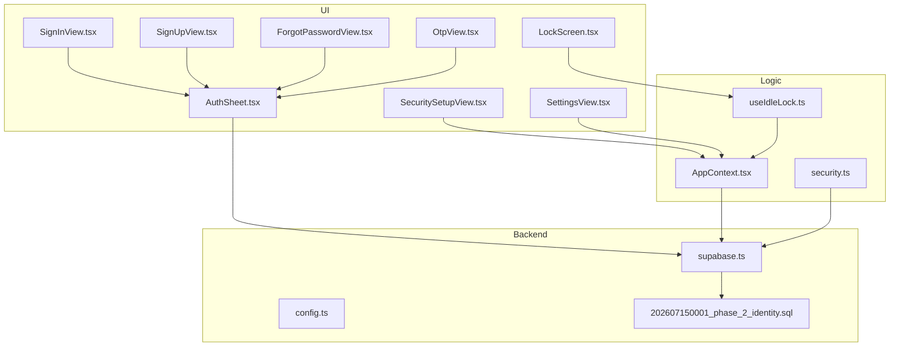

**Diagram sources**
- [SecuritySetupView.tsx](file://src/components/SecuritySetupView.tsx)
- [LockScreen.tsx](file://src/components/LockScreen.tsx)
- [useIdleLock.ts](file://src/hooks/useIdleLock.ts)
- [AppContext.tsx](file://src/context/AppContext.tsx)
- [security.ts](file://src/lib/security.ts)
- [AuthSheet.tsx](file://src/components/AuthSheet.tsx)
- [SignInView.tsx](file://src/components/SignInView.tsx)
- [SignUpView.tsx](file://src/components/SignUpView.tsx)
- [ForgotPasswordView.tsx](file://src/components/ForgotPasswordView.tsx)
- [OtpView.tsx](file://src/components/OtpView.tsx)
- [SettingsView.tsx](file://src/components/SettingsView.tsx)
- [supabase.ts](file://src/services/backend/supabase.ts)
- [config.ts](file://src/services/backend/config.ts)
- [202607150001_phase_2_identity.sql](file://supabase/migrations/202607150001_phase_2_identity.sql)

**Section sources**
- [SecuritySetupView.tsx](file://src/components/SecuritySetupView.tsx)
- [LockScreen.tsx](file://src/components/LockScreen.tsx)
- [useIdleLock.ts](file://src/hooks/useIdleLock.ts)
- [AppContext.tsx](file://src/context/AppContext.tsx)
- [security.ts](file://src/lib/security.ts)
- [AuthSheet.tsx](file://src/components/AuthSheet.tsx)
- [SignInView.tsx](file://src/components/SignInView.tsx)
- [SignUpView.tsx](file://src/components/SignUpView.tsx)
- [ForgotPasswordView.tsx](file://src/components/ForgotPasswordView.tsx)
- [OtpView.tsx](file://src/components/OtpView.tsx)
- [SettingsView.tsx](file://src/components/SettingsView.tsx)
- [supabase.ts](file://src/services/backend/supabase.ts)
- [config.ts](file://src/services/backend/config.ts)
- [202607150001_phase_2_identity.sql](file://supabase/migrations/202607150001_phase_2_identity.sql)

## Core Components
- Security setup flow: Orchestrates enabling or configuring security features such as 2FA and app lock preferences.
- Lock screen: Enforces immediate access control when the app is locked or idle.
- Idle lock hook: Tracks user inactivity and triggers lock events based on configured thresholds.
- Auth sheet and sign-in/sign-up/forgot-password/OTP views: Provide secure authentication and recovery flows.
- App context: Centralizes session state, security flags, and policy enforcement across the app.
- Security utilities: Offer helpers for hashing and token operations used by auth flows.
- Backend integration: Uses Supabase for identity, sessions, and secure communications.

Key responsibilities:
- Password management: Sign-up, sign-in, password reset, and OTP verification.
- Two-factor authentication: Setup and verification steps integrated into the auth flow.
- Session security: Policy enforcement via context and backend session tokens.
- Idle lock and auto-lock: Time-based locking with configurable thresholds.
- Device trust: Managed through session persistence and optional trusted device signals (as supported by the backend).

**Section sources**
- [SecuritySetupView.tsx](file://src/components/SecuritySetupView.tsx)
- [LockScreen.tsx](file://src/components/LockScreen.tsx)
- [useIdleLock.ts](file://src/hooks/useIdleLock.ts)
- [AppContext.tsx](file://src/context/AppContext.tsx)
- [security.ts](file://src/lib/security.ts)
- [AuthSheet.tsx](file://src/components/AuthSheet.tsx)
- [SignInView.tsx](file://src/components/SignInView.tsx)
- [SignUpView.tsx](file://src/components/SignUpView.tsx)
- [ForgotPasswordView.tsx](file://src/components/ForgotPasswordView.tsx)
- [OtpView.tsx](file://src/components/OtpView.tsx)
- [supabase.ts](file://src/services/backend/supabase.ts)

## Architecture Overview
The security architecture integrates UI-driven flows with backend identity services and local session/state management.

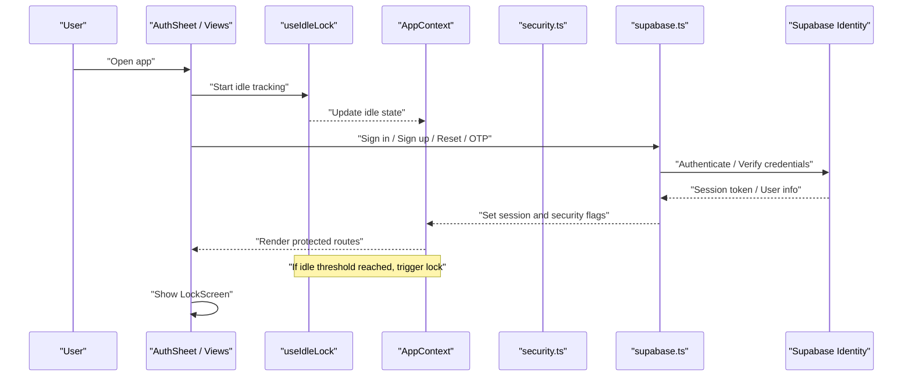

**Diagram sources**
- [AuthSheet.tsx](file://src/components/AuthSheet.tsx)
- [SignInView.tsx](file://src/components/SignInView.tsx)
- [SignUpView.tsx](file://src/components/SignUpView.tsx)
- [ForgotPasswordView.tsx](file://src/components/ForgotPasswordView.tsx)
- [OtpView.tsx](file://src/components/OtpView.tsx)
- [useIdleLock.ts](file://src/hooks/useIdleLock.ts)
- [AppContext.tsx](file://src/context/AppContext.tsx)
- [security.ts](file://src/lib/security.ts)
- [supabase.ts](file://src/services/backend/supabase.ts)

## Detailed Component Analysis

### Password Management
- Sign-up and sign-in: Handled by dedicated views that integrate with the shared auth sheet and backend identity service.
- Password reset: Provided via a forgot-password view that initiates recovery flows through the backend.
- OTP verification: A separate view manages one-time code entry during recovery or 2FA steps.

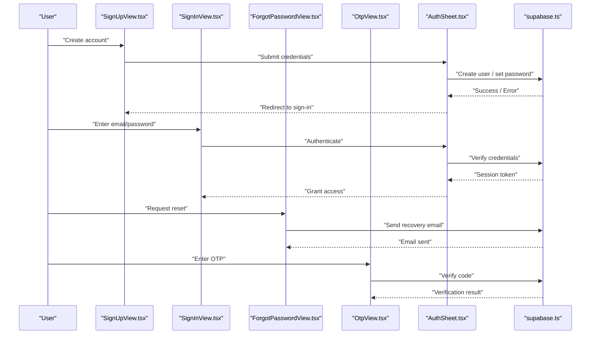

**Diagram sources**
- [SignUpView.tsx](file://src/components/SignUpView.tsx)
- [SignInView.tsx](file://src/components/SignInView.tsx)
- [ForgotPasswordView.tsx](file://src/components/ForgotPasswordView.tsx)
- [OtpView.tsx](file://src/components/OtpView.tsx)
- [AuthSheet.tsx](file://src/components/AuthSheet.tsx)
- [supabase.ts](file://src/services/backend/supabase.ts)

**Section sources**
- [SignInView.tsx](file://src/components/SignInView.tsx)
- [SignUpView.tsx](file://src/components/SignUpView.tsx)
- [ForgotPasswordView.tsx](file://src/components/ForgotPasswordView.tsx)
- [OtpView.tsx](file://src/components/OtpView.tsx)
- [AuthSheet.tsx](file://src/components/AuthSheet.tsx)
- [supabase.ts](file://src/services/backend/supabase.ts)

### Two-Factor Authentication (2FA)
- Setup and verification are integrated into the authentication flow using the OTP view and auth sheet.
- The security setup view allows users to configure 2FA preferences and complete enrollment steps.

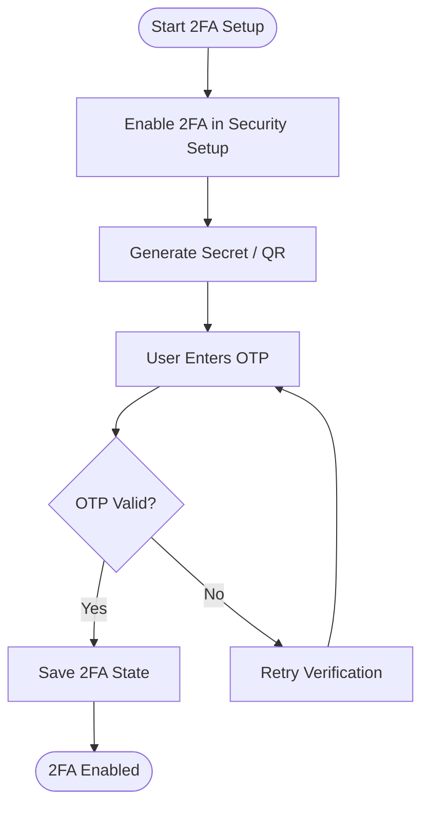

**Diagram sources**
- [SecuritySetupView.tsx](file://src/components/SecuritySetupView.tsx)
- [OtpView.tsx](file://src/components/OtpView.tsx)
- [AuthSheet.tsx](file://src/components/AuthSheet.tsx)

**Section sources**
- [SecuritySetupView.tsx](file://src/components/SecuritySetupView.tsx)
- [OtpView.tsx](file://src/components/OtpView.tsx)
- [AuthSheet.tsx](file://src/components/AuthSheet.tsx)

### Session Security Policies
- Session state and security flags are centralized in the application context, which enforces access controls and updates UI accordingly.
- Backend integration handles token issuance and validation via Supabase.

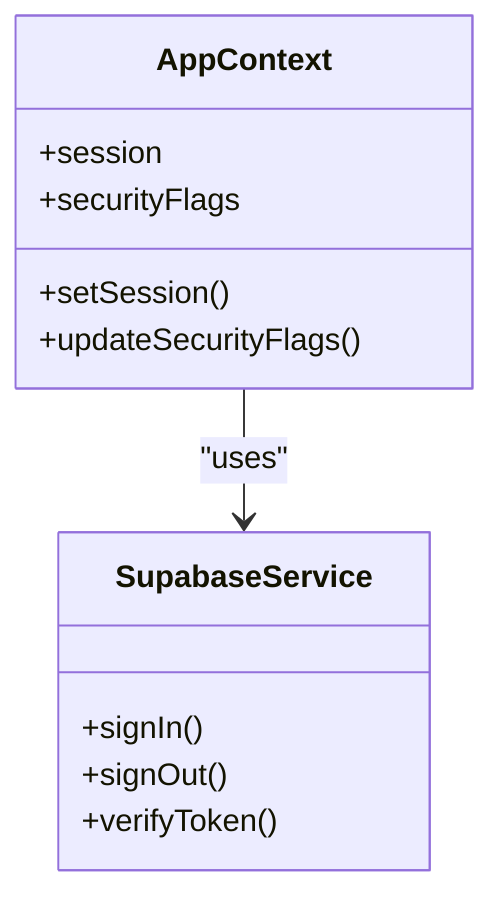

**Diagram sources**
- [AppContext.tsx](file://src/context/AppContext.tsx)
- [supabase.ts](file://src/services/backend/supabase.ts)

**Section sources**
- [AppContext.tsx](file://src/context/AppContext.tsx)
- [supabase.ts](file://src/services/backend/supabase.ts)

### Idle Lock and Automatic Screen Locking
- The idle lock hook monitors user activity and notifies the context when inactivity exceeds thresholds.
- The lock screen component enforces immediate access control when triggered.

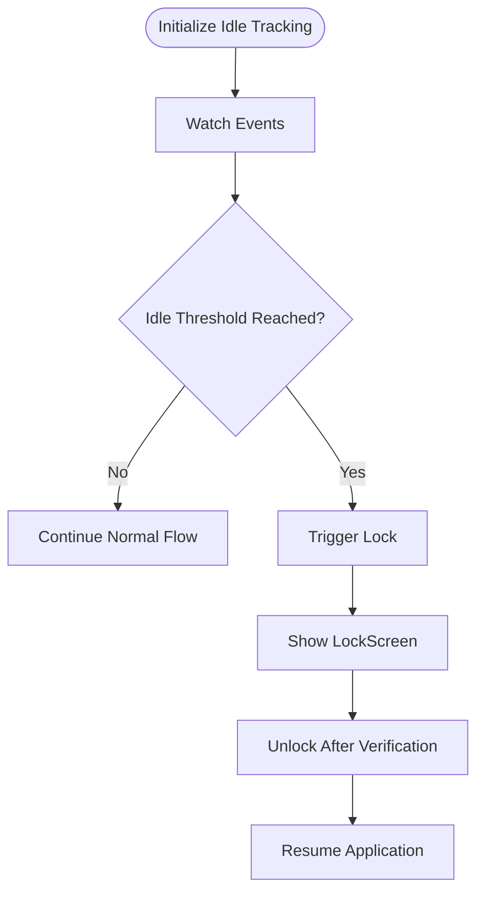

**Diagram sources**
- [useIdleLock.ts](file://src/hooks/useIdleLock.ts)
- [LockScreen.tsx](file://src/components/LockScreen.tsx)
- [AppContext.tsx](file://src/context/AppContext.tsx)

**Section sources**
- [useIdleLock.ts](file://src/hooks/useIdleLock.ts)
- [LockScreen.tsx](file://src/components/LockScreen.tsx)
- [AppContext.tsx](file://src/context/AppContext.tsx)

### Device Trust Mechanisms
- Device trust is managed through session persistence and backend identity services. Trusted device signals can be inferred from consistent sessions and environment attributes handled by the backend.

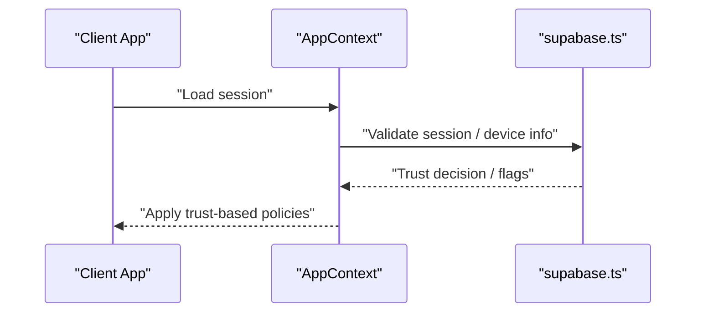

**Diagram sources**
- [AppContext.tsx](file://src/context/AppContext.tsx)
- [supabase.ts](file://src/services/backend/supabase.ts)

**Section sources**
- [AppContext.tsx](file://src/context/AppContext.tsx)
- [supabase.ts](file://src/services/backend/supabase.ts)

### Encryption Methods and Secure Storage
- Security utilities provide helper functions for hashing and token operations used within authentication flows.
- Secure storage practices rely on backend-managed sessions and tokens; client-side sensitive data should be minimized and handled via secure channels.

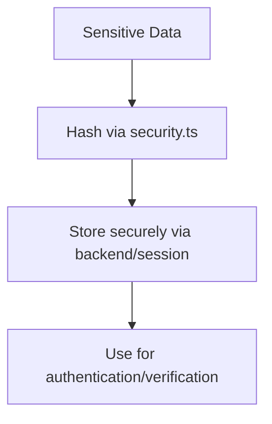

**Diagram sources**
- [security.ts](file://src/lib/security.ts)
- [supabase.ts](file://src/services/backend/supabase.ts)

**Section sources**
- [security.ts](file://src/lib/security.ts)
- [supabase.ts](file://src/services/backend/supabase.ts)

### Secure Communication Protocols
- All communications with the backend use HTTPS and Supabase’s secure transport.
- Configuration ensures proper endpoints and environment variables for secure connections.

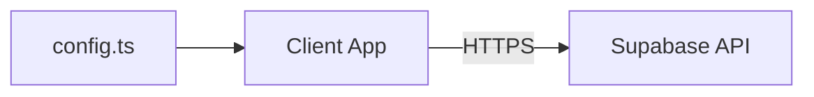

**Diagram sources**
- [config.ts](file://src/services/backend/config.ts)
- [supabase.ts](file://src/services/backend/supabase.ts)

**Section sources**
- [config.ts](file://src/services/backend/config.ts)
- [supabase.ts](file://src/services/backend/supabase.ts)

### Security Audit Logs and Suspicious Activity Detection
- Admin audit log tab exposes logs for administrative review, supporting visibility into security-relevant actions.
- Suspicious activity detection relies on backend analytics and admin tools; client-side hooks can surface warnings based on context flags.

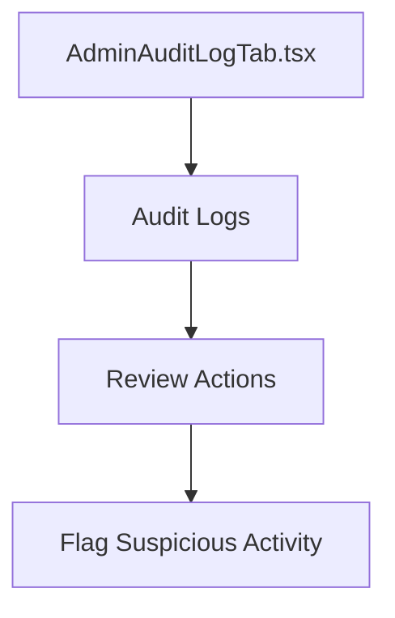

**Diagram sources**
- [AdminAuditLogTab.tsx](file://src/components/admin/AdminAuditLogTab.tsx)

**Section sources**
- [AdminAuditLogTab.tsx](file://src/components/admin/AdminAuditLogTab.tsx)

### Account Protection Measures
- Password reset and OTP verification protect accounts against unauthorized access.
- Session policies enforce timeouts and re-authentication where necessary.

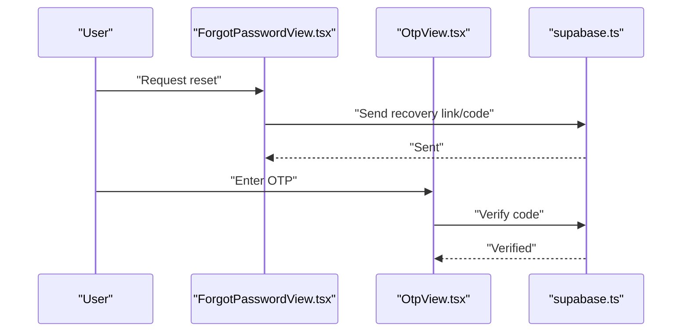

**Diagram sources**
- [ForgotPasswordView.tsx](file://src/components/ForgotPasswordView.tsx)
- [OtpView.tsx](file://src/components/OtpView.tsx)
- [supabase.ts](file://src/services/backend/supabase.ts)

**Section sources**
- [ForgotPasswordView.tsx](file://src/components/ForgotPasswordView.tsx)
- [OtpView.tsx](file://src/components/OtpView.tsx)
- [supabase.ts](file://src/services/backend/supabase.ts)

### Security Configuration Options and Policy Enforcement
- Settings view provides user-facing controls for security preferences such as idle lock duration and 2FA toggles.
- Policy enforcement is applied via context and backend rules.

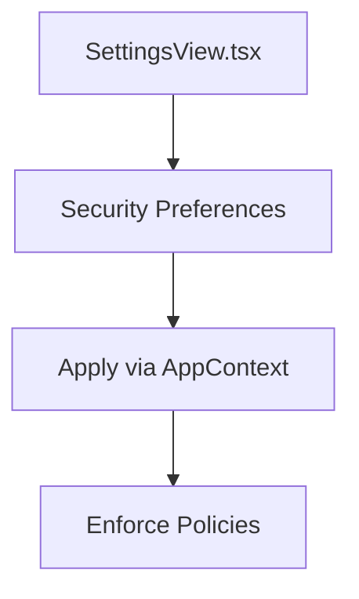

**Diagram sources**
- [SettingsView.tsx](file://src/components/SettingsView.tsx)
- [AppContext.tsx](file://src/context/AppContext.tsx)

**Section sources**
- [SettingsView.tsx](file://src/components/SettingsView.tsx)
- [AppContext.tsx](file://src/context/AppContext.tsx)

### Compliance Requirements, Data Protection Standards, and Privacy Controls
- Identity schema and RLS policies are defined in migrations, ensuring data isolation and secure access patterns.
- Backend services handle secure session management and token validation.

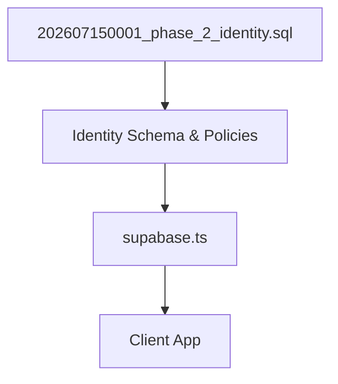

**Diagram sources**
- [202607150001_phase_2_identity.sql](file://supabase/migrations/202607150001_phase_2_identity.sql)
- [supabase.ts](file://src/services/backend/supabase.ts)

**Section sources**
- [202607150001_phase_2_identity.sql](file://supabase/migrations/202607150001_phase_2_identity.sql)
- [supabase.ts](file://src/services/backend/supabase.ts)

### Examples of Security Hooks, Encryption Utilities, and Secure Storage Implementations
- Security hooks: Idle lock hook tracks inactivity and triggers lock events.
- Encryption utilities: Security module provides hashing helpers used in auth flows.
- Secure storage: Backend-managed sessions and tokens ensure sensitive data is not stored insecurely on the client.

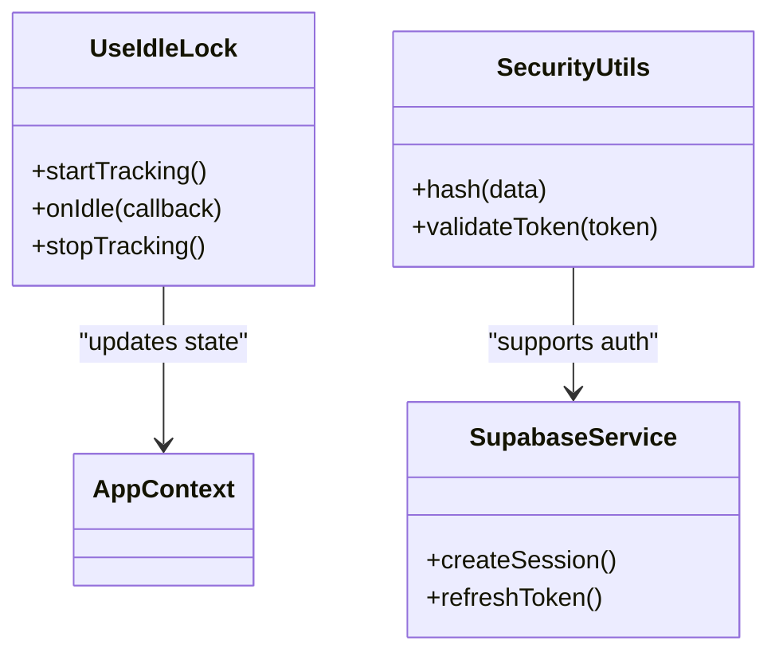

**Diagram sources**
- [useIdleLock.ts](file://src/hooks/useIdleLock.ts)
- [security.ts](file://src/lib/security.ts)
- [supabase.ts](file://src/services/backend/supabase.ts)

**Section sources**
- [useIdleLock.ts](file://src/hooks/useIdleLock.ts)
- [security.ts](file://src/lib/security.ts)
- [supabase.ts](file://src/services/backend/supabase.ts)

## Dependency Analysis
Security components depend on each other and on backend services to enforce policies and manage sessions.

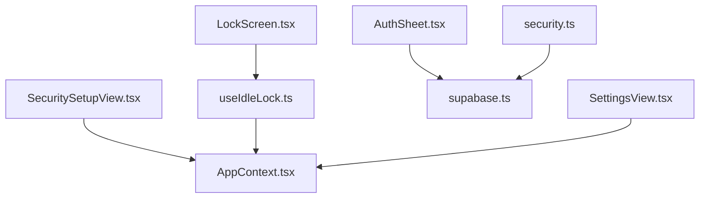

**Diagram sources**
- [SecuritySetupView.tsx](file://src/components/SecuritySetupView.tsx)
- [LockScreen.tsx](file://src/components/LockScreen.tsx)
- [useIdleLock.ts](file://src/hooks/useIdleLock.ts)
- [AppContext.tsx](file://src/context/AppContext.tsx)
- [AuthSheet.tsx](file://src/components/AuthSheet.tsx)
- [SettingsView.tsx](file://src/components/SettingsView.tsx)
- [security.ts](file://src/lib/security.ts)
- [supabase.ts](file://src/services/backend/supabase.ts)

**Section sources**
- [SecuritySetupView.tsx](file://src/components/SecuritySetupView.tsx)
- [LockScreen.tsx](file://src/components/LockScreen.tsx)
- [useIdleLock.ts](file://src/hooks/useIdleLock.ts)
- [AppContext.tsx](file://src/context/AppContext.tsx)
- [AuthSheet.tsx](file://src/components/AuthSheet.tsx)
- [SettingsView.tsx](file://src/components/SettingsView.tsx)
- [security.ts](file://src/lib/security.ts)
- [supabase.ts](file://src/services/backend/supabase.ts)

## Performance Considerations
- Minimize idle tracking overhead by debouncing event listeners and limiting frequency of state updates.
- Avoid unnecessary re-renders in lock screen and security views by memoizing derived values.
- Ensure backend calls are idempotent and cached where appropriate to reduce latency.

[No sources needed since this section provides general guidance]

## Troubleshooting Guide
- If the lock screen does not appear, verify idle thresholds and event listeners in the idle lock hook.
- For authentication failures, check backend connectivity and session validity in the context and supabase service.
- When 2FA setup fails, confirm OTP generation and verification steps in the OTP view and backend integration.

**Section sources**
- [useIdleLock.ts](file://src/hooks/useIdleLock.ts)
- [AppContext.tsx](file://src/context/AppContext.tsx)
- [supabase.ts](file://src/services/backend/supabase.ts)
- [OtpView.tsx](file://src/components/OtpView.tsx)

## Conclusion
Mooday implements a comprehensive security model combining UI-driven flows, robust session management, idle locking, and backend-backed identity services. Password management, 2FA setup, and secure communication are integrated to protect user accounts and data. Administrative audit logs support oversight and detection of suspicious activities. Configuration options allow users to tailor security preferences while maintaining policy enforcement.

[No sources needed since this section summarizes without analyzing specific files]

## Appendices
- Example paths for security hooks: [useIdleLock.ts](file://src/hooks/useIdleLock.ts)
- Example paths for encryption utilities: [security.ts](file://src/lib/security.ts)
- Example paths for secure storage via backend: [supabase.ts](file://src/services/backend/supabase.ts)
- Example paths for identity schema and policies: [202607150001_phase_2_identity.sql](file://supabase/migrations/202607150001_phase_2_identity.sql)