# User Management

<cite>
**Referenced Files in This Document**
- [AuthSheet.tsx](file://src/components/AuthSheet.tsx)
- [SignInView.tsx](file://src/components/SignInView.tsx)
- [SignUpView.tsx](file://src/components/SignUpView.tsx)
- [SocialLoginView.tsx](file://src/components/SocialLoginView.tsx)
- [ForgotPasswordView.tsx](file://src/components/ForgotPasswordView.tsx)
- [OtpView.tsx](file://src/components/OtpView.tsx)
- [SecuritySetupView.tsx](file://src/components/SecuritySetupView.tsx)
- [SettingsView.tsx](file://src/components/SettingsView.tsx)
- [EditProfileView.tsx](file://src/components/EditProfileView.tsx)
- [UserProfileView.tsx](file://src/components/UserProfileView.tsx)
- [AppContext.tsx](file://src/context/AppContext.tsx)
- [supabase.ts](file://src/services/backend/supabase.ts)
- [config.ts](file://src/services/backend/config.ts)
- [202607150001_phase_2_identity.sql](file://supabase/migrations/202607150001_phase_2_identity.sql)
- [confirmation.html](file://supabase/templates/confirmation.html)
- [recovery.html](file://supabase/templates/recovery.html)
- [auth/callback/page.tsx](file://src/app/auth/callback/page.tsx)
- [phase2-auth.spec.ts](file://tests/e2e/phase2-auth.spec.ts)
</cite>

## Table of Contents
1. Introduction
2. Project Structure
3. Core Components
4. Architecture Overview
5. Detailed Component Analysis
6. Dependency Analysis
7. Performance Considerations
8. Troubleshooting Guide
9. Conclusion

## Introduction
This document explains the user management and authentication system in Mooday. It covers authentication flows with Supabase Auth, OAuth integration for Google and Apple, session management, user profile management, account settings, security features (password management and two-factor authentication), roles and permissions, account recovery, privacy controls, registration workflow, email verification, social login, onboarding experiences, profile customization, and account deletion. Security best practices, data protection measures, and compliance considerations are also included.

## Project Structure
Mooday implements authentication and user management across UI components, a shared application context, backend configuration, and Supabase migrations and templates:
- Authentication UI: sign-in, sign-up, social login, forgot password, OTP verification, security setup, settings, and profile editing views.
- Application context: centralized auth state and session handling.
- Backend integration: Supabase client and configuration for identity and storage.
- Database schema: identity tables and RLS policies via migrations.
- Email templates: confirmation and recovery emails managed by Supabase.
- OAuth callback: Next.js route to finalize third-party logins.

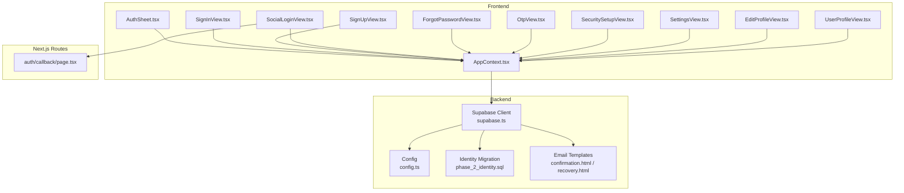

**Diagram sources**
- [AuthSheet.tsx](file://src/components/AuthSheet.tsx)
- [SignInView.tsx](file://src/components/SignInView.tsx)
- [SignUpView.tsx](file://src/components/SignUpView.tsx)
- [SocialLoginView.tsx](file://src/components/SocialLoginView.tsx)
- [ForgotPasswordView.tsx](file://src/components/ForgotPasswordView.tsx)
- [OtpView.tsx](file://src/components/OtpView.tsx)
- [SecuritySetupView.tsx](file://src/components/SecuritySetupView.tsx)
- [SettingsView.tsx](file://src/components/SettingsView.tsx)
- [EditProfileView.tsx](file://src/components/EditProfileView.tsx)
- [UserProfileView.tsx](file://src/components/UserProfileView.tsx)
- [AppContext.tsx](file://src/context/AppContext.tsx)
- [supabase.ts](file://src/services/backend/supabase.ts)
- [config.ts](file://src/services/backend/config.ts)
- [202607150001_phase_2_identity.sql](file://supabase/migrations/202607150001_phase_2_identity.sql)
- [confirmation.html](file://supabase/templates/confirmation.html)
- [recovery.html](file://supabase/templates/recovery.html)
- [auth/callback/page.tsx](file://src/app/auth/callback/page.tsx)

**Section sources**
- [AuthSheet.tsx](file://src/components/AuthSheet.tsx)
- [AppContext.tsx](file://src/context/AppContext.tsx)
- [supabase.ts](file://src/services/backend/supabase.ts)
- [config.ts](file://src/services/backend/config.ts)
- [202607150001_phase_2_identity.sql](file://supabase/migrations/202607150001_phase_2_identity.sql)
- [confirmation.html](file://supabase/templates/confirmation.html)
- [recovery.html](file://supabase/templates/recovery.html)
- [auth/callback/page.tsx](file://src/app/auth/callback/page.tsx)

## Core Components
- Authentication sheet and views: Provide sign-in, sign-up, social login, forgot password, OTP, and security setup screens.
- Profile and settings: Allow users to edit profiles, manage preferences, and configure security options.
- Context and services: Centralize auth state, session lifecycle, and Supabase interactions.
- Identity schema and templates: Define user identity storage and email workflows.

Key responsibilities:
- Orchestrate login/signup flows and redirect to OAuth providers.
- Manage sessions and persist user state across navigation.
- Enforce access control via Supabase policies.
- Handle email verification and password recovery.
- Support two-factor authentication setup and management.

**Section sources**
- [AuthSheet.tsx](file://src/components/AuthSheet.tsx)
- [SignInView.tsx](file://src/components/SignInView.tsx)
- [SignUpView.tsx](file://src/components/SignUpView.tsx)
- [SocialLoginView.tsx](file://src/components/SocialLoginView.tsx)
- [ForgotPasswordView.tsx](file://src/components/ForgotPasswordView.tsx)
- [OtpView.tsx](file://src/components/OtpView.tsx)
- [SecuritySetupView.tsx](file://src/components/SecuritySetupView.tsx)
- [SettingsView.tsx](file://src/components/SettingsView.tsx)
- [EditProfileView.tsx](file://src/components/EditProfileView.tsx)
- [UserProfileView.tsx](file://src/components/UserProfileView.tsx)
- [AppContext.tsx](file://src/context/AppContext.tsx)
- [supabase.ts](file://src/services/backend/supabase.ts)
- [config.ts](file://src/services/backend/config.ts)
- [202607150001_phase_2_identity.sql](file://supabase/migrations/202607150001_phase_2_identity.sql)
- [confirmation.html](file://supabase/templates/confirmation.html)
- [recovery.html](file://supabase/templates/recovery.html)
- [auth/callback/page.tsx](file://src/app/auth/callback/page.tsx)

## Architecture Overview
The authentication architecture integrates Next.js UI components with Supabase Auth for identity management. OAuth providers (Google, Apple) are handled through Supabase’s provider integrations and a dedicated callback route. Sessions are maintained in the application context and persisted via Supabase’s session mechanism. User profiles and settings are stored in Supabase tables governed by Row-Level Security (RLS).

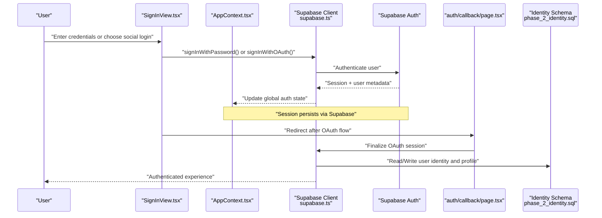

**Diagram sources**
- [SignInView.tsx](file://src/components/SignInView.tsx)
- [AppContext.tsx](file://src/context/AppContext.tsx)
- [supabase.ts](file://src/services/backend/supabase.ts)
- [auth/callback/page.tsx](file://src/app/auth/callback/page.tsx)
- [202607150001_phase_2_identity.sql](file://supabase/migrations/202607150001_phase_2_identity.sql)

## Detailed Component Analysis

### Authentication Flow (Email/Password and Social Login)
- Sign-in: Validates inputs, calls Supabase Auth, updates AppContext, and navigates to protected routes.
- Sign-up: Creates user, triggers email verification, and guides users to verify their email.
- Social login: Redirects to Google or Apple via Supabase; callback route finalizes session and syncs profile data.
- Session management: Maintains active sessions, handles refresh, and exposes current user state globally.

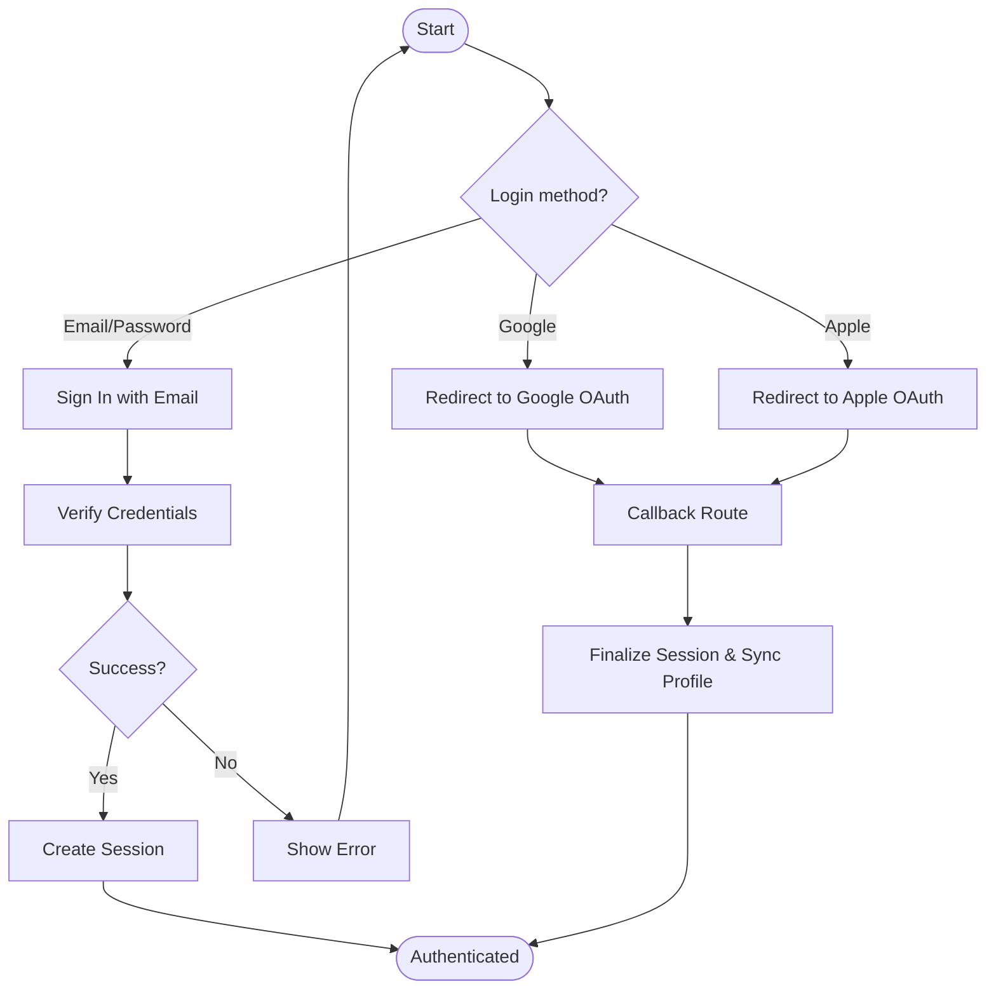

**Diagram sources**
- [SignInView.tsx](file://src/components/SignInView.tsx)
- [SignUpView.tsx](file://src/components/SignUpView.tsx)
- [SocialLoginView.tsx](file://src/components/SocialLoginView.tsx)
- [auth/callback/page.tsx](file://src/app/auth/callback/page.tsx)
- [AppContext.tsx](file://src/context/AppContext.tsx)
- [supabase.ts](file://src/services/backend/supabase.ts)

**Section sources**
- [SignInView.tsx](file://src/components/SignInView.tsx)
- [SignUpView.tsx](file://src/components/SignUpView.tsx)
- [SocialLoginView.tsx](file://src/components/SocialLoginView.tsx)
- [auth/callback/page.tsx](file://src/app/auth/callback/page.tsx)
- [AppContext.tsx](file://src/context/AppContext.tsx)
- [supabase.ts](file://src/services/backend/supabase.ts)

### Registration Workflow and Email Verification
- Registration creates a new identity and sends a confirmation email using Supabase templates.
- Users must verify email before accessing protected features.
- The app prompts unverified users to check their inbox and complete verification.

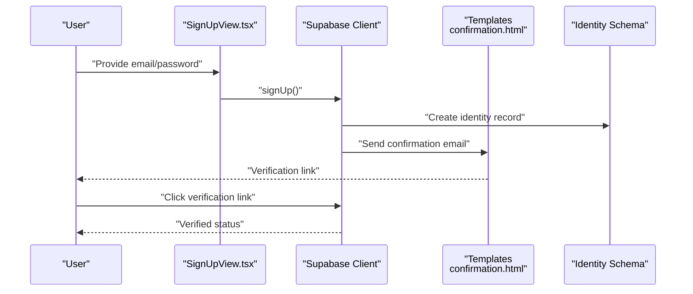

**Diagram sources**
- [SignUpView.tsx](file://src/components/SignUpView.tsx)
- [supabase.ts](file://src/services/backend/supabase.ts)
- [confirmation.html](file://supabase/templates/confirmation.html)
- [202607150001_phase_2_identity.sql](file://supabase/migrations/202607150001_phase_2_identity.sql)

**Section sources**
- [SignUpView.tsx](file://src/components/SignUpView.tsx)
- [confirmation.html](file://supabase/templates/confirmation.html)
- [202607150001_phase_2_identity.sql](file://supabase/migrations/202607150001_phase_2_identity.sql)

### OAuth Integration (Google and Apple)
- Social login uses Supabase’s OAuth providers for Google and Apple.
- After provider authorization, the Next.js callback route finalizes the session and ensures consistent user state.
- Profile data is synchronized from provider claims where applicable.

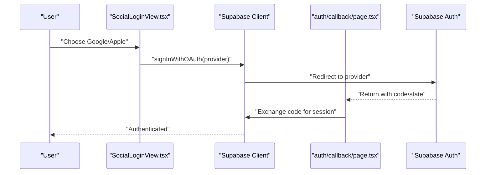

**Diagram sources**
- [SocialLoginView.tsx](file://src/components/SocialLoginView.tsx)
- [auth/callback/page.tsx](file://src/app/auth/callback/page.tsx)
- [supabase.ts](file://src/services/backend/supabase.ts)

**Section sources**
- [SocialLoginView.tsx](file://src/components/SocialLoginView.tsx)
- [auth/callback/page.tsx](file://src/app/auth/callback/page.tsx)
- [supabase.ts](file://src/services/backend/supabase.ts)

### Session Management
- Sessions are created upon successful authentication and maintained via Supabase’s session store.
- AppContext provides reactive user state and methods to sign out or refresh sessions.
- Protected routes rely on session checks to grant access.

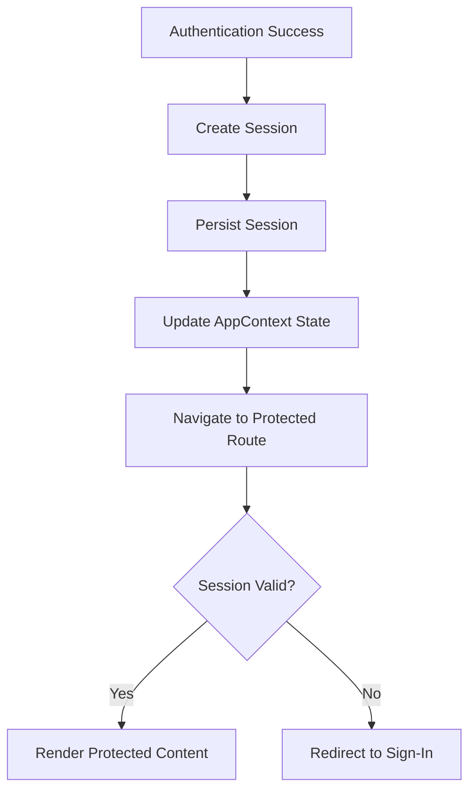

**Diagram sources**
- [AppContext.tsx](file://src/context/AppContext.tsx)
- [supabase.ts](file://src/services/backend/supabase.ts)

**Section sources**
- [AppContext.tsx](file://src/context/AppContext.tsx)
- [supabase.ts](file://src/services/backend/supabase.ts)

### Password Management and Account Recovery
- Forgot password flow initiates a recovery email using Supabase templates.
- Users receive a secure link to reset their password.
- The app validates new passwords and updates identity securely.

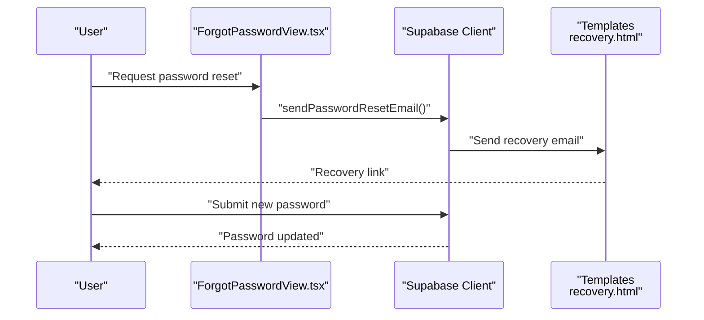

**Diagram sources**
- [ForgotPasswordView.tsx](file://src/components/ForgotPasswordView.tsx)
- [supabase.ts](file://src/services/backend/supabase.ts)
- [recovery.html](file://supabase/templates/recovery.html)

**Section sources**
- [ForgotPasswordView.tsx](file://src/components/ForgotPasswordView.tsx)
- [recovery.html](file://supabase/templates/recovery.html)
- [supabase.ts](file://src/services/backend/supabase.ts)

### Two-Factor Authentication (2FA)
- Security setup view allows enabling 2FA and managing trusted devices.
- OTP view supports entering verification codes during login or sensitive actions.
- Supabase Auth can integrate with 2FA providers; the app enforces additional verification steps when configured.

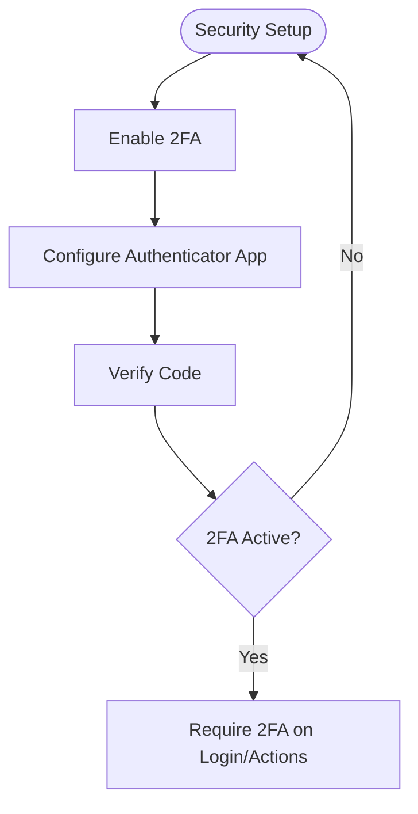

**Diagram sources**
- [SecuritySetupView.tsx](file://src/components/SecuritySetupView.tsx)
- [OtpView.tsx](file://src/components/OtpView.tsx)
- [supabase.ts](file://src/services/backend/supabase.ts)

**Section sources**
- [SecuritySetupView.tsx](file://src/components/SecuritySetupView.tsx)
- [OtpView.tsx](file://src/components/OtpView.tsx)
- [supabase.ts](file://src/services/backend/supabase.ts)

### User Profile Management and Onboarding
- Edit profile view enables updating display name, avatar, bio, and other public attributes.
- Public profile view renders user information for others to see.
- Onboarding may guide new users to complete profile setup post-signup.

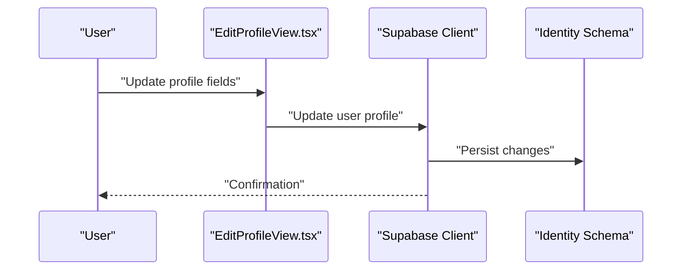

**Diagram sources**
- [EditProfileView.tsx](file://src/components/EditProfileView.tsx)
- [UserProfileView.tsx](file://src/components/UserProfileView.tsx)
- [supabase.ts](file://src/services/backend/supabase.ts)
- [202607150001_phase_2_identity.sql](file://supabase/migrations/202607150001_phase_2_identity.sql)

**Section sources**
- [EditProfileView.tsx](file://src/components/EditProfileView.tsx)
- [UserProfileView.tsx](file://src/components/UserProfileView.tsx)
- [supabase.ts](file://src/services/backend/supabase.ts)
- [202607150001_phase_2_identity.sql](file://supabase/migrations/202607150001_phase_2_identity.sql)

### Account Settings and Privacy Controls
- Settings view manages notification preferences, theme, language, and privacy toggles.
- Privacy controls allow users to adjust visibility of profile data and activity.
- Changes are persisted via Supabase and enforced by RLS policies.

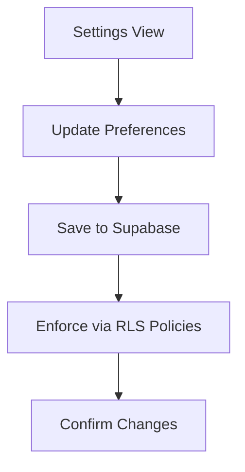

**Diagram sources**
- [SettingsView.tsx](file://src/components/SettingsView.tsx)
- [supabase.ts](file://src/services/backend/supabase.ts)
- [202607150001_phase_2_identity.sql](file://supabase/migrations/202607150001_phase_2_identity.sql)

**Section sources**
- [SettingsView.tsx](file://src/components/SettingsView.tsx)
- [supabase.ts](file://src/services/backend/supabase.ts)
- [202607150001_phase_2_identity.sql](file://supabase/migrations/202607150001_phase_2_identity.sql)

### Roles and Permissions
- Roles and permissions are enforced at the database layer using Supabase RLS policies defined in migrations.
- UI components respect role-based access by checking current user context and capabilities.
- Admin features are gated behind appropriate roles.

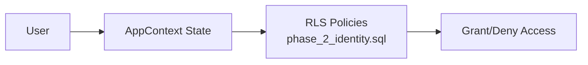

**Diagram sources**
- [AppContext.tsx](file://src/context/AppContext.tsx)
- [202607150001_phase_2_identity.sql](file://supabase/migrations/202607150001_phase_2_identity.sql)

**Section sources**
- [AppContext.tsx](file://src/context/AppContext.tsx)
- [202607150001_phase_2_identity.sql](file://supabase/migrations/202607150001_phase_2_identity.sql)

### Account Deletion Procedures
- Account deletion removes user identity and associated data according to RLS policies and retention rules.
- The process requires confirmation and may involve deactivating related resources.
- Post-deletion, user data is purged per policy and compliance requirements.

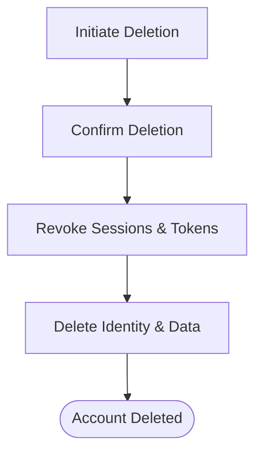

[No diagram sources since this section describes conceptual procedures without mapping to specific files]

## Dependency Analysis
The authentication subsystem depends on:
- UI components for user interaction and flow orchestration.
- AppContext for global auth state and session management.
- Supabase client for identity operations and session persistence.
- Config for environment-specific settings.
- Migrations for schema and policies governing user data.
- Email templates for verification and recovery communications.
- OAuth callback route to finalize third-party logins.

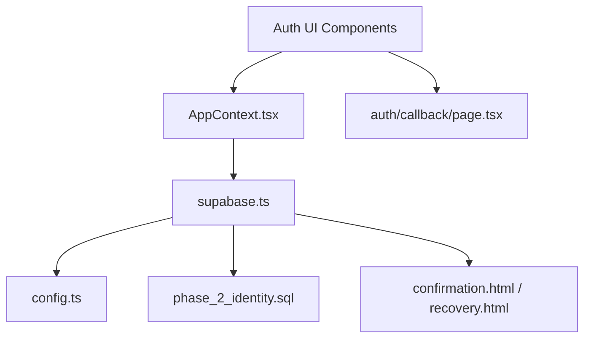

**Diagram sources**
- [AppContext.tsx](file://src/context/AppContext.tsx)
- [supabase.ts](file://src/services/backend/supabase.ts)
- [config.ts](file://src/services/backend/config.ts)
- [202607150001_phase_2_identity.sql](file://supabase/migrations/202607150001_phase_2_identity.sql)
- [confirmation.html](file://supabase/templates/confirmation.html)
- [recovery.html](file://supabase/templates/recovery.html)
- [auth/callback/page.tsx](file://src/app/auth/callback/page.tsx)

**Section sources**
- [AppContext.tsx](file://src/context/AppContext.tsx)
- [supabase.ts](file://src/services/backend/supabase.ts)
- [config.ts](file://src/services/backend/config.ts)
- [202607150001_phase_2_identity.sql](file://supabase/migrations/202607150001_phase_2_identity.sql)
- [confirmation.html](file://supabase/templates/confirmation.html)
- [recovery.html](file://supabase/templates/recovery.html)
- [auth/callback/page.tsx](file://src/app/auth/callback/page.tsx)

## Performance Considerations
- Minimize redundant auth calls by leveraging AppContext caching and Supabase session persistence.
- Use lazy loading for auth-related components to reduce initial bundle size.
- Optimize profile updates by batching changes and validating on the client before sending to the server.
- Ensure network requests handle retries and timeouts gracefully to improve resilience.

[No sources needed since this section provides general guidance]

## Troubleshooting Guide
Common issues and resolutions:
- Email not received: Check spam folder; ensure correct email domain and template rendering.
- OAuth failures: Verify provider configuration and callback URL correctness.
- Session expiration: Refresh token flow or re-authenticate if necessary.
- Permission errors: Review RLS policies and user roles in migrations.
- OTP delivery problems: Validate phone number format and provider limits.

Validation references:
- End-to-end tests cover core auth flows and help identify regressions.

**Section sources**
- [phase2-auth.spec.ts](file://tests/e2e/phase2-auth.spec.ts)

## Conclusion
Mooday’s user management and authentication system combines robust UI flows with Supabase Auth for secure identity management. OAuth integrations streamline sign-in, while session management and RLS policies ensure safe access to user data. The system supports comprehensive profile management, account settings, security features like 2FA, and clear recovery and deletion processes. Adhering to best practices for data protection and compliance ensures a trustworthy user experience.

[No sources needed since this section summarizes without analyzing specific files]