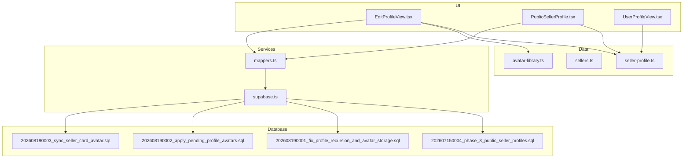
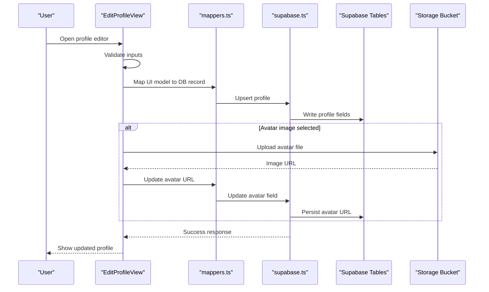
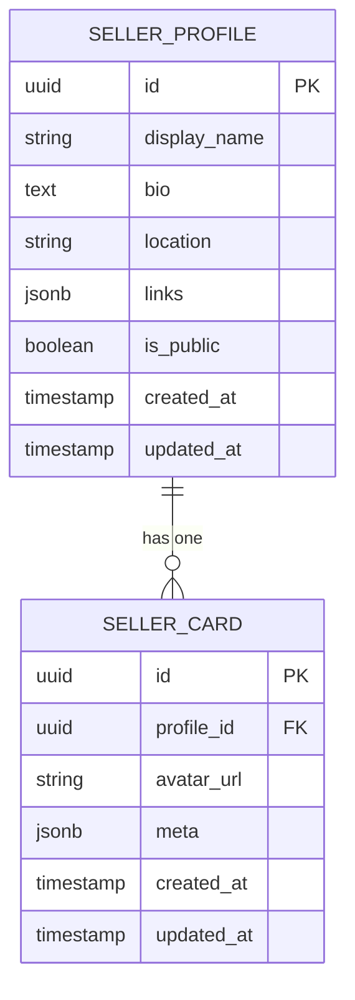
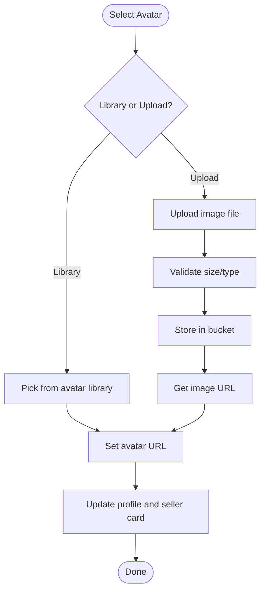
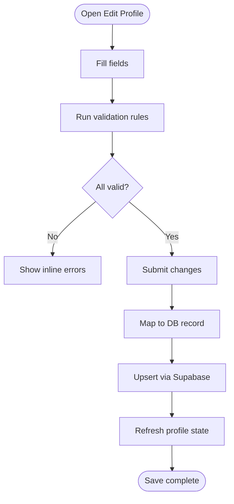
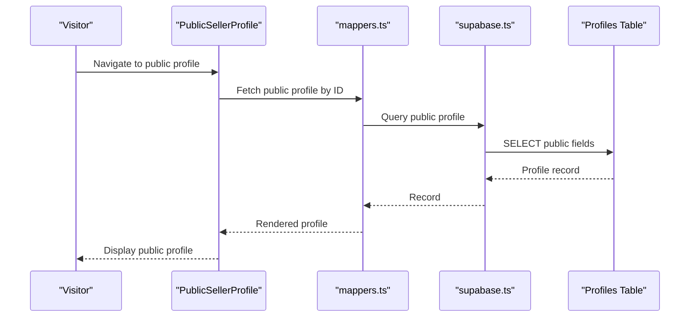
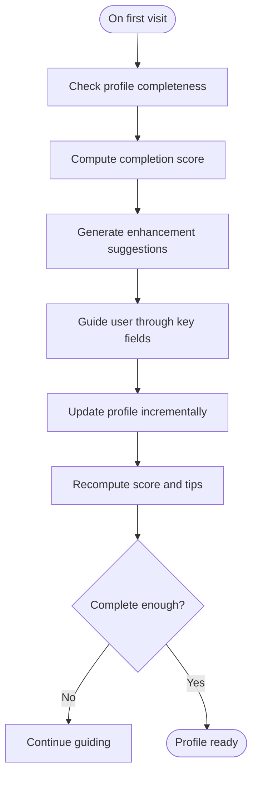
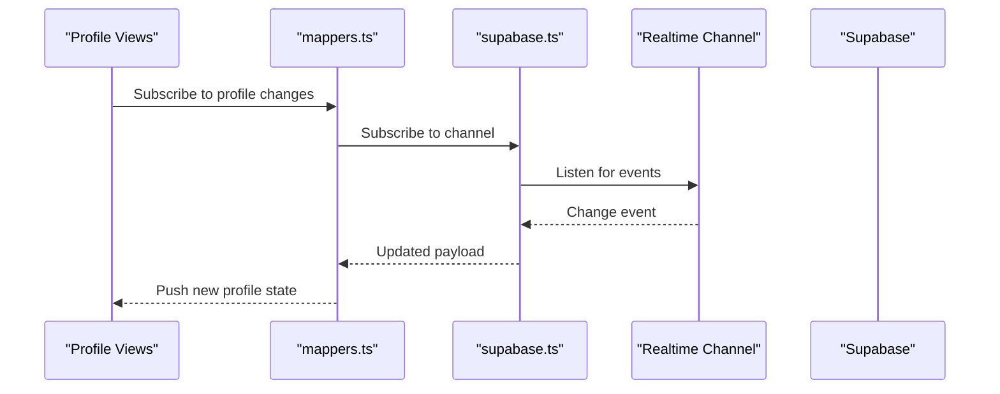
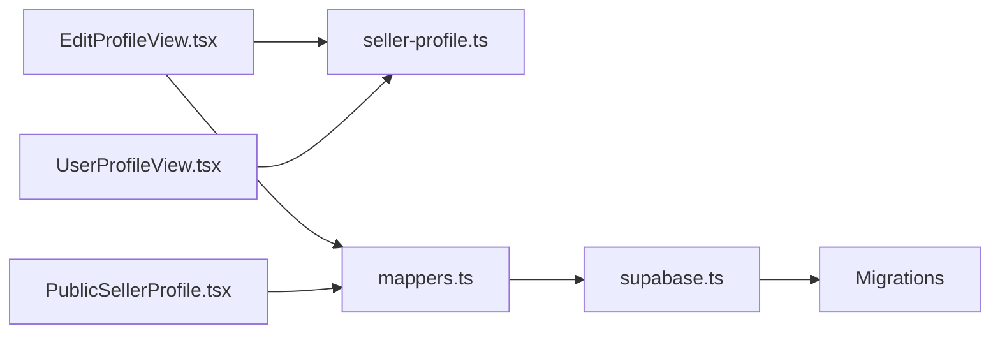

# User Profiles

<cite>
**Referenced Files in This Document**
- [EditProfileView.tsx](file://src/components/EditProfileView.tsx)
- [PublicSellerProfile.tsx](file://src/components/PublicSellerProfile.tsx)
- [UserProfileView.tsx](file://src/components/UserProfileView.tsx)
- [avatar-library.ts](file://src/data/avatar-library.ts)
- [seller-profile.ts](file://src/data/seller-profile.ts)
- [sellers.ts](file://src/data/sellers.ts)
- [mappers.ts](file://src/services/backend/mappers.ts)
- [supabase.ts](file://src/services/backend/supabase.ts)
- [202607150004_phase_3_public_seller_profiles.sql](file://supabase/migrations/202607150004_phase_3_public_seller_profiles.sql)
- [202608190001_fix_profile_recursion_and_avatar_storage.sql](file://supabase/migrations/202608190001_fix_profile_recursion_and_avatar_storage.sql)
- [202608190002_apply_pending_profile_avatars.sql](file://supabase/migrations/202608190002_apply_pending_profile_avatars.sql)
- [202608190003_sync_seller_card_avatar.sql](file://supabase/migrations/202608190003_sync_seller_card_avatar.sql)
- [profile-recursion-avatar-migration.test.ts](file://src/services/backend/profile-recursion-avatar-migration.test.ts)
- [public-seller-profiles-migration.test.ts](file://src/services/backend/public-seller-profiles-migration.test.ts)
- [group-g-profile.md](file://docs/group-g-profile.md)
- [public-seller-profile.md](file://docs/public-seller-profile.md)
</cite>

## Table of Contents
1. Introduction
2. Project Structure
3. Core Components
4. Architecture Overview
5. Detailed Component Analysis
6. Dependency Analysis
7. Performance Considerations
8. Troubleshooting Guide
9. Conclusion
10. Appendices

## Introduction
This document explains how user profiles are modeled, edited, and displayed in Mooday. It covers profile data structure, avatar customization, personal information editing, public seller profiles, privacy and visibility controls, synchronization with Supabase, caching strategies, real-time updates, completion tracking, onboarding progress, enhancement suggestions, security, validation, content moderation, and integration patterns for components, mappers, and APIs.

## Project Structure
Profile-related functionality spans UI components, data models, backend services, and database migrations:
- UI components: EditProfileView, PublicSellerProfile, UserProfileView
- Data models: seller-profile, sellers, avatar-library
- Backend services: mappers, supabase client
- Database schema: public seller profiles migration and avatar storage fixes

**Diagram sources**
- [EditProfileView.tsx](file://src/components/EditProfileView.tsx)
- [PublicSellerProfile.tsx](file://src/components/PublicSellerProfile.tsx)
- [UserProfileView.tsx](file://src/components/UserProfileView.tsx)
- [seller-profile.ts](file://src/data/seller-profile.ts)
- [sellers.ts](file://src/data/sellers.ts)
- [avatar-library.ts](file://src/data/avatar-library.ts)
- [mappers.ts](file://src/services/backend/mappers.ts)
- [supabase.ts](file://src/services/backend/supabase.ts)
- [202607150004_phase_3_public_seller_profiles.sql](file://supabase/migrations/202607150004_phase_3_public_seller_profiles.sql)
- [202608190001_fix_profile_recursion_and_avatar_storage.sql](file://supabase/migrations/202608190001_fix_profile_recursion_and_avatar_storage.sql)
- [202608190002_apply_pending_profile_avatars.sql](file://supabase/migrations/202608190002_apply_pending_profile_avatars.sql)
- [202608190003_sync_seller_card_avatar.sql](file://supabase/migrations/202608190003_sync_seller_card_avatar.sql)

**Section sources**
- [EditProfileView.tsx](file://src/components/EditProfileView.tsx)
- [PublicSellerProfile.tsx](file://src/components/PublicSellerProfile.tsx)
- [UserProfileView.tsx](file://src/components/UserProfileView.tsx)
- [seller-profile.ts](file://src/data/seller-profile.ts)
- [sellers.ts](file://src/data/sellers.ts)
- [avatar-library.ts](file://src/data/avatar-library.ts)
- [mappers.ts](file://src/services/backend/mappers.ts)
- [supabase.ts](file://src/services/backend/supabase.ts)
- [202607150004_phase_3_public_seller_profiles.sql](file://supabase/migrations/202607150004_phase_3_public_seller_profiles.sql)
- [202608190001_fix_profile_recursion_and_avatar_storage.sql](file://supabase/migrations/202608190001_fix_profile_recursion_and_avatar_storage.sql)
- [202608190002_apply_pending_profile_avatars.sql](file://supabase/migrations/202608190002_apply_pending_profile_avatars.sql)
- [202608190003_sync_seller_card_avatar.sql](file://supabase/migrations/202608190003_sync_seller_card_avatar.sql)

## Core Components
- EditProfileView: Provides the form to create or update a user’s profile, including avatar selection/upload, display name, bio, location, links, and privacy toggles. It validates inputs before persisting changes.
- PublicSellerProfile: Renders a read-only view of a seller’s public profile, aggregating profile fields and seller card metadata for visitors.
- UserProfileView: Displays the current user’s profile overview and navigation to edit actions.

Key responsibilities:
- Profile creation workflow and validation
- Avatar customization (library selection and image upload)
- Personal information editing (name, bio, location, links)
- Privacy and visibility controls for public exposure
- Synchronization with Supabase via mappers and client
- Real-time updates and caching strategies

**Section sources**
- [EditProfileView.tsx](file://src/components/EditProfileView.tsx)
- [PublicSellerProfile.tsx](file://src/components/PublicSellerProfile.tsx)
- [UserProfileView.tsx](file://src/components/UserProfileView.tsx)

## Architecture Overview
The profile system follows a layered architecture:
- UI layer: React components handle user interactions and local state.
- Data layer: TypeScript models define profile shape and defaults.
- Service layer: Mappers convert between UI models and database records; Supabase client performs queries and mutations.
- Storage layer: Supabase tables store profile data; storage buckets hold avatar images.

**Diagram sources**
- [EditProfileView.tsx](file://src/components/EditProfileView.tsx)
- [mappers.ts](file://src/services/backend/mappers.ts)
- [supabase.ts](file://src/services/backend/supabase.ts)
- [202607150004_phase_3_public_seller_profiles.sql](file://supabase/migrations/202607150004_phase_3_public_seller_profiles.sql)
- [202608190001_fix_profile_recursion_and_avatar_storage.sql](file://supabase/migrations/202608190001_fix_profile_recursion_and_avatar_storage.sql)

## Detailed Component Analysis

### Profile Data Model and Relationships
- Primary entity: Seller profile with fields for identity, presentation, and visibility.
- Related entities: Seller card metadata used by marketplace listings and search results.
- Avatar handling: Centralized library options plus uploaded images stored in a bucket; URLs persisted in profile.

**Diagram sources**
- [202607150004_phase_3_public_seller_profiles.sql](file://supabase/migrations/202607150004_phase_3_public_seller_profiles.sql)
- [202608190003_sync_seller_card_avatar.sql](file://supabase/migrations/202608190003_sync_seller_card_avatar.sql)

**Section sources**
- [seller-profile.ts](file://src/data/seller-profile.ts)
- [sellers.ts](file://src/data/sellers.ts)
- [202607150004_phase_3_public_seller_profiles.sql](file://supabase/migrations/202607150004_phase_3_public_seller_profiles.sql)
- [202608190003_sync_seller_card_avatar.sql](file://supabase/migrations/202608190003_sync_seller_card_avatar.sql)

### Avatar Customization
- Library avatars: Predefined options curated in the avatar library module.
- Uploaded avatars: Users can upload images; files are stored in a dedicated bucket and URLs are saved back to the profile and synced to seller card metadata where applicable.
- Migration safeguards: Fixes for recursion and storage folder names ensure stable avatar resolution.

**Diagram sources**
- [avatar-library.ts](file://src/data/avatar-library.ts)
- [202608190001_fix_profile_recursion_and_avatar_storage.sql](file://supabase/migrations/202608190001_fix_profile_recursion_and_avatar_storage.sql)
- [202608190002_apply_pending_profile_avatars.sql](file://supabase/migrations/202608190002_apply_pending_profile_avatars.sql)
- [202608190003_sync_seller_card_avatar.sql](file://supabase/migrations/202608190003_sync_seller_card_avatar.sql)

**Section sources**
- [avatar-library.ts](file://src/data/avatar-library.ts)
- [202608190001_fix_profile_recursion_and_avatar_storage.sql](file://supabase/migrations/202608190001_fix_profile_recursion_and_avatar_storage.sql)
- [202608190002_apply_pending_profile_avatars.sql](file://supabase/migrations/202608190002_apply_pending_profile_avatars.sql)
- [202608190003_sync_seller_card_avatar.sql](file://supabase/migrations/202608190003_sync_seller_card_avatar.sql)

### Personal Information Editing and Validation
- Fields: Display name, bio, location, and links.
- Validation rules: Enforce non-empty required fields, length limits, and safe link formats. Errors are surfaced inline to guide corrections before submission.
- Submission flow: Validates locally, maps to DB schema, persists via service layer, and refreshes UI state.

**Diagram sources**
- [EditProfileView.tsx](file://src/components/EditProfileView.tsx)
- [mappers.ts](file://src/services/backend/mappers.ts)
- [supabase.ts](file://src/services/backend/supabase.ts)

**Section sources**
- [EditProfileView.tsx](file://src/components/EditProfileView.tsx)
- [mappers.ts](file://src/services/backend/mappers.ts)
- [supabase.ts](file://src/services/backend/supabase.ts)

### Public Seller Profiles and Visibility Controls
- Public exposure: A seller can toggle visibility to make their profile discoverable publicly.
- Read-only view: Visitors see a curated set of fields suitable for discovery and trust signals.
- Security: Access checks ensure only authorized users can modify private fields; public readers cannot alter data.

**Diagram sources**
- [PublicSellerProfile.tsx](file://src/components/PublicSellerProfile.tsx)
- [mappers.ts](file://src/services/backend/mappers.ts)
- [supabase.ts](file://src/services/backend/supabase.ts)
- [202607150004_phase_3_public_seller_profiles.sql](file://supabase/migrations/202607150004_phase_3_public_seller_profiles.sql)

**Section sources**
- [PublicSellerProfile.tsx](file://src/components/PublicSellerProfile.tsx)
- [202607150004_phase_3_public_seller_profiles.sql](file://supabase/migrations/202607150004_phase_3_public_seller_profiles.sql)

### Profile Completion Tracking and Onboarding Progress
- Completion tracking: The profile editor computes a completion score based on filled fields and recommended enhancements.
- Onboarding guidance: New users are guided through essential steps to improve profile quality and trustworthiness.
- Enhancement suggestions: Contextual tips encourage adding an avatar, bio, and links to increase engagement.

**Section sources**
- [EditProfileView.tsx](file://src/components/EditProfileView.tsx)
- [seller-profile.ts](file://src/data/seller-profile.ts)

### Data Synchronization, Caching, and Real-Time Updates
- Synchronization: All writes go through the mapper layer to ensure schema alignment and consistent transformations before calling Supabase.
- Caching: Local component state holds the latest profile snapshot; cache invalidation occurs after successful mutations.
- Real-time updates: Listeners can be attached to profile changes to reflect edits across views without full reloads.

**Diagram sources**
- [mappers.ts](file://src/services/backend/mappers.ts)
- [supabase.ts](file://src/services/backend/supabase.ts)

**Section sources**
- [mappers.ts](file://src/services/backend/mappers.ts)
- [supabase.ts](file://src/services/backend/supabase.ts)

### Security, Validation, and Content Moderation
- Security: Role-based access ensures only profile owners can write private fields; public readers are restricted to allowed fields.
- Validation: Client-side checks prevent invalid submissions; server-side policies enforce constraints and sanitization.
- Moderation: Sensitive content filters and reporting mechanisms protect community standards.

**Section sources**
- [202607150004_phase_3_public_seller_profiles.sql](file://supabase/migrations/202607150004_phase_3_public_seller_profiles.sql)
- [202608190001_fix_profile_recursion_and_avatar_storage.sql](file://supabase/migrations/202608190001_fix_profile_recursion_and_avatar_storage.sql)

## Dependency Analysis
Profile features depend on cohesive layers:
- UI depends on data models and services for state and persistence.
- Services depend on Supabase client and mappers for schema-safe operations.
- Database migrations define the authoritative schema for profiles and avatars.

**Diagram sources**
- [EditProfileView.tsx](file://src/components/EditProfileView.tsx)
- [PublicSellerProfile.tsx](file://src/components/PublicSellerProfile.tsx)
- [UserProfileView.tsx](file://src/components/UserProfileView.tsx)
- [seller-profile.ts](file://src/data/seller-profile.ts)
- [mappers.ts](file://src/services/backend/mappers.ts)
- [supabase.ts](file://src/services/backend/supabase.ts)
- [202607150004_phase_3_public_seller_profiles.sql](file://supabase/migrations/202607150004_phase_3_public_seller_profiles.sql)

**Section sources**
- [EditProfileView.tsx](file://src/components/EditProfileView.tsx)
- [PublicSellerProfile.tsx](file://src/components/PublicSellerProfile.tsx)
- [UserProfileView.tsx](file://src/components/UserProfileView.tsx)
- [seller-profile.ts](file://src/data/seller-profile.ts)
- [mappers.ts](file://src/services/backend/mappers.ts)
- [supabase.ts](file://src/services/backend/supabase.ts)
- [202607150004_phase_3_public_seller_profiles.sql](file://supabase/migrations/202607150004_phase_3_public_seller_profiles.sql)

## Performance Considerations
- Minimize re-renders by memoizing computed profile fields and avoiding unnecessary state updates.
- Use pagination or selective field fetching when displaying large datasets around profiles.
- Cache avatar images at the browser level; prefer CDN-friendly URLs when available.
- Debounce input changes during profile editing to reduce network calls.
- Batch updates where possible to avoid multiple round trips.

[No sources needed since this section provides general guidance]

## Troubleshooting Guide
Common issues and resolutions:
- Avatar not updating: Verify storage bucket permissions and that the avatar URL is persisted to both profile and seller card fields.
- Public profile shows stale data: Ensure real-time subscriptions are active and cache invalidation triggers after edits.
- Validation errors block save: Confirm all required fields meet constraints and that link formats are accepted.
- Migration-related avatar problems: Apply pending avatar migrations and confirm storage folder naming conventions are correct.

**Section sources**
- [202608190001_fix_profile_recursion_and_avatar_storage.sql](file://supabase/migrations/202608190001_fix_profile_recursion_and_avatar_storage.sql)
- [202608190002_apply_pending_profile_avatars.sql](file://supabase/migrations/202608190002_apply_pending_profile_avatars.sql)
- [202608190003_sync_seller_card_avatar.sql](file://supabase/migrations/202608190003_sync_seller_card_avatar.sql)
- [profile-recursion-avatar-migration.test.ts](file://src/services/backend/profile-recursion-avatar-migration.test.ts)
- [public-seller-profiles-migration.test.ts](file://src/services/backend/public-seller-profiles-migration.test.ts)

## Conclusion
Mooday’s profile system combines a clear data model, robust UI workflows, and reliable backend synchronization. It supports avatar customization, editable personal information, public seller visibility, and real-time updates. With strong validation, security controls, and migration-backed storage fixes, it provides a solid foundation for user identity and marketplace presence.

## Appendices

### API Integration Patterns
- Mapper usage: Convert UI models to DB records and vice versa to maintain schema consistency.
- Supabase client: Use typed queries and mutations; leverage real-time channels for live updates.
- Error handling: Surface meaningful messages to users and log actionable details for debugging.

**Section sources**
- [mappers.ts](file://src/services/backend/mappers.ts)
- [supabase.ts](file://src/services/backend/supabase.ts)

### Example References
- Profile editor component: [EditProfileView.tsx](file://src/components/EditProfileView.tsx)
- Public seller profile view: [PublicSellerProfile.tsx](file://src/components/PublicSellerProfile.tsx)
- Profile overview view: [UserProfileView.tsx](file://src/components/UserProfileView.tsx)
- Avatar library: [avatar-library.ts](file://src/data/avatar-library.ts)
- Profile models: [seller-profile.ts](file://src/data/seller-profile.ts), [sellers.ts](file://src/data/sellers.ts)
- Backend mapping: [mappers.ts](file://src/services/backend/mappers.ts)
- Supabase client: [supabase.ts](file://src/services/backend/supabase.ts)
- Schema and migrations: [202607150004_phase_3_public_seller_profiles.sql](file://supabase/migrations/202607150004_phase_3_public_seller_profiles.sql), [202608190001_fix_profile_recursion_and_avatar_storage.sql](file://supabase/migrations/202608190001_fix_profile_recursion_and_avatar_storage.sql), [202608190002_apply_pending_profile_avatars.sql](file://supabase/migrations/202608190002_apply_pending_profile_avatars.sql), [202608190003_sync_seller_card_avatar.sql](file://supabase/migrations/202608190003_sync_seller_card_avatar.sql)