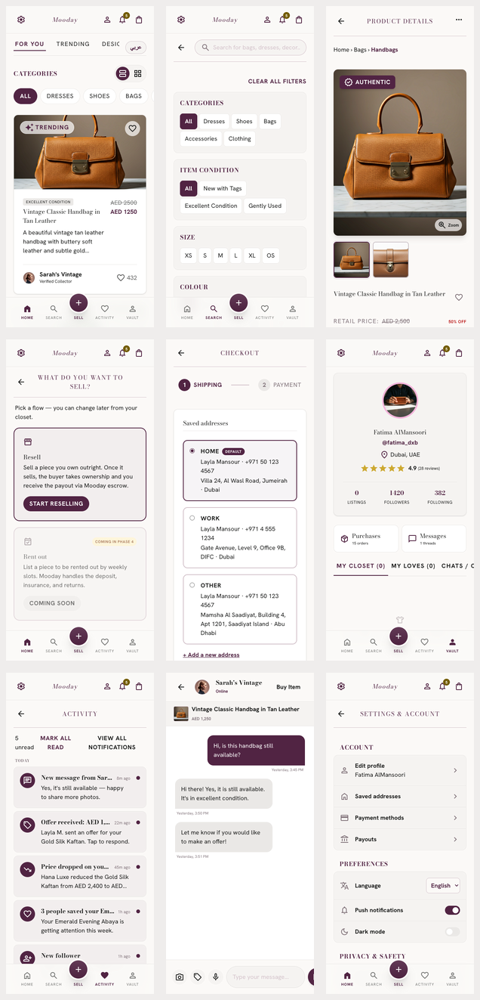
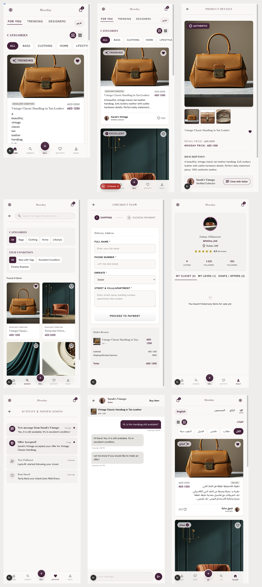

# Mooday Phase 1 — Client Product Completion Audit

> Audit date: 2026-07-14  
> Reference viewport: `393 × 852`  
> Purpose: turn the intended user journeys into an executable, screen-by-screen delivery contract. The showcase is supporting evidence, not the product specification.

## 1. Source-of-truth order

When two project artifacts disagree, use this order:

1. Product intent confirmed by the sponsor: a complete client-side product whose useful buyer, seller, social, trust, and account journeys work end to end.
2. User scenarios in `docs/user-scenarios.md`, refined into explicit acceptance criteria as gaps are discovered.
3. Shared client-state contracts: the same product, order, save, chat, profile, and listing state must remain consistent across every entry point.
4. Current working behavior worth preserving, provided it supports a coherent and usable journey.
5. `ROADMAP.md`, the showcase inventory, and showcase screenshots as historical context and design evidence only.

The showcase is deliberately non-binding because it is both incomplete and internally inconsistent:

- `public/showcase/search.png` shows Discover, not Search.
- `public/showcase/sell.png` shows Search, not Sell.
- There is no valid Settings screenshot.
- The checkout screenshot starts with a blank address form, while the inventory explicitly requires saved-address selection.

For these conflicts, the user journey and its acceptance criteria win. A showcase image may inspire hierarchy or visual language, but never removes a useful capability or creates a dead-end flow.

## 2. Phase 1 product surface

The current shell retains nine recognizable user-facing areas:

1. Discover
2. Search
3. Product Details
4. Sell
5. Checkout
6. Vault
7. Activity
8. Chat
9. Settings

The additional routes already implemented — orders, addresses, payment methods, seller profile, reviews, reports, disputes, and authentication — are not secondary merely because they are absent from the showcase. They are required parts of complete journeys and must remain reachable from the right context without competing with top-level navigation.

Rent remains a deliberately deferred path. It may communicate product direction, but it must never look functional or interrupt the working Resell journey.

Completion is measured by journeys, not screen count. A screen is complete only when its entry points, success path, recovery path, persisted state, cross-screen consistency, EN/AR behavior, and disabled/deferred actions are all intentional.

## 3. Captured evidence

Current implementation, captured from the running app at the reference viewport:

Current individual captures:

- [Discover](./baseline/current-discover.png)
- [Search](./baseline/current-search.png)
- [Product](./baseline/current-product.png)
- [Sell](./baseline/current-sell.png)
- [Checkout](./baseline/current-checkout.png)
- [Vault](./baseline/current-vault.png)
- [Activity](./baseline/current-activity.png)
- [Chat](./baseline/current-chat.png)
- [Settings](./baseline/current-settings.png)

Showcase gallery as it exists today:

## 4. Global gaps

| ID | Gap | Evidence | Required decision | Priority |
|---|---|---|---|---|
| G-01 | Header crowds the primary task | Current header exposes several competing destinations | Keep settings + logo + bag in the primary shell. Reach Notifications through Activity and authentication through Welcome/Settings | P0 |
| G-02 | Primary and secondary navigation compete | Vault adds quick-action cards before its tabs; header adds more entry points | Preserve secondary routes but move them under Vault/Settings hierarchy | P0 |
| G-03 | Screen density obstructs some tasks | Search is a filter wall; important results/actions start below low-value controls | Establish task-first hierarchy and shared spacing, type, card, chip, and section-title tokens | P0 |
| G-04 | Critical journeys lack a repeatable visual check | Existing tests cover behavior but not viewport usability | Keep deterministic `393 × 852` evidence captures and add screenshot checks after shell stabilization | P0 |
| G-05 | Some actions still terminate in `alert()` or Phase 3 placeholders | Payouts, support, dispute, and multiple forms | Replace with inline validation, snackbar, disabled state, or a complete local mock flow | P1 |
| G-06 | RTL is implemented but not part of release acceptance | Arabic screenshot exists only for Discover | Capture and approve all nine areas in EN and AR | P1 |
| G-07 | Gallery assets are stale or mislabeled | Search/Sell mismatch and missing Settings visual | Do not use gallery assets as acceptance gates; regenerate them only if a current presentation artifact is needed | P2 |

## 5. Screen execution matrix

### P1-01 — App Shell

**Status:** Completed on 2026-07-14 — [implementation record and screenshots](./p1-01-shell/README.md)

**Current state**

- Header has settings, account, notification, and bag actions.
- Bottom navigation is structurally close to the showcase.
- Full-page flows hide shell chrome inconsistently by view type.

**Target**

- Header: settings on the leading edge, Mooday centered, bag on the trailing edge.
- Notifications remain accessible from Activity; auth remains accessible from Welcome and Settings.
- Bottom navigation: Home, Search, elevated Sell, Activity, Vault.
- Product, Checkout, and Chat own their headers; normal tab screens use the shared shell.

**Acceptance criteria**

- At `393 × 852`, no body-level horizontal overflow exists.
- The logo remains geometrically centered regardless of action widths.
- Safe-area padding works at the top and bottom.
- Active tab, browser back, and deep links produce the same shell state.
- EN and AR mirror only directional controls; brand and non-directional icons do not mirror.

**Primary files**

- `src/app/page.tsx`
- `src/app/globals.css`
- `src/hooks/useAppNavigation.ts`

---

### P1-02 — Discover

**Status:** Completed on 2026-07-14 — [implementation record and screenshots](./p1-02-discover/README.md)

**Current state**

- Four lanes, category filtering, two card modes, likes, and category deep links exist.
- The visible category set and card density do not match the showcase.
- Tabs and category chips run off the viewport without a clear continuation cue.

**Target**

- Preserve For You, Trending, Designers, and New In.
- Use the showcase hierarchy: tabs → Categories heading/view toggle → category chips → feed.
- Featured cards prioritize image, condition, title, price, description, and seller metadata in that order.
- Compact mode is a deliberate two-column alternative, not merely a smaller featured card.

**Acceptance criteria**

- The first product card is fully readable with no clipped price or seller row.
- Tab and category horizontal scrolling never causes page-level overflow.
- Every tab has a meaningful ordering/grouping difference.
- Like state stays consistent with Search, Product, and Vault.
- Selecting a category opens or filters the correct category content.

**Primary file**

- `src/components/DiscoverFeedView.tsx`

---

### P1-03 — Search

**Status:** Completed on 2026-07-14 — [implementation record and screenshots](./p1-03-search/README.md)

**Current state**

- All requested filters exist, but advanced filters dominate the first viewport.
- Results are pushed below the fold.
- The stale showcase image shows only category and condition controls.

**Target**

- Make the default path query → results immediate on mobile.
- Keep the complete category, condition, size, colour, price, mode, and sort capability in a compact filter surface.
- Show active-filter count, removable active filters, clear-all, result count, and results without forcing a long scroll through controls.
- Treat shared URLs as input: restore valid filters and safely discard invalid or deferred values.
- Rent is present but disabled with an explicit explanation.

**Acceptance criteria**

- At least the result count and the start of results are visible in the initial viewport.
- Search is debounced and URL state remains shareable.
- Every active filter can be identified and removed without resetting unrelated filters.
- Invalid URL parameters cannot create an unreachable or misleading filter state.
- Clearing filters restores the complete dataset.
- Empty state explains how to recover.
- Keyboard focus and filter selection are visible.

**Primary file**

- `src/components/SearchFiltersView.tsx`

---

### P1-04 — Product Details

**Status:** Completed on 2026-07-14.

**Current state**

- Gallery, zoom, thumbnails, pricing, save, seller navigation, shipping accordion, bag, checkout, and chat behavior exist.
- Initial composition is close to the showcase, but the action hierarchy is below the first viewport and visual spacing differs.

**Target**

- Preserve the showcase media-first composition.
- Present title, save, retail/Mooday pricing, description, seller card, shipping, and the three purchase actions in a predictable order.
- Buy Now is primary; Add to Bag and Chat with Owner are secondary but always discoverable.

**Acceptance criteria**

- Gallery navigation, zoom, and thumbnails stay synchronized.
- Buy Now, Add to Bag, Chat, seller profile, save, and report all reach a real destination.
- Price and product data remain identical across Product, Bag, Chat, and Checkout.
- Long bilingual descriptions do not move actions off-screen indefinitely; a stable mobile CTA treatment is used.

**Primary file**

- `src/components/ProductDetailsView.tsx`

---

### P1-05 — Sell

**Status:** Completed on 2026-07-14.

**Current state**

- A functional mode picker and full Resell form exist.
- The current mode picker is usable, but no valid Sell screenshot exists in the showcase gallery.
- Rent is correctly disabled for Phase 4.

**Target**

- Use the inventory as the contract: two clear mode cards, one-line explanations, and a help affordance.
- Resell opens the bilingual listing form.
- Rent remains visibly disabled and cannot navigate into a partial flow.
- The form follows a clear sequence: photos → item details → classification → pricing → review/publish.

**Acceptance criteria**

- A listing can be drafted, restored, validated, published, edited, and removed locally.
- Up to eight photos can be represented, reordered, and removed.
- Discount percentage always reflects original and asking prices.
- Validation is inline; no browser `alert()` is used.
- A published listing appears in New In and My Closet.

**Primary files**

- `src/components/SellModePickerView.tsx`
- `src/components/SellItemView.tsx`
- `src/components/listing/ListingForm.tsx`

---

### P1-06 — Checkout

**Status:** Completed on 2026-07-14.

**Current state**

- Saved addresses, saved cards, new address/card forms, Apple Pay, COD, summary, and confirmation exist.
- The current first viewport starts with saved addresses; the old screenshot starts with a blank form.
- Inventory supports the current saved-address behavior.

**Target**

- Keep saved addresses as the default when available, with an obvious Add new option.
- Use three explicit states: Shipping, Payment, Confirmation.
- Keep the order summary and escrow assurance visible without overwhelming the form.

**Acceptance criteria**

- A user can complete checkout with a saved or new address and a saved or new payment method.
- COD is disabled above the documented threshold with a visible reason.
- Back navigation preserves entered data.
- Totals remain identical in Bag, Payment, and Confirmation.
- Validation is inline; no browser `alert()` is used.

**Primary files**

- `src/components/ShoppingBagView.tsx`
- `src/components/CheckoutFlowView.tsx`

---

### P1-07 — Vault

**Status:** Completed on 2026-07-14.

**Current state**

- Profile card is close to the showcase.
- Quick-action cards interrupt the hierarchy.
- Only Closet, Loves, and Chats are represented as primary tabs; Purchases, Sales, and secondary account tools use separate cards/routes.

**Target**

- Profile card first, then six destinations: Closet, Loves, Chats, Purchases, Sales, Rentals.
- Rentals uses an explicit Phase 4 empty state.
- Edit Profile, Addresses, Payment Methods, Payouts, and Help move to Settings or contextual secondary actions.

**Acceptance criteria**

- All six destinations are reachable from one stable Vault navigation pattern.
- The navigation works at 393 px without clipped labels or page overflow.
- Closet, Loves, Chats, Purchases, and Sales show live context data.
- The Rentals placeholder cannot be mistaken for a working feature.
- Profile statistics agree with the underlying data.

**Primary file**

- `src/components/UserProfileView.tsx`

---

### P1-08 — Activity

**Status:** Completed on 2026-07-14.

**Current state**

- Event data, unread state, mark-all-read, and access to Notifications exist.
- Header actions and dense cards make the screen visually heavier than the showcase.
- Deep-link behavior is incomplete for some event types.

**Target**

- A chronological, visually quiet event stream.
- Mark all read and View all notifications remain available without dominating the header.
- Every event type has one documented destination.

**Acceptance criteria**

- Message → Chat, offer → relevant product/chat, follow → seller profile, price drop/save → product, order → order details.
- Read state updates immediately and survives reload.
- Event cards truncate safely and expose full context after navigation.
- Activity and Notifications have distinct roles and do not duplicate navigation unnecessarily.

**Primary files**

- `src/components/ActivityView.tsx`
- `src/components/NotificationsCentreView.tsx`

---

### P1-09 — Chat

**Status:** Completed on 2026-07-14.

**Current state**

- Product context, text messages, mock image/voice actions, and offer creation exist.
- Visual composition is close to the showcase.
- Attachment and offer behavior still exposes implementation-oriented mock behavior.

**Target**

- Keep the showcase hierarchy: conversation header → product context → messages → composer.
- Image, voice, quick replies, offer, and Buy Item actions are clear and mutually distinct.
- Mock limitations are communicated through disabled states or deterministic local behavior.

**Acceptance criteria**

- The same thread opens from Product, Activity, Chats List, and Vault.
- Messages and offers survive reload.
- Offer cards have visible Pending, Accepted, Declined, and Counter behavior where applicable.
- Composer remains accessible above the mobile safe area and keyboard.
- No action silently inserts misleading fake content.

**Primary files**

- `src/components/ChatsListView.tsx`
- `src/components/ChatOverlay.tsx`

---

### P1-10 — Settings

**Status:** Completed on 2026-07-14.

**Current state**

- Account, preferences, privacy/safety, legal, help, and logout structures largely exist.
- There is no Settings screenshot in the showcase, so the inventory is the visual/content contract.
- Some downstream actions still end in placeholders.

**Target**

- Sections: Account, Security, Notifications, Legal, and About.
- Edit Profile, Addresses, Payment Methods, Payouts, Blocked Users, Help, language, and logout are organized here.
- Every row is either functional, explicitly disabled with a reason, or informational without a chevron.

**Acceptance criteria**

- No enabled-looking row is a no-op.
- Language changes the full app immediately and persists.
- Logout clears only auth state, not unrelated user-created local data.
- Settings subpages have consistent headers and back behavior.
- Legal/support placeholders are clearly labelled or locally functional.

**Primary file**

- `src/components/SettingsView.tsx`

## 6. Delivery order

Execute one independently reviewable ticket at a time:

1. `P1-01` App Shell + shared design tokens
2. `P1-02` Discover
3. `P1-03` Search
4. `P1-04` Product Details
5. `P1-05` Sell
6. `P1-06` Checkout
7. `P1-07` Vault
8. `P1-08` Activity + Notifications
9. `P1-09` Chat
10. `P1-10` Settings
11. Cross-screen RTL, accessibility, and placeholder cleanup
12. Regenerate showcase screenshots and reconcile `ROADMAP.md` / `docs/STATUS.md`

Each ticket must finish with:

- focused component tests;
- `npm run typecheck`;
- `npm run lint` with no newly introduced warnings;
- relevant screenshot capture at `393 × 852` in English and Arabic;
- a manual path check from its upstream and downstream screens;
- no unrelated rewrite of already working secondary routes.

## 7. Phase 1 definition of done

Phase 1 is aligned only when:

- the nine top-level areas match the approved showcase hierarchy;
- all secondary screens are reachable through those areas without competing navigation;
- no primary CTA is a no-op or browser alert;
- EN and AR pass the same visual and behavioral checks;
- app screenshots replace the stale/mislabeled showcase gallery;
- tests, typecheck, lint, and production build pass;
- `ROADMAP.md`, `docs/STATUS.md`, and the deployed showcase describe the same product state.
