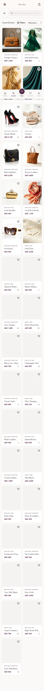

# P1-03 — Search completion record

Completed on 2026-07-14 at the `393 × 852` reference viewport.

## Product decision

Search is optimized for the user's task rather than for the stale showcase image. The default mobile path is now query → result count → products. The complete filter set remains available on demand and desktop retains a visible filter sidebar.

## Implemented

- Results and sorting appear before the mobile filter surface.
- The Filters control exposes the full category, condition, size, colour, price, and listing-mode set.
- Active-filter count and removable active-filter chips make the current query understandable.
- Clear all resets query, filters, and sorting without affecting saved products.
- Valid shared URL filters are restored; unknown categories, conditions, sizes, colours, sort values, prices, and deferred Rent state are discarded.
- Rent remains visible but disabled.
- Empty results provide a direct recovery action.
- EN and AR use the same functional hierarchy with correct RTL direction.

## Verification

- `npm run verify`: passed
- 44 test files, 419 tests: passed
- Search-specific tests: 19 passed
- Production build: passed
- EN viewport: no horizontal overflow; first product begins at `241px`
- AR viewport: `dir=rtl`, no horizontal overflow; first product begins at `241px`

## Evidence

